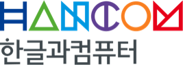
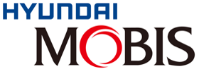
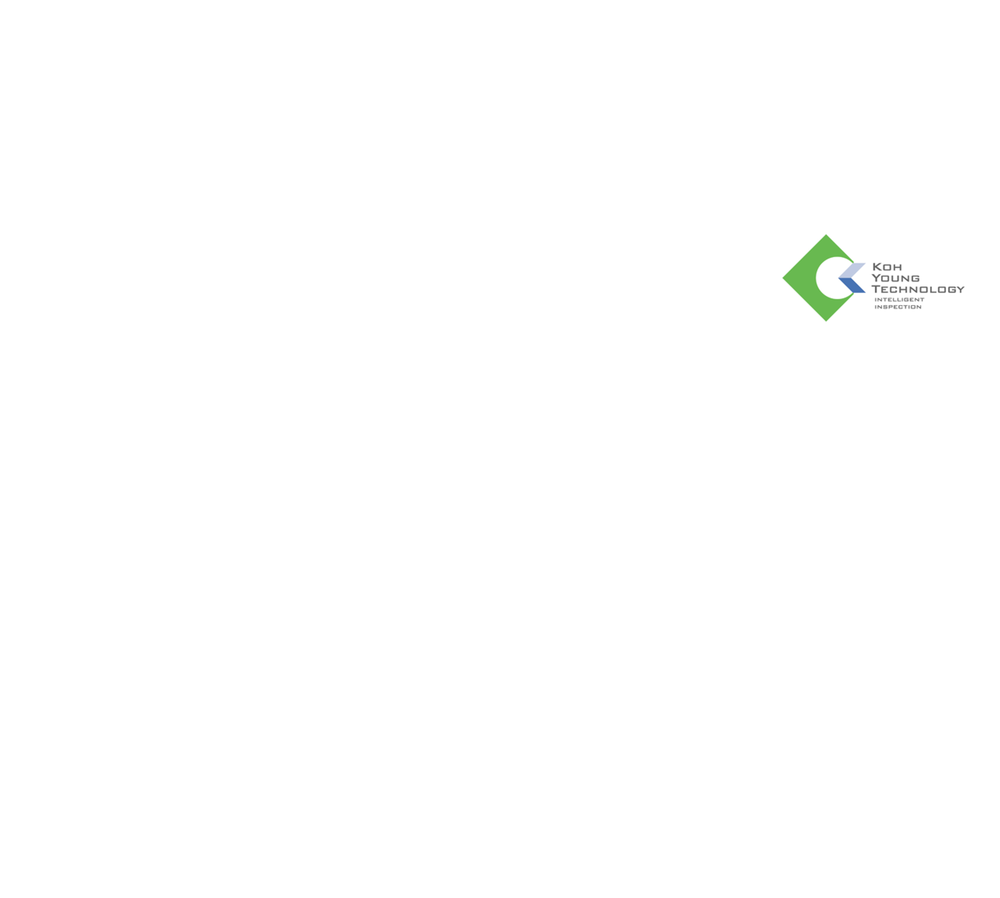

<body>
<table>
    <tr>
        <td align=center valign=middle></td>
        <td align=center valign=middle></td>
        <td align=center valign=middle></td>
        <td align=center valign=middle></td>
    </tr>
     <tr>
        <td align=center valign=middle></td>
        <td align=center valign=middle></td>
        <td align=center valign=middle></td>
        <td align=center valign=middle></td>
    </tr>
     <tr>
        <td align=center valign=middle></td>
        <td align=center valign=middle></td>
        <td align=center valign=middle></td>
        <td align=center valign=middle></td>
    </tr>
     <tr>
        <td align=center valign=middle></td>
        <td align=center valign=middle></td>
        <td align=center valign=middle></td>
        <td align=center valign=middle></td>
    </tr>
     <tr>
        <td align=center valign=middle></td>
        <td align=center valign=middle></td>
        <td align=center valign=middle></td>
        <td align=center valign=middle></td>
    </tr>
     <tr>
        <td align=center valign=middle></td>
        <td align=center valign=middle></td>
        <td align=center valign=middle></td>
        <td align=center valign=middle></td>
    </tr>
     <tr>
        <td align=center valign=middle></td>
        <td align=center valign=middle></td>
        <td align=center valign=middle></td>
        <td align=center valign=middle></td>
    </tr>
</table>
</body>

1. 42dot  
2. KOYOUNG Technology  
3. Korea Financial Telecommunications & Clearings Institute (KFTC)  
4. Kia  
5. Naver  
6. Doosan Digital Innovation  
7. RaonSecure  
8. LINE Plus  
9. Meritz Fire & Marine Insurance  
10. Busan Bank  
11. BC Card  
12. Samsung Electronics  
13. Samsung Fire & Marine Insurance  
14. Samsung SDS  
15. Shinhan Financial Group  
16. Shinhan DS  
17. CSPI  
18. AhnLab  
19. Woori Bank  
20. NCSOFT  
21. WayneOS  
22. Genians  
23. Kakao  
24. Telechips  
25. Toss Bank  
26. Korea Expressway Corporation  
27. Korea Institute of Energy Research (KIER)  
28. Hancom (Hancom Inc.)  
29. KEPCO KDN  
30. Hyundai Mobis  
31. Hyundai AutoEver  
32. Hyundai Motor Company  
33. ATCI  
34. CJ  
35. CJ CGV  
36. CJ ENM  
37. CJ OliveNetworks  
38. CJ Olive Young  
39. CJ CheilJedang  
40. ETRI (Electronics and Telecommunications Research Institute)  
41. KB Kookmin Bank  
42. KB Data Systems  
43. KT Corporation  
44. KT DS  
45. LG AI Research  
46. LG Electronics  
47. LIG Nex1  
48. LS ELECTRIC  
49. NHN  
50. SK Inc.  
51. SK Telecom