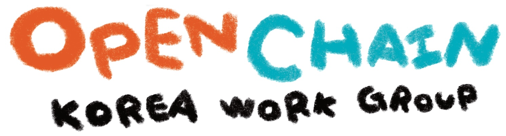

---
title: "About"
linkTitle: "About"
weight: 10
type: docs
description: >
  Introducing the OpenChain Korea Work Group.
menu:
  main:
    weight: 10
---
  

The OpenChain KWG (Korea Work Group), a subgroup of the Linux Foundation [OpenChain Project](https://openchainproject.org/), is a group to create and share how to effectively achieve open source compliance for everyone through collaboration and sharing, the spirit of open source software!

