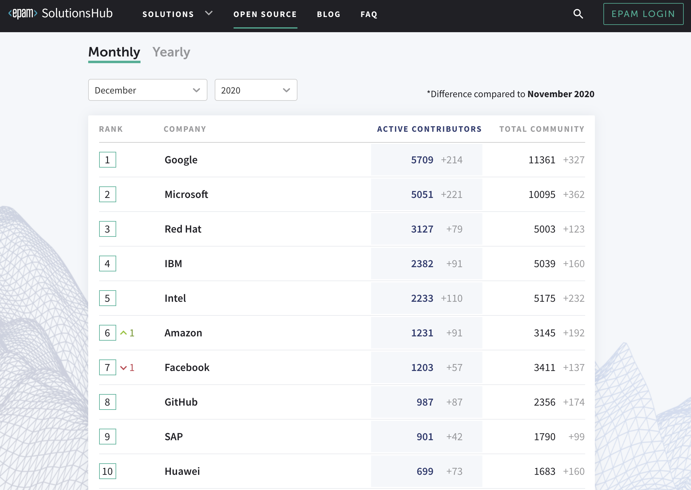
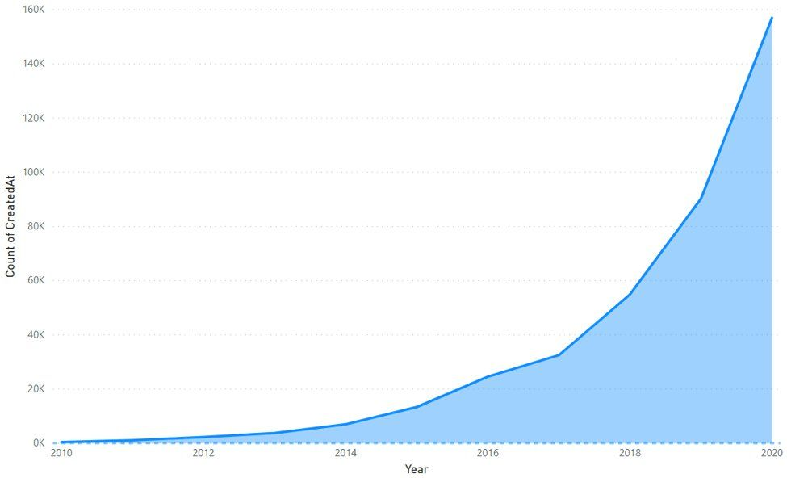
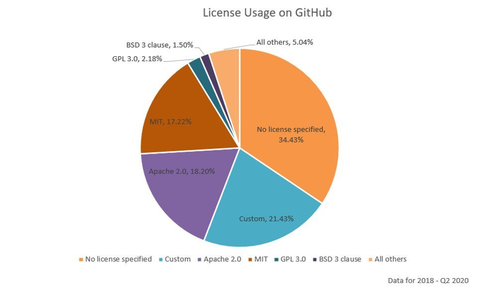
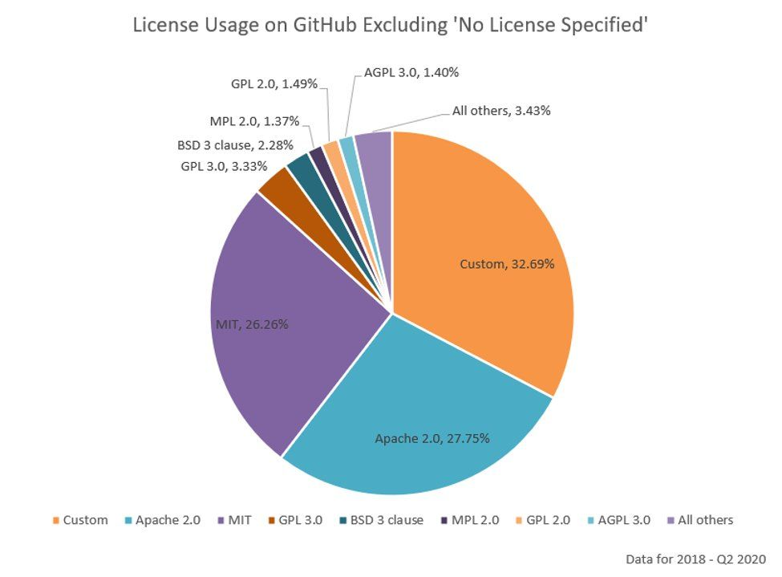
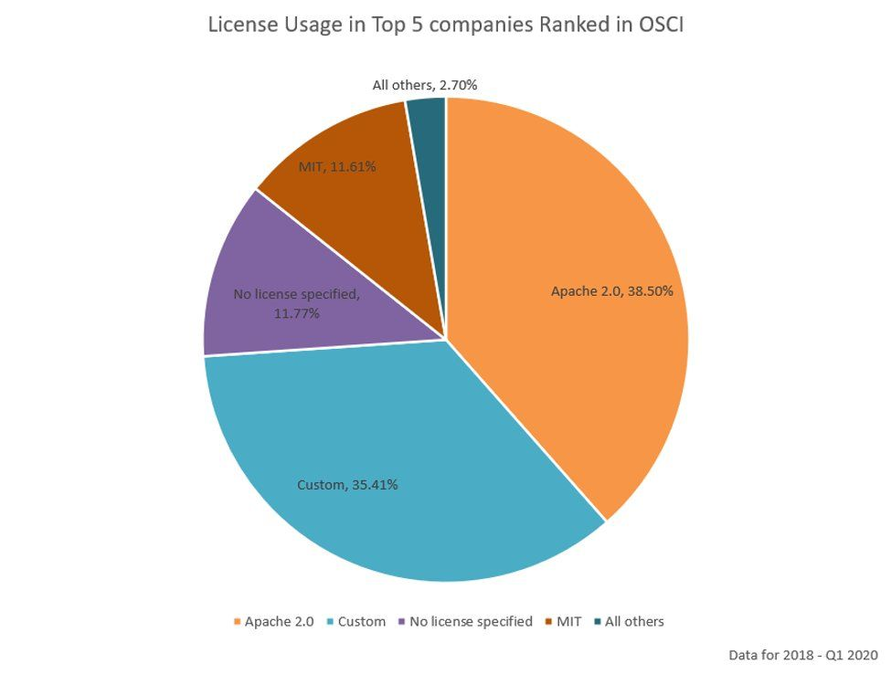
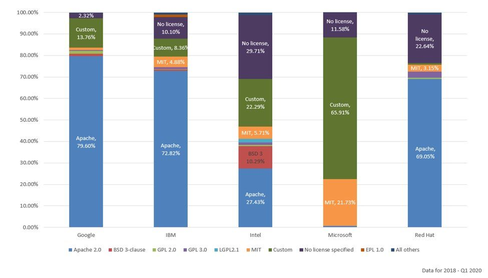
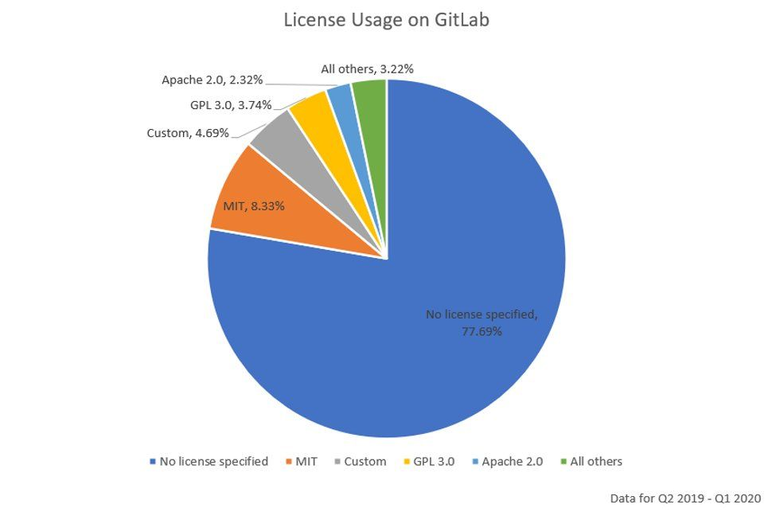
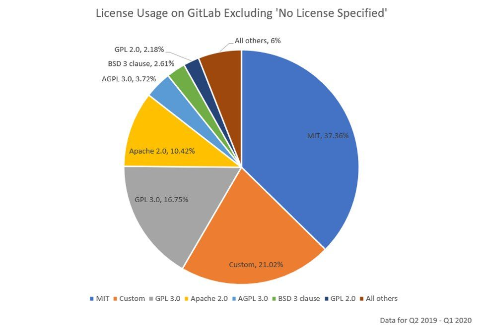

## EPAM, Github Activity Ranking and License Status by Enterprise in 2020 (OSCI)

[EPAM](https://www.epam.com/), which develops and consults Enterprise Software, provides a ranking service called [OSCI (Open Source Contributor Index)](https://solutionshub.epam.com/osci) that measures Github usage.

Measures the contributions of members of a commercial organization using publicly available Github Committed event data. Contributions from universities, research institutes and free email providers were not included. The target is contributors who have performed more than 10 commits, and the activity score is measured by an algorithm they have studied. The algorithm is published in [OSCI Github](https://github.com/epam/OSCI).

### OSCI (Open Source Contributor Index)
[https://solutionshub.epam.com/osci](https://solutionshub.epam.com/osci)

According to the analysis score, Google is at the forefront, with Microsoft and Red Hat coming next. Samsung is ranked 29th for Korean companies and LG Electronics is ranked 71st. 

## License Status used by Major Companies
The [Open Source License Usage Survey](https://solutionshub.epam.com/blog/post/examining-open-source-license-usage), drawn from data collected through OSCI, is also worth a look. Measurement was already possible with tools like Google BigQuery, but the results were unreliable because abuse and other invalid data weren't filtered out. Building OSCI made it possible to compile statistics over a set of meaningful GitHub repositories, which makes this data more useful.

The study examined the license choices of new public repositories created on GitHub from early 2018 through mid-2020, and also studied a year of data from GitLab to compare patterns across popular open source hosting platforms.

### The Sharp Rise in New GitHub Repositories

It shows that the number of repositories created on GitHub has grown sharply over the past two and a half years. This growth in open source is a trend that deserves particular attention.

### License Usage Trends Since 2018
Looking at repositories created from early 2018, several trends stand out.

- 34% of repositories do not include a license file, which puts their open source status in question.
- 21% of repositories are not recognized by GitHub as a standard license type. This is usually because the license file contains custom license text, often just a minor edit of standard license text. Finally, and most importantly, Apache 2.0 and MIT are the two most widely used license types, together accounting for more than 35% of all repositories.

Excluding repositories without a license file, more than half use the Apache 2.0 or MIT license. A third of repositories use some form of custom license text, and the remaining 13% cover a range of licenses, most commonly variants of BSD and the GNU Public License.

Repositories continue to be created without a license file despite GitHub's guidance. The data suggests that many individual contributors do not understand the importance of including a license file in an open source project.

### License Usage at the Top 5 OSCI-Ranked Companies
The chart for commercial organizations looks different from the one covering all repositories analyzed on GitHub. Apache 2.0 is by far the most widely used license, followed by custom license text. The MIT license is the only other standard license to gain significant adoption. **Copyleft licenses are barely used.** Finally, a non-trivial number of repositories still have no license file; a manual review of a sample found that most of these are not code repositories at all, but examples or documentation.

Looking at each of the top 5 companies individually, the results are interesting, and preferences differ from company to company.

Apache is the most preferred license at Google, IBM, and Red Hat. At Microsoft, most licenses are custom text, with MIT as the next most preferred standard license type. A manual review of some of that custom license text found that it was often actually MIT (for code repositories) or Creative Commons (for documentation).

Intel, by contrast, appears to use a much wider variety of license types, with Apache the most preferred, followed by custom license text and 3-Clause BSD. A manual study of the custom license text in Intel's repositories shows it to be a mix based on Apache 2.0, 3-Clause BSD, and other standard license types.

### GitLab Analysis
Over the 12 months from Q2 2019 through the end of Q1 2020, a pattern emerged that is very different from the GitHub results. In particular, 77.7% of public repositories created in this period have no license file. This again suggests that developers are not aware of the need for, or value of, choosing an open source license. It may also reflect some difference between the users who create open source projects on GitLab and on GitHub, with more individual use relative to commercial use.

Excluding repositories without a license file, the image below shows MIT as the most popular at 37%, followed by custom license text at 21%, GPL 3.0 at 17%, and Apache 2.0 at 10%. In summary, permissive license types are again the most widely used on GitLab, but MIT leads, and Apache 2.0 usage is much lower than on GitHub. Copyleft licenses hold a similarly small share on both GitLab and GitHub.

## Conclusion
This study surfaces a number of interesting findings.
- Apache 2.0 and MIT are the clear leaders, and the trend toward permissive license types is growing.
  Copyleft license types see only modest use.
- The number of repositories created without a license is growing, which suggests that individual developers in particular may not understand the legal aspects of open source.
- Custom license types are especially widespread among commercial organizations, and in most cases appear to be based on standard license types.
