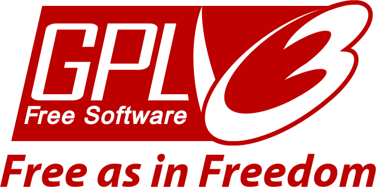
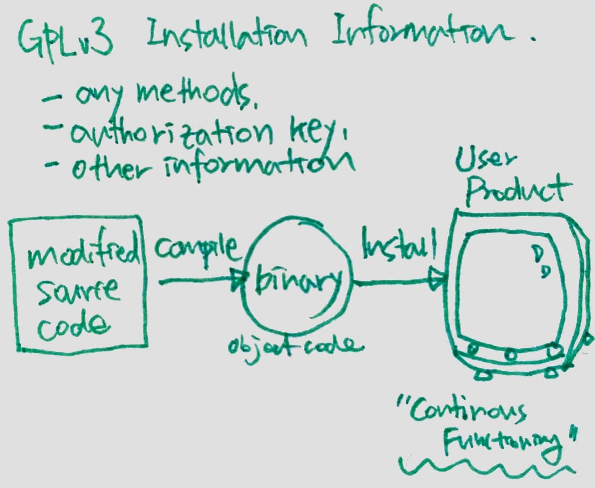
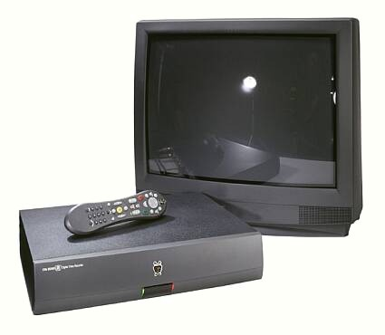

> <i>Hello. 
> 
> P. McCoy Smith, a well-known open source license attorney in the United States, recently published an article titled [Does GPLv2 Require 'Installation Information'](https://jolts.world/index.php/jolts/article/view/149) in JOLTS (Journal of Open Law, Technology & Society) ([JOLTS](https://jolts.world/)). 
> 
> In March 2021, the SFC (Software Freedom Conservancy) ([SFC](https://sfconservancy.org/)) [blog](https://sfconservancy.org/blog/) published a post titled "[Understanding Installation Requirements in GPLv2](https://sfconservancy.org/blog/2021/mar/25/install-gplv2/)," arguing that GPLv2 also requires the provision of installation information. This article analyzes that claim and explains, with detailed grounds, <b>the view that GPLv3's 'Installation Information' requirement does not apply to GPLv2</b>. 
> 
> This translation renders the original text while adding background explanations wherever possible to improve readability and help readers understand the content. 
> 
> If you find any errors or have additional comments, please feel free to contact me at haksung@sk.com. 
> 
> Thank you. :) </i>

{}
This paper was translated by Haksung Jang from the English version available at this [article](https://jolts.world/index.php/jolts/article/view/149/270).  The original author, [P. McCoy Smith](https://www.linkedin.com/in/mccoysmith), has not reviewed this translation.
{}

### Abstract

One of the key features added in GPLv3 (GNU General Public License version 3) is the requirement to provide 'Installation Information' in addition to source code when distributing software. This was newly added to GPLv3 to address a loophole in GPLv2 ([Tivoization](https://opensource.stackexchange.com/questions/7020/what-exactly-is-tivoization-and-why-did-linus-torvalds-not-like-it-in-gplv3)). Recently, however, a claim has been raised that this installation information requirement should be considered to apply to GPLv2 as well.

This article reviews the historical basis for including the 'Installation Information' requirement in GPLv3 and explains that this requirement is newly applied in GPLv3, not GPLv2. It also arrives at the same conclusion through an analysis of the GPLv2 text.

## 1. Introduction

GPLv2 (GNU General Public License, version 2)[^GNU-1991], released by the FSF (Free Software Foundation) in 1991, adopted a Copyleft (or Reciprocal) licensing approach. The Copyleft approach requires disclosure of source code in a specified manner at a specified time, and requires the same license to be applied when the software is redistributed. This is considered the best means of ensuring that software remains "free," a view still widely held today[^GPLv2_equal]. Here, "free" means the following[^free]. 
- The freedom to share modifications
- The freedom regarding what users can do with the code
- The freedom for users to modify the code as they wish

[^GNU-1991]: GNU Operating System, ‘GNU Library General Public License, version 2.0,’ (June, 1991) https://www.gnu.org/licenses/old-licenses/lgpl-2.0.html (accessed March 8, 2021).

[^GPLv2_equal]: Although GPLv3 was designed to eventually supplant GPLv2, in the 14 years since GPLv3 was published, the use of GPLv3, by some measures, is roughly equal in measure to the use of GPLv2; GPLv3’s relative use is also declining while GPLv2 remains steady state. Johnson, Patricia, ‘Open Source Licenses in 2021: Trends and Predictions,’ WhiteSource (January 28, 2021) https://resources.whitesourcesoftware.com/blog-whitesource/open-source-licenses-trends-and-predictions (accessed March 30, 2021).

[^free]: See GNU Operating System, ‘What is free software? The Free Software Definition,’ https://www.gnu.org/philosophy/free-sw.en.html (accessed March 8, 2021).

Nevertheless, in 2005 the FSF recognized the need to revise the license to address legal[^4] and technical[^5] issues that had not been considered[^6] when GPLv2 was released. Accordingly, the FSF began a large-scale, multinational collaborative effort from 2006[^7] through 2007 to create a new version of the GPL, and released GPLv3 on June 29, 2007[^8].

<!--  -->




[^4]: One example of a change in the law that the authors of  GPLv3 felt needed to be addressed in that license was the adoption in 1996 of the WIPO Copyright Treaty (WCT), and the passage in 1998 of its counterpart in the United States, the Digital Millennium Copyright Action (DMCA), particularly the provisions against circumvention of 'technological protection measures', See WCT Article 11; 17 U.S.C. § 1201 (1998). GPLv3, §  3 directly addresses these additions to copyright law.

[^5]: The technology in TiVo's devices,  preventing reinstallation of modified binaries on devices running GPLv2 software, was one example of technology developed long after the GPLv2 licence was drafted that was of concern to the drafters of GPLv3. Subsequent to the release of GPLv3, millions, if not billions, of devices continue to be distributed with a GPLv2-licensed Linux kernel that prevent the reinstallation of modified binaries. GPLv3 also addressed the outmoded language around distribution of source code in GPLv2, and GPLv3 ‒ in Section 6 ‒ added several additional mechanisms for fulfilling source code obligations more consistent with current mechanisms for software distribution. See GPLv3, § 6(d)-(e).

[^6]: Free Software Foundation, ‘Rationale for 1st  discussion draft,’ http://gplv3.fsf.org/gpl-rationale-2006-01-16.html (accessed March 22, 2021).

[^7]: Irish Free Software Organization, ‘Transcript of Opening session of first international GPLv3 conference,’ (January 16th 2006) http://www.ifso.ie/documents/gplv3-launch-2006-01-16.html (accessed March 22, 2021).

[^8]: GNU Operating System, ‘GNU General Public License, version 3,’ (‘GPLv3’) (June 29, 2007) https://www.gnu.org/licenses/gpl-3.0.html (accessed March 22, 2021).

## 2. GPLv3's 'Installation Information' Requirement

GPLv3 added numerous features to address the problems and concerns raised during the 15 years GPLv2 was in widespread use. Among these, the most notable (and also most controversial[^9]) are (1) the provision defining 'Installation Information' and (2) the provision specifying the circumstances under which installation information must be provided when 'conveying'[^10] software licensed under GPLv3. Understanding the extent to which GPLv3's 'Installation Information' requirement includes, and does not include, elements required under GPLv2 requires a detailed review of the language and history of both licenses.

[^9]: Burnette, Ed, ‘Tivo and GPL: Beauty and the Beast?,’ ZDNet, (October 2, 2006) https://www.zdnet.com/article/tivo-and-gpl-beauty-and-the-beast/ (accessed March 29, 2021).

[^10]: ‘Convey’ is the activity defined in GPLv3 as triggering source code disclosure obligations. GPLv3, n. 6, §§ 4-6.

GPLv3, Section 6[^11] (which specifies the obligations that apply when GPLv3 code is "conveyed in Non-Source Form") defines the disclosure obligations specific to 'Installation Information'.

~~~
“‘Installation Information’ ... means any methods, procedures, authorization keys, or other 
information required to install and execute modified versions of a covered work ... from a 
modified version of its Corresponding Source. The information must suffice to ensure that the 
continued functioning of the modified object code is in no case prevented or interfered with 
solely because modification has been made.”
~~~

<!--  -->




[^11]: GPLv3, n. 6 above, § 6.

What is notable about GPLv3's definition of 'Installation Information' is that it specifically mentions 'authorization keys' and 'other information'. This was included to address specific instances of abuse of GPLv2 software that concerned the FSF when the process of creating GPLv3 began[^12]. 

[^12]: See ‘Transcript of Opening Session of First International GPLv3 Conference,’ (January 16th 2006) http://www.ifso.ie/documents/gplv3-launch-2006-01-16.html  (accessed May 5, 2021) at 0h 03m 59s

The detailed requirements of GPLv3's 'Installation Information' obligation, and how and when GPLv3 requires the provision of installation information, are beyond the scope of this article[^13]. Nevertheless, a general understanding is needed of what similarities might support the argument that the installation information obligation also applies to GPLv2, what evidence demonstrates that the installation information obligation is unique to GPLv3, and through what process this content came to be adopted. It is therefore important to understand the historical background behind the addition of the 'Installation Information' obligation to GPLv3, the specific language added to GPLv3, and how that language differs from the obligations stated in GPLv2.

[^13]: Perhaps the most notable feature of the ‘Installation Information’ requirement, and an important feature in understanding how that requirement differs from the source code obligations in GPLv2, is that the ‘Installation Information’ requirement of GPLv3 applies only to a specified subset of products – ‘User Products’ upon which GPLv3 might be installed. See GPLv3, n. 6 above, at § 6.

## 3. Historical Background of the 'Installation Information' Requirement: 'Tivoization'

Around 2006, when GPLv3, the new version of the GPL, was proposed, the FSF expressed concern about a practice that could potentially undermine the concept of 'software freedom'. The FSF named this practice 'Tivoization'[^14], and at the time, the FSF considered that TiVo, a DVR (digital video recorder) company, was infringing on users' freedom. 

<!--  -->

https://blog.codinghorror.com/tivoization-and-the-gpl/


[^14]: The Computer Language Company, ‘Tivoization,’ The Free Dictionary by Farlex https://encyclopedia2.thefreedictionary.com/Tivoization (accessed April 2, 2021).

In the mid-2000s, certain TiVo DVR hardware devices had a GPLv2-licensed Linux kernel installed. These devices included a mechanism to verify the version of the Linux kernel to be installed on the TiVo hardware device. This validation mechanism used a checksum or cryptographic hash function to compare against the kernel version installed on the device, and refused to install any version of the Linux kernel whose checksum or cryptographic hash[^15] did not match a specific value. In this way, TiVo devices allowed only TiVo — as the hardware manufacturer and the sole party with the necessary information about the embedded checksum or hash value — to install authorized versions of the Linux kernel on the device. If a user of a TiVo device (e.g., a customer who purchased the device) obtained the source code of the kernel installed on the device, modified that kernel, and tried to reinstall it, the checksum or hash would differ for the modified kernel, so the modified kernel could not be reinstalled or executed[^16]. 

[^15]: Checksums and cryptographic hashes are techniques used to determine whether a received binary file is identical to, or deviates from, an expected binary file. Various techniques are used to generate a numerical value associated with the digits in the expected file to generate a value; that value is then compared at the receiving end to a stored representation of the same value.  In this way, any changes to the binary file, even so much as changing one bit from ‘0’ to ‘1’ or vice versa, will produce a different value which will not match the stored value, thus indicating at the received binary file is not identical to the expected binary file. See Fisher, T., ‘What Is a Checksum?’ Lifewire (June 14, 2021) https://www.lifewire.com/what-does-checksum-mean-2625825 (accessed June 14, 2021).

[^16]: Miller, Todd, ‘Using large disks with TiVo,’ Sudo Project (2008) https://web.archive.org/web/20120206023943/http://www.gratisoft.us/tivo/bigdisk.html (accessed April 2, 2021) (‘it is not possible to replace the kernel on a Series2 TiVo since the PROM requires that the kernel be cryptographically signed with a key from TiVo’). Note that although most of the commentary about the Series 2 TiVo devices of the mid-2000s indicate that they would not allow modified GPLv2 binaries to install or execute, at least one commentator has stated that that device allowed such binaries to be installed and run, but only prevented execution of non-GPLv2 proprietary code on that device. See Kuhn, Bradley & Webster, Behan, ‘Safely Copylefted Cars: Reexamining GPLv3 Installation Information Requirements,’ Linux Foundation Events (2017) at 13 https://events19.linuxfoundation.org/wp-content/uploads/2017/11/Safely-Copylefted-Cars-Reexamining-GPLv3-Installation-Information-Requirements-ALS-Bradley-Kuhn-Behan-Webster-1.pdf (accessed April 9, 2021)

Accordingly, in 2006 the FSF considered the inability to reinstall a modified version of GPLv2 software on an existing device to be an infringement of the freedom users should have over software, and did not hesitate to describe this practice in highly disparaging terms.

> &nbsp;&nbsp;&nbsp;&nbsp;&nbsp;&nbsp;<i>“A <b>tyrant</b> is a malicious device that refuses to allow users to install a different operating system or a modified operating system. These devices have measures to block execution of anything other than the ‘approved’ system versions.”</i>[^17]


https://fsfe.org/activities/gplv3/brussels-rms-transcript.en.html


[^17]: GNU Operating System, ‘Proprietary Tyrants,’ https://www.gnu.org/proprietary/proprietary-tyrants.html (accessed April 2, 2021).

## 4. Historical Analysis: The Relationship Between GPLv3's 'Installation Information' Obligation and GPLv2

Although the FSF had long opposed the practice of 'Tivoization' (preventing the reinstallation of modified binaries), during the drafting of GPLv3, statements by the FSF's President, General Counsel, and Executive Director also made clear that this practice could be permitted under GPLv2. 

> &nbsp;&nbsp;&nbsp;&nbsp;&nbsp;&nbsp;<i>“[T]he Tivo itself is the prototype of [T]ivoisation. The Tivo contains a small GNU/Linux operating system, thus, several programs under the GNU GPL[v2]. And, as far as I know, <b>the Tivo company does obey GPL version 2</b>. … [T]he trouble begins because the Tivo will not run modified versions, the Tivo contains hardware designed to detect that the software has been changed and shuts down.”</i>[^18]
> 
> &nbsp;&nbsp;&nbsp;&nbsp;&nbsp;&nbsp;<i>“TiVo is a provider of hardware and software …. Our concern with them is that they have rights as users, but they should respect the rights of the users to whom they sell. Having a personal video recorder … which won't run software if you modify the box … is not user-respecting conduct. <b>(TiVo) complied with GPL 2 by the skin of its teeth.”</b></i>[^19]
> 
> &nbsp;&nbsp;&nbsp;&nbsp;&nbsp;&nbsp;<i>“TiVoization is described by Peter Brown [Executive Director of FSF in 2006-07 during drafting of GPLv3] as circumventing GPL2 ‘in spirit, <b>not technically.</b>’”</i>[^20]

[^18]: Stallman, Richard, ‘Transcript of Richard Stallman at the 5th international GPLv3 conference,’ (November 21, 2006) https://fsfe.org/activities/gplv3/tokyo-rms-transcript#tivoisation (accessed April 2, 2021).

[^19]: Shankland, Stephen, ‘Defender of the GPL,’ CNet (January 19, 2006) https://www.cnet.com/news/defender-of-the-gpl/  (accessed April 2, 2021).

[^20]: Byfield, Bruce, ‘GPLv2 or GPLv3?: Inside the Debate,’ Datamation (June 17, 2007) https://www.datamation.com/trends/gplv2-or-gplv3-inside-the-debate/ (accessed April 9, 2021).

This difference (between GPLv3, which prohibits 'Tivoization', and GPLv2, which permits it) was the decisive reason why Linus Torvalds, the author of the Linux kernel, decided not to change the license to GPLv3 and to keep it 'GPLv2 only'. 


https://www.youtube.com/watch?v=bV3cKq26nKQ


> &nbsp;&nbsp;&nbsp;&nbsp;&nbsp;&nbsp;<i>“’The FSF is trying to make some things <b>no longer permissible under the GPLv3 that the GPLv2 left open</b>, and I just happen to think that those things were better off being left open.’”</i>[^21]
> 
> &nbsp;&nbsp;&nbsp;&nbsp;&nbsp;&nbsp;<i>“‘I don't think the GPL v3 conversion is going to happen for the kernel, since I personally don't want to convert any of my code.’  … ‘<b>I think it's insane to require people to make their private signing keys available</b>, for example. I wouldn't do it,’ [Torvalds] said.”</i>[^22]
> 
> &nbsp;&nbsp;&nbsp;&nbsp;&nbsp;&nbsp;<i>“[If] you can not <b>install</b> or <b>run</b> your changes on somebody else’s hardware … it in no way changes the fact that you got all the source code, and you can make changes (and use their changes) to it. <b>That requirement has always been there, even with plain GPLv2</b>. You have the source. The difference? The hardware may only run signed kernels. The fact that the hardware is closed is a <b>hardware</b> license issue. Not a software license issue. I’d suggest you take it up with your hardware vendor, and quite possibly just decide to not buy the hardware. Vote with your feet. … <b>[I]t’s important to realize that signed kernels that you can’t run in modified form under certain circumstances is not at all a bad idea in many cases.</b>”</i>[^23]

[^21]: Bennett, Amy, ‘Linux creator Torvalds still no fan of GPLv3,’ Computerworld (July 28, 2006) https://www.computerworld.com/article/2820022/linux-creator-torvalds-still-no-fan-of-gplv3.html (accessed April 7, 2021).

[^22]: Shankland, Stephen, ‘Torvalds rules out GPL3 for Linux,’ ZDNet UK (January 27, 2006) https://web.archive.org/web/20080424051024/http:/news.zdnet.co.uk/software/0,1000000121,39249370,00.htm (accessed April 7, 2021).

[^23]: Barr, Joe, ‘Torvalds versus GPLv3 DRM restrictions,’ Linux.com (February 2, 2006) https://www.linux.com/news/torvalds-versus-gplv3-drm-restrictions/ (accessed April 8, 2021).

Several major kernel developers also shared Torvalds's view on GPLv3's 'Installation Information' requirement, as shown below[^24]. Torvalds maintained a consistent position even a decade later, which is one of the reasons the Linux kernel continues to maintain a 'GPLv2 only' license to this day[^25]. 

> &nbsp;&nbsp;&nbsp;&nbsp;&nbsp;&nbsp;<i>“I give you source code, you give me your changes back; we’re even. … That’s my take on GPL version 2 and it’s that simple. … <b>Version 3 extended that in ways that I personally am really uncomfortable with.</b> Namely I give you source code, that means if you use that source code, you can’t use it on your device unless you follow my rules. And to me that’s a violation of everything version 2 stood for. And I understand why the FSF did it, because I know what the FSF wants, <b>but to me it’s not the same license at all</b>. So I was very upset, and made it very clear, and this was months before version 3 was actually published.”</i>[^26]

[^24]: Bottomley, James, et al., ‘Kernel developers' position on GPLv3,’ LWN.net (September 22, 2006) https://lwn.net/Articles/200422/ (accessed April 8, 2021). See also Bottomley, James, et al., 'The Dangers and Problems with GPLv3,' (September 15, 2006) https://lore.kernel.org/lkml/1158941750.3445.31.camel@mulgrave.il.steeleye.com (accessed May 27, 2021).

[^25]: Linux kernel licensing notice, https://elixir.bootlin.com/linux/latest/source/COPYING (accessed April 8, 2021).

[^26]: Deb Conf, ‘Linus Torvalds says GPL v3 violates everything that GPLv2 stood for,’ YOUTUBE (accessed May 5, 2021, at 0h 0m 34s) https://www.youtube.com/watch?v=PaKIZ7gJlRU.

In the process of creating and releasing GPLv3, the FSF made clear that, unlike GPLv2, GPLv3 was adding content that could prevent 'Tivoization'. 

> &nbsp;&nbsp;&nbsp;&nbsp;&nbsp;&nbsp;<i>“There are several primary areas <b>where version 3 is different from version 2. One is in regard to [T]ivoisation.</b>"[^27]
> 
> &nbsp;&nbsp;&nbsp;&nbsp;&nbsp;&nbsp;“The Tivo includes some GPL-covered software. …[Y]ou can get the source code for that, as required by the GPL … and once you get the source code, you can modify it, and there are ways to install the modified software in your Tivo and if you do that, it won't run, period. Because, it does a check sum of the software and it verifies that it's a version from them and if it's your version, it won't run at all. <b>So this is what we are forbidding, with the text we have written for GPL version three</b>. It says that the <b>source code they must give you includes whatever signature keys, or codes that are necessary to make your modified version run.</b>”</i>[^28]

[^27]: Stallman, Richard, ‘Transcript of Richard Stallman at the 3rd international GPLv3 conference,’ (June 22, 2006) https://fsfe.org/activities/gplv3/barcelona-rms-transcript.en.html#tivoisation (accessed April 2, 2021).

[^28]: Stallman, Richard, ‘Transcript of Richard Stallman speaking on GPLv3 in Torino,’ (March 18, 2006) https://fsfe.org/activities/gplv3/torino-rms-transcript.en.html#drm (accessed April 2, 2021).

The FSF has made clear (consistently from when GPLv3 was first proposed to the day this article was published) that GPLv3 in fact contains a definition of the 'Installation Information' requirement that is broader than any requirement contained in GPLv2. 

> &nbsp;&nbsp;&nbsp;&nbsp;&nbsp;&nbsp;<i>“<b>GPLv2 did not address the use of technical measures to take back the rights that ... GPL[v2] granted</b>, because such measures did not exist in 1991 [when GPLv2 was written], and would have been irrelevant to the forms in which software was then delivered to users. … <b>GPLv3 must address these issues: free software is ever more widely embedded in devices that impose technical limitations on the user's freedom to change it.</b>”</i>[^29]
> 
> &nbsp;&nbsp;&nbsp;&nbsp;&nbsp;&nbsp;<i>“Does GPLv2 have a requirement about delivering installation information?...</i>
> 
> &nbsp;&nbsp;&nbsp;&nbsp;&nbsp;&nbsp;<i>“GPLv3 explicitly requires redistribution to include the full necessary ‘Installation Information.’ GPLv2 doesn't use that term, but it does require redistribution to include scripts used to control compilation and installation of the executable with the complete and corresponding source code. <b>This covers part, but not all, of what GPLv3 calls ‘Installation Information.’ Thus, GPLv3's requirement about installation information is stronger.</b>”</i>[^30]

[^29]: Free Software Foundation, ‘Opinion on Digital Restrictions Management,’ (August, 2006) http://gplv3.fsf.org/drm-dd2.html (accessed March 17, 2021).

[^30]: GNU Project, ‘Frequently Asked Questions About the GNU Licenses,’ https://www.gnu.org/licenses/gpl-faq.html#InstInfo (accessed April 7, 2021)

Richard Stallman appealed to software developers to "upgrade" their licensing policy to GPLv3 to address the existing problems with GPLv2, and cited the newly introduced installation information requirement as the first reason developers should switch to GPLv3. 

> &nbsp;&nbsp;&nbsp;&nbsp;&nbsp;&nbsp;<i>““Keeping a program under GPLv2 won't create problems. <b>The reason to migrate is because of the existing problems which GPLv3 will address.</b></i>
> 
> &nbsp;&nbsp;&nbsp;&nbsp;&nbsp;&nbsp;<i>“One major danger that GPLv3 will block is tivoization. Tivoization means computers (called “appliances”) contain GPL-covered software that you can't change, because the appliance shuts down if it detects modified software. The usual motive for tivoization is that the software has features the manufacturer thinks lots of people won't like. The manufacturers of these computers take advantage of the freedom that free software provides, but they don't let you do likewise.</i>[^31]

[^31]: Stallman, Richard M. ‘Why Upgrade to GPL Version 3,’ (May 31, 2007) http://gplv3.fsf.org/rms-why.html (accessed May 6, 2021).

## 5. GPLv2's Source Code Disclosure Obligation

One of the most notable features of a Copyleft license such as GPLv2, released in 1991, is that any individual or entity that distributes[^32] code licensed under the terms of GPLv2 has an obligation to provide the 'source code'[^33]. GPLv2's Section 3 specifically defines the components of 'source code' that must be provided when code under GPLv2 is distributed in object or executable code form[^34]. 

~~~
“The source code for a work means the preferred form of the work for making modifications to it.
For an executable work, complete source code means all the source code for all modules it 
contains, plus any associated interface definition files, plus the scripts used to control 
compilation and installation of the executable.”
~~~

[^32]: GPLv3 uses the term ‘convey,’ n. 8 above, whereas GPLv2 uses the term ‘distribute,’ to articulate acts that trigger, among other things, obligations to provide source. Although there are subtle differences between the two terms, they are intended to cover the same acts. GNU Project, ‘Frequently Asked Questions About the GNU Licenses,’ https://www.gnu.org/licenses/gpl-faq.html#ConveyVsDistribute (accessed March 29, 2021).

[^33]: Brown, Neil, ‘GNU GPL 2.0 and 3.0: obligations to include licence text, and provide source code,’ JOLTS vol. 2, no. 1 (2010) DOI: 10.5033/ifosslr.v2i1.31 (accessed March 30, 2021).

[^34]: GPLv2, n. 1 above, § 3.

The explanation of the obligation to provide source code can generally be understood in connection with common knowledge of what 'source code' means in computer programming. 

> &nbsp;&nbsp;&nbsp;&nbsp;&nbsp;&nbsp;<i>“Source Code: … The form in which a computer program (software) is written by the programmer. Source code is written in some formal programming language which can be compiled automatically into object code or machine code or executed by an interpreter.”</i>[^35]

[^35]: ‘Source Code,’ Computer Dictionary of Information Technology https://www.computer-dictionary-online.org/definitions-s/source-code.html (accessed March 30, 2021).

GPLv2 also includes two other items that fall within the license's definition of 'source code'. 
* ‘associated interface definition files’
* ‘scripts used to control compilation and installation of the executable'  

To understand how GPLv2's disclosure obligation differs from GPLv3's disclosure obligation, it is necessary to review the meaning of these provisions. 

## 6. Textual Analysis: GPLv3's 'Installation Information' Obligation and GPLv2's Source Code Obligation

As discussed above, GPLv3's disclosure obligation for distributing executable code includes both 'Corresponding Source'[^36] and 'Installation Information'[^37]. 

~~~
“[A]ll the source code needed to generate, install, and (for an executable work) run the object 
code and to modify the work, including scripts to control those activities.”
~~~

~~~
“[A]ny methods, procedures, authorization keys, or other information required to install and 
execute modified versions of a covered work ... from a modified version of its Corresponding 
Source.”
~~~

[^36]: GPLv3, n. 6 above, § 1.

[^37]: GPLv3, n. 6 above, § 6.

GPLv3's original draft included the obligation to provide authorization keys within the definition of "Corresponding Source"[^38]. However, there was opposition to defining data such as authorization keys together with source code, and accordingly the FSF moved the authorization key requirement to a different section. 

> &nbsp;&nbsp;&nbsp;&nbsp;&nbsp;&nbsp;<i>“We have moved the technical restrictions provisions from section 1, where they formed part of the definition of Corresponding Source, to section 6, <b>where they are presented as a condition on the right to convey object code works</b>. Some critics of the provisions in our earlier drafts focused on what they regarded as <b>an inappropriate equation of cryptographic keys with source code</b>. Placing the requirements in section 6 should make their purpose and reasonableness more evident.”</i>[^39]

[^38]: Free Software Foundation, ‘GPLv3 First Discussion Draft,’ §1 (January 16, 2006) http://gplv3.fsf.org/gpl-draft-2006-01-16.html (accessed June 14, 2021).

[^39]: Free Software Foundation, ‘GPLv3 Third Discussion Draft Rationale,’ (March 28, 2007) http://gplv3.fsf.org/gpl3-dd3-rationale.pdf/download (accessed June 14, 2021).

Thus, during the draft revision stage of GPLv3, the FSF recognized and acknowledged that the 'Installation Information' requirement is a separate obligation beyond the 'Corresponding Source Code' obligation that existed in GPLv2 and was also included in GPLv3. 

GPLv2's source code disclosure obligation is as follows[^40]. 

~~~
“For an executable work, complete source code means all the source code for all modules it 
contains, plus any associated interface definition files, plus the scripts used to control 
compilation and installation of the executable.”
~~~




[^40]: GPLv2, n. 1 above, § 3.

To the extent that anything within GPLv2's 'corresponding source code' requirement resembles GPLv3's 'Installation Information' requirement, it would be the two separately specified items below. 
* ‘any associated interface definition files’
* ‘scripts used to control compilation and installation of the executables.’

'Interface definition file' is a term commonly used in computer programming (GPLv2 does not provide a more detailed definition of this term). It can be interpreted as a separate file containing attributes and definitions of a particular software's programming interface[^41]. This requirement in GPLv2 does not appear to impose an obligation to provide authorization keys, checksums, or other information necessary to permit the installation or execution of a modified binary. Instead, it requires the disclosure of information necessary to understand the interface of the distributed binary (because this is difficult to determine from the disclosed source code alone).

[^41]: E.g., Microsoft, ‘Interface Definition (IDL) File,’ Windows Developer Documentation (May 31, 2018) https://docs.microsoft.com/en-us/windows/win32/midl/interface-definition-idl-file (accessed April 8, 2021);
de St. Germain, H. James, ‘Interfaces in Object Oriented Programming Languages,’ University of Utah Computing Department https://www.cs.utah.edu/~germain/PPS/Topics/interfaces.html (accessed April 8, 2021).

By contrast, the second item — scripts used to compile and install the executable — is clearly material related to the installation of a GPLv2-covered executable. However, this requirement concerns the term 'script' itself, in the sense commonly understood in computing. 

> &nbsp;&nbsp;&nbsp;&nbsp;&nbsp;&nbsp;<i>“A computer script is a list of commands that are executed by a certain program or scripting engine. Scripts may be used to automate processes on a local computer …. Script files are usually just text documents that contain instructions written in a certain scripting language. … [W]hen opened by the appropriate scripting engine, the commands within the script are executed.”</i>[^42]
> 
> &nbsp;&nbsp;&nbsp;&nbsp;&nbsp;&nbsp;<i>“Script[:] … a sequence of instructions or commands for a computer to execute … especially … one that automates a small task (such as assembling or sorting a set of data).”</i>[^43]

[^42]: Christensson, Per, ‘Script Definition,’" TechTerms. (2006) https://techterms.com/definition/script (accessed April 8, 2021).

[^43]: ‘Script,’ Merriam-Webster.com Dictionary, Merriam-Webster https://www.merriam-webster.com/dictionary/script (accessed April 8, 2021).

An installation script[^44] is generally a small, simple program used to automate the process of installing a particular program on a particular device[^45]. 

[^44]: GPLv2’s requirement to provide ‘compilation’ scripts are not analysed in this article; compilation is part the process of converting source code into executable code, and is not related to the subsequent activities of installing, or executing, that executable code.

[^45]: Arthur, Ty, ‘How to Write a Simple Script to Install a Program,’ Techwalla https://www.techwalla.com/articles/how-to-write-a-simple-script-to-install-a-program (accessed April 8, 2021)

Therefore, from the standpoint of textual interpretation, there appears to be no doubt that GPLv2's obligation to provide ‘scripts used to control … installation of the executable’ cannot be interpreted as including the provision of checksums, hashes, authorization/signing keys, or other numerical data needed to install GPLv2 executable code. Such data does not fall within the ordinary scope of a 'script'. 

A more interesting interpretive question would instead be a case where firmware embedded in the hardware device itself runs an installation program that validates the executable in some form (for example, a feature that restricts installation by determining that the executable is invalid if it has been modified). Even in such a case, however, given that both the FSF and Linux kernel developers consistently maintained, over a long period during the drafting and release of GPLv3, the position that any form of installation validation (such as the use of PROM-loaded information, as with TiVo) was permitted under GPLv2, it would be difficult to argue that such an immediate check performed by firmware would trigger an obligation to provide installation information under GPLv2's ‘scripts used to … installation of the executable’ requirement. 

## 7. Backporting the Installation Information Requirement to GPLv2

Some attempt to backport the entirety of GPLv3's 'Installation Information' definition into GPLv2's source code obligation, but such an effort produces results that are historically and textually incorrect. Suppose the complete 'Installation Information' definition were included in GPLv2's Section 3. The moment one does so, a dilemma arises. GPLv3's 'Installation Information' requirement is limited in its application to a specific type of product, namely a 'User Product'[^46]. The obligation to provide 'Installation Information' under GPLv3 applies only to 'User Products' and does not apply to other products[^47]. 

~~~
“If you convey an object code work under this section in, or with, or specifically for use in, 
a User Product ... the Corresponding Source conveyed under this section must be accompanied by the 
Installation Information.”
~~~




[^46]: ‘User Products’ in GPLv3 are subject to a rigorous definition which excludes a large class of products which can, and currently do, use code licensed under one of the GPL family of licences: “A ‘User Product’ is either (1) a ‘consumer product’, which means any tangible personal property which is normally used for personal, family, or household purposes, or (2) anything designed or sold for incorporation into a dwelling. … A product is a consumer product regardless of whether the product has substantial commercial, industrial or non-consumer uses, unless such uses represent the only significant mode of use of the product.” GPLv3, n. 6 above, at Section 6.

[^47]: GPLv3, n. 6 above, at Section 6.

GPLv2, by contrast, contains no definition or limitation on the type of product to which the source code obligation applies. Source code must be provided under the GPLv2 obligation regardless of whether the product is a 'User Product' or not. Therefore, if GPLv3's complete definition of the 'Installation Information' obligation were merely a restatement or clarification of GPLv2's existing disclosure obligation, GPLv3 would have narrowed the circumstances under which that disclosure obligation could exist. The result would be that GPLv3 applies to a narrower range of software than GPLv2, thereby narrowing its scope in terms of 'software freedom'. This interpretation is the exact opposite of what GPLv3 was originally intended to achieve. 

> &nbsp;&nbsp;&nbsp;&nbsp;&nbsp;&nbsp;<i> “As a free software license ... this license [GPLv3] intrinsically disfavours technical attempts to restrict users freedom to copy, modify, and share copyrighted works. Each of [the licenses] provisions shall be interpreted in light of this specific declaration of the licensor's intent. We wish courts all over the world to understand that our intent [in creating GPLv3] <b>is to maximise freedom</b>, not to restrict it, and that everything should be so understood when effect is given to its terms”</i>[^48]

[^48]: Transcript of Opening Session of First International GPLv3 Conference, see n.10 above, at 0h 23m 30s.

Stated differently, GPLv3 can maximize freedom in line with its original intent only if the 'Installation Information' obligation itself extends 'freedom' beyond GPLv2's disclosure obligation. Otherwise, since GPLv2's obligation is not limited to a specific product type, GPLv3 — which imposes the obligation only on User Products — falls into the interpretive dilemma of having narrowed the scope of 'freedom'. 

## 8. GPLv2's Textual and Historical Revisionism

As explained in detail above, textual analysis and a review of the historical record make it clear that GPLv3's 'Installation Information' obligation does not exist within GPLv2's source code obligation, and that it cannot be backported to GPLv2 in any way. Despite this fact, there have recently been efforts to alter the historical record and reinterpret GPLv2's requirements so as to equate GPLv2's source code obligation with GPLv3's 'Installation Information' requirement. 

> &nbsp;&nbsp;&nbsp;&nbsp;&nbsp;&nbsp;<i> “GPLv2 §3 requires that the source code include ‘meta-material’ like scripts, interface definitions, <b>and other material that is used to ‘control compilation and installation’</b> of the binaries.”</i>[^49]
>
> &nbsp;&nbsp;&nbsp;&nbsp;&nbsp;&nbsp;<i> “GPLv2 included a clear obligation to provide ‘the scripts used to control … installation’ that function for the GPLv2'd works. GPLv2 assures, to the purchaser of an embedded product, their absolute right to receive the <b>information necessary to install a modified version of the GPLv2'd works.</b> … The GPLv2 was designed to assure bug-fixing. Furthermore, the drafters knew that, on embedded systems and devices, you need to know how to install those fixes. Scripts can be technical [artefacts] like shell scripts, <b>but can also be merely a recipe and/or guidance — written instructions that explain how to succeed at install.</b>”</i>[^50]

[^49]: Kuhn, Bradley, et al., ‘Copyleft and the GNU General Public License: A Comprehensive Tutorial and Guide,’ Copyleft.org at § 5.2 (2003-2018) https://copyleft.org/guide/comprehensive-gpl-guidech6.html#x9-460005.2 (accessed April 9, 2021).

[^50]: Gingerich, Denver, ‘Understanding Installation Requirements in GPLv2,’ Software Freedom Conservancy (March 25, 2021) https://sfconservancy.org/blog/2021/mar/25/install-gplv2/ (accessed April 9, 2021).

As shown in these statements, an effort is currently underway to fold GPLv3's concept of the 'Installation Information' requirement (information, recipes, guides, instructions, etc. for installing and executing an executable) into GPLv2, so that GPLv2 would also require the provision of a 'script' for installation. All such efforts are not only counter-textual to GPLv2's actual requirements but also ahistorical. Again, GPLv2's drafters acknowledged that GPLv2 could not require TiVo to provide the information necessary to reinstall a modified executable on a TiVo device[^51]. 

[^51]: See above nn. 17 and 22-23.

## 9. Conclusion

* The text of GPLv3 and the historical record make clear that GPLv3 was specifically designed to add the provision of 'Installation Information' — a new requirement not found in GPLv2. 
* This historical record also makes clear that, under GPLv2, distribution without providing installation information (such as authorization keys or other hardware-embedded information that could prevent the installation of a modified version of GPLv2 code) was entirely permitted, and that GPLv2 required only a narrow category of information (installation scripts). 
* All efforts to backport GPLv3's 'Installation Information' requirement to GPLv2 are ahistorical and produce the counterintuitive result of making GPLv3 more restrictive of 'freedom' than GPLv2. This was never the purpose for which GPLv3 was created in the first place. 
* Those who assert this counterintuitive result would in effect be advising developers who love software freedom to prefer GPLv2 over GPLv3, a result contrary to every purpose for which GPLv3 was created and released. 

Whether this ahistorical and textually unsupported interpretation of GPLv2 remains merely a theoretical debate, or is ultimately decided by a court as a result of compliance litigation, remains to be seen. The many statements made during the drafting of GPLv3 (as detailed above), together with the actual language of GPLv2, will serve as the basis for any determination of the scope of GPLv2's source code obligation. 

### About the author

<i><b>P. McCoy Smith</b> is Founding Attorney at Lex Pan Law ([www.lexpan.law](http://www.lexpan.law/)), a full-service intellectual property law firm in Portland, Oregon, U.S.A., that has a sub-speciality in free and open source licensing, as well as Founder at Opsequio ([www.opsequ.io](http://www.opsequ.io/)), an software licence compliance consultancy. As a member of [GPLv3 Discussion Committee B](http://gplv3.fsf.org/discussion-committees/B/memberlist), he was an active participant in the debate over, and revision of, the ‘Installation Information’ requirement in that licence.</i>

{}
<b>Licence and Attribution</b>

This paper was published in the Journal of Open Law, Technology, & Society, Volume 12, Issue 1 (April 2021). It originally appeared online at https://www.jolts.world

This article should be cited as follows:

Smith, P. McCoy (2021) 'Does GPLv2 Include an “Installation Information” Obligation? A Textual & Historical Analysis', Journal of Open Law, Technology & Society, 12(1), pp 21 – 31

DOI: [10.5033/jolts.v12i1.149ㅊㅊ](https://doi.org/10.5033/jolts.v12i1.149)

Copyright © 2021 P. McCoy Smith.

This article is licensed under a Creative Commons Attribution 4.0 CC-BY available at

https://creativecommons.org/licenses/by/4.0/

{}
