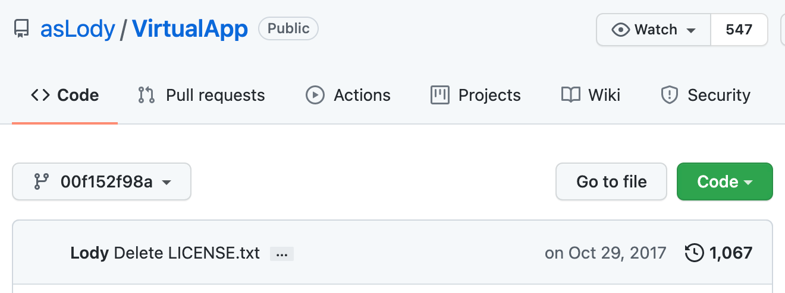
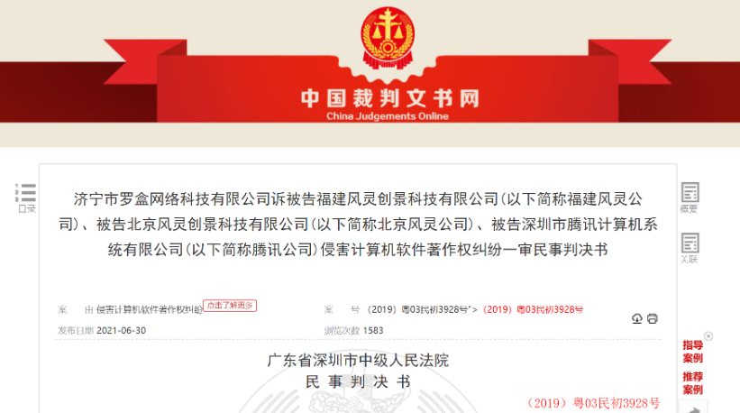

> <i>Hello, this is Haksung Jang.
> 
> In September 2021, it was reported through a [Chinese news article](https://www.oschina.net/news/159435) that the first GPL-related ruling in China had been handed down. I've summarized what I understood of it using a translation tool.
> Please keep in mind that, since I'm not a lawyer and don't know Chinese, there may be errors in the content. :)
> If you find any errors, I'd be grateful if you'd let me know at any time (haksung@sk.com).
> 
> (Thanks to [Jin-Young Choi](https://www.linkedin.com/in/jin-young-choi-20174b44), Center Director at the Korea Copyright Commission, for helping review this. ^^)</i>

{}
Source: "首例！违反 GPL 协议致侵权，被判赔偿 50 万元" - https://www.oschina.net/news/159435
{}

## Summary

In April 2021, a first-instance civil [ruling](https://www.iphouse.cn/cases/detail/woznd0v9pek4jx35ovdj8y5gxrm371q2.html?keyword=GPL) was handed down in China in a copyright infringement dispute. The ruling found that, because the defendant used code the plaintiff had released under GPL-3.0 without complying with GPL-3.0's obligations, the license rights granted by GPL-3.0 had terminated, and this constituted infringement. The court confirmed the infringement and ordered the defendant to pay damages of RMB 500,000 (about KRW 100 million).

## Parties to the Dispute

The plaintiff, the defendants, and the software at issue in this dispute are as follows.

### Plaintiff
The plaintiff is **Jining Luohe Network Technology Co., Ltd**, the copyright holder of VirtualApp.

### Defendants

There are three defendant companies in total.

1. **Fujian Fengling Chuangjing Technology Co., Ltd.**
    - Copyright holder of Dim Sum Desktop
    - Operates the official Dim Sum Desktop website
2. **Beijing Fengling Chuangjing Technology Co., Ltd.** (parent company of Fujian Fengling)
    - Listed as the developer of Dim Sum Desktop
3. **Shenzhen Tencent Computer System Co., Ltd.**
    - Operates "Application Bao" (a service for downloading, installing, and running Dim Sum Desktop)

## Software at Issue

### 1. VirtualApp (plaintiff's software)



The plaintiff developed and distributed VirtualApp, software that provides a virtual Android environment.
* Gitee: https://gitee.com/mirrors/VirtualApp
* GitHub: https://github.com/asLody/VirtualApp


http://www.downcc.com/soft/359746.html


Let's take a closer look at the history.

1. Lody, one of the plaintiff company's founders and the original contributor of VirtualApp, [published VirtualApp on GitHub](https://github.com/asLody/VirtualApp/commit/136fdba24e8770b009882369a778d468ce600bed) on July 7, 2016.
2. On July 8, 2016, [LGPL-3.0 was applied](https://github.com/asLody/VirtualApp/commit/7a610f0abf1852c5cc8134134b44f11de6d2b566), and
3. On August 12, 2016, [the license was changed to GPL-3.0](https://github.com/asLody/VirtualApp/commit/38cc2086ea88dd69009093d4d28fe2d11ee445b9).
   * Looking at [the code at that point in time](https://github.com/asLody/VirtualApp/tree/38cc2086ea88dd69009093d4d28fe2d11ee445b9), you can confirm that a copy of the GPL-3.0 license was included in the repository, and the license information in the README also explicitly stated "GPL-3.0".
4. Then, on January 24, 2017, a notice was suddenly added stating "[you do not have permission to use this project for free](https://github.com/asLody/VirtualApp/commit/7c8bfa40b2b301828cbaafefca122a3b5fc141d9)".
   * After that, from March through July 2017, notices stating that a commercial license was required to use this project commercially were added repeatedly on several occasions.
   * Regarding this change in licensing policy, one Chinese attorney speculated that Lody had initially released VirtualApp for free under an open source license during early development, but later changed his mind and decided to try to profit from it.
   * However, adding conditions like this to open source software already released under GPL is not permitted under GPL, and the Chinese attorney noted that Lody appeared to have attempted a licensing policy that violated GPL-3.0 because he didn't fully understand open source licensing.
5. In August 2017, Lody founded VirtualApp (the plaintiff). In other words, he was now formally going into business with VirtualApp.
6. And Lody ultimately [removed the open source license](https://github.com/asLody/VirtualApp/commit/44529892fc2e6198928196c80c5766e6453bf81e) from GitHub on October 29, 2017.
     * https://github.com/asLody/VirtualApp/commit/00f152f98a922ced0d858c31e1a9c2f0afb53ab6  
      
7. On November 8, 2017, the plaintiff registered a software copyright for VirtualApp v1.0, obtained a registration certificate, and sought to hold all rights to the software copyright.
8. On December 30, 2017, the plaintiff announced that [a commercial license must be purchased](https://github.com/asLody/VirtualApp/commit/8e6d9cd925af55b53a7e93046c469dd69676c38b) in order to use VirtualApp commercially, as shown below, and after that no longer updated the source code in the GitHub repo.

~~~
"VirtualApp (Chinese name: Luo box) was formally established in August 2017.
If you need to use VirtualApp for commercial purposes, please
contact QQ: 10890 to purchase a commercial license.
If you use VirtualApp's code as your own code for commercial gain or internal use,
or upload it to a software marketplace without authorization,
we will directly report this to the police (copyright infringement),
resulting in legal action and criminal liability for your company."
~~~  

For reference, Lody was the primary contributor to VirtualApp, with about 30 additional developers contributing afterward.

### 2. Dim Sum Desktop (defendant's software)

Like VirtualApp, Dim Sum Desktop is software that provides a virtual Android environment, and it was developed by defendant Fujian Fengling Chuangjing Technology Co., Ltd.


http://www.appchina.com/app/com.dianxinos.dxhome


While developing Dim Sum Desktop, the defendant obtained and included the [August 16, 2017 version of VirtualApp published on GitHub](https://github.com/asLody/VirtualApp/tree/13808a689e0da48d31bdba4b8724891a1dbf84e1). This version was under GPL-3.0 while also (inconsistently) including language prohibiting commercial use.

In September 2018, the plaintiff confirmed that "Dim Sum Desktop v6.5.8" was using code from VirtualApp V1.0.
  - Of 421 comparable pieces of code between the two programs, the following similarities were found.
      - 308 codes - substantial similarity
      - 27 codes - high similarity
      - 78 codes - general similarity

## Relief Sought

In 2019, the plaintiff filed suit seeking the following relief.

1. Defendants Fujian Fengling Company and Beijing Fengling Company shall immediately cease infringing the plaintiff's computer software copyright.
    - That is, they must immediately stop providing all services for downloading, installing, and running any version of the "Dim Sum Desktop" software over the internet.
2. Defendants Fujian Fengling Company and Beijing Fengling Company shall pay the plaintiff **RMB 20 million** in economic damages.
3. Defendants Fujian Fengling Company and Beijing Fengling Company shall compensate the plaintiff for a reasonable fee of **RMB 500,000** for the infringement compensate the plaintiff for a reasonable fee of 500,000 yuan for stopping the infringement.
4. Defendants Fujian Fengling Company and Beijing Fengling Company shall bear the litigation costs of this case.

## Court Ruling

In April 2021, the court [ruled](https://www.iphouse.cn/cases/detail/woznd0v9pek4jx35ovdj8y5gxrm371q2.html?keyword=GPL) that this case was a dispute concerning copyright infringement of computer software and involved issues related to open source, and offered its opinion on the following issues.

### Issue 1. Whether GPL-3.0 has legal effect

The court determined that GPL-3.0 has a contractual nature and can be regarded as a copyright agreement between the licensor and the user, and that it falls within the scope of adjustment of China's "Contract Law". It further explained tort liability for GPL-3.0 violations as follows.

#### Tort liability for violation of GPL-3.0

- Copyright law protects the exclusive rights of the copyright holder.
    - The rights of reproduction, modification, and distribution belong solely to the copyright holder (anyone other than the copyright holder may only use the work within the scope of "fair use").
    - Anyone who performs these acts without permission commits infringement.
- [GPL-3.0](https://www.gnu.org/licenses/gpl-3.0.html) 8. Termination
    - If the terms of use of GPL-3.0 are violated, the rights obtained through GPL-3.0 are automatically terminated.
    - "You may not propagate or modify a covered work except as expressly provided under this License. Any attempt otherwise to propagate or modify it is void, and will automatically terminate your rights under this License"
- Article 158 of the General Provisions of the Civil Law of China
    - Provides that "a civil juristic act may have conditions attached... a civil juristic act with a condition subsequent becomes void once the condition is fulfilled."
- Given the nature of open source software, the conditions of use specified in GPL-3.0 (source code disclosure, copyright/modification notices, etc.) are a precondition set by the licensor for allowing the user to use the software.
    - If the user violates this precondition of use, the GPL-3.0 agreement between the licensor and the user is automatically terminated.
    - The user's license under the contract is immediately terminated.
    - Any subsequent acts of reproduction, modification, or distribution performed by the user constitute infringement due to the loss of rights.

### Issue 2. Whether the plaintiff has standing to bring this lawsuit

The court did not clearly explain the nature of ownership (e.g., sole work, joint work, combined work) of a work created by multiple contributors on GitHub. However, it determined that, because the plaintiff registered a copyright for VirtualApp and for other reasons, the plaintiff holds the copyright and has the right to bring suit without the consent of other contributors.

1. Based on the upload records and authentication history on the code hosting website, it can be proven that the plaintiff is the copyright holder of VirtualApp.
2. The plaintiff has the right to bring suit without the consent or approval of contributors.
    - Lody, a shareholder of the plaintiff, published a total of 31,097 lines of the initial version of VirtualApp's source code on GitHub as the project owner, which forms the basis of the plaintiff's claim.
    - Contributors uploaded their own source code to the VirtualApp project and granted a license under GPL-3.0.
        - This is regarded as their consent to grant a license for their contributions to the project owner and other users.
    - If unanimous consent or approval from all contributors were required, it would in practice be impossible even to begin taking rights-protection measures. This would not help protect the litigation rights of open source projects.
    - In other words, the plaintiff does not need the consent or approval of contributors in order to initiate the lawsuit.
3. GPL-3.0 only restricts the licensor from asserting patent rights against the user; it does not restrict the licensor from asserting copyright claims against a user who violates the license agreement.
    - Therefore, the plaintiff's lawsuit can be seen as not violating the GPL-3.0 agreement regarding dispute resolution methods.

However, the court did not rule on whether the plaintiff has the right to relicense VirtualApp. Nor did it rule on the question of whether relicensing, by including contributions from other contributors, tainted GPL-3.0.

### Issue 3. Whether the defendant's conduct infringed the plaintiff's copyright

The court pointed out that VirtualApp's "prohibition on commercial use" clause violates GPL-3.0 (Section 7, Additional Terms; Section 10, Automatic Licensing of Downstream Recipients), and determined that the GPL-3.0 license still takes precedence.

1. The plaintiff split VirtualApp into an open source version and a commercial version, and removed the "GPL-3.0" license from subsequent open source versions.
    - Separately from this, the plaintiff asserted its rights based on the open source version of VirtualApp. Therefore, there is no need to determine the relationship and effect between VirtualApp's open source version and commercial version.
    - Under GPL-3.0, files bound by GPL-3.0 in an earlier version remain bound by GPL-3.0 even in subsequent versions.
2. GPL-3.0 allows users to make commercial use, and the licensor cannot restrict this.
    - Accordingly, the court did **not** support the plaintiff's following argument: "Is commercializing Dim Sum Desktop a violation of GPL-3.0?"
3. Although the "Dim Sum Desktop" app (V6.5.8) was required to freely disclose its source code under GPL-3.0, defendant Fujian Fengling Company failed to comply with this.
    - Accordingly, under Section 8 of GPL-3.0 and Article 158 of the General Provisions of the Civil Law of China, the rights obtained by defendant Fujian Fengling Company were automatically terminated.
    - Therefore, defendant Fujian Fengling Company's copying, modification, and distribution of VirtualApp constitute infringement due to the loss of the source of its rights.

However, the court made no mention of the "license reinstatement clause" of Section 8 of GPL-3.0 (which permanently reinstates the license if this is the first time the copyright holder has notified the violator of a violation, and the violation is cured within 30 days of receiving the notice). A Chinese attorney raised questions such as "Did the plaintiff notify the defendant of the violation beforehand?", "Did the plaintiff file suit directly without prior notice?", and "If so, does the opportunity for 'permanent reinstatement of the license upon cure within 30 days' still remain available?" (Shouldn't filing the lawsuit itself be regarded as constituting notice?)

### Issue 4. Scope of the defendant's legal liability upon confirmation of infringement

The plaintiff requested that damages be calculated based on the defendant's profits. However, the court appears to have determined the damages based on statutory damages.

- As the developer, operator, and publisher of the "Dim Sum Desktop" app (V6.5.8), defendant Fujian Fengling Company is liable under law to cease its infringement of VirtualApp's copyright.
    - Given that defendant Fujian Fengling Company is a wholly owned subsidiary of defendant Beijing Fengling Company, the plaintiff's claim that the two defendants jointly bear tort liability is lawful and is supported by the court.
- Defendant Tencent established relevant rules and a complaint channel for potential infringement on the "AppBao official website" and promptly removed the accused software upon complaint.
    - The plaintiff also did not file any specific complaint against defendant Tencent.
    - Accordingly, defendant Tencent is not required to bear legal liability.
- Compensation issue
    - The plaintiff claimed that it calculated damages based on the infringement profits of defendants Fujian Fengling Company and Beijing Fengling Company.
    - The court set the damages amount at RMB 500,000.

RMB 500,000 is reportedly [close to the maximum level of statutory damages for copyright infringement](https://www.copyright.or.kr/kcc/koreacopyright/info/download.do?brdctsno=44122&brdctsfileno=15650).

## Closing Thoughts

There has long been a perception that China is lenient toward violations of copyright law, so it was striking that the court recognized the legal effect of an English-language open source license and ruled that a license violation constituted copyright infringement. Companies need policies and processes in place to comply with open source license obligations in order to minimize the risk of getting caught up in disputes like this.

It is reported that the defendant has appealed the case to the Supreme Court. I'm curious to see what arguments the defendant will make on appeal. :)
