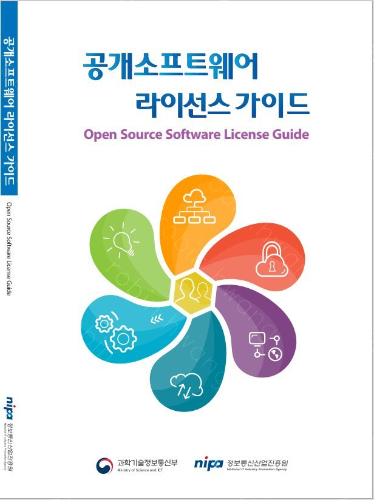
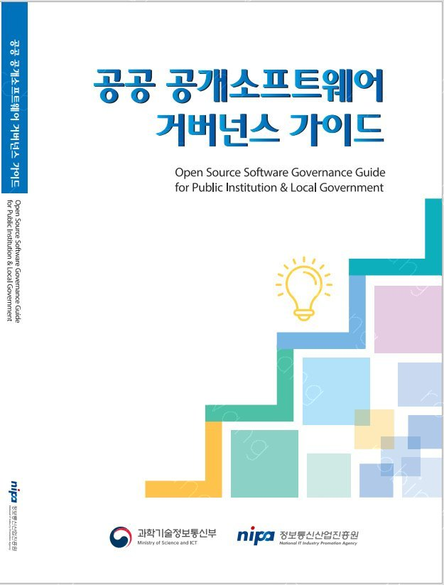
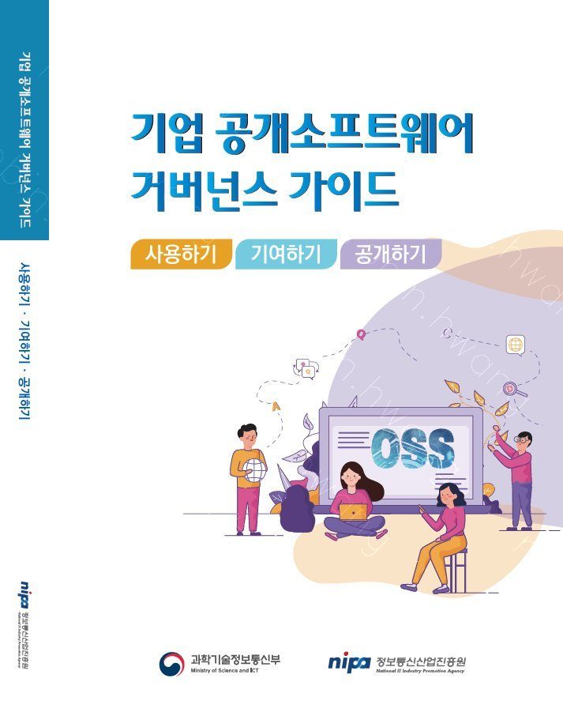
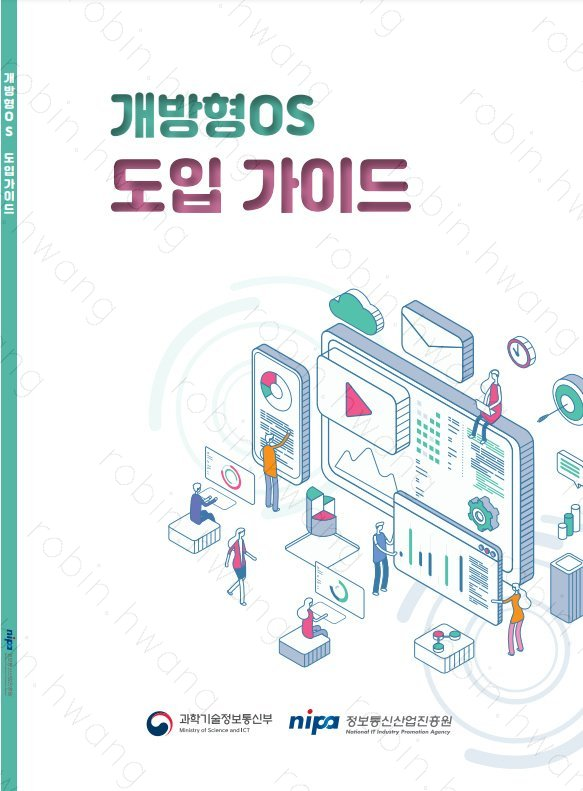

NIPA has published four guides for using open source software. (Source: https://www.oss.kr/news/show/ef0900db-f5b4-40fb-8745-f1b937fbd8d0)

The four open source software guides cover the following.
The Corporate Open Source Software Governance Guide was co-authored by current OpenChain KWG steering committee members Haksung Jang, Seoyeon Lee, and Minho Hwang.

## Open Source Software License Guide (Revised Edition)
[Download the Open Source Software License Guide](https://www.oss.kr/oss_guide/show/a17c94f3-a470-4e1d-8cfe-d5d15d6535f7)

Covers an overview and introduction to open source software licenses, how to comply with license obligations, copyright and patent considerations, license-related checklists, management approaches, notable dispute cases, and frequently asked questions, organized so the core content applicable to a company or organization can be identified and used across a range of situations.

The Open Source Software License Guide gives developers and managers at companies and organizations an easier way to understand the general concepts and key compliance requirements of open source licenses, and provides guidance on the matters they need to review to apply that understanding in practice. It is organized into: open source software concepts and definitions; open source license concepts and obligations; copyright and patent issues in open source software; open source license compatibility and dual licensing; open source license checklists by distribution method; open source license management; open source license dispute cases; and support available for open source license matters. Because the obligations a user must review and apply differ depending on the license, the mode of use, and the distribution method even when using the same open source software, this guide also offers separate tips for each section to help readers identify the content that matters most for their own company or organization and apply it across different situations.

## Public Sector Open Source Software Governance Guide
[Download the Public Sector Open Source Software Governance Guide](https://www.oss.kr/oss_guide/show/824f56c5-8ed7-40cc-84d1-a03fa2f42bb1)

Provides the relevant laws and guidelines, and the considerations and checkpoints to review, at each stage of a public-sector IT project when using open source software: planning, plan development, vendor selection and contracting, project execution, inspection and operation, and performance evaluation.

The Public Sector Open Source Software Governance Guide reflects an analysis of domestic and international open source policy and technology trends, and provides the laws and guidelines that must be checked, along with practical information and approaches, for using and managing open source software when carrying out an IT project in the domestic public sector. Each chapter covers the need for open source software management in IT projects and how to manage open source software in IT projects. The section on the need for management introduces the open source policies and use cases of governments at home and abroad, organizes the relevant laws, guidelines, and commentaries for IT projects, and explains the provisions relevant to open source software management. The section on managing open source software in IT projects introduces a basic management and review process for each stage — planning, plan development, vendor selection and contracting, project execution, inspection and operation, and performance evaluation — provides a list of guidelines and commentaries practitioners can reference at each stage, and offers management factors and review items for checking open source software management.

## Corporate Open Source Software Governance Guide
[Download the Corporate Open Source Software Governance Guide](https://www.oss.kr/oss_guide/show/2f7c25e8-df31-4ad9-9d25-1d8234c322c0)

Explains three cases of using open source software in enterprise software development and delivery — use, contribution, and release — in a way practitioners can apply directly, and closes with guidance on the organizational structure a company needs for open source software governance.

As companies increasingly develop and release software products and services built on open source software, the Corporate Open Source Software Governance Guide provides the guidance needed to establish open source software governance — covering source code management and supply policy, compliance processes, management tools, and organizational structure — as well as how a company can contribute to and release into the community. Each chapter covers using open source software, contributing to open source software, releasing open source software, and the OSPO (Open Source Program Office). Each topic is explained separately from the perspective of the company and of the developer to aid understanding. The company section focuses on what an open source software manager needs to know to establish policy and process, while the developer section explains what a developer at a company needs to use open source software.

## Open OS Adoption Guide
[Download the Open OS Adoption Guide](https://www.oss.kr/oss_guide/show/0e9ad67e-9d2a-4a0a-8f2d-092226e3ea07)

Introduces open operating systems for transitioning office PCs, their types, the adoption process and scope, ongoing maintenance, and case studies, giving practitioners a guide to the overall project plan when considering adoption of an open OS.

The Open OS Adoption Guide addresses the policy of expanding open OS adoption, a topic under active discussion domestically as part of open source software policy, and helps institutions considering adoption understand open operating systems, drawing on real adoption cases to make the guide useful throughout the review and implementation process. Each chapter covers an overview of open OS; open OS adoption case studies; matters to review before adopting an open OS; the project procurement process for adopting an open OS; the open OS maintenance process; and how to use this guide. Drawing on a range of reference models and cases for open OS adoption, it offers guidance on the overall project plan and the procedures and considerations practitioners need when reviewing adoption of an open OS.

---------
