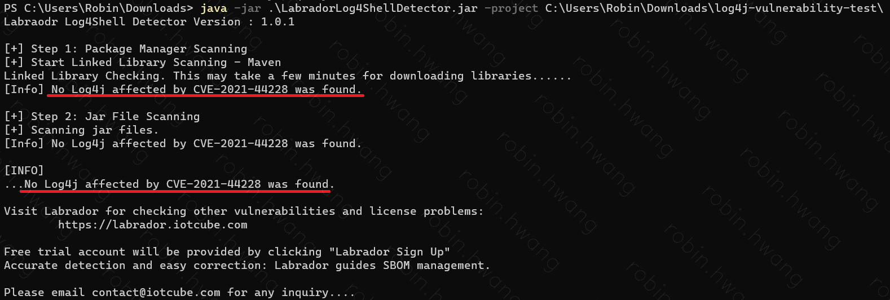
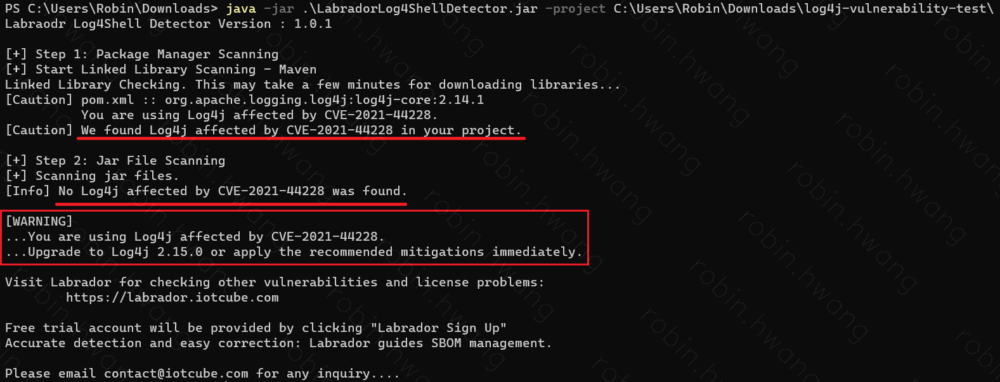
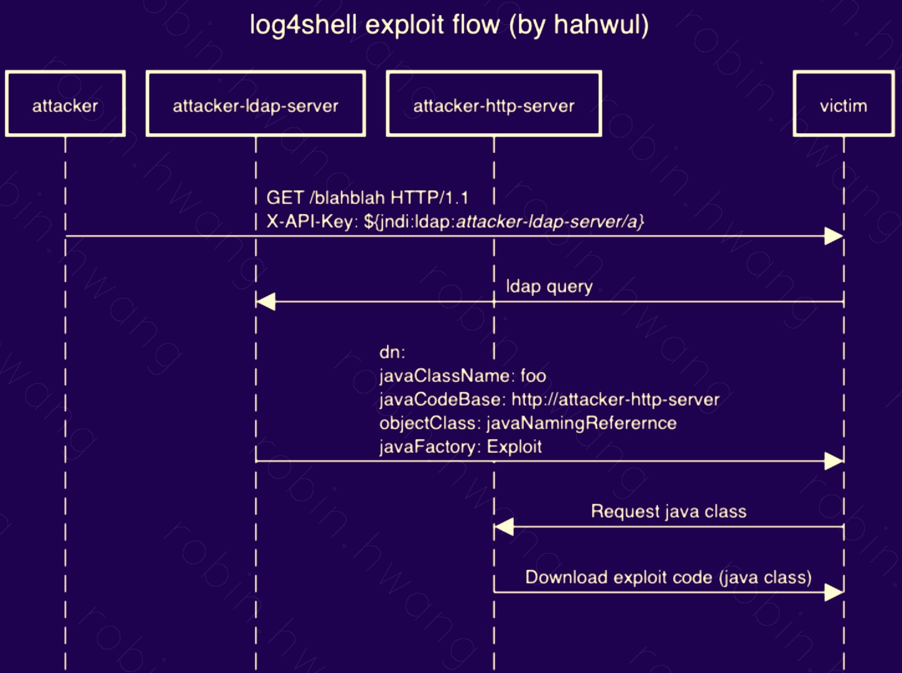

A vulnerability in Apache Log4j 2 ([CVE-2021-44228, NVD](https://cve.mitre.org/cgi-bin/cvename.cgi?name=CVE-2021-44228)) could lead to further damage such as malware infection, prompting urgent security update measures worldwide (2021.11.10). This post summarizes the related details.

### Log4j
Log4j is an open source project from the Apache Software Foundation, used for logging purposes in most Java-based web services.


### Timeline
- 2021.11.24 First discovered by the Alibaba Cloud security team ([Apache announcement](https://logging.apache.org/log4j/2.x/security.html))
- 2021.11.30 The Log4j team opened the pull request [Restrict LDAP access via JNDI](https://github.com/apache/logging-log4j2/pull/608) (merged 12/5)
- 2021.11.30 The Log4j team opened the pull request [no longer formats lookups in messages by default](https://github.com/apache/logging-log4j2/pull/607) (merged 12/5)
- 2021.12.09 The issue began to spread after a [tweet](https://twitter.com/P0rZ9/status/1468949890571337731) posted the Log4j 2 security PR along with a screenshot reproducing the vulnerability
- 2021.12.10 The issue gained widespread attention after Minecraft's technical lead announced via [tweet](https://twitter.com/slicedlime/status/1469150993527017483) that the issue had been fixed
- 2021.12.10 The security vulnerability was patched with the **release of Log4j 2.15.0**
- 2021.12.12 The Log4j team added [Disable JNDI by default](https://github.com/apache/logging-log4j2/commit/44569090f1cf1e92c711fb96dfd18cd7dccc72ea)
- 2021.12.12 Log4j 2.15.1 release candidate (JNDI disabled by default)

### Press Coverage (Korea)
- 2021.12.11 ["Worst vulnerability in the history of computing found" — global security industry stunned](https://www.yna.co.kr/view/AKR20211211035951009?section=popup/print)
- 2021.12.11 [Worst-ever 'Log4j' security flaw discovered, threatening nearly every server](https://news.naver.com/main/tool/print.naver?oid=092&aid=0002241848)
- 2021.12.11 [Following reports of "the worst vulnerability in the history of computing," the National Intelligence Service says it has "taken preemptive measures"](https://news.naver.com/main/tool/print.naver?oid=421&aid=0005778626)
- 2021.12.12 [Ministry of Science and ICT recommends urgent security measures for the "critically vulnerable" open source project Log4j](https://v.kakao.com/v/20211212103345131)
- 2021.12.12 ["The worst security flaw" — the IT industry thrown into turmoil](https://v.kakao.com/v/20211212180303915)
- 2021.12.12 [Electronic Times: damage is hard to assess — software details need to be identified](https://v.kakao.com/v/20211212184805464)
- 2021.12.12 ['Emergency response team' activated amid concerns over IT server hacking](https://v.kakao.com/v/20211212193223921)
- For coverage outside Korea, search for "**Log4Shell**"

### Response Measures
- **[Security advisories/notices related to Log4Shell (CVE-2021-44228)](https://gist.github.com/SwitHak/b66db3a06c2955a9cb71a8718970c592)**
- 2021.12.06 [Apache notice on 2.15.0 regarding CVE-2021-44228](https://logging.apache.org/log4j/2.x/)
- 2021.12.10 [Spring, Log4J2 Vulnerability and Spring Boot](https://spring.io/blog/2021/12/10/log4j2-vulnerability-and-spring-boot)
- 2021.12.11 [KISA (Korea Internet & Security Agency), advisory on the Apache Log4j 2 security update](https://www.krcert.or.kr/data/secNoticeView.do?bulletin_writing_sequence=36389)
- 2021.12.12 [Ministry of Science and ICT, urgent security patch recommendation for Apache Log4j 2 web services](https://www.korea.kr/news/pressReleaseView.do?newsId=156485848) (the guidance is the same as above)

### Response Examples (Reference)
- 2021.12.10 [AWS, Apache Log4j2 Issue](https://aws.amazon.com/ko/security/security-bulletins/AWS-2021-005)
- 2021.12.11 [How Cloudflare Security responded to the Log4j 2 vulnerability](https://blog.cloudflare.com/how-cloudflare-security-responded-to-log4j2-vulnerability/)


### Scope of Impact
- Log4j versions from 2.0-beta9 up to (but not including) 2.15.x

- [Regarding Spring Boot](https://spring.io/blog/2021/12/10/log4j2-vulnerability-and-spring-boot)
  - Spring Boot defaults to a different logging library, Logback, and is affected by the vulnerability only  
    [if the default logging system has been switched to Log4j2](https://docs.spring.io/spring-boot/docs/current/reference/html/howto.html#howto.logging.log4j).
  - As of 2021.12.12, in Spring Boot 2.6.1 (the latest version at the time), switching to Log4j2
  without specifying a version installs 1.14.1
  - Spring Boot 2.6.2, not yet released at the time, was planned to update to Log4j 2.15.x


### Known Vulnerability Scanners
- [Labrador Log4Shell code-level inspection tool](https://labrador.iotcube.com/) (jointly developed by Labrador Labs and the Korea University Security Research Institute)
- [Huntress Log4Shell Testing Application](https://github.com/huntresslabs/log4shell-tester)

- **Labrador Log4Shell test**
  - (Step 1) Scan via package management, then (Step 2) scan Jar files
  - Tested using a Spring Boot 2.6.1 sample project ([GitHub](https://github.com/revfactory/log4j-vulnerability-test)) ([create your own](https://start.spring.io/#!type=maven-project&language=java&platformVersion=2.6.1&packaging=jar&jvmVersion=11&groupId=com.kakao.opensource&artifactId=log4j-vulnerability-test&name=log4j-vulnerability-test&description=Demo%20project%20for%20Spring%20Boot&packageName=com.kakao.opensource.log4j-vulnerability-test&dependencies=web))  
  ```$java -jar LabradorLog4ShellDetector.jar -project [path]```
  - Scanning the default Spring project: no vulnerability found
    
  - [After switching the logging system to Log4j2](https://docs.spring.io/spring-boot/docs/current/reference/html/howto.html#howto.logging.log4j)
    


### Attack Method
- Log4Shell is classified as an RCE (Remote Code Execution) vulnerability.
- It carries the risk of zero-day attacks (attacks that exploit a publicly disclosed but not yet patched security vulnerability).
- [See here for details](https://www.hahwul.com/2021/12/11/log4shell-internet-is-on-fire/)
  
  [Image source](https://www.hahwul.com/2021/12/11/log4shell-internet-is-on-fire/)


### Government Considers Surveying Open Source Usage
The government is also considering ways to raise the security level of open source software. A Ministry of Science and ICT official said, "Because there is so much open source in use, similar incidents are likely to occur again," and added, "we are considering follow-up measures, including a usage survey."

(excerpted from [this article](https://v.kakao.com/v/20211212233003588))

---------
