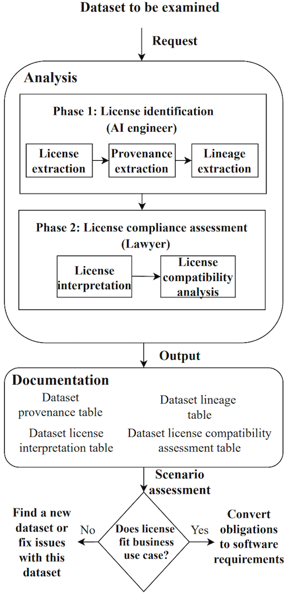
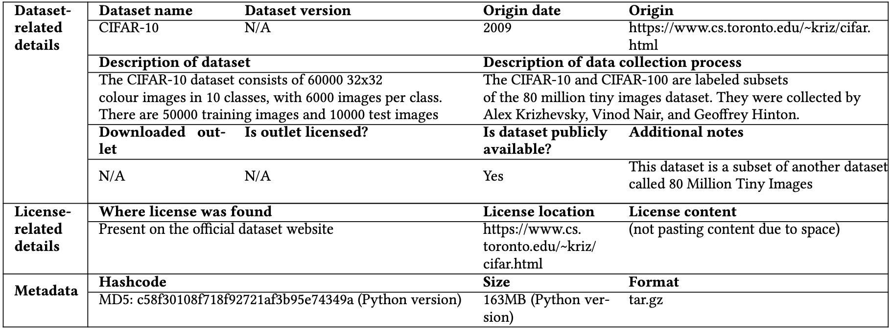
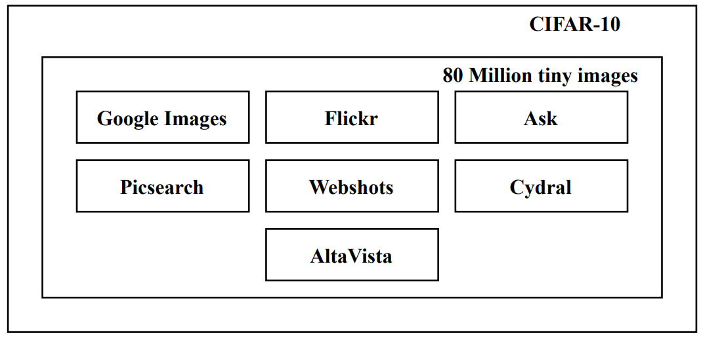
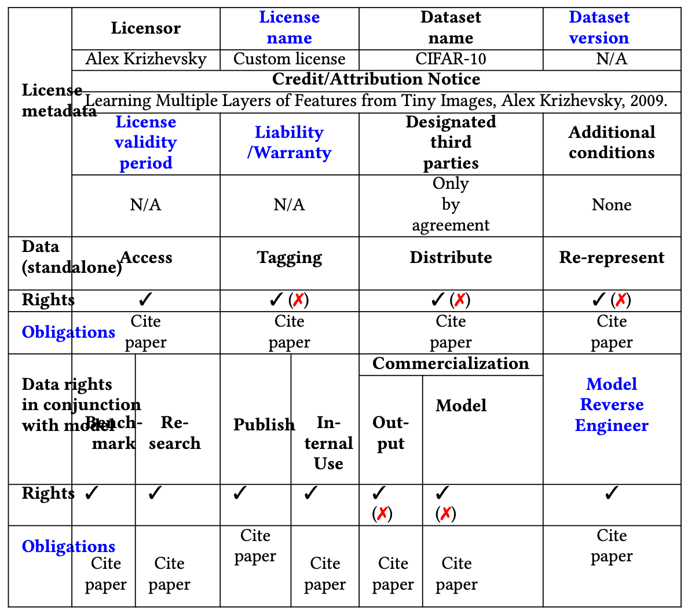
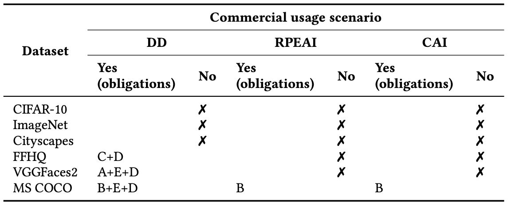

Hello, I'm Haksung Jang.

AI has become such an essential technology in modern business that virtually no company operates without using it. Building an AI service requires large volumes of data, and publicly available datasets are also widely used for this purpose. However, even a publicly available dataset carries copyright, so using it in a commercial AI service requires checking its license to minimize legal risks such as copyright infringement.

Today, I want to introduce a recently published paper on this topic: <b>Can I use this publicly available dataset to build commercial AI software? -- A Case Study on Publicly Available Image Datasets</b>: https://arxiv.org/abs/2111.02374

{}

"Can I use this publicly available dataset to build commercial AI software? -- A Case Study on Publicly Available Image Datasets"

<i>- Gopi Krishnan Rajbahadur, Erika Tuck, Li Zi, Dayi Lin, Boyuan Chen, Zhen Ming (Jack)Jiang, Daniel Morales German</i>

{}

I hope this post gives some insight into the efforts and procedures needed to minimize copyright infringement when building an AI service that relies on publicly available datasets.

## 1. Intro

The paper first explains that, unlike open source licenses, licenses for using publicly available datasets present several difficult problems.


1. It is difficult to identify a complete and accurate license for the dataset.
    - For example, the website that provided the dataset may have shut down.
2. It is difficult to confirm whether the license for the dataset is valid.
    - Many datasets are created by combining multiple data sources. Each of these data sources may be subject to a different license.
    - Moreover, the creators of publicly available datasets rarely document the licenses of the various data sources used to build the dataset.
    - For example, the only requirement the [CIFAR-10](https://www.cs.toronto.edu/~kriz/cifar.html) website states for using the dataset is a "citation requirement," with nothing else explained.
        - However, [CIFAR-10](https://www.cs.toronto.edu/~kriz/cifar.html) was created by crawling images from various data sources, such as Google Images and Flickr, that carry licenses which may restrict commercial use of the images.
        - In such cases, considering only the license of [CIFAR-10](https://www.cs.toronto.edu/~kriz/cifar.html) itself can create a compliance problem.
3. Licenses applied to publicly available datasets are generally ambiguous and do not clearly explain rights and obligations.
    - Building commercial AI software using such datasets without license risk is genuinely difficult in practice.
    - For example, GitHub Copilot uses a large AI model trained on billions of lines of source code hosted on GitHub.
        - However, open source licenses do not clearly define the right to use source code for training an AI model for commercial purposes.
        - This ambiguity has led to extensive legal debate over GitHub Copilot's compliance.
{}

### GitHub Copilot

Let me briefly touch on the debate surrounding GitHub Copilot here. The U.S.-based Software Freedom Conservancy (SFC) recently published a post titled "[If Software is My Copilot, Who Programmed My Software?](https://sfconservancy.org/blog/2022/feb/03/github-copilot-copyleft-gpl/)" pushing back against the claims made by Microsoft and GitHub.

Copilot is an AI service that GitHub trained on publicly available source code to help developers write code, and because this includes copyleft software, it has become a legal issue. In response, GitHub CEO Nat Friedman made the following counterargument:


1. Using public data to train an ML system is fair use.
2. Output produced by an ML system belongs to the system's operator.
{}

However, the SFC warned that this position taken by GitHub could cause significant harm to Copilot users in the following ways. It therefore took the position that, in order to avoid infringing on someone else's copyright, it is best not to use Copilot.


- GitHub's claim that "the output belongs to the operator" creates a false sense of legal legitimacy.
- The GitHub CEO's statement sidesteps liability toward Copilot users who could face a GPL enforcement action.
- In the end, this means the user must be the one to prepare a "fair use" or "not copyrightable" defense for Copilot's output.
{}

The SFC further argued that Microsoft and GitHub must prove why training on copylefted code qualifies as "fair use" and that the trained model is not a "work based on GPL'd software."

## 2. Background

Let's return to today's paper. It explains copyright law and contract law as they relate to datasets.


Basically, copyright-protected data cannot be used commercially or distributed unless the copyright owner explicitly permits it. Publicly available datasets may also contain data that is protected by copyright.

- Using such data to develop commercial AI software can potentially give rise to copyright infringement.
- However, in certain situations or countries, using copyright-protected data for various purposes, including commercial purposes, without the copyright owner's explicit permission may be permitted.
    - For example, in the United States, as suggested by the recent lawsuit Authors Guild v. Google, using copyrighted data is permitted under the fair use doctrine when there is no substantial harm to the copyright holder.
- However, this determination of fair use can differ from country to country.
    - In the UK and Canada, the fair dealing exception to copyright infringement allows copyright-protected data to be used without the copyright holder's explicit permission, but only for non-commercial purposes.
    - In the EU, the Text and Data Mining Law allows copyright-protected material to be used for non-commercial purposes without the copyright holder's explicit permission.
- As such, using publicly available datasets that contain copyright-protected data to build commercial AI software can potentially result in copyright infringement.
{}


Under contract law, the copyright owner of a work (e.g., an image or video) can grant a license describing the rights another party may enjoy and the obligations that must be fulfilled to enjoy those rights.

- If the license terms are not respected — that is, if rights not granted by the license are exercised over the data, or if obligations are not fulfilled — this can constitute a (potential) breach of contract.
{}

In the end, the paper emphasizes that, for companies developing AI services using publicly available datasets (except in cases that can be judged as fair use), a rigorous approach to confirming the rights and obligations tied to the dataset and ensuring license compliance is important in order to prevent copyright infringement, breach of contract law, and the like.

However, as I will mention again later, checking the license of every dataset, data source, and even individual data point involved in using a publicly available dataset, and complying with each obligation, is close to impossible in practice. Personally, I think a realistic approach is to accept a certain amount of license risk in order to use a publicly available dataset, or to build a legal basis on which fair use can be argued.

Now let's look at what rigorous approach the paper proposes for using publicly available datasets in commercial AI services.

## 3. Approach

The paper emphasizes that an AI engineer who wants to use a publicly available dataset must identify the applicable license, and a lawyer must analyze the rights and obligations of that license to determine whether it can be applied to a commercial AI service.

First, Phase 1 is the process in which the AI engineer confirms the license. The paper explains the details as follows.


#### (Step 1) License extraction

1. The AI engineer first identifies the license on the website from which the publicly available dataset was downloaded.
2. If no license can be found, the engineer checks whether a license is provided as a separate file within the dataset.
3. If it is still not found, the engineer confirms the license by contacting the dataset's owner directly.

* Taking [CIFAR-10](https://www.cs.toronto.edu/~kriz/cifar.html) as an example, the website states the following condition for using the dataset, which can be regarded as its license:

  <i> Please cite it if you intend to use this dataset. "Learning Multiple Layers of Features from Tiny Images, Alex Krizhevsky, 2009."</i>

#### (Step 2) Provenance extraction

Here, provenance means the original source of the dataset.

- A dataset created by one researcher may later be modified, added to, and redistributed by someone else on a different platform.
- Therefore, it is important for the AI engineer to confirm whether the dataset obtained is identical to the one the original author created.
- In other words, the engineer checks the dataset's original source to confirm whether the license extracted in Step 1 is in fact the correct license for the dataset.
1. (Sub-step 1) First, query a search engine with appropriate search terms to find the dataset's official source (e.g., an official website, research paper, or technical report).
2. (Sub-step 2) Extract the license and metadata from the official source.

* Taking [CIFAR-10](https://www.cs.toronto.edu/~kriz/cifar.html) as an example, information about its license and original source can be recorded as follows.

#### (Step 3) Lineage extraction

Many publicly available datasets, including computer vision and NLP datasets, are generally created by collecting data from various sources, such as websites that host data like images or other popular sites. Because the license of these data sources differs from the license of the dataset itself, it must be checked separately.
1. (Sub-step 1) Trace the dataset's creation process.
    - Record this separately (see the "Description of the data collection process" field in the table above).
    - If it turns out that a data source itself contains another data source, find and record that data source as well (repeat recursively).
    - For example, [CIFAR-10](https://www.cs.toronto.edu/~kriz/cifar.html) is a subset of another dataset called [80 Million Tiny Images](https://groups.csail.mit.edu/vision/TinyImages/). The paper reveals that this dataset draws on seven data sources: Google, Flickr, Ask, Altavista, Picsearch, Webshots, and Cydral.
    
2. (Sub-step 2) Find the official source for each data source (using websites, search engines, etc.).
    - For example, the dataset is no longer available on the [80 Million Tiny Images](https://groups.csail.mit.edu/vision/TinyImages/) website. In this case, look for a possible archived version (e.g., [http://web.archive.org/web/20100601000000*/http://groups.csail.mit.edu/vision/TinyImages/](http://web.archive.org/web/20100601000000*/http://groups.csail.mit.edu/vision/TinyImages/))
    - Then determine the official website for each of the seven data sources listed above.
3. (Sub-step 3) Confirm which license applies at the relevant point in time.
    - Keep in mind that a data source's license may have changed over time.
    - That is, confirm the license of the data source as it stood at the time the dataset was created.
    - For example, for data originating from Google Images, confirm which license applies among Google's Terms of Service from 2005, and/or 2007, and/or 2012, and so on.
4. (Sub-step 4) Identify the license for each data source.
    - Identify the license associated with every data source that contributed to creating the dataset.

{}

That covers Phase 1, and there is quite a lot for an AI engineer who wants to use a publicly available dataset to confirm. A bigger problem is that no matter how much effort is put in, if a website provides no license information or provides incorrect information, the scope of what the AI engineer can confirm will inevitably be limited. In any case, let's look further into the paper. Next is Phase 2, the stage in which a lawyer or other legal professional confirms the rights and obligations of the license.


#### (Step 1) License interpretation

Here, the legal professional looks at the license of the dataset and its data and extracts the rights and obligations.

- The extracted rights and obligations are documented in a standard format.
- The paper proposes extending the [Montreal Data License (MDL)](https://arxiv.org/abs/1903.12262) format for this purpose → Enhanced MDL.
- The following can be recorded here:
  1. License metadata
     - Licensor
     - License name
     - Dataset name
     - Dataset version 
     - Credic / Attribution Notice
     - License validity period
     - Liability / Warranty 
     - Designated third parties
     - Additional condition
  2. Data (standalone)
     - Rights / Obligations
       - Access
       - Tagging
       - Distribute
       - Re-represent
  3. Data rights in conjunction with model
     - Rights / Obligations
       - Benchmark
       - Research
       - Publish
       - Internal Use
       - Commercialization
         - Output
         - Model
       - Model Reverse Engineer

#### (Step 2) License compatibility analysis

Based on the information in the Enhanced MDL, the legal professional performs a risk assessment to decide whether the dataset can be used commercially.

- Take note of cases where, even if the dataset's license permits something, the data source's license restricts that use case.
- For example, with CIFAR-10, what the dataset's license permits and what the data source's license permits sometimes differ.
- In the table above, a red mark (x) indicates that the data source's license imposes a restriction (as with the licenses of Google and Flickr, for example).

In summary, CIFAR-10's license grants all rights to the dataset as long as the paper is cited, but the data sources' licenses are more restrictive. As a result, using this dataset to train an AI model, or for commercial purposes including modifying or distributing the dataset itself, carries a potential risk of license compliance violation.

{}

Going through Phase 2, we've looked at how a legal professional documents license rights and obligations in the Enhanced MDL format and how this is used. The paper explains that checking not just the dataset's license but also the licenses of its data sources matters, because if a data source's license restricts commercial use, using the dataset commercially carries risk as well.

Using this same approach, the paper conducted case studies on other datasets as well. Let's look at what it found.

## 4. Case Study Details



For the case study, six image datasets were selected based on popularity and the likelihood of commercial use.

1. [CIFAR-10](https://www.cs.toronto.edu/~kriz/cifar.html) : Alex Krizhevsky, Geoffrey Hinton, et al. 2009. Learning Multiple Layers of Features from Tiny Images. Technical Report. University of Toronto.
2. [ImageNet](https://www.image-net.org/) : Olga Russakovsky, Jia Deng, Hao Su, Jonathan Krause, Sanjeev Satheesh, Sean Ma, Zhiheng Huang, Andrej Karpathy, Aditya Khosla, Michael Bernstein, et al. 2015. Imagenet large scale visual recognition challenge. International journal of computer vision 115 (2015), 211–252
3. [Cityscapes](https://www.cityscapes-dataset.com/) : Marius Cordts, Mohamed Omran, Sebastian Ramos, Timo Scharwächter, Markus Enzweiler, Rodrigo Benenson, Uwe Franke, Stefan Roth, and Bernt Schiele. 2015. The Cityscapes Dataset. In Proceedings of the 2015 CVPR Workshop on the Future of Datasets in Vision, Boston, MA, USA, June 11.
4. [FFHQ](https://github.com/NVlabs/ffhq-dataset) : Tero Karras, Samuli Laine, and Timo Aila. 2019. A style-based generator architecture for generative adversarial networks. In Proceedings of the IEEE/CVF Conference on Computer Vision and Pattern Recognition. 4401–4410
5. [VGGFace2](https://paperswithcode.com/dataset/vggface2-1) : Georgia M Kapitsaki, Frederik Kramer, and Nikolaos D Tselikas. 2017. Automating the License Compatibility Process in Open Source Software with SPDX. Journal of Systems and Software 131 (2017), 386–401.
6. [MS COCO](https://cocodataset.org/) : Tsung-Yi Lin, Michael Maire, Serge Belongie, James Hays, Pietro Perona, Deva Ramanan, Piotr Dollár, and C Lawrence Zitnick. 2014. Microsoft coco: Common objects in context. In European conference on computer vision. Springer, 740–755.

{}

All six of these datasets are image datasets, and their licenses have the following characteristics.

| Dataset | Dataset license | Data Source |
| --- | --- | --- |
| CIFAR-10 | No license stated (citation only required) | Multiple data sources |
| ImageNet | custom license | Multiple data sources |
| Cityscapes | custom license | One data source |
| FFHQ | CC-NC-SA-4.0 | Multiple data sources|
| VGGFaces2 | CC-NC-SA-4.0 | Multiple data sources |
| MS COCO | CC 4.0 | Multiple data sources |

Now let's look at the results of the paper's research on these six datasets.



The most common usage scenarios for image datasets can be seen as the following three:

1. Distributing the dataset itself commercially (DD : Distribute Datasets)
2. Training an AI model with the dataset and releasing an embedded product that includes the model (RPEAI : Release Product with Embedded AI Model)
3. Training an AI model with the dataset and commercializing the model's output (CAI : Commercialize the Model)

The research results for each dataset against these usage scenarios are as follows.

- A - Provide a link to license CC-BY-NC 4.0
- B - Provide a link to the license CC-BY 4.0
- C - Provide a link to license CC-By-NC-SA 4.0
- D - Remove infringing content as soon as possible when an infringement is detected
- E- Indicate changes

### 1. Distributing the dataset together with commercial AI software --> can potentially cause a license compliance violation (3 of 6)

- Distribution is not permitted for CIFAR-10, ImageNet, and Cityscapes
- Despite this restriction, many platforms distribute these datasets. (e.g., [https://deepai.org/datasets](https://deepai.org/datasets) - distributes ImageNet and CIFAR-10) This can cause problems.
- The other 3 datasets can only be used if obligations such as distributing them under the same license are complied with.

### 2. Using the dataset to train commercial AI software --> can potentially cause a license compliance violation (5 of 6)

- Except for MS COCO, none of the datasets explicitly grants the right to commercialize an AI model trained on the dataset
- For MS COCO, when the dataset is used to build commercial AI software, it requires
    - Providing a link to the license
    - Not using the dataset to warrant a product

### 3. For 3 of the 6, modifying the dataset can potentially cause a license compliance violation

- Datasets are often modified or augmented to improve an AI model's performance
- For CIFAR-10, ImageNet, and Cityscapes, modifying the dataset can potentially cause a license compliance violation
- The other datasets also must comply with the obligation to indicate the exact changes made, as required by their licenses

As such, publicly available datasets may not be well suited for building commercial AI software.

{}

Even just from the results described above, using a publicly available dataset in a commercial AI service carries the potential to cause a license compliance violation. Moreover, the paper further explains that there are additional aspects this study did not consider.

## 5. THREATS TO VALIDITY



### External validity

This paper studied only the license violation aspect.

- Factors such as privacy protection and ethical concerns are also important when building AI software using a dataset.
- The paper did not address cases where a dataset is used for internal research or academic purposes.
- It also did not address whether use is permissible under fair use, fair dealing, or other similar legal doctrines.
- This study covered only image datasets. Other types of datasets, such as video or text, may raise different issues, so further research is needed.

### Internal validity

This study considered licenses only down to the data source level and did not consider the license associated with each individual data point (e.g., each individual image).

- Individual images may also carry their own copyright.
- However, each data source contains thousands or tens of thousands of data points, and extracting the license for each of these is practically impossible.
- Therefore, this remains a threat to validity.

### Construct validity

The provenance or lineage confirmed in this study for each dataset may not be accurate.

- It is impossible to determine exactly when and where a dataset was created.
- In cases such as ImageNet, the exact data sources may not even be knowable.
- The best that can be done is to infer the data sources, and thereby the license, from whatever related documentation is available.

{}

Considering, as described above, both the difficulty of confirming the license of individual data points and the difficulty of confirming a license from inaccurate information, I think it may be fair to conclude that using a publicly available dataset in a commercial AI service without any license risk is genuinely close to impossible. That said, publicly available datasets cannot be excluded entirely from AI product research either. Just as GitHub is preparing the Copilot service despite the copyright infringement issues — accepting a certain degree of legal risk and, where necessary, continuing to fight it out in court — it seems worth considering that a company should be willing to bear some degree of potential copyright infringement risk in order to make use of AI technology. In fact, there is also a view that using a dataset solely for machine learning training does not constitute copyright infringement.

* Under [Article 35-2 of the Copyright Act](https://glaw.scourt.go.kr/wsjo/lawod/sjo192.do?contId=2135829&jomunNo=35&jomunGajiNo=2), temporary reproduction of a work on a computer is permitted. Based on this, there is room to argue that temporarily copying a publicly available dataset into memory during machine learning training is likewise permitted.
* [Article 35-3 of the Copyright Act](https://glaw.scourt.go.kr/wsjo/lawod/sjo192.do?contId=2135829&jomunNo=35&jomunGajiNo=3) permits the use of a work as fair use when the use does not conflict with the work's normal exploitation and does not unreasonably prejudice the legitimate interests of the author. Using a publicly available dataset made up of image data solely for machine learning training does not conflict with the normal way pictures or photographs are exploited and does not harm the author's interests, so it could be argued that this qualifies as fair use.

That said, since there is still no clear case law on this point, it cannot be said that there is no risk at all. (And by the way, I am not a lawyer, so please note that none of this carries any legal effect. ^^)

Overseas, countries such as those in Europe, Japan, and the United States have amended their laws to allow the use of big data for AI training, and I understand that a bill to amend the Copyright Act for this purpose has also been introduced in Korea's National Assembly. I hope the government moves quickly to pass the necessary legislation so that domestic companies can use publicly available datasets more easily and accelerate innovation in AI technology.

Thank you.
