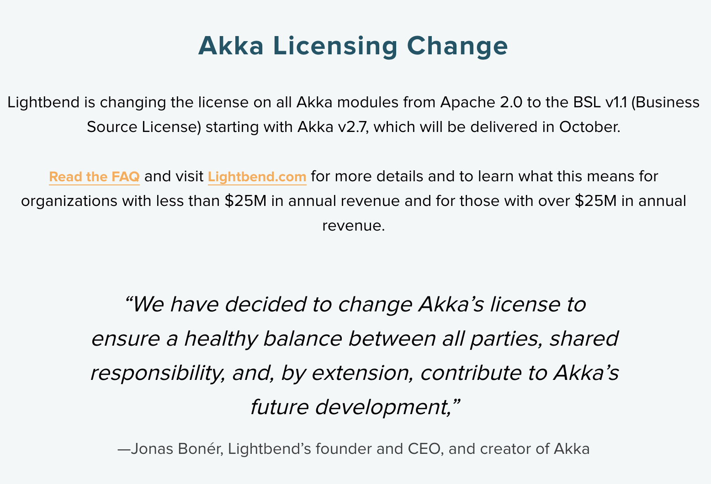
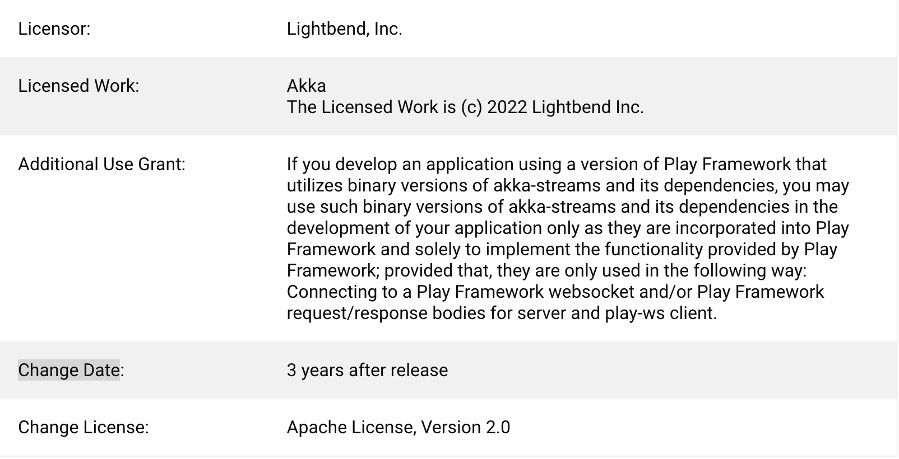

> There is a growing number of cases where software companies that started out as open source change their license policy. Lightbend, a US company that had maintained an Apache-2.0 open source license policy, announced in September 2022 that it would change Akka's license to BUSL-1.1 (Business Source License).
> Let's take a look at what the Business Source License is, and what the background and impact are of Lightbend changing Akka's license to BSL.

## What is Akka?

[Akka](https://github.com/akka/akka) is a toolkit that simplifies distributed applications, in which multiple threads work concurrently on the JVM, based on the [Actor Model](https://doc.akka.io/docs/akka/current/typed/guide/actors-intro.html). It is reportedly used mainly in backend platforms that require high performance, such as live chatting.

## The License Change

Lightbend, a US company, [changed](https://akka.io/) Akka's license in September 2022.

The main points of the license change are as follows.

- Akka, which was open source (Apache-2.0), will be under a new license starting with v2.7.
- The new license is [BUSL-1.1](https://spdx.org/licenses/BUSL-1.1.html) (Business Source License).
- It can be used for free for noncommercial purposes, but a license fee must be paid for commercial use.

Lightbend [stated](https://www.lightbend.com/blog/why-we-are-changing-the-license-for-akka) that it had supported the Akka open source project under Apache-2.0 for over a decade, but that it had become difficult to sustain this.

> Over the years, Lightbend has steadily borne more of the support for Akka. With Akka now considered critical infrastructure for many large organizations, the Apache 2.0 model becomes increasingly risky when a small company solely carries the maintenance effort. Balancing the global demands of our corporate community while supporting these needs of a vast open source base is a tremendous weight to bear.

In the end, Lightbend also gave up sustaining the Apache-2.0 open source model, and instead introduced BUSL-1.1, a "Source Available" license, to disclose source code to the community while generating revenue by charging enterprise users a license fee. The number of cases where companies that develop software as open source change their license policy to improve profitability has been increasing since 2018. MongoDB's SSPL is a representative example, and Elasticsearch introduced the Elastic License. You can find the details on this in the previous post, '[Elastic License 2.0 (subtitle: The Evolving Open Source License)](https://devocean.sk.com/opensource/techBoardDetail.do?ID=163055)'. It can be inferred that Lightbend also decided to change its license considering this background and profitability.

BUSL-1.1 had already been applied to several projects that used to be open source, even before Akka.
- [MariaDB](https://mariadb.com/bsl-faq-mariadb/)
- [CockroachDB](https://www.cockroachlabs.com/blog/oss-relicensing-cockroachdb/)
- [Sentry](https://blog.sentry.io/2019/11/06/relicensing-sentry/)
- [materialize](https://github.com/MaterializeInc/materialize/blob/main/LICENSE)

## Business Source License

How is [BUSL-1.1](https://spdx.org/licenses/BUSL-1.1.html) different from an open source license?

### Grants the right to use only for non-production use

Unlike a typical open source license, BUSL-1.1 grants the right to copy, modify, and redistribute only for `non-production use`.

> The Licensor hereby grants you the right to copy, modify, create derivative works, redistribute, and make non-production use of the Licensed Work.

If your use does not qualify as `non-production use`, you are required to purchase a commercial license from the Licensor.

> If your use of the Licensed Work does not comply with the requirements currently in effect as described in this License, you must purchase a commercial license from the Licensor, ...

Therefore, companies using the version of Akka to which BUSL-1.1 applies (v2.7 and later) can no longer use Akka for free and must [purchase a commercial license](https://www.lightbend.com/akka#pricing) from Lightbend.

### Change Date, Change License

Another characteristic of BUSL-1.1 is the `Change Date` and `Change License`. Once the `Change Date` passes after a version of the software under BUSL-1.1 is released, the `Change License` applies and BUSL-1.1 no longer applies.

> Effective on the Change Date, or the fourth anniversary of the first publicly available distribution of a specific version of the Licensed Work under this License, whichever comes first, the Licensor hereby grants you rights under the terms of the Change License, and the rights granted in the paragraph above terminate.

For [Akka's BUSL-1.1](https://www.lightbend.com/akka/license), the `Change Date` is 3 years after release, and the `Change License` is Apache-2.0.

For example, if Akka 2.8 were released on January 1, 2023, after 3 years, from January 1, 2026, Apache-2.0 would apply and companies could also use it for free. BUSL-1.1 provides this `Change License` provision so that you have to pay to use the new version, but even old versions can be used for free even for commercial purposes. This appears to reflect an intent to charge large companies, the heavy users of the software.

### Additional Use Grant

BUSL-1.1 has an `Additional Use Grant` provision that allows the Licensor to grant rights to commercial users under certain conditions.

> The Licensor may make an Additional Use Grant, above, permitting limited production use.

Therefore, the Licensor can permit users to use the software for commercial purposes as needed. For example, Lightbend [permitted](https://www.lightbend.com/akka/license) the use of Akka when developing an application using [Play Framework](https://www.playframework.com/) that utilizes akka.

> Additional Use Grant:	If you develop an application using a version of Play Framework that utilizes binary versions of akka-streams and its dependencies, you may use such binary versions of akka-streams and its dependencies in the development of your application only as they are incorporated into Play Framework and solely to implement the functionality provided by Play Framework; provided that, they are only used in the following way: Connecting to a Play Framework websocket and/or Play Framework request/response bodies for server and play-ws client.

## Akka License FAQ

Lightbend [provides an FAQ](https://www.lightbend.com/akka/license-faq) related to the Akka license change, and here are a few of the key points.

### Free for startup-sized companies

First, looking at [Akka's pricing](https://www.lightbend.com/akka#pricing), it is provided for free to startup companies with annual revenue under $25 million.

### Can I keep using older versions of Akka?

The license of older versions remains unchanged as Apache-2.0. However, additional features, improvements, non-critical security updates, and non-critical bug fixes will not be provided. For version 2.6.x, only critical security updates and critical bug fixes will be provided under Apache-2.0 for the next year, i.e., until September 2023.

### We use it for production, as well as for development, testing, and staging. In which cases do we need a commercial license?

You only need a commercial license for the copies of the software used for production.

### I work at a government department not related to revenue. Do I need to purchase a commercial license?

If Akka is used in production rather than for `non-production use`, a commercial license purchase is required even for government departments.

> Government departments using Akka in production will require a commercial license.

### Can I backport parts of BUSL-1.1 software to an older version under Apache-2.0?

No. This would violate Lightbend's copyright, as well as Apache-2.0.

> No. In this circumstance, you would either violate Lightbend's copyright by re-releasing the code under Open Source, or you would violate the earlier Akka version's Apache license by introducing incompatible BSL code (i.e., code subject to a use limitation not allowed by the Open Source Apache 2.0 license).

## Closing

The role of corporate open source governance is becoming increasingly important. Using open source in products while complying with open source license obligations, such as attribution notices and source code disclosure, is a basic compliance activity that companies must maintain. However, there has recently been an increase in cases where software that used to be open source changes to a license that requires a commercial purchase, such as BUSL-1.1. Therefore, companies developing products/services using open source need to respond quickly to such license changes. Otherwise, it should be remembered that a license violation could result in significant losses.

In particular, companies should build an SBOM (Software Bill of Materials) management system so that, when they identify a license change case like this one with Akka, they can immediately determine which products/services or internal systems within the company use Akka and which version, and take the necessary action (using an older version, or purchasing a commercial license).

Thank you.
