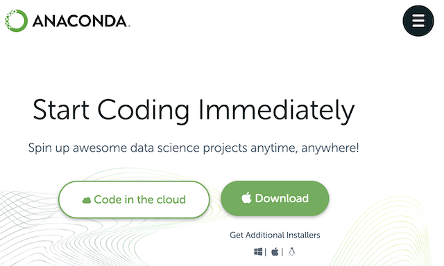
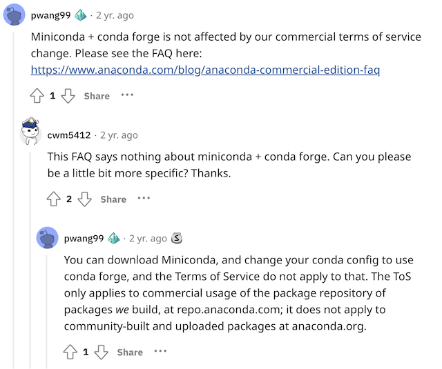

Hello.

Do you often use Anaconda when setting up a Python development environment? Python is widely used for everything from simple task automation to data analysis, AI training, and modeling, and running multiple Python projects can create the inconvenience of package version conflicts. Anaconda has the advantage of providing a virtual environment for each development project to prevent version conflicts, and it is widely used because it can be easily downloaded and installed from the [homepage](https://www.anaconda.com/).



[https://www.anaconda.com/](https://www.anaconda.com/)

## But you need to buy Anaconda to use it.

In [September 2020](https://www.anaconda.com/blog/anaconda-commercial-edition-faq), Anaconda changed its Terms of Service to require payment when a company or government organization with 200 or more employees uses the Anaconda Repository.

Therefore, if you are a developer working at a company with 200 or more employees, you must purchase a Pro or higher license on the Anaconda website.


[https://www.anaconda.com/pricing](https://www.anaconda.com/pricing)

Let's look a bit more closely. To install Anaconda, you can typically download the [Anaconda Distribution](https://www.anaconda.com/products/distribution) for free from the Anaconda homepage.


[https://www.anaconda.com/products/distribution](https://www.anaconda.com/products/distribution)

Installing it sets up a development environment easily, since the conda package manager, Python, and about 150 packages are installed together.

Anaconda Inc. hosts the [Anaconda Repository](https://repo.anaconda.com), providing over 8,000 open source packages, and users can reliably install and manage these packages with the `conda install PACKAGENAME` command.


[https://repo.anaconda.com/](https://repo.anaconda.com/)

The [Terms of Service](https://legal.anaconda.com/policies/en/?name=terms-of-service) for this very [Anaconda Repository](https://repo.anaconda.com) is what changed in September 2020, and free use of the Anaconda Repository is no longer possible for commercial activity.

Many developers easily download and use the Anaconda Distribution, but in doing so they end up using the Anaconda Repository. For a developer at a company with 200 or more employees, this results in "unintentionally" violating Anaconda's Terms of Service, and to avoid this you must purchase Anaconda Pro or higher.

For reference, [Miniconda](https://docs.conda.io/en/latest/miniconda.html) is, like Anaconda, a software package that installs the conda package manager, Python, and minimal dependencies. Using Miniconda also accesses the Anaconda Repository to download packages, so it can be considered subject to the same paid-purchase requirement as Anaconda.


[https://docs.conda.io/en/latest/miniconda.html](https://docs.conda.io/en/latest/miniconda.html)


In the end, even if a developer at a company with 200 or more employees downloads and uses the Anaconda Distribution for free, they won't immediately be charged or have features blocked. Still, for the stable development of Anaconda, it would be good for developers at companies with 200 or more employees to voluntarily purchase and use it. (Of course, a license violation notice and invoice could show up at the company at some point. ^^)


## There is an alternative: 'conda-forge'

Anaconda Inc. publishes and maintains the package manager [conda](https://conda.io/) as open source. [conda](https://github.com/conda/conda) itself is open source released under the [BSD-3-Clause](https://github.com/conda/conda/blob/main/LICENSE.txt) license, so there is no problem with companies using it for free.


[https://github.com/conda/conda](https://github.com/conda/conda)

conda needs a repository location to find packages to install and manage, and this is called a channel. The default channel is the [Anaconda Repository](https://repo.anaconda.com/). However, there is also a community-based repository: [conda-forge](https://conda-forge.org/).


[https://conda-forge.org/](https://conda-forge.org/)

You can install conda and add conda-forge as a channel.

```
conda config --add channels conda-forge
conda config --set channel_priority strict
```

This way, since you are not using the Anaconda Repository, you can use conda [without violating](https://florianwilhelm.info/2021/09/Handling_Anaconda_without_getting_constricted/) the Terms of Service described above.

Peter Wang, CEO of Anaconda Inc., has [stated](https://www.reddit.com/r/Python/comments/iqsk3y/comment/g4xuabr/) directly that downloading Miniconda and changing the conda config to conda-forge allows free use.



[https://www.reddit.com/r/Python/comments/iqsk3y/comment/g4xuabr/](https://www.reddit.com/r/Python/comments/iqsk3y/comment/g4xuabr/)

Removing the defaults channel, which points to the Anaconda Repository, entirely can more reliably restrict use of the Anaconda Repository.
```
conda config --remove channels defaults
```

You can check whether the channel has changed as intended with the command below.

```
### Before the change
% conda config --show channels
channels:
  - defaults

### After the change
% conda config --show channels
channels:
  - conda-forge
```

## Miniforge adds conda-forge to the channel at installation.

Going a step further, [Miniforge](https://github.com/conda-forge/miniforge) is an open source project that provides a minimal installer for conda, and it adds conda-forge to the channel by default at installation. Miniforge is also known to support various CPU architectures, including Apple M1.


[https://github.com/conda-forge/miniforge](https://github.com/conda-forge/miniforge)

Therefore, if you install Miniforge instead of Anaconda, it appears you can relatively easily set up a development environment with the conda package manager without violating the license.


One interesting point is that operating conda-forge requires substantial hosting costs, which Anaconda Inc. pays. Anaconda Inc. explains that it [needed](https://conda-forge.org/blog/posts/2020-11-20-anaconda-tos/) the revenue from changing the Anaconda Repository's Terms of Service in order to keep conda-forge free.

Considering development convenience and stability, it would be good to purchase and use Anaconda Pro where possible. Until then, to avoid license issues, you might consider the Miniconda + conda-forge combination, or Miniforge, as alternatives.

Please let me know if there is anything incorrect. ^^

Thank you.
