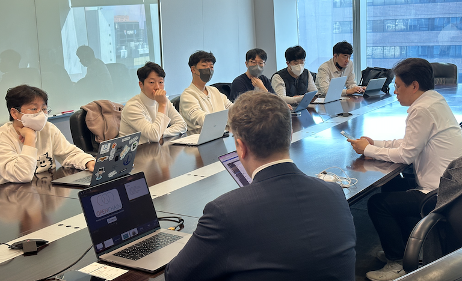
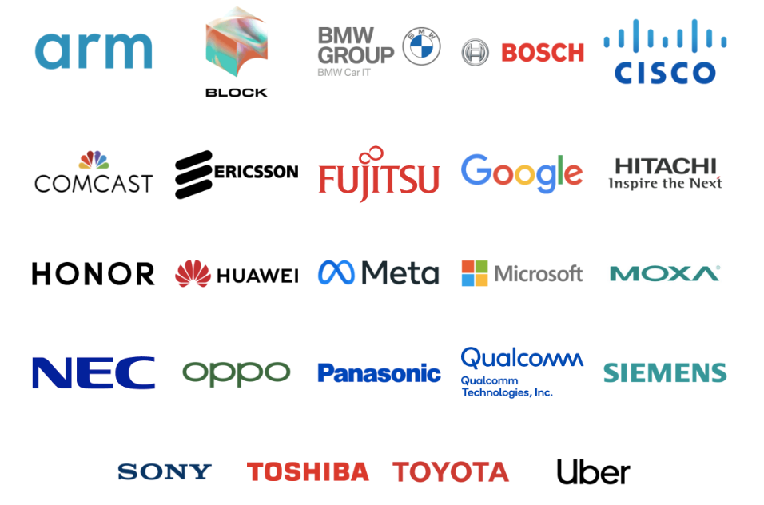
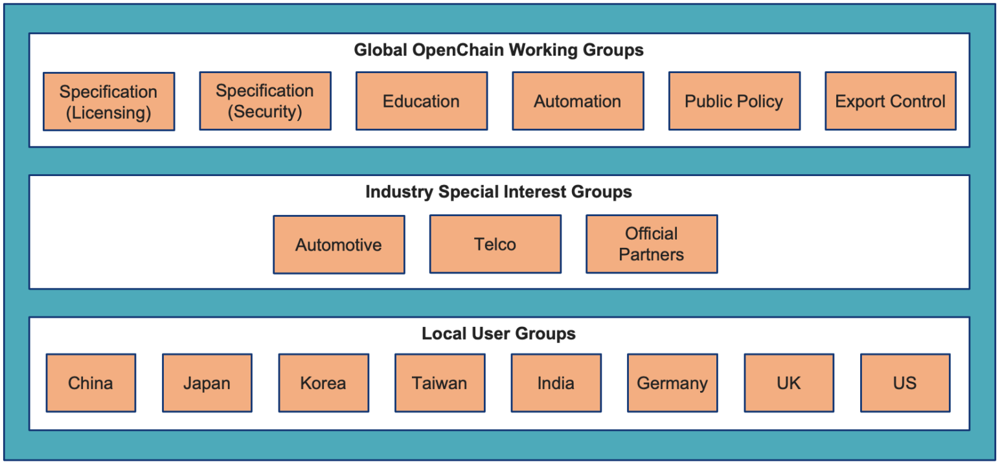
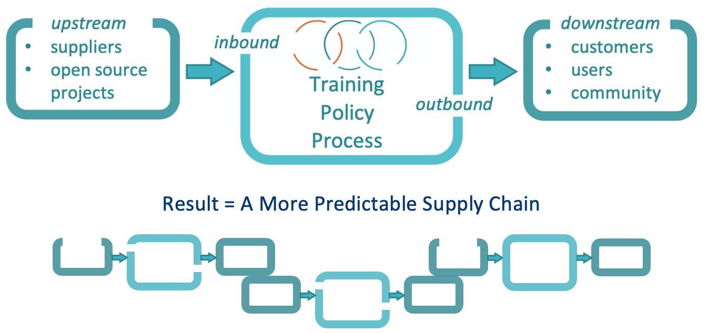
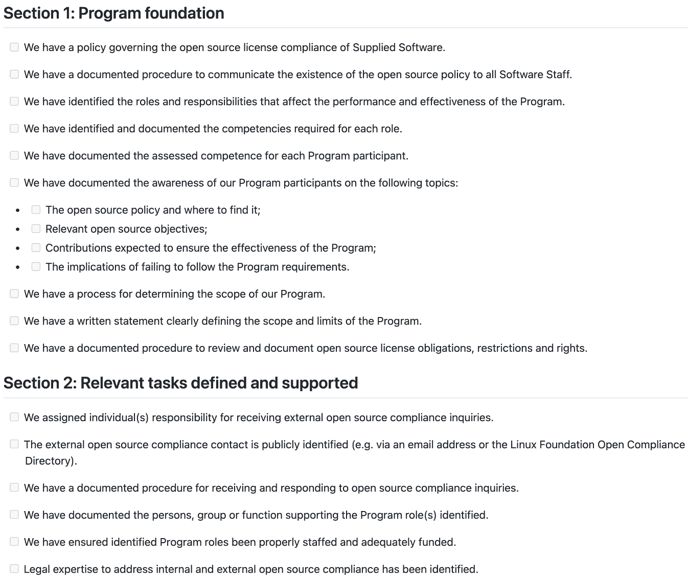
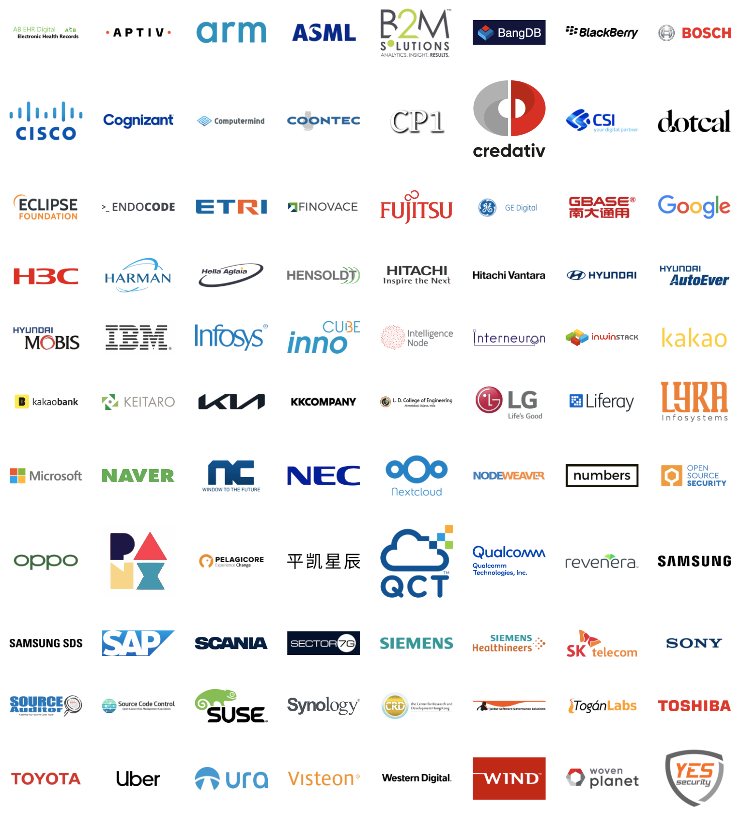
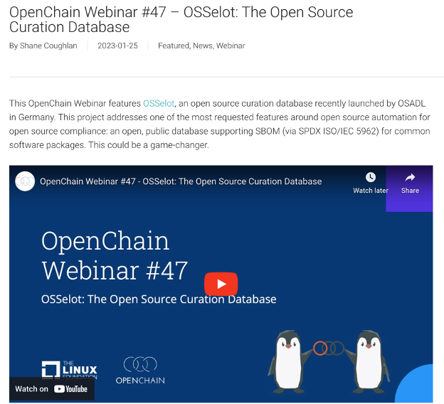
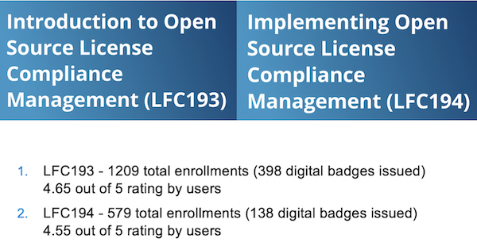
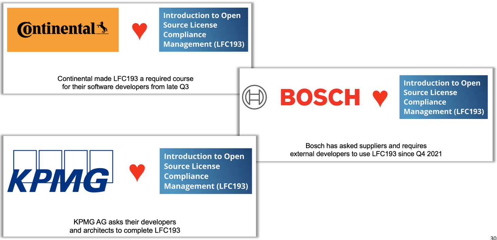
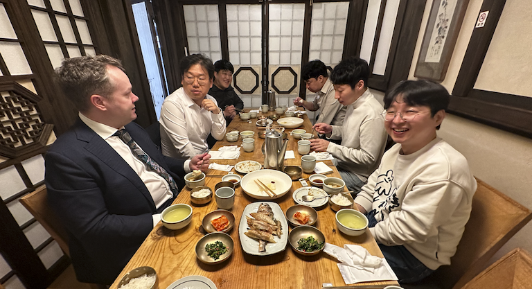

Using open source has become almost essential to modern software development, to the point that it is said over 93% of the software products companies develop use open source. Yet [there are reports](https://www.synopsys.com/blogs/software-security/open-source-trends-ossra-report/) that 53% of the open source used has license compliance issues, and 81% has security vulnerabilities. Given the complexity of modern software development environments and the vast software supply chain, companies developing products with open source need open source management efforts to minimize license compliance and security vulnerability risks. The [Linux Foundation](https://www.linuxfoundation.org/)'s [OpenChain Project](openchainproject.org) is a project for carrying out these efforts at the community level, with multiple companies sharing and collaborating together.

On March 27, 2023, [Shane Coughlan](https://github.com/shanecoughlan), General Manager of the OpenChain Project, visited SK telecom for a session explaining the OpenChain Project's major activities, international standards related to open source, and global trends.

Members of SK telecom's [OSRB](https://sktelecom.github.io/about/osrb/) and the SK Group open source council (SK Planet, SK Shieldus, SK Inc., the Supex Council, and others) took part and exchanged various opinions.

On this day, Shane introduced the OpenChain Project and explained how it jointly resolves open source management issues in the software supply chain through global collaboration. This article introduces the main points.

## OpenChain Project Global Community

Multiple global companies collaborate through the OpenChain Project to manage software supply chain issues: [https://www.openchainproject.org/community](https://www.openchainproject.org/community)

### Platinum Members

### Community Structure

The OpenChain Project has [numerous Work Groups](https://www.openchainproject.org/participate), and each Work Group develops standards for open source management and jointly builds automation tools. There are also Work Groups organized by country.

## OpenChain Standard

### ISO/IEC 5230:2020, ISO/IEC 18974

The most visible outcome is the development of the first international standard for open source management. In December 2020, [ISO/IEC 5230](https://www.iso.org/standard/81039.html) was registered as the sole international standard for open source compliance. [ISO/IEC 18974](https://www.iso.org/standard/86450.html) is the de facto standard for open source security assurance compliance, and is scheduled to be formally registered as an ISO standard in the second half of 2023.

These standards define the core requirements companies need to manage open source. By complying with the requirements of these standards, a company can transparently demonstrate that open source management is taking place within its software supply chain.

### Self-Certification

The OpenChain Project also provides a checklist for [Self-Certification](https://github.com/OpenChain-Project/Reference-Material/tree/master/Self-Certification). Companies can raise their level of open source management by working through the checklist items one by one.

### Adoption of OpenChain ISO/IEC 5230:2020

A company that complies with every item on the checklist can declare itself compliant with ISO/IEC 5230. The list of companies that have declared adoption of ISO/IEC 5230 includes several Korean companies as well, such as LG Electronics, Kakao, Samsung Electronics, Naver, SK telecom, NCSOFT, and Hyundai Motor Group.

## Other Interesting Items

### Online Webinar

The OpenChain Project continues to hold [online webinars](https://www.openchainproject.org/webinars) on open source management.

### Training Courses

A [free training course](https://www.openchainproject.org/resources) for open source license compliance is provided, and a badge can also be earned upon completion.

This training course is put to various uses, such as companies requiring their employees or suppliers to complete it.

## Update on China and Japan

### China

Collaboration with the OpenChain Project is also active in China. In particular, discussions on collaboration are underway with Chinese government bodies such as [CAICT](http://www.caict.ac.cn/english/) and [CESI](https://www.cc.cesi.cn/english.aspx).

Companies such as Huawei, Honor, and OPPO also actively participate in the OpenChain China Work Group, which has around 250 members.

Starting in the second quarter of 2023, a quarterly event co-hosted by OpenChain and CAICT is planned, and the Asian Legal Network (ALN) together with [OIN](https://openinventionnetwork.com/) is also said to be restarting.

### Japan

The [OpenChain Japan Work Group](https://openchain-project.github.io/OpenChain-JWG/) has around 190 participating members. Fujitsu, Hitachi, NEC, Panasonic, Sony, Toshiba, and Toyota provide ongoing support, and community events are held every other month.

In collaboration with [TODO Group](https://todogroup.org/), OSPO events are also held every two weeks.

## Korea Market: Challenges and Opportunities

### Current Situation

The [OpenChain Korea Work Group](https://openchain-project.github.io/OpenChain-KWG/) is an excellent Work Group that ranks second in the world in scale and enthusiasm, after Japan. Major companies such as SK telecom, LG Electronics, Samsung Electronics, and Hyundai Motor participate, and NIPA is also involved through sponsorship and other means.

That said, Korea is not immune to the risk posed by the global economic downturn. It is also a shame that there is no Korean corporate member on the [OpenChain Board](https://www.openchainproject.org/community).

### Opportunities

If the OpenChain Korea Work Group continues its community meetings and activities as it has so far, opportunities will keep coming. If possible, it would be good to work toward including the OpenChain standard in government open source policy, as Japan and China have done, and to encourage the participation of government bodies for this purpose.

Lastly, if a Korean company joins the OpenChain Board, it would increase the strategic diversity of the OpenChain Project and help grow its influence in the global supply chain.

## Closing

The OpenChain Project is a community for applying the open source approach of sharing and collaboration to the field of corporate open source management itself, so that everyone can together achieve a high level of risk management practice with lower cost and fewer resources. The [OpenChain Korea Work Group](https://openchain-project.github.io/OpenChain-KWG/) is where companies that share this purpose gather. Nearly 100 open source managers from various companies have joined the OpenChain Korea Work Group's mailing list and are active there. As it happens, an offline meetup was held on March 28, the first in three years since COVID. I will cover this in detail in the next article.

After the meeting session with Shane, we enjoyed a nice lunch sponsored by SK telecom's Tech HR team. (Thank you, [Sangki](https://kr.linkedin.com/in/ksangki)~ ^^)

Thank you.
