In the previous post, I introduced the [OpenChain Project for global collaboration](https://devocean.sk.com/blog/techBoardDetail.do?ID=164676) as an effective open source management practice for companies. This time, I would like to introduce the [OpenChain Korea Work Group](https://openchain-project.github.io/OpenChain-KWG/), a collaborative community for Korean companies to effectively manage open source.

## OpenChain Korea Work Group

The [OpenChain Korea Work Group](https://openchain-project.github.io/OpenChain-KWG/) (KWG) is a subgroup of the Linux Foundation's [OpenChain Project](https://openchainproject.org/). This group is a gathering where, through the open source spirit of collaboration and sharing, everyone thinks about and shares ways to succeed at effective open source management. Open source managers from Korea's [major ICT companies](https://openchain-project.github.io/OpenChain-KWG/about/member/) participate in the KWG.

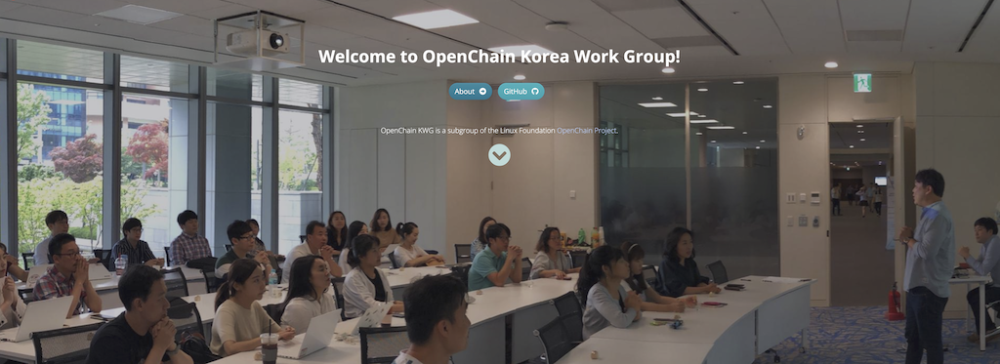

## OpenChain KWG Regular Meetings

Even large companies that have already established policies and processes for open source management find it difficult to escape open source license or security vulnerability risks, given today's massive and complex software supply chains. Ultimately, it is important to raise the level of open source management across all companies in the software supply chain. To achieve this, companies with a high level of understanding of open source management practices need to first share their know-how and act as a guide so that other companies can easily participate.

Even if a company shares its open source management assets with competitors, this does not negatively affect revenue. Conversely, even if a company learns a competitor's open source management policy, it cannot connect this to its own profit. If companies share open source management best practices with each other, each company can achieve significant results with less cost and fewer resources invested. Resonating with this idea, the first [OpenChain KWG meeting](https://openchain-project.github.io/OpenChain-KWG/meeting/), attended by open source managers from LG Electronics, SK telecom, Kakao, Hyundai Motor, and Samsung Electronics, was held in January 2019.

## 17th Meeting (In-Person)

The meetings are held every quarter, and were held online during the COVID-19 period. Then, on March 28, 2023, an [in-person meeting was held](https://openchain-project.github.io/OpenChain-KWG/meeting/17th/) for the first time in 3 years. About 50 open source managers from 19 companies/organizations attended. This in-person meeting was organized by LINE Plus. Thank you to LINE Plus's open source managers [Seoyeon Lee](https://engineering.linecorp.com/ko/blog/line-opensource-manager-interview) and Donghyuk Kim for providing a comfortable venue, refreshments, and souvenirs! ^^

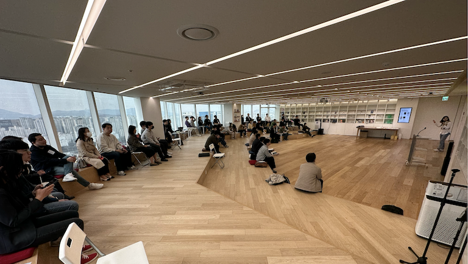

In the first part of this meeting, there were presentations on the latest domestic and international trends in the OpenChain Project and the security assurance specification, as well as a presentation on legal issues and case studies related to AI technology. In the second part, there was a session presenting open source tools developed and shared by companies for open source management. I will cover the details of each presentation below.

## Part 1: Session Presentations

### OpenChain Global Update (Linux Foundation, Shane Coughlan)

[Shane Coughlan](https://jp.linkedin.com/in/shanecoughlan), General Manager of the Linux Foundation's OpenChain Project, attended in person and introduced the [Global Trend of the OpenChain Project](https://openchain-project.github.io/OpenChain-KWG/meeting/17th/global-updates-public.pdf).

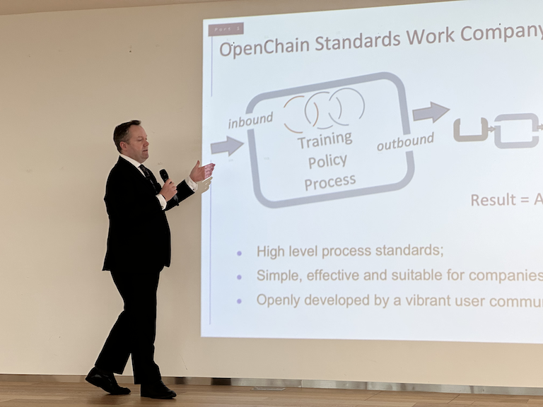

In addition to ISO/IEC 5230, the standard for open source compliance, [ISO/IEC 18974](https://www.iso.org/standard/86450.html), a standard for security, is also under development. This standard is expected to soon be registered as an official ISO standard, and a [Self-Checklist](https://github.com/OpenChain-Project/Reference-Material/blob/master/Self-Certification/Checklist/DIS-18974/en/DIS-18974-Self-Certification-Checklist-2.0.md) that companies must comply with has also been published. Companies can use these materials to carry out efficient open source risk management.

Shane also brought souvenirs for KWG members, which received a great response. (Thank you, Shane.)

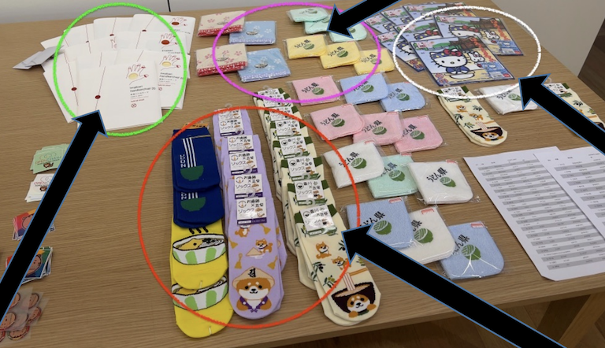

### Introduction to the OpenChain Security Standard (SK telecom, Haksung Jang)

[ISO/IEC 5230](https://www.iso.org/standard/81039.html) is the international standard for open source compliance. This standard was registered with ISO in 2020, and [many companies around the world comply with this standard](https://www.openchainproject.org/community-of-conformance) to carry out open source compliance management well. The reason companies need to manage open source is not only license compliance but also the risk of security vulnerabilities. The OpenChain Project has created a standard for security vulnerability management, [ISO/IEC 18974](https://www.iso.org/standard/86450.html), the OpenChain security assurance specification. I gave a [brief summary introduction](https://openchain-project.github.io/OpenChain-KWG/meeting/17th/OpenChain%EB%B3%B4%EC%95%88%EB%B3%B4%EC%A6%9D%EA%B7%9C%EA%B2%A9%EC%86%8C%EA%B0%9C_20230328_%EC%9E%A5%ED%95%99%EC%84%B1.pdf) of what this standard consists of.

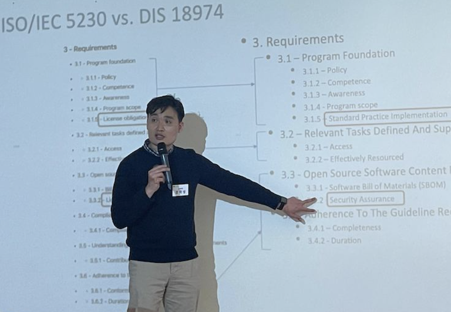

This security standard is organized in the same format as ISO/IEC 5230. Instead of license compliance, it defines the requirements that must be fulfilled for security vulnerability management. In addition to license compliance, companies must establish policies and processes for security vulnerability management. They must also establish procedures to respond to discovered security vulnerabilities.

### Legal Issues of AI Technologies / Case Study: Getty Images v. Stability AI (ETRI, Jungsuk Park)

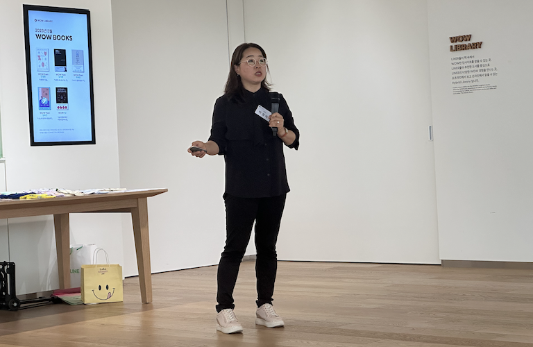

Jungsuk Park of ETRI analyzed the recently filed Stable Diffusion-related lawsuit and introduced AI legal issues. The presentation materials can be found [here](https://openchain-project.github.io/OpenChain-KWG/meeting/17th/OpenChain-KWG_2023%EB%85%843%EC%9B%94_ETRI_%EB%B0%95%EC%A0%95%EC%88%99.pdf).

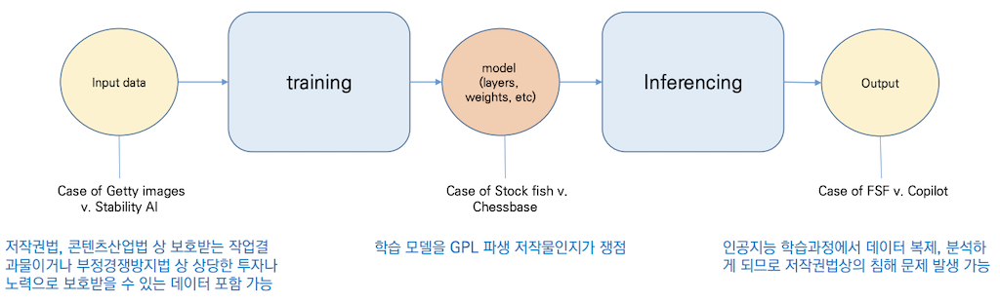

Jungsuk Park analyzed the current status of AI-related legislation, and based on this, explored and shared ways to respond to AI-related open source compliance issues.

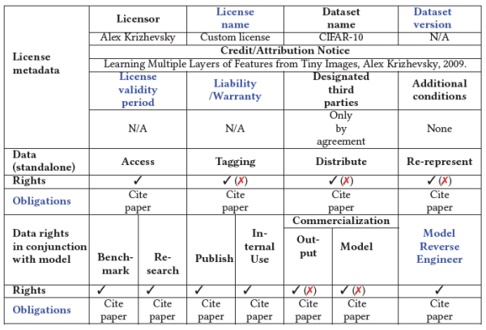

## Part 2: Mini Summit - Open Source Management Automation Tools

In Part 2, there were session presentations sharing each company's best practices for automating open source management.

### Dependency Analysis Methods by Tool (Kakao, Hyunji Lim)

Hyunji Lim of Kakao presented a comparative analysis of the dependency analysis methods of open source analysis tools. The presentation materials can be found [here](https://openchain-project.github.io/OpenChain-KWG/meeting/17th/%EB%8F%84%EA%B5%AC%EB%B3%84_%EC%9D%98%EC%A1%B4%EC%84%B1_%EB%B6%84%EC%84%9D_%EB%B0%A9%EC%8B%9D.pdf).

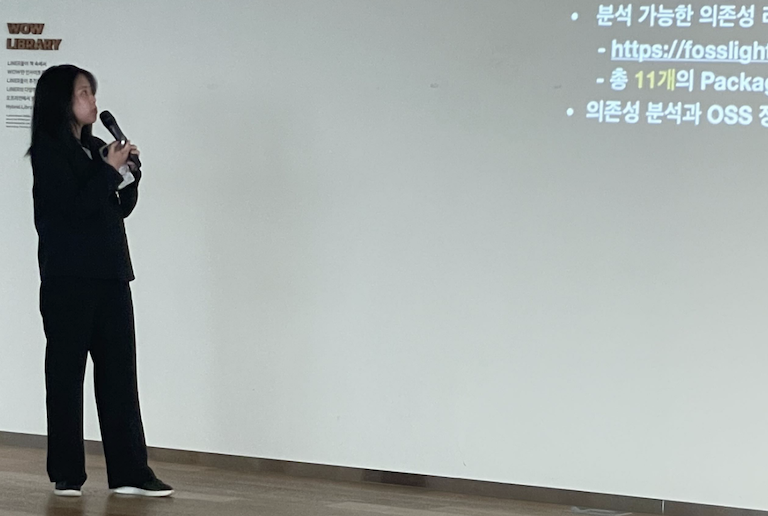

She identified and shared the dependency analysis methods of the representative open source analysis tools FOSSA, FOSSLight, ORT (OSS Review Toolkit), and OLIVE Platform.

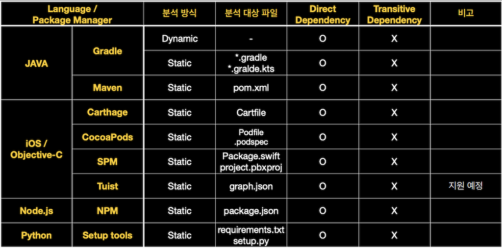

### OSORI (LG Electronics, Soim Kim)

Soim Kim of LG Electronics gave a [session presentation](https://openchain-project.github.io/OpenChain-KWG/meeting/17th/230328_History_of_OSORI_%EB%B0%9C%ED%91%9C%EC%9A%A9.pdf) introducing the OSORI project.

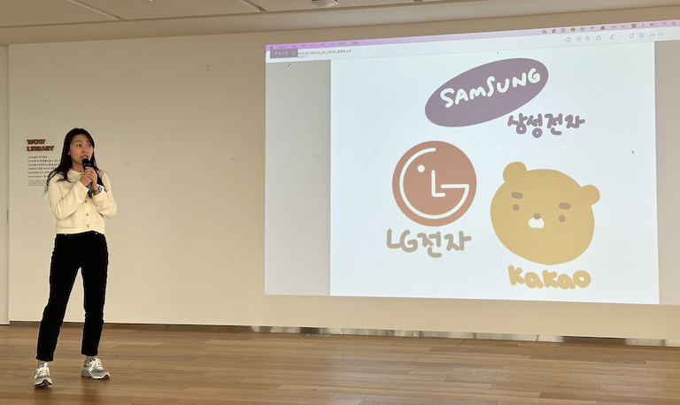

OSORI is an open source project that discloses open source information data so that anyone can easily check open source information and comply with the necessary obligations. It defined a schema for building a database of the key information, license types, and related key compliance and restriction requirements for open source projects held by LG Electronics, Samsung Electronics, and Kakao, organized as tables by item, and introduced a roadmap for future data refinement, establishing operating policy, and building a guide page.

### FOSSLight Roadmap (LG Electronics, Kyungae Kim)

[FOSSLight](https://fosslight.org/) is an integrated open source management system developed in-house by LG Electronics, which was [open-sourced in 2021](https://live.lge.co.kr/lg-fosslight/) for anyone to use. Kyungae Kim of LG Electronics introduced the 2023 [FOSSLight Roadmap](https://openchain-project.github.io/OpenChain-KWG/meeting/17th/230328_FOSSLight_2023_%EB%A1%9C%EB%93%9C%EB%A7%B5_%EA%B3%B5%EC%9C%A0.pdf).

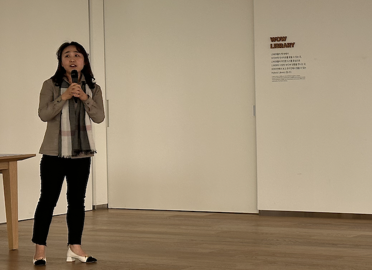

The FOSSLight Project has a roadmap for 2023 that includes improving security vulnerability features, strengthening SBOM functionality, and improving UX.

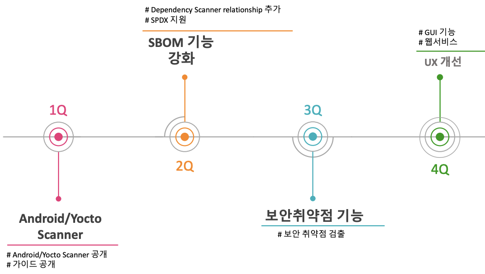

### Have You Tried OLIVE Lately? (Kakao, Eunkyung Hwang)

[OLIVE Platform](https://olive.kakao.com/) is an open source license verification service developed by Kakao, which anyone can use for free with just a Kakao account, or a GitHub, Google, or Facebook account.

Eunkyung Hwang of Kakao introduced the key features of the OLIVE Platform.

The OLIVE Platform added the OLIVE CLI feature, which can be used safely even when there are concerns about source code exposure, allowing it to be adopted even in the security-sensitive financial sector.

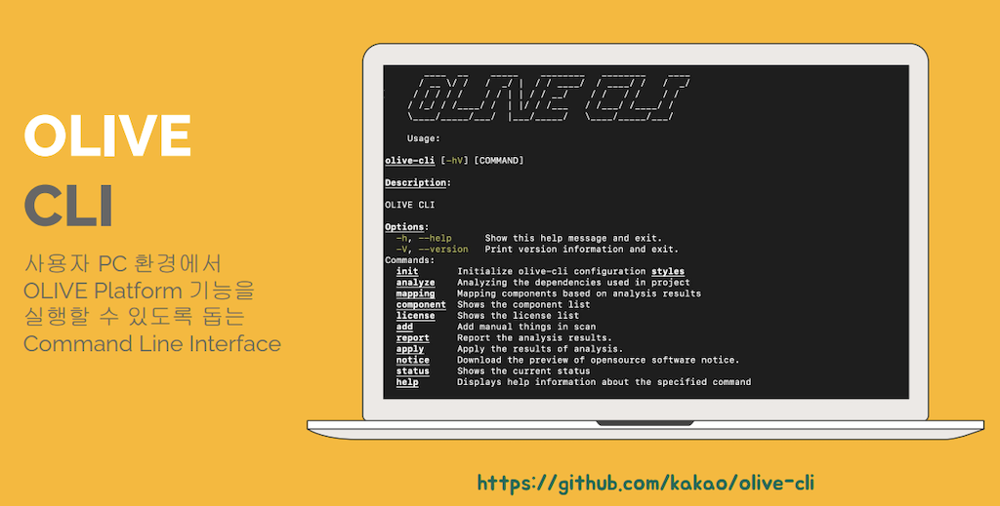

### onot Has Gotten Pretty Usable! (Kakao, Hyeonmin Han)

[onot](https://github.com/sktelecom/onot) is an open source project jointly developed by SK telecom and Kakao. It is a tool that automatically converts an SBOM written in the [SPDX](https://spdx.org/) format into an open source notice. Hyeonmin Han of Kakao introduced the new features recently added to onot. The presentation materials can be found [here](https://openchain-project.github.io/OpenChain-KWG/meeting/17th/openchain_kwg_17th_onot.pdf).

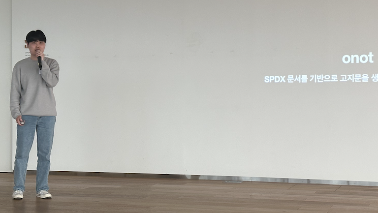

onot can now extract file information in addition to package information, and now also supports multi-license notation. It can generate open source notices from SPDX documents in RDF/XML format as well, and now supports a more convenient user environment, such as a GUI on Windows PCs.

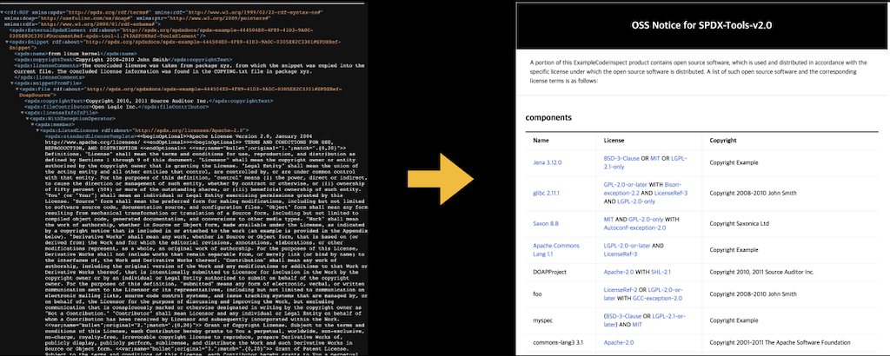

## Closing

The in-person meeting, held for the first time in about 3 years, was so packed with content that the short time felt like too little. Thank you again to Seoyeon Lee and Donghyuk Kim of LINE Plus for preparing a wonderful venue, souvenirs, and even raffle prizes.

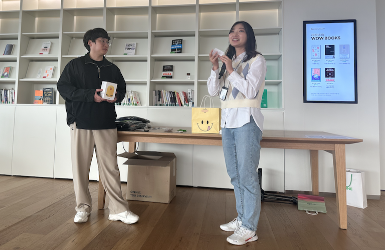

Companies face similar difficulties in open source management work, and sharing how they overcame and streamlined these challenges is of great help to one another. The OpenChain Korea Work Group is a gathering that anyone who shares this sentiment can voluntarily join. Anyone in charge of open source management at a company or organization can participate in the OpenChain Korea Work Group: [How to Join](https://openchain-project.github.io/OpenChain-KWG/about/subscribe/)

Lastly, the OpenChain KWG holds regular meetings every quarter. The next meeting is expected to be held at Kakao.

Until then, happy days to everyone!
