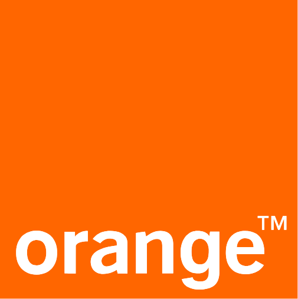

Hello.

Today I want to look at a case in which a French court ordered the telecom company Orange to pay damages for violating the GPL. This case seemed especially worth noting for two main reasons.

- First, the defendant in this case is Orange, a major telecom operator. (Since I work at a telecom operator myself...)
- Second, while GPL violation lawsuits mostly arise in embedded devices, in this case the open source at issue was used to build a B2B web service. This underscores that open source license compliance matters across every area of software development.

Through these aspects, this case looks set to reaffirm the importance of open source license compliance. It stands as an important example emphasizing that companies must thoroughly understand and comply with license requirements when using open source.

> Thanks to Manager Cheolung Park of SK telecom for his review and comments.

## What Is GPL?

Short for GNU General Public License, GPL is one of the most representative open source licenses, a strongly copyleft license under which a software's copyright holder "allows anyone to freely use, modify, and distribute the software, while imposing the condition that modified versions or derivative works must also follow the GPL."

- Reference - GPL-2.0 Guide: [https://sktelecom.github.io/guide/use/obligation/gpl-2.0/](https://sktelecom.github.io/guide/use/obligation/gpl-2.0/)

## Plaintiff: Entr'Ouvert

Entr'Ouvert, a French software company founded in September 2002, developed a C library named [Lasso](https://lasso.entrouvert.org). Lasso is a library that implements authentication protocols such as the Liberty Alliance's SAML standard.

Lasso is currently offered under two licenses.

- Open source license: GPL-2.0 + OpenSSL exception (requires source code disclosure)
- Commercial license (requires paid purchase)

> *We strongly recommend the use of the GNU General Public License each time it is possible. But for proprietary projects, that wouldn't want to use it, we designed a commercial license.*
>
> *https://lasso.entrouvert.org/*

## Defendant: Orange

In 2005, Orange, a major French telecom operator, signed a contract with the French agency for the development of electronic administration (ADAE, now DGME) to develop the "My Public Service" portal (now [https://www.service-public.fr/](https://www.service-public.fr/)).

At the time, this portal needed to use the SAML protocol to support an identity management service. Orange used Lasso to implement this, but did not comply with the terms of the GPL-2.0 license. That is, Orange did not identify the source and license of the Lasso software, and did not disclose the modified source code.

Entr'Ouvert discovered this and, in 2011, filed a lawsuit against Orange seeking damages.

## The Ruling

The lawsuit ran for more than 10 years, and finally, on February 14, 2024, the Paris Court of Appeal ordered Orange to pay Entr'Ouvert a total of 650,000 euros (roughly KRW 940 million) for failing to comply with the GNU GPL v2 license. Orange must pay Entr'Ouvert 500,000 euros in compensation for economic loss and 150,000 euros for moral damages.

The court stated that "had Orange respected the license agreement and entered into a paid license, it would have had to pay royalties to Entr'Ouvert." The court further noted that by using the Lasso software for free, Orange had unjustly profited over the seven years this large public-sector contract continued.

## Takeaways

1. It is interesting that a telecom operator, now accelerating into non-telecom strategies as 5G growth hits its limits, became the target of this lawsuit. Telecom operators that are launching a variety of products and services in advanced technology fields such as AI, cloud, IoT, robotics, semiconductors, and UAM, and pushing into the B2B space alongside other industries, have now come to rely on open source in their software development just as companies in other industries do. Establishing policies and processes for open source management has therefore become important.

2. Open source license disputes have mostly arisen when a device or software product developed using open source is distributed without authorization. In this case, however, the subject of the dispute was open source used by a software supplier under contract to build a government agency's website. Companies should therefore keep in mind that they need to apply open source management processes not only when distributing software devices, apps, and the like, but also when they enter into a B2B web service development contract and supply software to a government agency or client.

## References

- French Court Issues Damages Award for Violation of GPL: https://heathermeeker.com/2024/02/17/french-court-issues-damages-award-for-violation-of-gpl/amp/
- [https://www.entrouvert.com/actualites/2019/entrouvert-versus-orange/](https://www.entrouvert.com/actualites/2019/entrouvert-versus-orange/)
- [https://www.zdnet.fr/blogs/l-esprit-libre/non-respect-de-la-licence-gpl-orange-condamne-en-appel-39964312.htm](https://www.zdnet.fr/blogs/l-esprit-libre/non-respect-de-la-licence-gpl-orange-condamne-en-appel-39964312.htm)

> This blog post is based on a translation of an article originally written in French, and since my legal knowledge is very limited, there may be errors.
> If you find an error, please let me know (haksung@sk.com)
> 
> I'll update it right away. ^^
