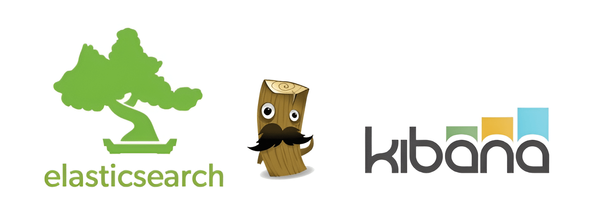

## Introduction: The Background of the Elasticsearch License

Elasticsearch began as an open source project and has since gone through several changes in licensing policy. Initially it was distributed under the Apache 2.0 license, but in 2021 Elastic changed its license to the Elastic License 2.0 and the Server Side Public License. Then, on August 30, 2024, it drew attention again with an announcement ([Elasticsearch is Open Source, Again](https://www.elastic.co/blog/elasticsearch-is-open-source-again)) adding back the **AGPL-3.0**.

This change has had a major impact not only on the open source community but also on the companies that use it. In this article, we look at why Elasticsearch changed its licensing policy again, and how companies using it should respond.

---

## 1. History of Elasticsearch License Changes

### 1.1 The Shift from Apache 2.0 to Elastic License 2.0
Elasticsearch initially used the Apache 2.0 license, but in January 2021 Elastic shifted to the Elastic License 2.0 and SSPL. Elastic made this change because of competition with cloud providers, particularly AWS. AWS was profiting from its own service based on Elasticsearch without contributing to it or paying for it, and Elastic changed its license to check this.

Elastic License 2.0 discloses source code but restricts its use in commercial cloud services, and was used as a means of protecting Elastic's technical assets. In response, AWS started the [OpenSearch](https://opensearch.org/) project and kept the Apache 2.0 license.

This was covered in detail in a previous blog post, "**[Elastic License 2.0 and the Evolving Open Source License](https://openchain-project.github.io/OpenChain-KWG/blog/2021/03/28/elastic-license/)."

### 1.2 Elastic License 2.0 Is Not an Open Source License
However, Elastic License 2.0 was not an open source license recognized by the **Open Source Initiative (OSI)**. This sparked controversy in the open source community. Elastic's decision created tension between the free use of open source and commercial interests, and became an occasion for companies to raise their awareness of licensing issues when adopting open source.

---

## 2. Background to Elasticsearch's Adoption of AGPL-3.0

### 2.1 Key Characteristics of AGPL-3.0

In August 2024, Elastic [announced](https://www.elastic.co/blog/elasticsearch-is-open-source-again) that it was adding the GNU Affero General Public License v3 (AGPL-3.0) as a license option for the free portions of Elasticsearch and Kibana. AGPL-3.0 differs from the traditional **GPL** license in that it requires source code to be disclosed even for software used over a network.

The **key characteristics** of AGPL-3.0 are as follows:
- **Source Code Disclosure Obligation**: When software is provided over a network, the source code must be provided if a user requests it.
- **Strong Copyleft**: AGPL-3.0 requires that modifications to the software also be distributed under the same license.

A detailed guide to AGPL-3.0 can be found here: [AGPL-3.0 Guide](https://sktelecom.github.io/guide/use/obligation/agpl-3.0/)

### 2.2 Why Elastic Returned to AGPL-3.0

The reasons Elastic chose **AGPL-3.0** are as follows:

- **Restoring the Relationship with the Open Source Community**: Having lost the community's trust due to the earlier license change, Elastic turned back to AGPL-3.0, recognized by the OSI, to restore that trust. Shay Banon, Elastic's founder and CTO, [said](https://www.elastic.co/pricing/faq/licensing), "We have always strongly believed in the spirit of open source and the clarity and transparency it brings."
- **Providing Users with More Freedom and Flexibility**: AGPL-3.0 is an OSI-approved license that grants users more rights.
- **Improving Trust**: By using an OSI-approved license, Elastic sought to raise its credibility within the open source community.

Elastic's decision can be seen as a strategic choice that both attempts to restore its relationship with the community and still seeks to control commercial use.

However, some experts [question](https://www.infoq.com/news/2024/09/elastic-open-source-agpl/) whether this change can quickly restore the community's trust. There is also analysis [suggesting](https://www.computing.co.uk/news/4352646/elastic-returns-open-source-fold) that the success of OpenSearch may have influenced Elastic's decision.

---

## 3. In an Era of Open Source License Change, What Should Companies Do?

Such license changes carry important implications for companies that use open source. Companies need to always keep in mind the possibility that an open source software's license may change, and establish a response strategy for it.

### 3.1 Monitoring License Changes
Frequent changes to open source licenses can expose a company to new legal risk. Preventing this requires continuous **monitoring**, which makes it important to form a dedicated team and introduce a management system. A systematic process should be built through **open source governance** to ensure open source license compliance across the company.

- **Forming a Dedicated Team**: Form a dedicated team where the legal and technical teams work together to track license changes.
- **Open Source Governance**: Establish clear internal policies and guidelines for open source use.
- **Using Automation Tools**: Use software composition analysis (SCA) tools to automatically track the open source components in use and their licenses.

### 3.2 Providing Training and Internal Guidelines
Companies need to provide **training** and **guidelines** so that developers who use open source internally can understand and respond to license changes. This can reduce legal disputes arising from license violations.

- **Regular Training Programs**: Conduct regular training on open source licenses for developers and managers.
- **Providing License Guides**: Produce and distribute guides summarizing the characteristics and compliance requirements of major open source licenses.
- **Developing In-House Experts**: Develop open source license experts to serve as internal advisors.

### 3.3 Responding to AGPL-3.0 in Cloud Environments

Companies operating **cloud services** need to clearly understand their legal obligations under AGPL-3.0 and put in place a system to prepare for source code disclosure requests. This response strategy can include strengthening internal review processes and considering alternative licenses.

- **Strengthening Internal Review**: Conduct thorough legal and technical review before introducing AGPL-3.0 software into a cloud service.
- **Reviewing Alternative Solutions**: If the constraints of the AGPL-3.0 license are burdensome, consider alternative open source or commercial solutions.
- **Automating License Compliance**: Build a system that automatically checks license compliance for software used in cloud environments.

> For reference, AGPL-3.0 does not impose requirements such as source disclosure when open source is used only internally, without redistribution or being offered as an external service.
> Therefore, for purely in-house use, it can be freely used without complying with obligations such as source code disclosure.
> However, please discuss with your in-house legal team for a clear determination of the scope of AGPL-3.0 open source use within your company and the obligations that apply to it.

---

## Conclusion: Open Source License Change, a Company's Strategic Response

Elasticsearch's decision to return to AGPL-3.0 carries significant meaning within the open source ecosystem. It is not only an effort by Elastic to find a balance between commercial interest and the spirit of open source, but also carries important implications for every company that uses open source.

Companies must respond proactively to changes in open source licenses, and through this establish a strategy that reduces legal risk and maximizes technical opportunity. A strong copyleft license such as AGPL-3.0 will draw even more attention in the cloud era, and companies should strengthen their internal systems and advance their open source management framework accordingly.

Changes in open source licenses are an unavoidable reality, but a company that responds to this appropriately, treating it as an opportunity, can secure a competitive edge. Through a systematic open source management strategy, companies can minimize legal risk and maximize technical advantage, achieving sustainable growth within the open source ecosystem.

---

{}

*This article was written together with Perplexity ([https://www.perplexity.ai/](https://www.perplexity.ai/)).*

*SKT customers can use Perplexity Pro for free for one year: [https://perplexity.sktadotevent.com/](https://perplexity.sktadotevent.com/)*

{}
