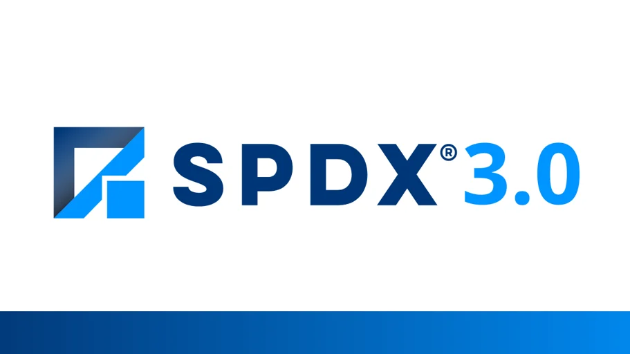

## 1. Introduction to SPDX 3.0

SPDX (Software Package Data Exchange) is an open standard for communicating software component, license, copyright, and security information in a standardized way. SPDX 3.0 is the latest version of this standard, released in April 2024, and is a major update that significantly improves the transparency and security of the software supply chain[2].



### Definition and Purpose of SPDX

SPDX is a Linux Foundation project that provides a standard format for sharing important information related to software packages. Its main purposes are as follows:

- Providing transparency of software components
- Improving license compliance
- Supporting security vulnerability management
- Enhancing the reliability of the software supply chain

### Key Changes in SPDX 3.0

SPDX 3.0 brings significant changes compared to previous versions:

1. **Modular structure**: SPDX 3.0 consists of a core model and multiple profiles, allowing it to flexibly address a variety of use cases.
2. **Improved extensibility**: The new version makes it easy to add custom fields and relationships, enabling it to accommodate future requirements.
3. **Support for various profiles**: It provides various profiles such as Software, Security, License, Build, and AI/ML to meet the requirements of specific domains.
4. **Enhanced data model**: It can express relationships between entities more clearly, allowing complex software structures to be described more accurately.


### Significance of SPDX 3.0

SPDX 3.0 is important for enterprise open source management for the following reasons:

1. **Standardization of SBOM generation**: It provides a standard format for generating a Software Bill of Materials (SBOM), facilitating information exchange between organizations.
2. **Support for regulatory compliance**: It meets the SBOM minimum requirements of the US NTIA and complies with various international standards and regulations.
3. **Enhanced security**: It improves vulnerability management through integration with CVE information and strengthens software supply chain security.
4. **Global standardization**: It has been adopted as ISO/IEC 5962:2021, becoming an internationally recognized standard[2].

SPDX 3.0 is a powerful tool that greatly improves transparency, security, and compliance throughout the software development and distribution process. By understanding and applying this standard, enterprise open source managers can modernize their organization's software management processes and reduce risk.

Citations: <br>
[1] [https://fossa.com/blog/understanding-using-spdx-license-identifiers-license-expressions/](https://fossa.com/blog/understanding-using-spdx-license-identifiers-license-expressions/)<br>
[2] [https://www.linuxfoundation.org/press/spdx-3-revolutionizes-software-management-in-systems-with-enhanced-functionality-and-streamlined-use-cases](https://www.linuxfoundation.org/press/spdx-3-revolutionizes-software-management-in-systems-with-enhanced-functionality-and-streamlined-use-cases)<br>
[3] [https://fossa.com/learn/spdx](https://fossa.com/learn/spdx)<br>
[4] [https://fossa.com/blog/sbom-examples-explained/](https://fossa.com/blog/sbom-examples-explained/)<br>
[5] [https://ossna2023.sched.com](https://ossna2023.sched.com/)<br>
[6] [https://ossna2023.sched.com/list/descriptions/](https://ossna2023.sched.com/list/descriptions/)<br>
[7] [https://fossa.com/blog/spdx-3-0/](https://fossa.com/blog/spdx-3-0/)<br>

## 2. Key Features of SPDX 3.0

SPDX 3.0 is the latest version of software package data exchange, offering significantly improved features compared to previous versions. The key features are as follows:

### Modular Structure

SPDX 3.0 introduces a modular structure that greatly improves flexibility and extensibility[1][5]. This structure consists of the following elements:

- **Core Model**: Defines the core elements that form the basis of every SPDX document.
- **Profiles**: Provide additional information and functionality tailored to specific use cases.

This modular approach allows users to selectively use only the information they need, reducing complexity and increasing efficiency.

### Improved Extensibility

SPDX 3.0 is designed to make it easy to add custom fields and relationships[5]. This provides the following benefits:

- Ability to respond quickly to new technologies and requirements
- Ability to easily incorporate industry-specific requirements
- Ability to flexibly adapt to future changes in the software ecosystem

### Support for Various Use Cases

SPDX 3.0 supports various use cases through six main profiles[7]:

1. **Security Profile**: Includes vulnerability information and security-related metadata
2. **License Profile**: Provides detailed license information and compliance data
3. **AI Profile**: Includes information related to AI model training and characterization
4. **Dataset Profile**: Provides information on dataset provenance and characteristics
5. **Software Packaging Profile**: Includes package structure and dependency information
6. **Build Process Profile**: Provides detailed information about the software build process

These profiles help software engineers, security experts, and legal and compliance professionals use SPDX more easily[7].

### Enhanced Data Model

SPDX 3.0 provides an enhanced data model that can express relationships between entities more clearly[1]. This enables:

- More accurate description of complex software structures
- Clearer expression of dependencies between software components
- More granular linking of security and license information

### Compliance with International Standards

SPDX 3.0 complies with the ISO/IEC 5962:2021 standard, which has significant implications for global software supply chain management[5][6]. This enables:

- Generation of SBOMs in an internationally recognized format
- Compliance with various regulatory requirements (e.g., US government EO 14028, EU Cyber Resilience Act)
- Improved consistency and reliability of software information exchange between organizations

These key features of SPDX 3.0 greatly improve the transparency, security, and compliance of the software supply chain, and meet modern software development and management requirements.

Citations:<br>
[1] [https://scribesecurity.com/ko/blog/spdx-vs-cyclonedx-sbom-formats-compared/](https://scribesecurity.com/ko/blog/spdx-vs-cyclonedx-sbom-formats-compared/)<br>
[2] [https://github.com/spdx/spdx-3-model/releases](https://github.com/spdx/spdx-3-model/releases)<br>
[3] [https://olis.or.kr/license/licenseSPDX.do?mapcode=010107](https://olis.or.kr/license/licenseSPDX.do?mapcode=010107)<br>
[4] [https://ettrends.etri.re.kr/ettrends/203/0905203008/0905203008.html](https://ettrends.etri.re.kr/ettrends/203/0905203008/0905203008.html)<br>
[5] [https://www.linuxfoundation.org/press/spdx-3-revolutionizes-software-management-in-systems-with-enhanced-functionality-and-streamlined-use-cases](https://www.linuxfoundation.org/press/spdx-3-revolutionizes-software-management-in-systems-with-enhanced-functionality-and-streamlined-use-cases)<br>
[6] [https://www.prnewswire.com/news-releases/spdx-3-0-revolutionizes-software-management-in-systems-with-enhanced-functionality-and-streamlined-use-cases-302118321.html](https://www.prnewswire.com/news-releases/spdx-3-0-revolutionizes-software-management-in-systems-with-enhanced-functionality-and-streamlined-use-cases-302118321.html)<br>
[7] [https://www.gttkorea.com/news/articleView.html?idxno=5131](https://www.gttkorea.com/news/articleView.html?idxno=5131)<br>

## 3. SPDX 3.0 Profiles

The concept of profiles introduced in SPDX 3.0 is a key feature that enables SPDX data to be organized and managed according to various use cases. Each profile defines the information and structure required for a specific domain or use case.

### Core Profile

The Core Profile defines the core elements that form the basis of every SPDX document.

- **Key components**:
    - Element: The base class for all SPDX objects
    - Artifact: A class representing a software component
    - Agent: A class representing a person, organization, tool, etc.
    - Relationship: A class defining relationships between entities
- **Purpose**: Provides the basic structure and information commonly used by all other profiles.
- **Example use**: Every SPDX document is built on the Core Profile, with information from other profiles added on top of it.

### Software Profile

The Software Profile provides detailed information related to software packages.

- **Key components**:
    - Package: Information about a software package
    - File: Information about an individual file
    - Snippet: Information about a portion of a file
- **Purpose**: Describes the structure, components, and metadata of software in detail.
- **Example use**: Used when documenting the structure and components of an open source library.

### Security Profile

The Security Profile covers security-related information about software.

- **Key components**:
    - Vulnerability: Vulnerability information
    - Assessment: Vulnerability assessment information
- **Purpose**: Provides information on software security vulnerabilities and related assessments.
- **Example use**: Used when including Common Vulnerabilities and Exposures (CVE) information in an SPDX document.

### License Profile

The License Profile covers software license-related information in detail.

- **Key components**:
    - License: License information
    - LicenseExpression: Complex license expressions
- **Purpose**: Describes software license information accurately and in detail.
- **Example use**: Used when documenting the license information of open source software.

### Build Profile

The Build Profile provides information about the software build process.

- **Key components**:
    - BuildStep: Build step information
    - BuildTool: Build tool information
- **Purpose**: Provides detailed information about how software is compiled and packaged.
- **Example use**: Used when documenting the build process of a CI/CD pipeline.

### AI/ML Profile

The AI/ML Profile covers information specific to artificial intelligence and machine learning models.

- **Key components**:
    - AIModel: AI model information
    - Dataset: Training dataset information
- **Purpose**: Describes the characteristics, training data, performance metrics, and other aspects of AI/ML models.
- **Example use**: Used when documenting the structure and training dataset of a deep learning model.

Each profile reflects the modular structure of SPDX 3.0, and users can select the appropriate profile as needed to generate SPDX documents. This allows various aspects of the software supply chain to be documented and managed effectively.

Citations:<br>
[1] [https://spdx.dev/leveraging-profiles-for-license-compliance-insights-from-spdx-mini-summit/](https://spdx.dev/leveraging-profiles-for-license-compliance-insights-from-spdx-mini-summit/)<br>
[2] [https://spdx.dev/providing-transparency-at-software-developments-core-process-build-time/](https://spdx.dev/providing-transparency-at-software-developments-core-process-build-time/)<br>
[3] [https://spdx.github.io/spdx-spec/v2.3/SPDX-license-list/](https://spdx.github.io/spdx-spec/v2.3/SPDX-license-list/)<br>
[4] [https://spdx.dev/capturing-software-vulnerability-data-in-spdx-3-0/](https://spdx.dev/capturing-software-vulnerability-data-in-spdx-3-0/)<br>
[5] [https://www.linuxfoundation.org/press/spdx-3-revolutionizes-software-management-in-systems-with-enhanced-functionality-and-streamlined-use-cases](https://www.linuxfoundation.org/press/spdx-3-revolutionizes-software-management-in-systems-with-enhanced-functionality-and-streamlined-use-cases)<br>
[6] [https://spdx.dev/understanding-spdx-profiles/](https://spdx.dev/understanding-spdx-profiles/)<br>
[7] [https://github.com/spdx/spdx-3-model/actions](https://github.com/spdx/spdx-3-model/actions)<br>
[8] [https://spdx.github.io/spdx-spec/v3.0/model/AI/AI/](https://spdx.github.io/spdx-spec/v3.0/model/AI/AI/)<br>

## 4. SPDX 3.0 Data Model

The data model of SPDX 3.0 is designed to be more flexible and extensible than previous versions. This model better reflects the complexity of the software supply chain and supports a variety of use cases.

### Key Entities and Relationships

1. **Element**
    - The base class for all major objects in SPDX 3.0.
    - Every Element has a unique SPDX ID.
2. **Artifact**
    - Represents a software component (e.g., package, file, snippet).
    - Includes attributes such as name, version, and supplier.
3. **Agent**
    - Represents an entity involved in creating the SPDX document, such as a person, organization, or tool.
4. **Relationship**
    - Defines relationships between entities (e.g., dependency, containment).
    - Specifies the source, target, and relationship type.
5. **LifecycleScopedRelationship**
    - Represents a relationship specific to a particular software lifecycle stage.
6. **Annotation**
    - Provides additional information or comments about an entity.

### Identifier Scheme

SPDX 3.0 introduces a more robust and flexible identifier scheme:

- **SPDX ID**: Provides a unique identifier for every Element.
- **External identifiers**: Can reference identifiers from other systems (e.g., CVE, PURL).
- **Namespaces**: Clarify the scope of identifiers and prevent collisions.

### Metadata Management

1. **CreationInfo**
    - Includes metadata about the SPDX document itself.
    - Provides information such as creation date, author, and tool version.
2. **Profile-specific metadata**
    - Defines metadata fields specific to each profile (Software, Security, License, etc.).

### Extensibility Mechanisms

1. **Custom attributes**
    - Can include additional user-defined attributes beyond the standard fields.
2. **External references**
    - Provides links to external systems or documents.

### Data Types

SPDX 3.0 supports various data types:

- Strings, integers, booleans, date/time
- Enumerations (e.g., license type, relationship type)
- Composite types (e.g., version range, checksum)

### Serialization Formats

The SPDX 3.0 data model can be serialized into various formats:

- JSON-LD
- YAML
- RDF
- XML

This support for multiple formats facilitates integration with other systems.

### Profile Support

The data model is designed to support various profiles:

- Core Profile: Basic elements common to every SPDX document
- Software Profile: Information related to software packages
- Security Profile: Vulnerability and security-related data
- License Profile: Detailed license information
- AI/ML Profile: Metadata related to AI models
- Dataset Profile: Information related to datasets

Each profile defines the additional fields and relationships required for a specific use case. The data model of SPDX 3.0 can comprehensively express the complexity of the software supply chain while providing the flexibility to meet the requirements of specific domains. This enables organizations to manage and share more accurate and detailed information about their software components.

## 5. SPDX 3.0 Implementation Guide

This section provides a detailed guide for effectively implementing SPDX 3.0.

### Tools and Libraries

The main tools and libraries that support SPDX 3.0 are as follows:

1. **SPDX Java Library**
    - GitHub: [https://github.com/spdx/tools-java](https://github.com/spdx/tools-java)
    - Features: Parsing, generating, converting, and validating SPDX documents
    - Usage: Add as a Maven dependency for use in Java projects
2. **SPDX Python Library**
    - GitHub: [https://github.com/spdx/tools-python](https://github.com/spdx/tools-python)
    - Features: Parsing, generating, and validating SPDX documents
    - Characteristics: Provides experimental support for SPDX 3.0
3. **SPDX Online Tools**
    - Website: [https://tools.spdx.org](https://tools.spdx.org/)
    - Features: Web-based SPDX document generation and validation
4. **FOSSology**
    - GitHub: [https://github.com/fossology/fossology](https://github.com/fossology/fossology)
    - Features: An open source compliance tool that supports SPDX document generation
5. **SPDX SBOM Generator**
    - GitHub: [https://github.com/opensbom-generator/spdx-sbom-generator](https://github.com/opensbom-generator/spdx-sbom-generator)
    - Features: Generates SPDX SBOMs for projects in various programming languages

These tools can be used to generate, parse, and validate SPDX 3.0 documents.

### File Formats (JSON, YAML, RDF)

SPDX 3.0 supports various file formats:

1. **JSON-LD**
    - The most recommended format
    - Example:
        
        ```json
        {
          "@context": "<https://spdx.org/spdx-3.0-context.jsonld>",
          "@type": "SpdxDocument",
          "name": "Example SPDX 3.0 Document",
          "elements": [
            {
              "@type": "Package",
              "name": "ExamplePackage",
              "version": "1.0.0"
            }
          ]
        }
        
        ```
        
2. **YAML**
    - A human-readable format
    - Example:
        
        ```yaml
        ---
        $schema: <https://spdx.org/spdx-3.0-schema.json>
        spdxVersion: SPDX-3.0
        name: Example SPDX 3.0 Document
        elements:
          - type: Package
            name: ExamplePackage
            version: 1.0.0
        
        ```
        
3. **RDF**
    - Suitable for semantic web applications
    - Example:
        
        ```xml
        <rdf:RDF xmlns:rdf="<http://www.w3.org/1999/02/22-rdf-syntax-ns#>"
                 xmlns:spdx="<http://spdx.org/rdf/terms#>">
          <spdx:SpdxDocument>
            <spdx:name>Example SPDX 3.0 Document</spdx:name>
            <spdx:element>
              <spdx:Package>
                <spdx:name>ExamplePackage</spdx:name>
                <spdx:versionInfo>1.0.0</spdx:versionInfo>
              </spdx:Package>
            </spdx:element>
          </spdx:SpdxDocument>
        </rdf:RDF>
        
        ```
        

Each format is suited to specific use cases, and developers can choose the appropriate format based on their project requirements.

### Migrating from Existing SPDX 2.x

The process of migrating from SPDX 2.x to 3.0 is as follows:

1. **Understand the structural changes**
    - Familiarize yourself with the modular structure and profile concept of SPDX 3.0
    - Identify new fields and relationship types
2. **Update tools**
    - Upgrade to the latest versions of tools and libraries that support SPDX 3.0
3. **Convert documents**
    - Use the `spdx_tools.spdx3.bump_from_spdx2.spdx_document` module of the SPDX Python Library
    - Convert SPDX 2.x documents to 3.0 using the `bump_spdx_document()` function
4. **Add new fields**
    - Add fields newly introduced in SPDX 3.0 (e.g., AI/ML-related information)
5. **Redefine relationships**
    - Redefine existing relationships using the new relationship types in SPDX 3.0
6. **Apply profiles**
    - Select and apply the appropriate SPDX 3.0 profiles
7. **Validate**
    - Use SPDX 3.0 validation tools to verify the validity of the converted document
8. **Test and integrate**
    - Integrate and test the converted SPDX 3.0 document within the existing workflow

During the migration process, it is advisable to actively make use of SPDX community resources and documentation, and to seek expert help if needed.

By following this implementation guide, organizations can effectively adopt and utilize SPDX 3.0.

Citations:<br>
[1] [https://www.linuxfoundation.org/press/spdx-3-revolutionizes-software-management-in-systems-with-enhanced-functionality-and-streamlined-use-cases](https://www.linuxfoundation.org/press/spdx-3-revolutionizes-software-management-in-systems-with-enhanced-functionality-and-streamlined-use-cases)<br>
[2] [https://www.youtube.com/watch?v=iqVk-Sek8Pc](https://www.youtube.com/watch?v=iqVk-Sek8Pc)<br>
[3] [https://github.com/spdx/Spdx-Java-Library](https://github.com/spdx/Spdx-Java-Library)<br>
[4] [https://spdx.github.io/spdx-spec/v3.0/annexes/diffs-from-previous-editions/](https://spdx.github.io/spdx-spec/v3.0/annexes/diffs-from-previous-editions/)<br>
[5] [https://github.com/spdx/spdx-3-model/releases](https://github.com/spdx/spdx-3-model/releases)<br>
[6] [https://spdx.dev/use/spdx-tools/](https://spdx.dev/use/spdx-tools/)<br>
[7] [https://github.com/spdx/tools-python/blob/main/README.md](https://github.com/spdx/tools-python/blob/main/README.md)<br>
[8] [https://fossa.com/learn/spdx](https://fossa.com/learn/spdx)<br>

## 6. SBOM and SPDX 3.0

The Software Bill of Materials (SBOM) has become a core element of software supply chain security. SPDX 3.0 provides a powerful framework for generating and managing SBOMs, enabling organizations to track and manage software components more effectively.

### SBOM Generation and Management

1. **Automated SBOM generation**
    - SPDX 3.0 can be integrated into CI/CD pipelines to automatically generate SBOMs[6].
    - This makes it possible to generate SBOMs at "machine speed," allowing SBOMs to be updated instantly in step with the software release cycle.
2. **Use of a consistent format**
    - SPDX 3.0 provides a standardized SBOM format to ensure consistency[6].
    - This facilitates SBOM data exchange between organizations and enables automated analysis.
3. **Regular updates**
    - The SBOM must be updated with every software release[6].
    - Leveraging the automation features of SPDX 3.0 makes it possible to manage this process efficiently.
4. **Inclusion of metadata**
    - SPDX 3.0 allows rich metadata, such as license information and patch status, to be included in the SBOM[6].
    - This greatly improves security and compliance management.

### Improving SBOMs with SPDX 3.0

1. **Modular structure**
    - The profile-based structure of SPDX 3.0 can be used to generate SBOMs tailored to various use cases[1].
    - Information specific to each profile, such as Software, Security, and License, can be included in the SBOM.
2. **Integration of security vulnerability information**
    - The Security Profile of SPDX 3.0 can be used to include vulnerability information directly in the SBOM[1].
    - This allows security teams to identify and respond to vulnerabilities more quickly and effectively.
3. **Strengthened license compliance**
    - The License Profile of SPDX 3.0 can be used to include detailed license information in the SBOM[2].
    - This makes it easier for legal and compliance teams to identify and manage license obligations.
4. **Inclusion of AI/ML model information**
    - The AI/ML Profile of SPDX 3.0 can be used to include AI model and dataset information in the SBOM[2].
    - This contributes to increasing the transparency and accountability of AI systems.

### Meeting NTIA Minimum Requirements

SPDX 3.0 meets the SBOM minimum requirements defined by the National Telecommunications and Information Administration (NTIA)[4][5].

1. **Basic data fields**
    - SPDX 3.0 includes all seven basic data fields required by the NTIA:
        - Supplier Name
        - Component Name
        - Component Version
        - Other Unique Identifiers
        - Dependency Relationship
        - SBOM Author
        - Timestamp
2. **Automation and interoperability**
    - SPDX 3.0 supports machine-readable formats (JSON-LD, YAML, RDF), meeting the NTIA's automation requirements[5].
3. **Practicability**
    - SPDX 3.0 ensures practicability by supporting SBOM generation and management through a variety of tools and libraries.
4. **Extensibility**
    - The modular structure of SPDX 3.0 provides the extensibility to accommodate future requirements.

SBOM management using SPDX 3.0 goes beyond simply meeting regulatory requirements — it significantly strengthens an organization's software supply chain security and contributes to greater transparency. This ultimately leads to the construction of a safer and more trustworthy software ecosystem.

Citations:<br>
[1] [https://spdx.dev/capturing-software-vulnerability-data-in-spdx-3-0/](https://spdx.dev/capturing-software-vulnerability-data-in-spdx-3-0/)<br>
[2] [https://www.linuxfoundation.org/press/spdx-3-revolutionizes-software-management-in-systems-with-enhanced-functionality-and-streamlined-use-cases](https://www.linuxfoundation.org/press/spdx-3-revolutionizes-software-management-in-systems-with-enhanced-functionality-and-streamlined-use-cases)<br>
[3] [https://www.legitsecurity.com/blog/best-practices-for-managing-maintaining-sboms](https://www.legitsecurity.com/blog/best-practices-for-managing-maintaining-sboms)<br>
[4] [https://www.ntia.gov/report/2021/minimum-elements-software-bill-materials-sbom](https://www.ntia.gov/report/2021/minimum-elements-software-bill-materials-sbom)<br>
[5] [https://cybellum.com/blog/ntia-minimum-elements-for-a-software-bill-of-materials-sbom-a-guide/](https://cybellum.com/blog/ntia-minimum-elements-for-a-software-bill-of-materials-sbom-a-guide/)<br>
[6] [https://jfrog.com/devops-tools/article/best-practices-for-software-bill-of-materials-management/](https://jfrog.com/devops-tools/article/best-practices-for-software-bill-of-materials-management/)<br>
[7] [https://about.gitlab.com/blog/2022/10/25/the-ultimate-guide-to-sboms/](https://about.gitlab.com/blog/2022/10/25/the-ultimate-guide-to-sboms/)<br>
[8] [https://scribesecurity.com/sbom/how-to-generate-an-sbom/](https://scribesecurity.com/sbom/how-to-generate-an-sbom/)<br>

## 7. Security and Vulnerability Management

SPDX 3.0 provides powerful features for software security and vulnerability management. This enables organizations to manage the security of their software supply chain more effectively.

### CVE Information Integration

Integrating Common Vulnerabilities and Exposures (CVE) information into SPDX 3.0 documents is a core element of security management.

1. **How to reference CVEs**
    - SPDX 3.0 uses the `ExternalReference` class to reference CVE information.
    - Example:
        
        ```json
        {
          "@type": "ExternalReference",
          "referenceType": "SecurityAdvisory",
          "referenceLocator": "CVE-2021-44228",
          "referenceCategory": "CVE"
        }
        
        ```
        
2. **Inclusion of detailed CVE information**
    - Common Vulnerability Scoring System (CVSS) score
    - Affected version range
    - Patch availability and patch information
3. **Automatic CVE updates**
    - SPDX 3.0 tools can automatically pull CVE information from external sources such as the National Vulnerability Database (NVD) to update SPDX documents.
4. **Linking CVE information to components**
    - SPDX 3.0 can clearly link specific software components with related CVE information.
    - This makes it easy to identify and track vulnerable components.

### Vulnerability Tracking and Reporting

SPDX 3.0 provides features for effectively tracking and reporting vulnerabilities.

1. **Vulnerability lifecycle management**
    - The entire lifecycle of a vulnerability, including discovery date, report date, and patch date, can be tracked.
    - Example:
        
        ```json
        {
          "@type": "Vulnerability",
          "name": "CVE-2021-44228",
          "description": "Log4j RCE vulnerability",
          "discoveredDate": "2021-12-09",
          "publishedDate": "2021-12-10",
          "patchedDate": "2021-12-14"
        }
        
        ```
        
2. **Vulnerability severity assessment**
    - The severity of a vulnerability can be assessed and recorded using the CVSS score.
    - Example:
        
        ```json
        {
          "@type": "VulnerabilityAssessment",
          "vulnerability": "CVE-2021-44228",
          "cvssV3": {
            "baseScore": 10.0,
            "vectorString": "CVSS:3.1/AV:N/AC:L/PR:N/UI:N/S:C/C:H/I:H/A:H"
          }
        }
        
        ```
        
3. **Vulnerability report generation**
    - Automated vulnerability reports can be generated based on SPDX 3.0 data.
    - The report includes the affected components, severity, patch status, and more.
4. **Vulnerability trend analysis**
    - Patterns in vulnerability occurrence over time can be analyzed.
    - This allows security teams to establish long-term security strategies.

### Utilizing the Security Profile

The Security Profile of SPDX 3.0 enables systematic management of security-related information.

1. **Security Profile structure**
    - `Vulnerability`: A class representing vulnerability information
    - `VulnerabilityAssessment`: A class representing vulnerability assessment information
    - `SecurityAdvisory`: A class representing security advisories
2. **Example use of the Security Profile**
    
    ```json
    {
      "@type": "SecurityProfile",
      "vulnerabilities": [
        {
          "@type": "Vulnerability",
          "name": "CVE-2021-44228",
          "description": "Log4j RCE vulnerability"
        }
      ],
      "assessments": [
        {
          "@type": "VulnerabilityAssessment",
          "vulnerability": "CVE-2021-44228",
          "cvssV3": {
            "baseScore": 10.0,
            "vectorString": "CVSS:3.1/AV:N/AC:L/PR:N/UI:N/S:C/C:H/I:H/A:H"
          }
        }
      ],
      "advisories": [
        {
          "@type": "SecurityAdvisory",
          "title": "Update Log4j to version 2.15.0 or later",
          "description": "Upgrade Log4j to mitigate CVE-2021-44228"
        }
      ]
    }
    
    ```
    
3. **Ways to utilize the Security Profile**
    - Automatically update the Security Profile by integrating with vulnerability scanning tools
    - Use as a data source for building security dashboards
    - Use as evidence of security posture during compliance audits
4. **Security metric tracking**
    - Security metrics such as the number of open vulnerabilities, average patch time, and the ratio of high-risk vulnerabilities can be tracked based on SPDX 3.0 data.

By leveraging the security and vulnerability management features of SPDX 3.0, organizations can greatly strengthen the security of their software supply chain. Integrating CVE information, systematically tracking and reporting vulnerabilities, and utilizing the Security Profile help security teams respond to threats more effectively and improve the organization's overall security posture.

## 8. License Compliance

SPDX 3.0 provides powerful features for effectively managing software license compliance. This allows organizations to more easily identify and comply with the license obligations of open source and commercial software.

### License Information Management

1. **License identifiers**
    - SPDX 3.0 uses standardized license identifiers.
    - Example: "MIT", "Apache-2.0", "GPL-3.0-only"
    - This ensures the consistency and accuracy of license information.
2. **Inclusion of license text**
    - The full license text can be included in the SPDX document.
    - Example:
        
        ```json
        {
          "@type": "License",
          "licenseId": "MIT",
          "name": "MIT License",
          "text": "MIT License\\n\\nCopyright (c) [year] [fullname]\\n\\nPermission is hereby granted, ..."
        }
        
        ```
        
3. **Custom licenses**
    - For licenses not on the standard SPDX license list, a custom license can be defined.
    - In this case, the "LicenseRef-" prefix is used.
    - Example: "LicenseRef-CompanyA-Proprietary"
4. **License expressions**
    - Complex license combinations can be expressed.
    - Example: "(MIT OR Apache-2.0) AND CC-BY-4.0"
5. **File- and package-level licenses**
    - License information can be specified at the level of individual files, snippets, or packages.
    - This allows for fine-grained license management.

### License Compatibility Checking

SPDX 3.0 data can be used to automatically check license compatibility.

1. **License graph generation**
    - A license graph is generated based on the dependencies between software components and the license information of each component.
2. **Compatibility rule definition**
    - Compatibility rules between licenses are defined.
    - Example: GPL-3.0 is compatible with Apache-2.0, but GPL-2.0 is not compatible with Apache-2.0.
3. **Automatic compatibility checking**
    - The license graph is analyzed based on the defined rules to automatically identify compatibility issues.
4. **Conflict resolution suggestions**
    - When a license conflict is found, possible resolutions are suggested.
    - Example: Using an alternative version of a specific component, requesting a license exception, etc.
5. **Dynamic analysis**
    - License compatibility can be checked in real time during the software build process.
    - This allows license issues to be identified and resolved early in development.

### Compliance Report Generation

Detailed license compliance reports can be generated based on SPDX 3.0 data.

1. **Report components**
    - A list of all software components used
    - License information for each component
    - A summary of license obligations
    - Potential license conflicts and resolutions
    - Copyright notice text
2. **Obligation tracking**
    - Tracks the key obligations of each license and reports on compliance status.
    - Example: the obligation to disclose source code, the obligation to provide copyright notice, the obligation to include license text, etc.
3. **Risk assessment**
    - Assesses and reports the legal risk of each license and license combination.
    - Provides warnings about the use of high-risk licenses.
4. **Compliance workflow integration**
    - Report generation can be automated and integrated into regular compliance review processes.
    - It can be integrated into a CI/CD pipeline to generate a compliance report with every build or release.
5. **Customized reports**
    - Customized reports can be generated to meet the needs of various stakeholders (legal team, development team, management, etc.).
    - Example: detailed reports for the legal team, summary reports for management, etc.
6. **History management**
    - Changes in compliance status over time can be tracked.
    - This makes it possible to measure the effectiveness of license compliance improvement efforts.

By leveraging the license compliance features of SPDX 3.0, organizations can effectively manage and comply with license obligations within a complex software ecosystem. This helps reduce legal risk, improve relationships with the open source community, and increase the transparency and reliability of the overall software development process.

## 9. SPDX 3.0 Use Cases

SPDX 3.0 can be used to improve software management and security across a variety of industries. The main use cases are as follows:

### Software Supply Chain Security

1. **Vulnerability identification and management**
    - The Security Profile of SPDX 3.0 is used to systematically track vulnerabilities in software components.
    - CVE information can be integrated into the SPDX document to assess security risk in real time.
2. **Ensuring supply chain transparency**
    - SPDX 3.0 makes it possible to clearly document all components of software and their provenance.
    - This helps reduce the risk of malicious code injection or supply chain attacks.
3. **Build process security**
    - The Build Profile of SPDX 3.0 can be used to ensure the integrity of the software build process.
    - Documenting information such as build tools, environment, and scripts supports reproducible builds.
4. **Rapid application of security patches**
    - SPDX 3.0 documents make it possible to quickly identify and patch vulnerable components.
    - The security update process can be optimized by integrating with automated tools.

### Open Source Management

1. **License compliance**
    - The License Profile of SPDX 3.0 is used to systematically manage open source license obligations.
    - Complex license combinations can be accurately expressed and analyzed.
2. **Open source contribution tracking**
    - SPDX 3.0 makes it possible to clearly record the provenance and contributor information of open source components within a project.
    - This helps strengthen collaboration with the open source community and recognize contributions.
3. **Open source policy enforcement**
    - SPDX 3.0 documents can be linked to an organization's open source policy to ensure that only approved licenses and components are used.
4. **Streamlining open source audits**
    - The standardized format of SPDX 3.0 makes it possible to automate and streamline the open source audit process.

### Regulatory Compliance

1. **Meeting SBOM requirements**
    - SPDX 3.0 meets the SBOM generation requirements set out in US government Executive Order 14028 and the EU Cyber Resilience Act, among others.
2. **Responding to industry-specific regulations**
    - SPDX 3.0 makes it possible to effectively respond to software-related regulatory requirements across various industries, including medical devices, automotive, and aerospace.
3. **Data privacy regulatory compliance**
    - The Dataset Profile of SPDX 3.0 can be used to support compliance with data privacy regulations such as GDPR and CCPA.
4. **Support for audits and reporting**
    - SPDX 3.0 documents make it easy to provide regulators or auditors with the necessary software composition and security information.
5. **Responding to AI regulation**
    - By using the AI/ML Profile of SPDX 3.0 to document an AI model's training data, algorithms, and performance metrics, organizations can proactively prepare for future AI regulation.

These use cases of SPDX 3.0 enable organizations to improve software management, security, and compliance in an integrated way. Its standardized approach promotes collaboration between organizations and contributes to increasing transparency and reliability across the software ecosystem.

Citations:<br>
[1] [https://linuxsecurity.com/news/organizations-events/spdx-3-0](https://linuxsecurity.com/news/organizations-events/spdx-3-0)<br>
[2] [https://spdx.dev/spdx-announces-3-0-release-candidate-with-new-use-cases/](https://spdx.dev/spdx-announces-3-0-release-candidate-with-new-use-cases/)<br>
[3] [https://www.linuxfoundation.org/press/spdx-3-revolutionizes-software-management-in-systems-with-enhanced-functionality-and-streamlined-use-cases](https://www.linuxfoundation.org/press/spdx-3-revolutionizes-software-management-in-systems-with-enhanced-functionality-and-streamlined-use-cases)<br>
[4] [https://www.prnewswire.com/news-releases/spdx-3-0-revolutionizes-software-management-in-systems-with-enhanced-functionality-and-streamlined-use-cases-302118321.html](https://www.prnewswire.com/news-releases/spdx-3-0-revolutionizes-software-management-in-systems-with-enhanced-functionality-and-streamlined-use-cases-302118321.html)<br>
[5] [https://spdx.dev/leveraging-profiles-for-license-compliance-insights-from-spdx-mini-summit/](https://spdx.dev/leveraging-profiles-for-license-compliance-insights-from-spdx-mini-summit/)<br>
[6] [https://www.synopsys.com/blogs/software-security/sboms-and-spdx.html](https://www.synopsys.com/blogs/software-security/sboms-and-spdx.html)<br>
[7] [https://spdx.dev/understanding-spdx-profiles/](https://spdx.dev/understanding-spdx-profiles/)<br>

## 10. SPDX 3.0 Adoption Strategy

A systematic approach is needed to successfully adopt SPDX 3.0 within an organization. The following is a detailed strategy for adopting SPDX 3.0.

### Phased Implementation Plan

1. **Current state analysis**
    - Assess the current SBOM generation and management process
    - Analyze existing tools and workflows
    - Identify the benefits that adopting SPDX 3.0 can bring
2. **Pilot project selection**
    - Select a small, low-criticality project
    - Select and apply a specific SPDX 3.0 profile (e.g., Security or License)
3. **Tool selection and configuration**
    - Evaluate tools that support SPDX 3.0 (e.g., SPDX tools, FOSSology)
    - Integrate the selected tools into the existing CI/CD pipeline
4. **Process definition**
    - Design workflows for generating, validating, and managing SPDX 3.0 documents
    - Define owners and roles
5. **Expansion plan**
    - Identify improvements based on the pilot project's results
    - Gradually expand adoption to other projects and departments
6. **Monitoring and optimization**
    - Set KPIs to measure the impact of SPDX 3.0 adoption
    - Conduct regular reviews and process improvements

### Training and Awareness Within the Organization

1. **Securing executive support**
    - Present the business value of adopting SPDX 3.0
    - Emphasize regulatory compliance and risk management aspects
2. **Department-specific training**
    - Development team: How to generate and manage SPDX 3.0 documents
    - Legal team: Ways to improve license compliance
    - Security team: Vulnerability management and how to use the Security Profile
3. **Workshops and hands-on sessions**
    - Hands-on practice using SPDX 3.0 tools
    - Practice applying SPDX 3.0 to real projects
4. **Internal communication**
    - Publish newsletters related to SPDX 3.0
    - Build an SPDX 3.0 resource center on the intranet
5. **Sharing success stories**
    - Share the outcomes and lessons learned from the pilot project
    - Highlight the improvements achieved through SPDX 3.0 adoption

### Tips for Successful Adoption

1. **Gradual approach**
    - Do not try to change everything at once; adopt it in stages
    - Collect feedback and identify improvements at each stage
2. **Forming a cross-functional team**
    - Form a team of experts from various departments, including development, legal, security, and operations
    - Discuss progress and issues through regular meetings
3. **Emphasizing automation**
    - Automate the process of generating and managing SPDX 3.0 documents
    - Integrate SPDX 3.0-related steps into the CI/CD pipeline
4. **Leveraging external experts**
    - Seek help from the SPDX community or consulting firms as needed
    - Benchmark the success stories of other organizations
5. **Maintaining flexibility**
    - Do not try to adopt all features of SPDX 3.0 at once
    - Start with the profiles and features that fit the organization's needs
6. **Emphasizing continuous learning**
    - Encourage participation in SPDX community activities
    - Support attendance at related conferences and webinars
7. **Measuring and reporting outcomes**
    - Compare metrics before and after SPDX 3.0 adoption (e.g., vulnerability response time, improvement in license compliance)
    - Regularly report progress and ROI to management
8. **Managing cultural change**
    - Encourage the organization to see SPDX 3.0 not merely as a tool but as a new way of working
    - Develop strategies to overcome resistance to change

Successful adoption of SPDX 3.0 involves not only technical implementation but also changes in organizational culture and processes. Through systematic planning, continuous education, and a flexible approach, organizations can make the most of the benefits of SPDX 3.0[1][2].

Citations:<br>
[1] [https://www.linuxfoundation.org/press/spdx-3-revolutionizes-software-management-in-systems-with-enhanced-functionality-and-streamlined-use-cases](https://www.linuxfoundation.org/press/spdx-3-revolutionizes-software-management-in-systems-with-enhanced-functionality-and-streamlined-use-cases)<br>
[2] [https://spdx.dev/unpacking-the-spdx-3-0-tooling-mini-summit-a-new-era-of-compliance-and-security/](https://spdx.dev/unpacking-the-spdx-3-0-tooling-mini-summit-a-new-era-of-compliance-and-security/)<br>
[3] [https://spdx.dev/spdx-announces-3-0-release-candidate-with-new-use-cases/](https://spdx.dev/spdx-announces-3-0-release-candidate-with-new-use-cases/)<br>
[4] [https://openchainproject.org/news/2023/03/31/webinar-50](https://openchainproject.org/news/2023/03/31/webinar-50)<br>
[5] [https://nand-research.com/quick-take-spdx-3-0-release/](https://nand-research.com/quick-take-spdx-3-0-release/)<br>
[6] [https://linuxsecurity.com/news/organizations-events/spdx-3-0](https://linuxsecurity.com/news/organizations-events/spdx-3-0)<br>
[7] [https://spdx.dev/leveraging-profiles-for-license-compliance-insights-from-spdx-mini-summit/](https://spdx.dev/leveraging-profiles-for-license-compliance-insights-from-spdx-mini-summit/)<br>

## 11. Future Outlook and Direction

The release of SPDX 3.0 has opened a new chapter in software supply chain management. This section takes a closer look at the future and direction of SPDX.

### SPDX Community Participation

1. **Open participation model**
    - SPDX has adopted an open community model, so anyone can participate[1].
    - A variety of stakeholders — individuals, companies, and organizations — can contribute to the development of SPDX.
2. **How to participate**
    - Subscribe to the mailing list: You can join the general SPDX mailing list to receive the latest news[1].
    - Attend regular meetings: You can join the monthly general meeting to follow project progress and share your input[1].
    - Work group activities: You can participate in various working groups such as technical, legal, and outreach.
3. **Participation in tool development**
    - You can participate directly in SPDX tool development. For example, students can contribute to SPDX-related projects through the Google Summer of Code program[7].

### Future Updates and Improvements

1. **Enhancement of AI/ML-related features**
    - Profiles covering AI model training and characterization, dataset provenance, and similar topics are expected to be further developed[4].
    - Adding metadata related to AI ethics and accountability may be considered.
2. **Expansion of security features**
    - The linkage between vulnerability information and SBOMs is expected to be further strengthened.
    - Integration with real-time threat intelligence is a possibility.
3. **Improved automation and integration**
    - Deeper integration with CI/CD pipelines is expected.
    - Automated SBOM generation and update features will become more sophisticated.
4. **Improved user experience**
    - More intuitive user interfaces and visualization tools may be developed.
    - Simplified versions of SPDX tools for non-technical users may emerge.

### Global Standardization Trends

1. **Strengthening its position as an ISO standard**
    - SPDX has already been adopted as the ISO/IEC 5962:2021 standard, and version 3.0 is also planned to be submitted to ISO[5].
    - This is expected to further accelerate the global adoption of SPDX.
2. **Responding to international regulations**
    - It is expected to become a core tool for addressing international software supply chain security regulations, such as US Executive Order 14028 and the EU Cyber Resilience Act[6].
3. **Industry-specific standardization**
    - Industry-specific standards based on SPDX may be developed across various sectors, including automotive, medical devices, and aerospace.
4. **Strengthening international cooperation**
    - The SPDX community is expected to strengthen cooperation with other international standards bodies and open source foundations.
    - This could lead to a more unified global approach to software supply chain security.

SPDX 3.0 is an important milestone shaping the future of software management. Through continued community participation, technological advancement, and international standardization efforts, SPDX is expected to continue making a significant contribution to improving software supply chain security and transparency.

Citations:
[1] [https://spdx.dev/engage/participate/](https://spdx.dev/engage/participate/)<br>
[2] [https://www.linuxinsider.com/story/spdx-becomes-new-standard-for-open-source-software-security-87265.html](https://www.linuxinsider.com/story/spdx-becomes-new-standard-for-open-source-software-security-87265.html)<br>
[3] [https://spdx.dev/engage/join/](https://spdx.dev/engage/join/)<br>
[4] [https://sbomify.com/2024/04/28/exploring-the-new-spdx-3-0-a-game-changer-for-sboms/](https://sbomify.com/2024/04/28/exploring-the-new-spdx-3-0-a-game-changer-for-sboms/)<br>
[5] [https://www.prnewswire.com/news-releases/spdx-3-0-revolutionizes-software-management-in-systems-with-enhanced-functionality-and-streamlined-use-cases-302118321.html](https://www.prnewswire.com/news-releases/spdx-3-0-revolutionizes-software-management-in-systems-with-enhanced-functionality-and-streamlined-use-cases-302118321.html)<br>
[6] [https://spdx.dev/spdx-announces-3-0-release-candidate-with-new-use-cases/](https://spdx.dev/spdx-announces-3-0-release-candidate-with-new-use-cases/)<br>
[7] [https://wiki.spdx.org/view/GSOC/GSOC_ProjectIdeas](https://wiki.spdx.org/view/GSOC/GSOC_ProjectIdeas)<br>
[8] [https://linuxsecurity.com/news/organizations-events/spdx-3-0](https://linuxsecurity.com/news/organizations-events/spdx-3-0)<br>

## 12. Conclusion: SPDX 3.0 Utilization Strategy for Enterprise Open Source Managers

SPDX 3.0 provides enterprise open source managers with a powerful and flexible tool. The following are strategic approaches for making effective use of SPDX 3.0:

1. **Strategic adoption**
    - Recognize SPDX 3.0 not merely as a tool but as a strategic asset.
    - Link SPDX 3.0 with the organization's open source policy to build a consistent management system.
2. **Automation first**
    - Automate the process of generating and managing SPDX 3.0 documents as much as possible.
    - Integrate SPDX 3.0-related steps into the CI/CD pipeline to achieve continuous monitoring.
3. **Strengthened risk management**
    - Use the Security and License profiles of SPDX 3.0 to systematically manage the risks of using open source.
    - Conduct regular open source audits based on SPDX 3.0 to ensure compliance.
4. **Decision support**
    - Use SPDX 3.0 data to support informed decision-making about the adoption and use of open source.
    - Use it to develop a data-driven open source strategy.
5. **Promoting collaboration**
    - Use SPDX 3.0 to strengthen collaboration between the development, legal, and security teams.
    - Use its standardized format to facilitate information exchange with external partners.
6. **Education and capability building**
    - Open source managers should lead internal training based on a deep understanding of SPDX 3.0.
    - Actively participate in SPDX community activities to keep up with the latest trends and learn best practices.
7. **Preparing for regulatory response**
    - Use SPDX 3.0 to proactively address SBOM-related regulatory requirements.
    - Build a system that can flexibly respond to future regulatory changes.
8. **Value creation**
    - Use SPDX 3.0 to increase the efficiency of open source management and translate this into strengthened organizational competitiveness.
    - Document open source contribution activities with SPDX 3.0 to enhance the company's technical capability and reputation.
9. **Continuous improvement**
    - Regularly evaluate the current state of SPDX 3.0 utilization and identify areas for improvement.
    - Quickly incorporate new profiles or features into the organization's processes as they are added.
10. **Leading innovation**
    - Develop an organization-specific open source management model based on SPDX 3.0.
    - This helps secure a leading position in open source management within the industry.

SPDX 3.0 provides enterprise open source managers with a powerful tool for effectively managing and leveraging the open source ecosystem. By taking a strategic and systematic approach to using SPDX 3.0, organizations can maximize the benefits of open source while minimizing the associated risks. Through this tool, open source managers can play a central role in driving their organization's digital transformation and strengthening its competitiveness.


{}

*This article was written with Perplexity ([https://www.perplexity.ai/](https://www.perplexity.ai/)).*

*SK telecom customers can use Perplexity Pro free for one year: [https://perplexity.sktadotevent.com/](https://perplexity.sktadotevent.com/)*


{}
