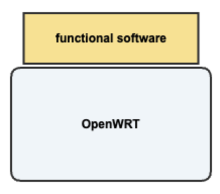

As the use of open source software has spread widely, the legal issues surrounding it have grown increasingly complex. In particular, the question of copyright over derivative works based on open source projects that use a copyleft license such as GPL (GNU General Public License) is a thorny subject for many companies. A recent software copyright infringement lawsuit in China offers important implications for this issue.

## Parties to the Lawsuit

- Plaintiff: Wangjing Technology (Wangjing)
- Defendants:
    - Yibang Communication Technology (Yibang)
    - Qi'ao Network Technology (Qi'ao)
    - and three individuals (Liu, Wu, Xie)

## Overview of the Case

In 2009, Wangjing developed a converged communication smart gateway product called "OfficeTen."

> OfficeTen SDG 1800 by Wangjing - [http://www.cncr-it.com/product_detail.php?sid=26&cid=133&id=388](http://www.cncr-it.com/product_detail.php?sid=26&cid=133&id=388)

The "OfficeTen1800" software embedded in this product was developed based on the open source framework "OpenWRT," and obtained a copyright registration certificate from the National Copyright Administration in 2013.

This software consisted of two components: the base system software built on OpenWRT and the upper-layer application software. Wangjing claimed that the latter was an "independent and separate program" from the OpenWRT system.

In 2015, Wangjing began an investigation after suspecting that a competitor, Yibang's product infringed its copyright. The investigation found that former Wangjing employees had provided the source code of "OfficeTen1800" to Qi'ao, helping it develop very similar software, and that this software was used in Yibang's product.

According to the appraisal, the proportion of identical non-open-source code between Wangjing's "OfficeTen1800" and the software used in Yibang's product reached 90.2%, and Wangjing's special marks were found in Yibang's product.

## Progress of the Lawsuit

In July 2018, Wangjing filed a software copyright infringement lawsuit against Yibang and Qi'ao. Wangjing demanded that the infringement be stopped and sought damages of 3 million yuan.

### The Defendants' Arguments

Yibang and Qi'ao denied the infringement and argued as follows:

1. "OfficeTen1800" was developed based on the open source framework "OpenWRT."
2. "OpenWRT" is subject to the constraints of the GPLv2 license.
3. Wangjing's failure to disclose the source code of "OfficeTen1800" was a violation of GPLv2.
4. Therefore, Wangjing cannot claim copyright over the software.

## The Court's Ruling

### First-Instance Judgment

The Suzhou Intermediate People's Court ruled as follows:

1. Even where a developer modified or made secondary development of an open source product, if it created an original work, it holds copyright in that work.
2. It cannot be concluded that all related software must be disclosed under the GPLv2 agreement.

Accordingly, the court found Yibang and Qi'ao liable for infringement and ordered them to stop the infringement and pay damages of 500,000 yuan (about $70,961, roughly KRW 1 billion).

### The Supreme People's Court's Ruling

Yibang and Qi'ao appealed, but the Supreme People's Court upheld the original judgment. The Supreme People's Court's main findings were as follows:

1. Since the parties in this case are not the rights holders of the "OpenWRT" system software, whether GPLv2 was complied with cannot be examined in this proceeding.
2. Whether Wangjing violated the GPLv2 agreement and its claim for damages for copyright infringement are separate matters.
3. The copyright arising from a software developer's original contribution must not be unreasonably deprived or restricted.

## Significance of the Ruling

This ruling offers important implications for the copyright protection of derivative works based on open source software.

1. **Recognition of Originality**: The court held that even a derivative work based on open source software can be subject to copyright protection if the developer made an original contribution.
2. **Separation of License Violation from Copyright Protection**: The court treated the question of GPLv2 license violation and the claim for damages for copyright infringement as separate matters. This means that even if there is a license violation, the copyright itself can still be valid.
3. **Prevention of Rights Abuse**: By rejecting the defendants' argument that "it's fine to copy it since there's an obligation to disclose source anyway," the court prevented reckless copying that abuses the GPL license.
4. **Protection of the Open Source Ecosystem**: By recognizing copyright in derivative works, the ruling encourages open-source-based innovation and promotes the healthy development of the open source ecosystem.

## Similarity to the WordPress Theme Case

In the Karlsruhe Higher Regional Court's WordPress theme case (ruling of November 13, 2020, reference number 6 U 60/20), GPLv2 was likewise raised as a defense. In that case, the court made the following important findings:

1. A distinction must be made based on whether the copyright holder of the (alleged) derivative work licensed that work under GPLv2.
2. The mere possibility of a copyleft violation is not sufficient to defeat a copyright claim.
3. Enforcement of GPLv2 is the licensor's responsibility, and it cannot be enforced merely because a user declares the software to be "GPL licensed."
4. The copyleft effect does not automatically lead to GPL licensing. This is an act that the author of the derivative work must actively carry out.

This finding aligns with the ruling of China's Supreme People's Court, and shows a converging trend in the international legal interpretation of GPL licenses and the rights to derivative works.

## Implications for Corporate Open Source Management

This ruling offers the following important implications for corporate open source managers:

1. **Thorough License Compliance**: When using open source software under a copyleft license such as GPL, the requirements of that license must be thoroughly complied with.
2. **Importance of Original Contribution**: Even when developing based on an open source project, it is important to clearly identify and document original contributions.
3. **Source Code Management**: Open source code and in-house developed code must be clearly separated and managed.
4. **Legal Risk Assessment**: Legal risks that may arise from using open source should be assessed and prepared for in advance.
5. **Continuous Monitoring**: The similarity between a company's own products and competitors' products should be continuously monitored to detect potential copyright infringement early.

## Conclusion

This ruling from the Chinese court, together with a similar ruling from a German court, clearly resolves the misconception that "GPL-based software products already have an obligation to disclose source anyway, so isn't it fine to copy them?" Even a derivative work based on open source software under the GPL license can be subject to copyright protection if the developer made an original contribution.

This can be seen as a balanced approach that encourages innovation using open source software while preventing reckless copying and copyright infringement. Companies should refer to this legal interpretation when establishing their open source policies, and strike a balance between license compliance and original development.

As the use of open source software becomes even more common, this kind of legal judgment is expected to be referenced in more countries going forward. Corporate open source managers should therefore continuously monitor these legal trends and reflect them in their own open source policies.

Finally, this ruling delivers an important message to both the open source community and commercial users. It reminds us once again that respecting the spirit of open source while recognizing developers' effort and creativity, and pursuing innovation while complying with licenses, is the path to a healthy software ecosystem.

## References
1. 2024-09-20 OpenWRT, the GPL and the Supreme People's Court of China: https://www.ifross.org/?q=node/1676
2. 2023-12-29 Copyright dispute cases over derivative works based on open source code: https://www.copyright.or.kr/information-materials/trend/International-copyright-center/download.do?brdctsno=52544&brdctsfileno=22493

{}

*This article was written together with Perplexity ([https://www.perplexity.ai/](https://www.perplexity.ai/)).*

*SKT customers can use Perplexity Pro for free for one year: [https://perplexity.sktadotevent.com/](https://perplexity.sktadotevent.com/)*

{}
