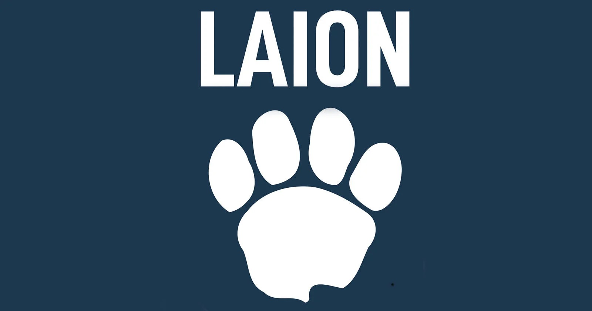

This post is based on JBB Rechtsanwält:innen's blog post "To Mine or Not To Mine" ([https://jbb.de/to-mine-or-not-to-mine/](https://jbb.de/to-mine-or-not-to-mine/)) and is published to explain a recent German court ruling on text and data mining (TDM) and to share related knowledge.

> Please note that I am not a legal professional, and this content cannot serve as a legal basis. For specific situations related to license and legal issues, please be sure to seek advice from a legal professional.

## Background

In 2021, German photographer Robert Kneschke learned that his photos had been included without authorization in an AI training dataset created by the nonprofit organization [LAION](https://laion.ai/) (Large-scale Artificial Intelligence Open Network).

An AI training dataset refers to a large collection of data used to train artificial intelligence models. The dataset called '[LAION-5B](https://laion.ai/blog/laion-5b/)' consisted of about 5.8 billion images and their corresponding description text. Such datasets are used to improve an AI's ability to recognize and understand images.

### CommonCrawl

At the heart of this case is the nonprofit organization '[CommonCrawl](https://commoncrawl.org/)', which plays an important role. CommonCrawl regularly creates a 'backup' or 'snapshot' of the internet. It replicates, in text form, every webpage accessible through links.

- How CommonCrawl collects data:
  1. It replicates the text content of webpages.
  2. It does not directly store non-text data such as images or videos.
  3. Instead, it stores the source code of webpages, which includes links to such content.

CommonCrawl [makes the datasets it collects available on its own website](https://commoncrawl.org/latest-crawl). This dataset includes the 'source code' of webpages, which researchers can use to analyze the structure and content of the internet.

### LAION's Data Processing

LAION used this dataset provided by CommonCrawl to [create its own image dataset](https://laion.ai/blog/laion-5b/#distributed-processing-of-common-crawl). This process is as follows:

1. Extracting image links from the CommonCrawl dataset: LAION filtered the CommonCrawl data to find only the links to image files.

2. Collecting additional information: LAION sought to collect not only image links but also additional information about each image. This additional information [includes](https://laion.ai/blog/laion-5b/#watermark-and-safety-inference):
   - Image description
   - Presence of a watermark
   - Whether the image contains content harmful to minors

3. [Downloading](https://laion.ai/blog/laion-5b/#distributed-downloading-of-the-images) and analyzing images: To obtain this additional information, LAION downloaded the actual images through the collected links and analyzed the images using its own AI models.

4. Constructing the dataset: The final dataset LAION created was structured as a table, with each row containing an image link and additional information about the corresponding image.

Through this process, LAION built a large-scale image dataset that could be used for AI training. However, copyright issues were raised during this process, which eventually led to a legal dispute.

Kneschke argued that even though the terms of service of the website containing his photo prohibited automated content downloading, LAION's unauthorized downloading and analysis of his photo constituted copyright infringement. In response, LAION countered that its activities fell under text and data mining (TDM) for scientific research purposes and were permitted under Section 60d of the Copyright Act.

This case raised important legal and ethical questions about how to strike a balance between data collection and copyright protection in the AI era.

## The Start of the Lawsuit

On April 27, 2023, Kneschke filed a copyright infringement lawsuit against LAION in the Hamburg Regional Court. Copyright infringement refers to the use of a copyrighted work without the copyright holder's permission. Kneschke objected to the unauthorized use of his photo and demanded that his image be removed from the dataset. This raised an important question about how to protect creators' rights in the AI era.

## Legal Issues

The core issues of this lawsuit are as follows:

1. **The scope of application of the text and data mining (TDM) exception**:
The TDM exception refers to a provision in copyright law that allows a copyrighted work to be used without the copyright holder's permission under certain conditions. This applies when large volumes of data need to be analyzed for research or technological development. In this lawsuit, the issue was whether creating a dataset for AI training falls under this exception. For example, it had to be determined whether automatically collecting and analyzing a website's text for research purposes constitutes copyright infringement, or whether it falls under this exception and is permitted.
2. **The definition of noncommercial scientific research purposes**:
The issue was exactly what LAION's claimed 'noncommercial scientific research' means, and whether its activities fall under this definition.
3. **The validity of the copyright holder's 'opt-out' right**:
'Opt-out' refers to the right of a copyright holder to refuse to have their work used for TDM. The issue was how this right can be exercised and what form of refusal is valid.

## The Impact of the EU Copyright Directive

In 2019, the EU adopted the Digital Single Market Copyright Directive (DSM Directive), which came into effect in EU member states starting June 7, 2021. This directive included two exceptions for text and data mining:

1. TDM for scientific research purposes (Article 3)
    - Scope: Applies only to research organizations and cultural heritage institutions.
    - Purpose: Permitted only for the purpose of scientific research.
    - Authorization: No prior permission from the copyright holder is required, and no compensation of any kind is required.
    - Access condition: Applies only to data that can be legally accessed (e.g., subscriptions, licenses, free online content, etc.)
    - Restriction: Excludes institutions under the decisive influence of private companies.
2. TDM for general purposes (Article 4)
    - Scope: Applies to all individuals or organizations.
    - Purpose: Applies to TDM for any purpose (including commercial purposes).
    - Authorization: Applies only if the copyright holder has not explicitly reserved their rights.
    - Access condition: Applies only to data that can be legally accessed.
        - Opt-out mechanism: The copyright holder can reserve their rights in an 'appropriate manner' (e.g., in a machine-readable format for online content).
    - Data retention: Copies may be retained for TDM purposes.

Germany incorporated this directive into domestic law and amended its Copyright Act as follows:

- Section 44b: Established a new exception for TDM for general purposes. This provision permits TDM for any purpose, including commercial purposes, but recognizes the copyright holder's right to explicitly opt out.
- Section 60d: Expanded the existing exception for TDM for scientific research purposes. This provision grants broader freedom for TDM for noncommercial scientific research purposes and does not recognize the copyright holder's opt-out right.

## The Ruling

On September 27, 2024, the Hamburg Regional Court ruled that LAION's conduct did not constitute copyright infringement. The main points of the ruling are as follows:

1. LAION's dataset creation activity falls under TDM for noncommercial scientific research purposes under Section 60d of the German Copyright Act.
2. The mere fact that LAION has a cooperative relationship with commercial companies does not negate its noncommercial nature.
3. A TDM prohibition phrase written in natural language in a website's terms of service can also be regarded as an opt-out in a 'machine-readable format'.

## Significance of the Ruling

1. **A broad interpretation of the TDM exception**:
    - The court recognized LAION's image dataset construction activity as TDM for noncommercial scientific research purposes.
    - This means that modern research methods, such as building AI training datasets, can also fall under the TDM exception.
    - This interpretation could provide greater freedom for AI research and development.
2. **An expanded definition of noncommercial research**:
    - The court determined that the fact that LAION has a cooperative relationship with commercial companies does not negate its noncommercial nature.
    - This could strengthen legal protection for collaborative research between academia and industry.
    - Not only pure academic research but also industry-academia collaboration projects can now benefit from the TDM exception.
3. **A new interpretation of the opt-out mechanism**:
Although the opt-out did not apply in this case because LAION's activity was recognized as TDM for noncommercial scientific research purposes, this determination carries important meaning in a broader context:
    - Flexibility of legal interpretation: The court flexibly interpreted the requirement of a 'machine-readable format' in line with technological developments. This shows that the law can adapt to a rapidly changing technological environment.
    - Impact on future commercial TDM: Although not applied in this case, this interpretation could carry significant meaning for commercial TDM, because a copyright holder's opt-out is valid for commercial TDM.
    - Guidance for copyright holders: This ruling provides guidance to copyright holders that, if they wish to exclude their content from TDM, they can specify this clearly in their website's terms of service.
    - Impact on technology companies: AI and data mining companies may now need to review website terms of service more carefully.
4. **Balance between copyright law and technological innovation**:
    - This ruling can be seen as an attempt to strike a balance between copyright protection and promoting technological innovation.
    - It provided the legal space needed for the advancement of AI and data science, without completely disregarding the copyright holder's rights.

## Future Outlook

Kneschke can appeal this ruling, and given the importance of the matter, it could go to a higher court or even the Court of Justice of the European Union (CJEU). This ruling is also expected to affect similar cases in other EU member states.

This case raises important legal and ethical questions about how to strike a balance between copyright protection and technological innovation in the AI era. Further discussion and legal judgments in this area are expected to follow.

## Implications for Domestic AI Companies

Although this ruling is a German case, it also offers important implications for domestic AI companies:

1. **Commercial TDM**: While this ruling focuses on noncommercial research, it suggests that commercial TDM may also be permitted under certain conditions. However, for commercial TDM, the copyright holder's opt-out right must be respected.
2. **Data collection methods**: AI companies must carefully check a website's terms of service when collecting data. If a provision explicitly prohibits TDM, this may need to be respected.
3. **Research collaboration**: Companies could consider building datasets through collaboration with nonprofit research institutions. This could be a way to secure the necessary data while reducing legal risk.
4. **Transparency and ethics**: It is important to maintain transparency about data use in the AI model development process and to establish ethical guidelines. This can help prevent potential legal disputes.
5. **Preparing for domestic legal amendments**: Laws similar to the EU Copyright Directive may also be discussed domestically. AI companies need to review their data collection and use policies in advance and adjust them as necessary to prepare for such legal changes.

This case raises important legal and ethical questions about how to strike a balance between copyright protection and technological innovation in the AI era. Domestic AI companies should also keep an eye on this global trend and continue their efforts toward responsible AI development.
