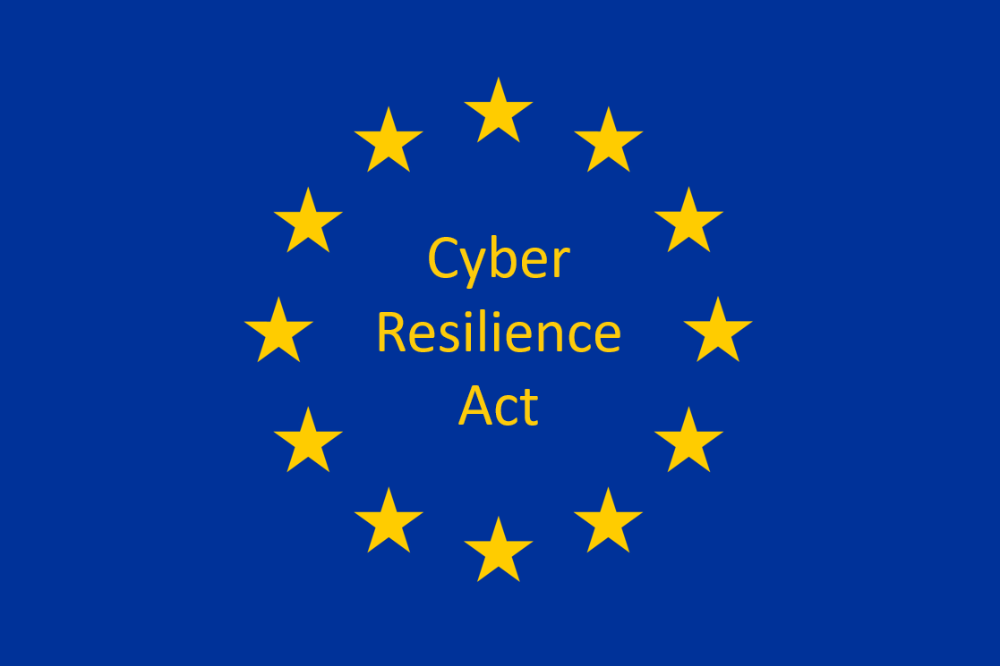

## Introduction

Three major pieces of legislation the European Union (EU) has recently introduced carry very significant implications for Korean companies. The [Product Liability Directive (PLD)](https://ec.europa.eu/info/business-economy-euro/doing-business-eu/contract-rules/digital-contracts/liability-rules-artificial-intelligence_en), the [Cyber Resilience Act (CRA)](https://digital-strategy.ec.europa.eu/en/library/cyber-resilience-act), and the [AI Act](https://digital-strategy.ec.europa.eu/en/policies/regulatory-framework-ai) present a comprehensive regulatory framework governing the development, deployment, and use of software and AI systems.

These pieces of legislation matter to Korean companies for the following reasons:

1. **Access to the EU market**: The EU is one of the largest single markets in the world, and many Korean companies aim to enter it. Failure to comply with these laws can restrict access to the EU market.
2. **Setting a global standard**: EU regulation tends to become a de facto global standard. This is the so-called '[Brussels effect](https://en.wikipedia.org/wiki/Brussels_effect)', and other countries are likely to introduce similar regulations.
3. **Expanded corporate liability**: These laws significantly expand the scope of corporate liability. In particular, the strict liability principle under the PLD could pose a new challenge for Korean companies.

Important perspectives for Korean companies to keep in mind when approaching these laws include the following:

- **Proactive response**: Companies should prepare in advance of the laws taking effect in order to secure a competitive advantage.
- **Integrated approach**: Rather than viewing each law individually, companies should recognize them as a single, overall shift in the regulatory environment.
- **Balancing innovation and regulatory compliance**: Care must be taken not to stifle innovation in the process of complying with regulation.

Now let's look at the key content of each law.

## 1. Product Liability Directive (PLD)

### 1.1 Overview

The [Product Liability Directive (PLD)](https://ec.europa.eu/info/business-economy-euro/doing-business-eu/contract-rules/digital-contracts/liability-rules-artificial-intelligence_en) aims to modernize the EU's legal framework for product liability and adapt it to the digital age. This directive introduces a strict liability regime for all products, including software and AI systems.

### 1.2 Key Changes

1. **Inclusion of software in the definition of a product**: The PLD expands the definition of a "product" to explicitly include software. This applies to all kinds of software, including operating systems, firmware, computer programs, applications, and AI systems.
2. **Strict liability principle**: The PLD introduces the principle of '[strict liability](https://en.wikipedia.org/wiki/Strict_liability)'. This means that a manufacturer can be held liable for damage caused by a defect in a product even without fault.
3. **Expanded scope of damage**: The PLD expands the scope of damage to include not only harm to persons or property but also data corruption.

### 1.3 Scope of Application

The PLD applies to all products placed on the market or made available as a service in the EU. This applies even to products manufactured outside the EU, if they are sold in the EU market.

### 1.4 Key Obligations

| Obligation | Description |
| --- | --- |
| Documentation and information provision | Manufacturers must provide accurate documentation on the product's functionality, safety, and regulatory compliance. |
| Continuous monitoring | Manufacturers must continue to monitor the product even after it is placed on the market, and provide updates as needed. |
| Risk assessment and management | Manufacturers must establish a risk assessment and management system spanning the product's entire lifecycle. |

### 1.5 Implementation Timeline

The PLD is expected to be published in November 2024, with penalties applying from 2026, two years later.

### 1.6 Impact on Companies

1. **Expanded scope of liability**: Software companies must now take responsibility for all kinds of damage their products could cause. This includes not only physical harm but also data loss or privacy breaches.
2. **Changes to product design and development processes**: Companies must consider safety and security from the product design stage onward. This means applying the '[Security by Design](https://en.wikipedia.org/wiki/Secure_by_design)' principle.
3. **Stronger documentation and transparency**: Companies must provide more detailed and clear documentation regarding a product's functionality, risks, safety features, and more.
4. **Continuous monitoring and updates**: Companies must continue to monitor products after they are placed on the market and provide security updates where necessary.

## 2. Cyber Resilience Act (CRA)

### 2.1 Overview

The [Cyber Resilience Act (CRA)](https://digital-strategy.ec.europa.eu/en/library/cyber-resilience-act) is a piece of legislation introduced in the EU to strengthen the cybersecurity of digital products. This law applies to all products with digital elements (PDEs), including software.

### 2.2 Scope of Application

The CRA applies to all PDEs sold in the EU market. This applies even to products manufactured outside the EU, if they are sold in the EU market.

### 2.3 Key Requirements

1. **Essential cybersecurity requirements**: Manufacturers must develop, produce, and distribute products that meet "essential cybersecurity requirements" appropriate to the product's risk.
2. **Cybersecurity risk assessment**: Manufacturers must carry out a cybersecurity risk assessment related to the PDE. This assessment must be updated throughout the support period and considered across the entire product lifecycle.
3. **Vulnerability management**: PDEs must be placed on the market free of known vulnerabilities, and security updates for vulnerabilities must be provided without delay. Resolved vulnerabilities must also be publicly disclosed.
4. **Support period**: A product's support period must correspond to its expected duration of use and must be at least 5 years. The end date of the support period (month and year) must be accessible to the user at the time of purchase.
5. [**Software Bill of Materials (SBOM)**](https://www.cisa.gov/sbom): Manufacturers must identify and document the product's components and vulnerabilities. This includes, at minimum, preparing a Software Bill of Materials (SBOM) covering the product's top-level dependencies.
6. **Testing**: Manufacturers must regularly test the security of their products.
7. **Vulnerability reporting**: Manufacturers must establish a vulnerability reporting policy and make it publicly available.

### 2.4 Implementation Timeline

The CRA is expected to enter into force in the second half of 2024, and manufacturers must bring compliant products to the EU market by 2027.

### 2.5 Impact on Companies

| Impact | Description |
| --- | --- |
| Changes to product design and development processes | Companies must consider cybersecurity from the product design stage onward. This means applying the '[Security by Design](https://en.wikipedia.org/wiki/Secure_by_design)' principle. |
| Stronger documentation and transparency | Companies must provide more detailed and clear documentation regarding a product's security features, vulnerabilities, SBOM, and more. |
| Continuous monitoring and updates | Companies must continue to monitor products after they are placed on the market and provide security updates where necessary. |
| Improved vulnerability management processes | Companies must build processes to quickly identify, assess, and resolve vulnerabilities. |

### 2.6 Company Response Measures

1. **Adopt security-focused design**: Introduce a design methodology that considers security from the earliest stage of product development.
2. **Build an SBOM management system**: Build a system to track and manage all software components used in a product.
3. **Improve vulnerability management processes**: Establish a system to quickly discover and respond to vulnerabilities.
4. **Establish a long-term support plan**: Establish a long-term support plan that takes the product's expected lifetime into account.
5. **Strengthen security testing**: Introduce a regular, systematic security testing process.
6. **Improve documentation and reporting systems**: Build a detailed documentation and reporting system that meets CRA requirements.
7. **Train personnel and build capacity**: Hire cybersecurity experts or build up the capacity of existing staff.

The CRA is expected to significantly strengthen the cybersecurity of digital products. Companies should treat this not as mere regulatory compliance but as an opportunity to improve product quality and reliability. A proactive response can secure competitiveness in the EU market and, further, an edge in the global market as well.

## 3. AI Act

### 3.1 Overview

The [AI Act](https://digital-strategy.ec.europa.eu/en/policies/regulatory-framework-ai) is the EU's first comprehensive legal framework governing the development, deployment, and use of AI systems. This law aims to address the risks of AI systems while enabling Europe to play a leading role globally.

### 3.2 Classification of AI Systems

The AI Act classifies AI systems by risk level as follows:

1. Unacceptable risk
2. High risk
3. Limited risk
4. Minimal risk

### 3.3 Key Requirements

1. **Requirements for high-risk AI systems**: High-risk AI systems must comply with the following strict obligations before being placed on the market:
    - An adequate risk assessment and mitigation system
    - High-quality datasets to minimize risk and discriminatory outcomes
    - Activity logging to ensure traceability of results
    - Detailed documentation providing authorities with all the information needed to assess compliance
    - Clear and adequate information provided to deployers
    - Appropriate human oversight measures to minimize risk
    - A high level of robustness, security, and accuracy
2. **Requirements for limited-risk AI systems**: Specific transparency obligations apply to limited-risk AI systems. For example, when using a [chatbot](https://en.wikipedia.org/wiki/Chatbot), users must be aware that they are interacting with a machine.
3. **Requirements for General-Purpose AI models**: Transparency obligations apply to General-Purpose AI models. Additional risk management obligations apply to particularly powerful and influential models.

### 3.4 Implementation Timeline

The AI Act entered into force on August 1, 2024, and will fully apply from August 2026, two years later. However, some provisions apply sooner:

- Prohibitions apply after 6 months
- Governance rules and obligations for General-Purpose AI models apply after 12 months
- Rules for AI systems embedded in regulated products apply after 36 months

### 3.5 Impact on Companies

| Impact | Description |
| --- | --- |
| Classification and assessment of AI systems | Companies must assess which risk category their AI systems fall under and comply with the requirements applicable to that category. |
| Strict management of high-risk AI systems | Companies that develop or use AI systems classified as high risk must comply with strict requirements. This includes detailed documentation, continuous monitoring, human oversight, and more. |
| Stronger transparency | Transparency is strengthened for all AI systems. In particular, when using technologies such as chatbots or [deepfakes](https://en.wikipedia.org/wiki/Deepfake), users must be clearly informed. |
| Additional obligations for General-Purpose AI models | Companies that develop General-Purpose AI models must comply with additional transparency and risk management obligations. |
| Consideration of international competitiveness | EU companies must consider the impact of this regulation on international competitiveness. They should prepare for increased compliance costs and possible slower innovation, while also recognizing that meeting the EU's high AI standards can serve as a competitive advantage in the global market. |
| Promoting ethical AI development | The AI Act will encourage companies to pay more attention to ethical and responsible AI development. This also carries significant implications for corporate reputation management and social responsibility. |
| Building an AI governance framework | Companies must build an internal governance framework for the development, deployment, and monitoring of AI systems. This should be a comprehensive framework that includes risk management, quality assurance, ethical review, and more. |

### 3.6 Company Response Measures to Prepare for Implementation

1. **Assess and classify AI systems**: Companies must assess their AI systems and classify them according to the risk categories under the AI Act. This allows them to identify the regulatory requirements applicable to each system.
2. **Establish a regulatory compliance roadmap**: Companies must establish a phased regulatory compliance roadmap aligned with the AI Act's implementation timeline. This should include the necessary resource allocation, process improvements, and technology development.
3. **Secure and train specialized personnel**: Companies must secure specialized personnel for AI regulatory compliance and train existing employees. This should cover expertise across various fields, including law, technology, and ethics.
4. **Improve documentation and reporting systems**: Companies must thoroughly document the development, testing, deployment, and monitoring processes of AI systems, and build a system to report to regulators as needed.
5. **Strengthen stakeholder communication**: Companies must actively communicate with customers, partners, investors, and other stakeholders about the impact of the AI Act and the company's response measures.

### 3.7 Key Features and Significance of the AI Act

- **Risk-based approach**: The AI Act adopts an approach that varies the intensity of regulation according to the risk level of the AI system. This is a balanced approach that allows necessary regulation to be applied without stifling innovation.
- **Strengthened transparency and accountability**: This law significantly strengthens transparency and accountability throughout the development and use of AI systems. This is expected to help increase social trust in AI.
- **Promoting ethical AI development**: By requiring AI systems to respect [the EU's fundamental values and rights](https://european-union.europa.eu/principles-countries-history/principles-and-values/aims-and-values_en), the AI Act promotes ethical and responsible AI development.
- **Setting a global standard**: EU AI regulation is likely to become a global standard. This can be an opportunity for EU companies to gain competitiveness in the global market.

The AI Act is a comprehensive regulatory framework that takes into account both the advancement of AI technology and its social impact. This law aims to increase the safety and reliability of AI while also promoting innovation. By proactively responding to these regulatory changes, companies will be able to manage risk and create new opportunities. The AI Act should be used not merely as a target for regulatory compliance, but as a guideline for responsible and sustainable AI development.

## 4. Interrelationship Among the Three Laws

The EU's three major laws (PLD, CRA, AI Act) are closely related to one another and together form a comprehensive regulatory framework for digital products and services. Understanding this interrelationship is important for companies in establishing an effective response strategy.

### 4.1 Common Regulatory Purposes

| Law | Main Purpose |
| --- | --- |
| PLD | Ensuring the safety of digital products and strengthening consumer protection |
| CRA | Strengthening the cybersecurity of digital products |
| AI Act | Ensuring the safety, transparency, and accountability of AI systems |

All three laws share the common goal of increasing the safety and reliability of digital technology.

### 4.2 Overlapping Scope of Application

In many cases, a single product or service may be subject to multiple laws at once. For example, an IoT device that includes AI functionality could be subject to all three laws as follows:

- PLD: from a product liability perspective
- CRA: cybersecurity requirements
- AI Act: regulation of AI functionality

### 4.3 The Need for an Integrated Approach

Rather than responding to these laws individually, companies should adopt an integrated approach. This offers the following benefits:

1. Avoiding duplicated work
2. Establishing a consistent regulatory compliance strategy
3. Efficient use of resources
4. Strengthened overall risk management

## 5. Recommendations for Korean Companies

The following are key recommendations for Korean companies to consider in responding to the EU's new regulatory environment.

### 5.1 Form a Regulatory Compliance Task Force

- Form a multidisciplinary team of legal, technical, and business experts
- Assign this team the role of continuously monitoring and analyzing EU regulatory trends
- Build a system for smooth communication and cooperation with other departments within the company

### 5.2 Review the Product and Service Portfolio

- Assess whether current and upcoming products/services are subject to EU regulation
- Identify the specific regulatory requirements applicable to each product/service
- Establish a plan to redesign or improve products/services as needed

### 5.3 Strengthen Documentation and Transparency

- Build a detailed documentation system covering the product development, testing, and deployment process
- Introduce a process for preparing and managing an [SBOM (Software Bill of Materials)](https://www.cisa.gov/sbom)
- Develop a way to explain the decision-making process of AI systems

### 5.4 Strengthen the Risk Management Framework

- Establish a risk assessment and management process spanning the entire product lifecycle
- Build a system for continuous monitoring of and response to cybersecurity risk
- Introduce an ethical impact assessment for AI systems

### 5.5 Build Human Capacity

- Hire or develop experts on EU regulation
- Run EU regulatory training programs for employees
- Build cooperative relationships with external experts and consulting firms

### 5.6 Reassess R&D and Innovation Strategy

- Redesign the R&D process with regulatory compliance in mind
- Apply the '[Security by Design](https://en.wikipedia.org/wiki/Secure_by_design)' and '[Privacy by Design](https://en.wikipedia.org/wiki/Privacy_by_design)' principles
- Establish guidelines for ethical AI development

### 5.7 Adjust the Business Model and Strategy

- Analyze the impact of EU regulation on the business model
- Adjust the business model or develop a new revenue model as needed
- Reassess the strategy for entering or expanding in the EU market

### 5.8 Strengthen Stakeholder Communication

- Regularly share the status of EU regulatory response with customers, partners, investors, and other stakeholders
- Emphasize the improvement in product/service safety and reliability achieved through regulatory compliance
- Where necessary, seek understanding regarding increased costs resulting from regulatory compliance

## 6. Conclusion

The EU's new digital regulatory environment is both a challenge and an opportunity for Korean companies. The PLD, CRA, and AI Act should not be treated merely as targets of regulatory compliance, but can be used as a framework for developing safer, more reliable digital products and services.

Companies that respond proactively to this regulation can gain the following benefits:

1. Securing a competitive advantage in the EU market
2. Gaining the opportunity to lead global standards
3. Improving the quality and safety of products and services
4. Enhancing customer trust
5. Securing long-term business sustainability

Korean companies can treat these regulatory changes as an opportunity for new innovation and growth, and build stronger competitiveness in the global digital economy. By going beyond mere regulatory compliance to pursue responsible technology development and use, they can increase their social value and achieve sustainable growth.

> Disclaimer: I am not a legal expert, and this content should not be relied upon as a legal basis. For specific matters related to licensing or legal issues, please be sure to seek the advice of a legal professional.
