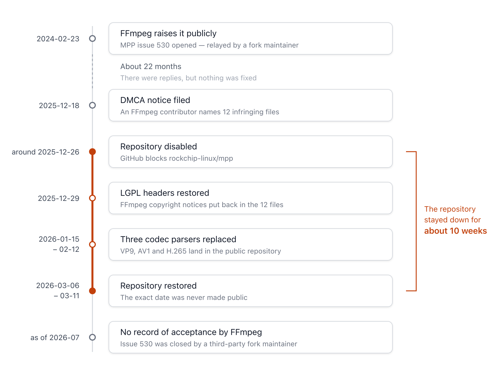
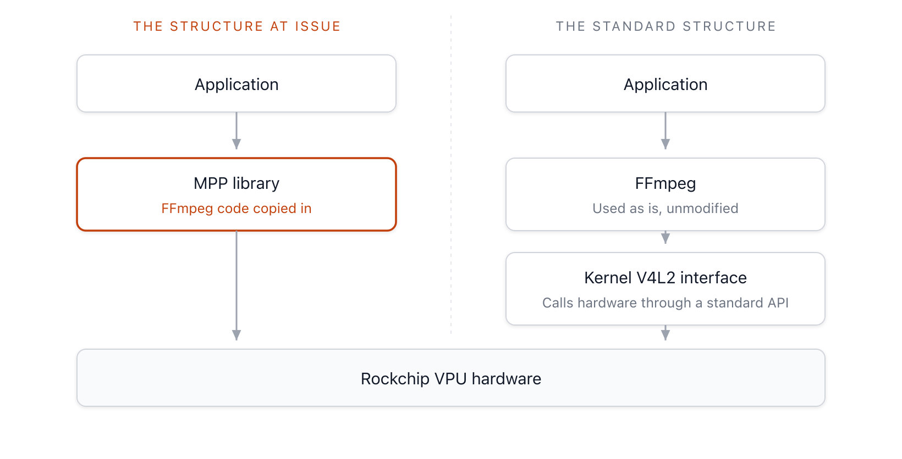

{}
This article was written using Claude Code, and the key facts cited were cross-verified against primary sources.
{}

{}
This article reflects the author's personal analysis and summary, and does not constitute legal advice. The facts cited have been verified based on publicly available sources, but legal determinations such as whether infringement has occurred are matters that can be disputed, so please have specific matters reviewed by an attorney or other expert.
{}

Hello.

I have put together a summary of the Rockchip and FFmpeg license dispute, which became a hot topic in the embedded Linux industry.
I first wrote this article in December 2025, when the repository was taken down. Since then, Rockchip has taken action and the repository was restored. I have thoroughly revised the article to reflect these developments, and replaced the evidence with the actual code that became available for review once the repository reopened.

This case is not just about one company's mistake. It also shows the kind of supply chain risk that comes with taking an SDK or BSP provided by a hardware vendor and using it as-is, and how a misunderstanding of licensing can inflate a simple fix into a two-year-long task.


## 1. Overview of the Incident

In December 2025, Rockchip's GitHub repository `rockchip-linux/mpp` (Media Process Platform) was disabled. This was in response to a DMCA (Digital Millennium Copyright Act) takedown notice filed by an FFmpeg contributor.

Rockchip has provided a middleware library called `mpp` for hardware video acceleration on its chipsets (such as the RK3588). The problem is that this library's stream header parser code came from FFmpeg's `libavcodec`. Simply taking the code was not, by itself, the problem; the compliance violation arose from three overlapping acts. Rockchip deleted the original copyright notices, rewrote the headers to make it appear that Rockchip was the author, and redistributed code that had been LGPL 2.1 under Apache-2.0.

The notice specified exactly these three acts, and stated as grounds for infringement that this is "evident from the identical code structure and comments, including commented-out calls to FFmpeg internal functions retained under their original names."

### Timeline



**Figure 1.** Dispute timeline *(Source: DMCA notice, MPP commit history, Issues 530 and 73, Internet Archive. Verified 2026-07-23.)*

The exact date the repository reopened was not publicly disclosed. Internet Archive snapshots returned HTTP 451 (Unavailable for Legal Reasons) through March 6, 2026, and new forks began appearing starting March 11, so the reopening is estimated to have occurred sometime in between. The repository was inactive for roughly 10 weeks.

One point worth noting about the DMCA process: it is commonly said that a platform must take content down within a set time after receiving a notice, but 17 U.S.C. §512(c)(1)(C) of the US Copyright Act only uses the term "expeditiously," with no specific deadline. As a matter of operating policy, GitHub gives repository owners roughly one business day to self-correct when a notice identifies specific files, before taking the repository down.

## 2. What Was Copied

The notice identified 12 infringing files: 4 related to AV1, 3 related to H.265, and 5 related to VP9. With the repository restored, it became possible to pull the commit as it stood at the time infringement was alleged and compare it directly against the FFmpeg original. Below are the results of that comparison.

### Copyright Header Replacement

The header from FFmpeg's `libavcodec/vpx_rac.h`:

```c
/*
 * Copyright (C) 2006  Aurelien Jacobs <aurel@gnuage.org>
 *
 * This file is part of FFmpeg.
 *
 * FFmpeg is free software; you can redistribute it and/or
 * modify it under the terms of the GNU Lesser General Public
 * License as published by the Free Software Foundation; either
 * version 2.1 of the License, or (at your option) any later version.
...
*/
```

The same location in MPP's `mpp/codec/dec/vp9/vpx_rac.h`:

```c
/*
*
* Copyright 2015 Rockchip Electronics Co. LTD
*
* Licensed under the Apache License, Version 2.0 (the "License");
* you may not use this file except in compliance with the License.
...
*/
```

The name of the original author, Aurelien Jacobs, the LGPL terms, and any reference to FFmpeg all disappeared, replaced with an Apache-2.0 header under Rockchip's name. The original authors of `vpx_rac.c`, Fiona Glaser, and of `vp9data.h`, Ronald S. Bultje and Clément Bœsch, likewise vanished without a trace.

### Matching Function Bodies

Let's compare the core function of the VP9 range coder.

FFmpeg `libavcodec/vpx_rac.h`:

```c
static av_always_inline int vpx_rac_get_prob(VPXRangeCoder *c, uint8_t prob)
{
    unsigned int code_word = vpx_rac_renorm(c);
    unsigned int low = 1 + (((c->high - 1) * prob) >> 8);
    unsigned int low_shift = low << 16;
    int bit = code_word >= low_shift;

    c->high = bit ? c->high - low : low;
    c->code_word = bit ? code_word - low_shift : code_word;

    return bit;
}
```

MPP `mpp/codec/dec/vp9/vpx_rac.c` (commit `14667441`, as of the time infringement was alleged):

```c
rk_s32 vpx_rac_get_prob(VpxRangeCoder *c, uint8_t prob)
{
    unsigned int code_word = vpx_rac_renorm(c);
    unsigned int low = 1 + (((c->high - 1) * prob) >> 8);
    unsigned int low_shift = low << 16;
    int bit = code_word >= low_shift;

    c->high = bit ? c->high - low : low;
    c->code_word = bit ? code_word - low_shift : code_word;

    return bit;
}
```

The only changes are dropping the inline specifier and changing the return type from `int` to `rk_s32`. The function body is identical down to the whitespace, and the `uint8_t` parameter type and `unsigned int` in the body remain exactly as written in FFmpeg.

### Traces Left in the Code

Comments unrelated to functionality are exactly what reveal provenance. The following comments remained untouched in the MPP files.

```c
// branchy variant, to be used where there's a branch based on the bit decoded
// rounding is different than vpx_rac_get, is vpx_rac_get wrong?
```

The first is a word-for-word match with FFmpeg's `vpx_rac.h`. The second is a question the FFmpeg developer posed to themselves; the original refers to `vp56_rac_get`, and MPP simply substituted its own function name while carrying the comment over unchanged. A rhetorical question-style comment like this could not coincidentally appear as an identical sentence in independently written code.

At the top of the file, a description referring to a codec that MPP doesn't even support was left in place.

```c
/**
 * vp56 specific range coder implementation
 */
```

In FFmpeg, this description exists because the file is shared across VP5 through VP9, but it carried straight over into MPP, which doesn't handle VP5 or VP6 at all. There is also a spot where an alignment macro was redefined to do nothing.

```c
#define DECLARE_ALIGNED(n,t,v)      t v
```

This macro name exists in both FFmpeg and libvpx, so by itself it doesn't establish provenance. However, where it is used tracks FFmpeg exactly. FFmpeg's `vp56.h` declares the first field of its motion vector struct as `DECLARE_ALIGNED(4, int16_t, x);`, and MPP's corresponding struct carries this line over verbatim. The equivalent struct in libvpx does not use this macro at all.

A match at this level would be unlikely to survive a substantial similarity analysis under copyright law. Changing type names or macros alone does not make a work independent. This approach is sometimes used when absorbing external open source into an internal codebase, and this case demonstrates exactly the risk that carries.

### The Probability Tables Are a Somewhat Different Matter

The codec's probability tables, however, are an area where snap judgments should be avoided. These figures are constants defined in the VP9 bitstream specification, and comments like `/* a/l both not split */` next to the values are not expressions FFmpeg created either. The same wording already appears in libvpx (Google, BSD-family license), the reference implementation of VP9. FFmpeg, too, should be understood as having taken these from libvpx.

So the fact that the comments match does not by itself tell us where they were taken from. Placing the three codebases side by side, the point where they diverge is not the wording but the formatting.

libvpx:

```c
      { 222, 34, 30 },  // a/l both not split
```

FFmpeg:

```c
            { 222,  34,  30 } /* a/l both not split */,
```

libvpx places a comma and then attaches a `//` comment, while FFmpeg places a `/* */` comment before the comma and aligns the numbers to two-character width. MPP's version matches FFmpeg's format byte-for-byte. While the values and wording trace back to libvpx, the formatting fits the conclusion that the actual copying source was the FFmpeg version.

The reason this distinction matters is clear. In areas where implementing the same algorithm naturally produces similar code, similarity by itself is not grounds for infringement. One has to pin down which version's specific traces were followed.

## 3. Why It Took 22 Months

This is the part of the case with the most to learn from. The issue was first made public on February 23, 2024. FFmpeg's official account posted the callout on X, and on the same day, the developer maintaining the `ffmpeg-rockchip` fork opened Issue 530 on the MPP repository to relay it. It took 22 months from there to the DMCA notice.

Contrary to what is commonly assumed, Rockchip did not stay silent. The person in charge issued a public apology in February 2024, and continued to respond afterward with statements such as "it's delayed," "it's in progress," and "the refactor is on hold." This was a case of responding without correcting.

Rockchip later revealed the reason for the delay.

```
But after studying the license details, we realised that simply restoring
the LGPL headers would convert the entire MPP library to LGPL-licensed code.
While this is acceptable for dynamically linked libraries, it would mandate
that any project statically linking MPP also adopt the LGPL license.
To avoid this mixed-license scenario, we decided to develop a brand-new parser.
```

Rockchip's reasoning was that restoring the LGPL headers would make all of MPP LGPL-licensed, forcing even customer projects that statically link MPP to adopt the LGPL as well. To avoid that outcome, they decided to write a new parser from scratch — but they underestimated the amount of work involved, and progress stalled as it was crowded out by day-to-day work.

This reasoning is only half right. The first part has a basis. If FFmpeg code was incorporated into MPP, MPP becomes a "work based on the Library" as that term is used in LGPL 2.1, and Section 2(c) requires that the entire work be licensed under the terms of the LGPL.

The second part is different. Section 6 provides an exception for combined works, including those using static linking.

```
6. As an exception to the Sections above, you may also combine or
link a "work that uses the Library" with the Library to produce a
work containing portions of the Library, and distribute that work
under terms of your choice, ...
```

A combined work can be distributed under terms of the distributor's choosing. The conditions are that customers must be permitted to modify it for their own use, reverse engineering for debugging must be permitted, and either a re-linkable form must be provided or a shared library mechanism must be used. A customer company that statically links MPP is not required to release its own product under the LGPL.

Because the license clause was misread, a task that would have ended with restoring the headers instead inflated into a full parser rewrite, and because that task was heavy, it sat neglected for nearly two years. Distribution in a state of violation continued the entire time. This is the kind of way costs balloon when a compliance judgment is wrong.

## 4. Rockchip's Response and Remaining Issues

After the DMCA notice, Rockchip moved quickly. Within a little over ten days of the notice, it restored the LGPL headers on the 12 identified files, and then went on to replace the VP9, AV1, and H.265 parsers in turn. In mid-February 2026, it announced that it had "removed all FFmpeg LGPL code" and requested review.

A substantial portion of this was actually carried out. Eight of the 12 identified files disappeared from the repository, and the range coder was replaced with an implementation with an entirely different function naming scheme and structure. Scanning all 778 source files in the repository for FFmpeg-specific identifiers such as `ff_vp9_`, `av_always_inline`, `AVCodecContext`, and `libavcodec` turned up none. No source file mentions the LGPL either. The only trace left is the title of the restoration commit in the changelog document.

Still, a few things remain.

The identified file `vp9data.h` was not deleted; it was renamed to `vp9d_codec.c`. In the commit history, this file's status is shown as a rename, not a deletion. In the process, the header was changed again. The FFmpeg copyright notice and LGPL terms that the LGPL-restoration commit had added were removed, reverting to sole Rockchip copyright with an Apache-2.0 notice. The two commits were made the same day, three hours apart. Of 1,299 lines, 1,045 remain unchanged, and the probability tables and comments also remain in the FFmpeg formatting seen earlier.

Files not listed in the notice were left untouched. In the hardware abstraction layer's `hal_vp9d_com.c`, the VP9 probability tables discussed earlier remain in FFmpeg's exact formatting. This bears out the caveat the notice attached before its file list: "(and possibly others)."

Whether this portion constitutes infringement is hard to say definitively. Since the values and comment wording trace back to libvpx and the specification document, the scope of copyright protection itself is open to dispute.

Above all, there is no public record that FFmpeg has reviewed or accepted this state of affairs. Issue 530 was closed on April 1, 2026, but it was closed by the third-party fork maintainer who had opened it, not by the FFmpeg project. That is not the same as a release from the rights holder. Neither side has stated a policy on how already-distributed past versions will be handled.

## 5. Why License Laundering Is Dangerous

It is easy to assume that "code released under Apache-2.0 is safe." This case shows that Apache-2.0 code with an opaque copyright provenance can actually be a greater risk. This is because it is the code's actual origin, not its stated license, that determines the obligations that attach to it.

Mapping each violation to the relevant clause looks like this.

| Act | Relevant LGPL 2.1 Section |
|:---|:---|
| Deleting copyright notices | Section 1 — keep intact the notices concerning the license and disclaimer of warranty |
| Failing to disclose modifications | Section 2(b) — mark modified files with a notice stating that they were changed, along with the date |
| Not licensing the entire work | Section 2(c) — license the entire work under the terms of this license |
| Relicensing under Apache-2.0 | Section 3 (permits conversion to the GPL only) and Section 8 (any other disposition is void; rights terminate automatically) |

Falsely altering attribution is treated differently depending on the country. In Korea and France, this constitutes infringement of the right of attribution, one of the moral rights of authors. US copyright law has no general moral rights regime; the Visual Artists Rights Act (VARA) applies only, and narrowly, to works of visual art.

### What the Correct Structure Looks Like

The Linux kernel provides a standard interface called V4L2 (Video for Linux 2) for hardware acceleration. In this structure, FFmpeg is left unmodified in user space, and hardware-dependent code is kept separate in the kernel driver.



**Figure 2.** Comparison of hardware acceleration integration structures

Because FFmpeg and the kernel driver are cleanly separated into user space and kernel space, there is no longer any reason for a vendor to tear apart and redistribute FFmpeg code itself.

Progress in this direction was led not by Rockchip but by Collabora. Decoder support for the RK3588's VDPU381 and the RK3576's VDPU383 was merged into mainline in February 2026 and landed in Linux 7.0 (April 2026). The current scope covers H.264 and H.265, while AV1, VP9, and multi-core decoding remain as follow-up work.

One point of caution: the `nyanmisaka/ffmpeg-rockchip` fork, commonly mentioned by developers using Rockchip hardware as an alternative, does not replace MPP. This project is an FFmpeg fork that implements hardware acceleration by calling MPP and librga, so it does not avoid MPP's provenance problem. To escape the dependency on MPP, one must use the mainline V4L2 path.

## 6. The Allwinner Case, Ten Years Earlier

There is a history of embedded chip vendors repeating the same mistake with multimedia codec licenses. The closest precedent is Allwinner's CedarX from 2015.

| Point of Comparison | Allwinner CedarX (2015) | Rockchip MPP (2025-2026) |
|:---|:---|:---|
| Distribution form | Centered on binary blobs | Source released |
| Nature of violation | Included code derived from FFmpeg's `libavcodec` in the user-space CedarX library without releasing source | Copied FFmpeg code, then removed copyright notices, changed attribution to Rockchip, and relicensed under Apache-2.0 |
| Response | Community reverse-engineered the Cedrus driver, later merged upstream | DMCA takedown, repository disabled, parser rewritten, V4L2 driver pursued on a separate track |
| Lesson | Binary distribution makes violations easy to hide, but they eventually surface through symbol analysis | Even with source released, erasing provenance and relicensing is still a violation — and it leaves clearer evidence behind |

In March 2015, Allwinner put out an "LGPL release," but in practice it amounted to no more than an API layer wrapping a closed binary. The eventual resolution was that a Cedrus driver, reverse-engineered by the community, was merged upstream. This is structurally similar to how, in the Rockchip case, the V4L2 driver work was led by Collabora.

There are also cases where a license violation led to actual monetary liability. On February 14, 2024, the Paris Court of Appeal ordered damages of 800,000 euros in the lawsuit Entr'ouvert brought against Orange. This consisted of 500,000 euros in economic damages, 150,000 euros for infringement of moral rights, and 150,000 euros in restitution of unjust enrichment, with 60,000 euros in litigation costs added separately. This was the conclusion reached 13 years after the suit was filed in 2011, following a first-instance trial, an appeal, and a remand from the Court of Cassation. This ruling matters because it treated the open source license violation as copyright infringement rather than as a breach of contract.

In Germany, the Hamburg Regional Court held in the 2013 Fantec case that "a supplier's assurance of license compliance alone does not provide a defense; the distributor must verify it independently." This applies directly to any company that takes a BSP from an SoC vendor and incorporates it into a product.

## 7. What Companies Should Check

The same problem may be hiding in an SDK or BSP provided by a vendor. Here are three things to check.

First, a supply-chain license audit. You need to verify that a vendor-supplied library — especially code related to multimedia, graphics, or AI acceleration — retains the original author's license. Even if a vendor claims Apache-2.0 or MIT, if the internal code came from a GPL or LGPL project, the entire product is exposed to risk. Scanning vendor-supplied code with a source code analysis tool such as Black Duck or FOSSID can surface original license notices or copyright markings left inside. As this case shows, the decisive clue is often found in comments unrelated to functionality.

Second, check whether the vendor's driver is upstream in the mainline kernel. Code merged into mainline has gone through review and license scrutiny by multiple developers, giving it higher reliability than a vendor's own self-managed repository. That said, being mainlined and being feature-complete are separate questions, so you should check the scope of support alongside it.

Third, internal development rules. When bringing in external open source, committing changes that delete the copyright header at the top of a file or change it to the company's own name should never be permitted. This can be read as willful infringement and becomes damaging evidence in any later dispute. If integration is needed, prefer a linking approach, and make it a standing rule to always preserve the original author's license and copyright notice.

## Summary

The Rockchip case shows that releasing source and complying with an open source license are two different things. LGPL code cannot be relicensed under something like Apache-2.0 without the copyright holder's consent, and deleting copyright notices and changing attribution are infringements in themselves.

The more practical lesson lies in how the delay came about. Because the license clause was misread, a task that should have ended with restoring the headers instead became a full parser rewrite, and its weight left it neglected for nearly two years. License determinations should be made together with legal or compliance teams, and the larger the apparent cost of a remedy looks, the more that determination needs to be double-checked.

Rather than simply trusting software as delivered by a vendor, it is necessary to periodically check, using a source code analysis tool, what licenses and copyright notices are present, and to have a process in place for using those results to sort out the division of responsibility with the vendor.

## References

- [FFmpeg DMCA Notice on GitHub (2025-12-18)](https://github.com/github/dmca/blob/master/2025/12/2025-12-18-ffmpeg.md)
- [rockchip-linux/mpp Issue #530 — LGPL license violation reported by upstream FFmpeg](https://github.com/rockchip-linux/mpp/issues/530)
- [HermanChen/mpp Issue #73 — Official explanation from Rockchip](https://github.com/HermanChen/mpp/issues/73)
- [rockchip-linux/mpp repository](https://github.com/rockchip-linux/mpp)
- [GNU LGPL 2.1, original text](https://www.gnu.org/licenses/old-licenses/lgpl-2.1.txt)
- [17 U.S.C. §512 (Cornell LII)](https://www.law.cornell.edu/uscode/text/17/512)
- [Hackaday: GitHub Disables Rockchip's Linux MPP Repository After DMCA Request](https://hackaday.com/2026/01/05/github-disables-rockchips-linux-mpp-repository-after-dmca-request/)
- [Tom's Hardware: Rockchip Repository Disabled](https://www.tomshardware.com/software/chinese-semiconductor-outfit-has-linux-mpp-repository-on-github-disabled-after-a-dmca-takedown-request-ffmpeg-team-accuses-it-of-using-libavcodec-code-without-attribution)
- [Collabora: RK3588 and RK3576 video decoders support merged in the upstream Linux Kernel](https://www.collabora.com/news-and-blog/news-and-events/rk3588-and-rk3576-video-decoders-support-merged-in-the-upstream-linux-kernel.html)
- [libvpx (VP9 reference implementation)](https://github.com/webmproject/libvpx)
- [CNX Software: Allwinner's CedarX May Infringe on Open Source Licenses (2015-02-26)](https://www.cnx-software.com/2015/02/26/allwinners-new-media-codec-library-cedarx-may-infringe-on-open-source-licenses-and-copyrtights/)
- [CNX Software: Allwinner CedarX GPL/LGPL Compliance Update (2015-03-23)](https://www.cnx-software.com/2015/03/23/allwinner-cedarx-media-codec-library-gpl-lgpl-compliance-update/)
- [nyanmisaka/ffmpeg-rockchip](https://github.com/nyanmisaka/ffmpeg-rockchip)

*Revised on July 23, 2026 to reflect subsequent developments.*
