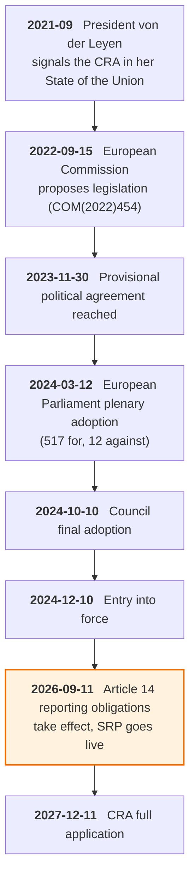
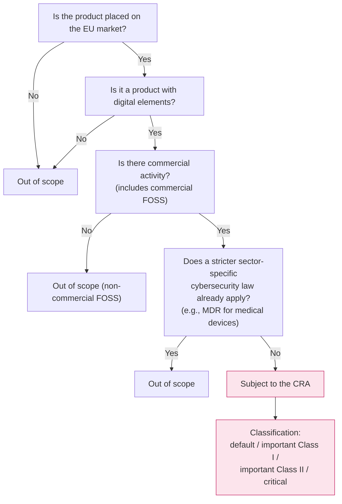
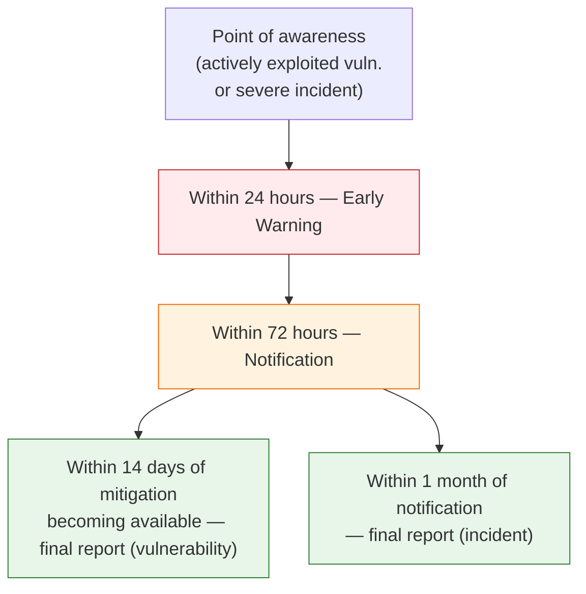
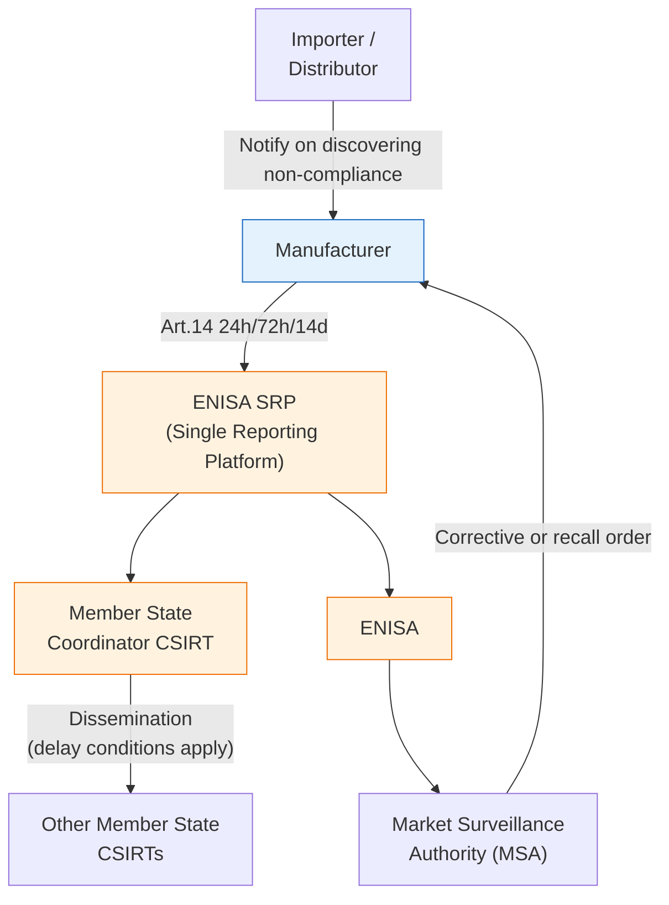

{}
This article was written with Claude Code, and the key facts cited here were cross-checked against primary sources.
{}

> **Summary**
>
> The EU Cyber Resilience Act (Cyber Resilience Act, CRA — Regulation (EU) 2024/2847) is the EU's first comprehensive product security regulation, imposing horizontal cybersecurity obligations on every "product with digital elements" (PDE) placed on the EU market. The regulation entered into force on December 10, 2024, and applies in phases. From September 11, 2026, the Article 14 reporting obligations take effect, requiring manufacturers, importers, and distributors to notify ENISA (the European Union Agency for Cybersecurity) and Member State CSIRTs of actively exploited vulnerabilities and severe incidents within a staged 24-hour, 72-hour, and 14-day window. Companies that have not stood up a reporting workflow by this date face fines of up to €15 million or 2.5% of worldwide annual turnover, and Korean companies that place products on the EU market are subject to the obligation immediately. [A1](#a1), [B1](#b1), [E1](#e1)

---

## 1. Why 2026-09-11 Matters to Korean Companies

September 11, 2026, is the first application date for the CRA's Article 14 reporting obligations. ENISA's Single Reporting Platform (SRP) also goes live on this date. [A1](#a1), [B4](#b4) The CRA's remaining essential obligations — CE marking and conformity assessment among them — are not due until December 11, 2027, but the reporting workflow has to be in place 15 months ahead of that.

For Korean companies, the weight of this date comes from the CRA's legal character. The CRA is not a Directive that Member States transpose into national law; it is a Regulation with direct effect, applying the moment a product enters the EU market, with no national implementing legislation required. [A1](#a1) A company headquartered in Korea with no EU legal entity, exporting directly, is not exempt. Legacy products — those already placed on the EU market — are covered as well, a point that also warrants attention. [E1](#e1)

As of June 2026, roughly three months remain before the reporting obligation takes effect. ENISA has said it will run a testing period but has not yet announced an official schedule, and has signaled that an operational manual will be available sometime in June 2026. ENISA has also stated explicitly that it does not currently offer an API for SRP integration. [B4](#b4) Companies that assumed automated integration will need to redesign their reporting process around manual submission to the platform.

---

## 2. The Structure of the CRA

### 2.1 Legislative Background and Timeline

The CRA's formal title is *Regulation (EU) 2024/2847 on horizontal cybersecurity requirements for products with digital elements*. First signaled in Commission President Ursula von der Leyen's State of the Union address in September 2021, the European Commission proposed the legislation on September 15, 2022. The European Parliament adopted it in plenary on March 12, 2024, by a vote of 517 to 12, the Council gave its final adoption on October 10 of the same year, it was signed on October 23, and it was published in the Official Journal of the EU on November 20. It entered into force on December 10, 2024. [A1](#a1), [B1](#b1)

**Figure 1.** CRA legislative and implementation timeline *(source: Regulation (EU) 2024/2847, EC Legislative Train)* [A1](#a1), [B1](#b1)

The open source community's public positioning during the legislative process was notable. During the 2022-2023 draft stages, the Eclipse Foundation, the Open Source Initiative (OSI), and The Document Foundation, among others, warned that an unclear definition of "commercial activity" could push compliance burdens onto volunteer developers. The provisional agreement of December 2023 introduced the concept of an "open-source steward" along with exemptions, easing some of that concern, but the scope of application to small-scale redistributors remains contested. [D1](#d1)

### 2.2 Scope of Application (Art. 2-3)

The CRA applies to "products with digital elements" (PDE). This covers hardware and software capable of logical or physical data connection to a device or network, and includes software components placed on the market independently. [B3](#b3)

Some products fall outside the scope. The main exclusions are free and open source software supplied without commercial activity, and products already subject to stricter sector-specific cybersecurity regulation, such as medical devices or automotive systems. Even where existing sector-specific cybersecurity rules apply, the CRA may still apply "complementarily," so a sector-by-sector judgment is needed. [A1](#a1), [E2](#e2)

**Figure 2.** CRA applicability decision flow *(source: CRA Art. 2-3, Implementing Regulation (EU) 2025/2392)* [A1](#a1), [A3](#a3)

### 2.3 Phased Implementation

The CRA does not enter into full application at a single point in time.

| Date | Obligation | Legal Basis |
|---|---|---|
| 2024-12-10 | Entry into force | CRA Art. 71 |
| 2026-06-11 | Provisions on notification of conformity assessment bodies (Chapter IV) | CRA Art. 71(2) |
| **2026-09-11** | **Article 14 reporting obligations + SRP goes live** | CRA Art. 14, 16 |
| 2027-12-11 | CE marking, conformity assessment, and essential requirements in full application | CRA Art. 71(2) |

[A1](#a1), [B3](#b3)

What has to be in place by September 11, 2026, is not product certification but a vulnerability and incident reporting workflow. CE marking and conformity assessment are due 15 months later, on December 11, 2027.

---

## 3. Manufacturer Obligations (Art. 13)

### 3.1 Annex I Essential Requirements

Article 13 requires manufacturers to meet the essential cybersecurity requirements set out in CRA Annex I. The requirements fall into two groups. [A1](#a1), [B3](#b3)

**Part I — Product security requirements**: shipping with no known exploitable vulnerabilities, no default passwords, provision of security updates, application of least-privilege principles, data protection, minimization of the attack surface, resilience by design, and provision of records of access to and modification of personal data.

**Part II — Vulnerability handling requirements**: identifying and documenting vulnerabilities, maintaining an SBOM, providing patches promptly and free of charge, a Coordinated Vulnerability Disclosure (CVD) policy, reporting exploited vulnerabilities and incidents (Art. 14), and monitoring vulnerabilities across the product's lifecycle.

No harmonized standards for these requirements have yet been finalized, so companies must implement directly against the CRA's functional text in the meantime. The *CRA Requirements Standards Mapping* (2024), jointly published by ENISA and the JRC, maps the requirements to existing standards, with ISO/IEC 30111 (vulnerability handling), ISO/IEC 29147 (vulnerability disclosure), and NIST SP 800-218 (SSDF) serving as the main reference points. [B5](#b5), [C1](#c1), [C2](#c2), [C6](#c6)

### 3.2 Support Period

Manufacturers must provide security support for the expected product lifetime after market placement, and for at least 5 years in any case. Products with an expected lifetime shorter than 5 years may use that shorter period as the support period. The support period must be clearly indicated on the product, and vulnerability handling and security updates are mandatory throughout it. [A1](#a1), [B3](#b3)

### 3.3 SBOM Requirements

CRA Annex I Part II mandates a Software Bill of Materials (SBOM). Manufacturers must generate an SBOM for each release version and keep it in a machine-readable format so it can be produced on request from a Market Surveillance Authority. There is no obligation to disclose the SBOM to third parties, but it must be submitted to the Market Surveillance Authority when requested. [A1](#a1)

SPDX and CycloneDX have become the de facto standard formats. SPDX was standardized as ISO/IEC 5962:2021 (based on SPDX v2.2.1; the current specification is v3.0), [C3](#c3), [C4](#c4) and CycloneDX, a specification maintained by OWASP, published ECMA-424 2nd Edition (based on v1.7) on December 10, 2025. [C5](#c5) As of June 2026, no CRA-level implementing act has established an official SBOM schema. Germany's Federal Office for Information Security (Bundesamt für Sicherheit in der Informationstechnik, BSI) published TR-03183-2 v2.1.0 in August 2025, which is the most practical reference point available today for mapping SBOM fields to CRA alignment. [G1](#g1)

---

## 4. Reporting Obligations (Art. 14) — In Effect from 2026-09-11

### 4.1 Notification Triggers

Article 14 defines two categories of event that trigger a manufacturer's notification duty. [A1](#a1), [B2](#b2)

The first is an actively exploited vulnerability. The trigger is not the mere theoretical existence of a vulnerability, but confirmation that an attacker has actually exploited it. The second is a severe incident — an event that has a significant impact on product security by causing, or being liable to cause, serious operational disruption, loss, or damage.

Importers and distributors, too, must notify the manufacturer when they discover non-compliance or become aware of an incident.

### 4.2 The Three-Tier Deadline (24h/72h/14d)

**Figure 3.** CRA Article 14 reporting deadlines *(source: CRA Art. 14, EC "CRA — Reporting obligations")* [A1](#a1), [B2](#b2)

The content required differs at each stage. [A1](#a1), [B2](#b2)

| Stage | Deadline | Content Required |
|---|---|---|
| Early Warning | 24 hours after awareness | Member States affected, whether linked to malicious activity |
| Notification | 72 hours | General nature of the vulnerability or incident, available mitigations, sensitivity assessment |
| Final report — vulnerability | 14 days after mitigation becomes available | Severity and scope of impact, threat actor information, content of the security update |
| Final report — incident | 1 month after Notification | Detailed description of the incident, threat type and root cause, mitigations applied |

The CRA text is explicit that the 24-hour deadline does not require the vulnerability to be classified or resolved by then; its purpose is to signal existence as an early warning. Micro and small enterprises may be exempted from fines for missing the 24-hour deadline. [A1](#a1)

### 4.3 The Single Reporting Platform (Art. 16)

All Article 14 notifications go through the Single Reporting Platform (SRP). Operated by ENISA, a single submission by the manufacturer is automatically routed to the coordinator CSIRT (Computer Security Incident Response Team) of the Member State where the manufacturer's main establishment is located, and to ENISA. [B4](#b4), [A1](#a1)

In procuring the SRP, ENISA required a forward-looking architecture capable of integrating with the incident and vulnerability reporting systems under NIS2 and DORA. The design goal is a platform that can interoperate with adjacent regulatory regimes, not just serve the CRA obligation on its own.

**Figure 4.** Stakeholder interaction in the CRA reporting framework *(source: CRA Art. 13-16, Delegated Regulation (EU) 2026/881)* [A1](#a1), [A2](#a2)

### 4.4 Conditions for Delaying Inter-CSIRT Dissemination (Delegated Regulation 2026/881)

Delegated Regulation (EU) 2026/881, adopted December 11, 2025 (published in the Official Journal April 20, 2026), sets out the conditions under which a Member State CSIRT may withhold immediate dissemination of a notification received via the Single Reporting Platform to other CSIRTs. [A2](#a2) Delay is permitted where an assessment of the notified information's nature justifies it, where the receiving CSIRT cannot guarantee the confidentiality of the information, or where the Single Reporting Platform itself has been compromised or is temporarily unable to operate. Beyond this, delay is allowed only for the period "strictly necessary," and only when tools such as the Traffic Light Protocol (TLP) or the Permissible Actions Protocol (PAP) cannot mitigate the risk.

The 24-hour deadline for manufacturers reporting to a CSIRT is unaffected by this Delegated Regulation. What it addresses is the further dissemination step between CSIRTs, adding a security-based safety valve there.

### 4.5 Concurrent Application with GDPR and NIS2

CRA reporting obligations can arise alongside those of other regulations at the same time. When a vulnerability or incident compromises data that includes personal data, CRA notification does not replace the 72-hour supervisory authority notification obligation under Article 33 of the GDPR (General Data Protection Regulation). [A5](#a5) The two notifications must go through separate channels and separate recipients — the data protection authority on one side, CSIRTs and ENISA on the other.

The same holds for operators of essential and important services subject to the NIS2 Directive (Directive (EU) 2022/2555) that become aware of a vulnerability or incident in their own products. Both CRA reporting and NIS2 reporting may be required simultaneously. The Digital Omnibus package's "report once, share many" model is under discussion as a way to consolidate the two reporting obligations, but it has not yet been enacted into law. [A4](#a4), [E2](#e2)

---

## 5. Conformity Assessment and CE Marking (2027-12-11)

Conformity assessment is due December 11, 2027, with the pathway determined by classification. Default-category products may self-assess, issue an EU Declaration of Conformity, and affix CE marking. Important Class I products may self-assess using EU harmonized standards, or opt for third-party evaluation by a Conformity Assessment Body (CAB). Important Class II and critical products require mandatory enhanced review by a CAB. [A1](#a1), [B3](#b3)

In February 2025, ENISA published *CRA Implementation via EUCC and its Applicable Technical Elements*, analyzing how EU Common Criteria (EUCC) certification can be used as a pathway for CRA conformity assessment. [B6](#b6)

From June 11, 2026, the provisions on notification of conformity assessment bodies take effect. By this date, each Member State must designate a notifying authority, and the accreditation process for notified bodies to handle third-party conformity assessment must begin so that sufficient capacity is in place by December 11, 2026. [B3](#b3)

Penalties for non-compliance vary by violation type. The most serious violations — failure to meet essential requirements, and breach of the reporting obligations — can draw fines of up to €15 million or 2.5% of worldwide annual turnover, whichever is greater, along with the possibility of an order to withdraw the product from the EU market. [A1](#a1), [E1](#e1)

---

## 6. Mapping to Standards and Frameworks

The CRA specifies only essential requirements and delegates technical detail to harmonized standards. CEN/CENELEC JTC 13 WG 9 is developing European harmonized standards (EN) for the CRA, targeting publication of horizontal standards by August 30, 2026, and vertical standards by October 30, 2026. The horizontal standards take the form of the prEN 40000-1 series: vocabulary (prEN 40000-1-1), principles (prEN 40000-1-2), vulnerability handling (prEN 40000-1-3), and general security requirements (prEN 40000-1-4). The final list of cited standards has not yet been settled, so the table below can be used as a candidate mapping for now. [B5](#b5)

| Standard/Framework | Owner | CRA Mapping |
|---|---|---|
| ISO/IEC 30111:2019 | ISO/IEC | Vulnerability handling process — Annex I Part II "vulnerability handling" requirements |
| ISO/IEC 29147:2018 | ISO/IEC | Coordinated Vulnerability Disclosure (CVD) — Art. 14 notification workflow |
| SPDX v3.0 (ISO/IEC 5962) | Linux Foundation / ISO | SBOM standard format |
| CycloneDX v1.7 (ECMA-424) | OWASP / Ecma | SBOM standard format — native support for VEX (Vulnerability Exploitability eXchange) |
| NIST SP 800-218 (SSDF) | NIST | Secure-by-design practices — functionally aligned with Annex I Part I requirements |
| prEN 40000-1-3 (draft) | CEN/CENELEC | CRA harmonized horizontal standard — vulnerability handling, targeted for 2026-08-30 |
| BSI TR-03183-2 v2.1.0 | BSI (Germany) | Technical guideline mapping SBOM fields to CRA alignment |

[C1](#c1), [C2](#c2), [C3](#c3), [C4](#c4), [C5](#c5), [C6](#c6), [G1](#g1), [C7](#c7)

The European Vulnerability Database (EUVD) went live on May 13, 2025, operated by ENISA in implementation of Article 12 of the NIS2 Directive. [F1](#f1) The EUVD can serve as a primary monitoring source under the CRA's "vulnerability monitoring" requirement. It uses its own identifier scheme (`EUVD-YYYY-NNNNNN`) alongside CVE IDs and CVSS scores. It is a separate system from the SRP: the SRP is the channel through which manufacturers notify authorities, while the EUVD is a public database. [B4](#b4), [F2](#f2)

---

## 7. Recent Developments (2025-2026)

Since entering into force in December 2024, the regulatory landscape has taken shape through delegated acts, implementing acts, and guidance documents.

Implementing Regulation (EU) 2025/2392 was adopted November 28, 2025, and entered into force December 21. It finalizes the technical definitions that sort the "important" and "critical" products referenced in CRA Annexes III and IV into 28 categories, distributed across Class I, Class II, and critical. This is the primary legal basis manufacturers use to determine their product's conformity assessment pathway. [A3](#a3)

Delegated Regulation (EU) 2026/881 was adopted December 11, 2025, and published in the Official Journal on April 20, 2026. It codifies the conditions under which inter-CSIRT dissemination of notifications may be delayed (see §4.4). [A2](#a2)

Guidance has arrived in two stages. The Commission's first official FAQ was issued December 3, 2025 (updated December 19), setting out — non-bindingly, but for the first time — the scope and recurrence of risk assessment and the concept of "intended purpose." That was followed by the first draft guidance under CRA Article 26, published March 3, 2026. Roughly a quarter of its 75 pages is devoted to defining open-source stewards, and it also covers remote data processing solutions, free and open source software, the support period, and the interplay between the CRA and other regulations such as NIS2 and DORA. The comment period closed March 31, but as of June 2026 no final version had been published. [E3](#e3)

The open source community's collective response became visible on April 2, 2024, when seven foundations — the Apache Software Foundation, the Blender Foundation, the Eclipse Foundation, OpenSSL, the PHP Foundation, the Python Software Foundation, and the Rust Foundation — announced they would jointly develop common standards for secure software development. The effort was led by the Eclipse Foundation AISBL in Brussels and grew, on September 24 of the same year, into the Open Regulatory Compliance Working Group (ORC WG), which published a white paper setting out the scope of a steward's obligations. OpenSSF published its direction for aligning SBOM standards on October 22, 2025. [F3](#f3), [D1](#d1)

The most persistent point of contention is whether the 24-hour notification requirement actually works. Security researchers, including HackerOne, have repeatedly argued since 2024 that notifying authorities of a vulnerability's existence before a patch is ready risks exposing an unmitigated vulnerability. [E4](#e4) Delegated Regulation (EU) 2026/881 only introduced conditions for delaying dissemination between CSIRTs; it left the manufacturer-to-CSIRT 24-hour deadline itself untouched.

---

## 8. A Korean Company's Perspective — What to Do in the Next Three Months

### 8.1 Determining Applicability

The first step is confirming whether the reporting obligation due September 11, 2026, applies to your company at all. Work through the questions in order: is the product placed on the EU market, is it a product with digital elements, and is a stricter sector-specific cybersecurity law already in force for it? "Placed on the EU market" covers direct sales, resale, and OEM supply alike, and applies even without an EU legal entity if a Korean headquarters exports directly. Any software or hardware capable of data connection to a network or device qualifies as a product with digital elements. If a stricter regime already applies — medical device or automotive safety regulation, for example — the CRA may not apply.

Legacy products are covered too. Many companies overlook that products already placed on the EU market also become subject to the reporting obligation from September 11. [E1](#e1)

### 8.2 Preparation Steps

No certificate is required by September 11. What is required is a reporting workflow. There must be a human structure and technical connection in place to issue an early warning within 24 hours of becoming aware of a vulnerability or incident, with an on-call rotation, decision-making authority, and a designated external communications contact set up in advance.

A pipeline that automatically generates and retains an SBOM in SPDX or CycloneDX format for every release version is also needed by September 11. BSI TR-03183-2 v2.1.0's field mapping can serve as a practical reference point. [G1](#g1)

ENISA has stated that it does not currently offer an API for SRP integration (as of June 2026). An operational manual has been promised for release sometime in June, so companies should build a process for manual submission to the platform rather than assuming automated integration, and watch for ENISA's manual and testing-period announcements.

A process for monitoring the EUVD (`https://euvd.enisa.europa.eu`) against your company's own product components is also needed, with the ability to handle both the CVE ID and `EUVD-YYYY-NNNNNN` identifier schemes.

By December 11, 2027, another step is required: CE marking, conformity assessment, selection of a CAB matching the product's classification (for Class I and above), and a declaration of conformity once the harmonized standards are published. Companies should track the publication of CEN/CENELEC's horizontal standards (targeted for 2026-08-30) and vertical standards (targeted for 2026-10-30).

### 8.3 Comparison with Other Jurisdictions

| Item | EU CRA | US (EO 14028 / CISA KEV) | UK PSTI Act | Korea's SW Supply Chain Guideline |
|---|---|---|---|---|
| Scope | All PDEs on the EU market | Federal-procurement software (advisory for private sector) | Consumer connected products | All software (non-mandatory) |
| Legal force | EU Regulation — direct effect | Executive order, binding operational directives (BOD) | Statute | Administrative guideline |
| Reporting deadline | 24h/72h/14d | Deadline set per KEV entry | Duty to maintain a reporting channel only | None |
| SBOM | Mandatory (SPDX/CycloneDX) | Advisory for federal-procurement software (NTIA) | None | SSDF-based recommendation |
| Enforcement date | 2026-09-11 (reporting) / 2027-12-11 (full) | 2021-05 | 2024-04-29 | 2024-05 |

[C6](#c6), [E2](#e2)

The CRA's most distinctive feature is its horizontal application across IoT, software, and embedded systems, combined with direct effect. Korea's Software Supply Chain Security Guideline 1.0, built on the NIST SSDF, recommends 30 checklist items and an SBOM procedure; because the CRA's essential requirements align functionally with the SSDF, a system built to the domestic guideline is a reasonable starting point for CRA readiness. That said, the Korean guideline is advisory while the CRA is a legal obligation backed by a fine regime, and the CRA layers a separate reporting obligation on top of it.

---

## 9. Conclusions and Recommendations

September 11, 2026, is the date the CRA first imposes a substantive compliance obligation on manufacturers. CE marking and conformity assessment are not due until December 11, 2027, but the reporting workflow has to be complete before then.

For a Korean company, the first priority is confirming whether its products fall under the CRA, and if so, determining which classification — default, important, or critical — applies, using Implementing Regulation (EU) 2025/2392 as the basis. Classification determines the 2027 conformity assessment pathway and how much lead time it requires.

Building the reporting infrastructure and internal playbook comes next. The SRP operational manual has not yet been published, but the human structure and internal procedures can be designed now regardless. Since ENISA has said it will not provide an integration API, companies should set up a manual submission process for the platform and watch for the manual and testing-period announcements.

SBOM pipeline automation needs to be finished by September 11. Without an SBOM automatically generated and retained in SPDX or CycloneDX format for every release version, the software composition information the reporting obligation requires simply will not exist. [A1](#a1), [B2](#b2), [E2](#e2), [E4](#e4)

---

## References

### A. Legislative and Regulatory Text (Primary)

**A1.** European Parliament and Council (2024). *Regulation (EU) 2024/2847 of 23 October 2024 on horizontal cybersecurity requirements for products with digital elements (Cyber Resilience Act)*. Official Journal of the European Union, OJ L, 2024/2847, 20.11.2024. <https://eur-lex.europa.eu/eli/reg/2024/2847/oj/eng> (accessed: 2026-05-12). <a href="#a1-ref-1" onclick="event.preventDefault(); history.back(); return false;" title="Back to text">&#8617;</a>

**A2.** European Commission (2025). *Commission Delegated Regulation (EU) 2026/881 of 11 December 2025 supplementing Regulation (EU) 2024/2847 with regard to the conditions for delaying dissemination of notifications of actively exploited vulnerabilities and severe incidents*. Published 20 April 2026. <https://eur-lex.europa.eu/eli/reg_del/2026/881/oj> (accessed: 2026-05-12). <a href="#a2-ref-1" onclick="event.preventDefault(); history.back(); return false;" title="Back to text">&#8617;</a>

**A3.** European Commission (2025). *Commission Implementing Regulation (EU) 2025/2392 of 28 November 2025 laying down technical descriptions of categories of important and critical products with digital elements*. OJ L, 2025/2392. <https://eur-lex.europa.eu/legal-content/EN/TXT/PDF/?uri=OJ:L_202502392> (accessed: 2026-05-12). <a href="#a3-ref-1" onclick="event.preventDefault(); history.back(); return false;" title="Back to text">&#8617;</a>

**A4.** European Parliament and Council (2022). *Directive (EU) 2022/2555 of 14 December 2022 on measures for a high common level of cybersecurity across the Union (NIS2 Directive)*. OJ L 333, 27.12.2022. <https://eur-lex.europa.eu/eli/dir/2022/2555/oj/eng> (accessed: 2026-05-12). <a href="#a4-ref-1" onclick="event.preventDefault(); history.back(); return false;" title="Back to text">&#8617;</a>

**A5.** European Parliament and Council (2016). *Regulation (EU) 2016/679 — General Data Protection Regulation (GDPR)*. OJ L 119, 4.5.2016. <https://eur-lex.europa.eu/legal-content/EN/TXT/HTML/?uri=CELEX:32016R0679> (accessed: 2026-05-12). <a href="#a5-ref-1" onclick="event.preventDefault(); history.back(); return false;" title="Back to text">&#8617;</a>

---

### B. Official Documents from Issuing Bodies

**B1.** European Commission, DG CNECT (2026). *Cyber Resilience Act — Shaping Europe's digital future*. <https://digital-strategy.ec.europa.eu/en/policies/cyber-resilience-act> (accessed: 2026-05-12). <a href="#b1-ref-1" onclick="event.preventDefault(); history.back(); return false;" title="Back to text">&#8617;</a>

**B2.** European Commission, DG CNECT (2026). *Cyber Resilience Act — Reporting obligations*. <https://digital-strategy.ec.europa.eu/en/policies/cra-reporting> (accessed: 2026-05-12). <a href="#b2-ref-1" onclick="event.preventDefault(); history.back(); return false;" title="Back to text">&#8617;</a>

**B3.** European Commission, DG CNECT (2024). *The Cyber Resilience Act — Summary of the legislative text*. <https://digital-strategy.ec.europa.eu/en/policies/cra-summary> (accessed: 2026-05-12). <a href="#b3-ref-1" onclick="event.preventDefault(); history.back(); return false;" title="Back to text">&#8617;</a>

**B4.** ENISA (2026). *Single Reporting Platform (SRP)*. <https://www.enisa.europa.eu/topics/product-security-and-certification/single-reporting-platform-srp> (accessed: 2026-05-12). <a href="#b4-ref-1" onclick="event.preventDefault(); history.back(); return false;" title="Back to text">&#8617;</a>

**B5.** ENISA & Joint Research Centre (2024). *Cyber Resilience Act Requirements Standards Mapping — Joint Analysis*. April 2024. <https://www.enisa.europa.eu/publications/cyber-resilience-act-requirements-standards-mapping> (accessed: 2026-05-12). <a href="#b5-ref-1" onclick="event.preventDefault(); history.back(); return false;" title="Back to text">&#8617;</a>

**B6.** ENISA (2025). *Cyber Resilience Act implementation via EUCC and its applicable technical elements*. 26 February 2025. <https://certification.enisa.europa.eu/publications/cyber-resilience-act-implementation-eucc-and-its-applicable-technical-elements_en> (accessed: 2026-05-12). <a href="#b6-ref-1" onclick="event.preventDefault(); history.back(); return false;" title="Back to text">&#8617;</a>

---

### C. Standards and Frameworks

**C1.** ISO/IEC (2019). *ISO/IEC 30111:2019 — Information technology — Security techniques — Vulnerability handling processes*. Edition 2. <https://www.iso.org/standard/69725.html> (accessed: 2026-05-12). <a href="#c1-ref-1" onclick="event.preventDefault(); history.back(); return false;" title="Back to text">&#8617;</a>

**C2.** ISO/IEC (2018). *ISO/IEC 29147:2018 — Information technology — Security techniques — Vulnerability disclosure*. Edition 2. <https://www.iso.org/standard/72311.html> (accessed: 2026-05-12). <a href="#c2-ref-1" onclick="event.preventDefault(); history.back(); return false;" title="Back to text">&#8617;</a>

**C3.** ISO/IEC (2021). *ISO/IEC 5962:2021 — Information technology — SPDX® Specification V2.2.1*. <https://www.iso.org/standard/81870.html> (accessed: 2026-05-12). <a href="#c3-ref-1" onclick="event.preventDefault(); history.back(); return false;" title="Back to text">&#8617;</a>

**C4.** The Linux Foundation / SPDX Project (2024). *SPDX Specifications (current: v3.0)*. <https://spdx.dev/specifications/> (accessed: 2026-05-12). <a href="#c4-ref-1" onclick="event.preventDefault(); history.back(); return false;" title="Back to text">&#8617;</a>

**C5.** OWASP Foundation / Ecma International (2025). *CycloneDX Specification v1.7 / ECMA-424*, 2nd Edition. ECMA-424 published 2025-12-10. <https://cyclonedx.org/specification/overview/> (accessed: 2026-05-12). <a href="#c5-ref-1" onclick="event.preventDefault(); history.back(); return false;" title="Back to text">&#8617;</a>

**C6.** Souppaya, M., Scarfone, K., Dodson, D. — NIST (2022). *Secure Software Development Framework (SSDF) Version 1.1: Recommendations for Mitigating the Risk of Software Vulnerabilities*. NIST SP 800-218. DOI: 10.6028/NIST.SP.800-218. <https://csrc.nist.gov/publications/detail/sp/800-218/final> (accessed: 2026-05-12). <a href="#c6-ref-1" onclick="event.preventDefault(); history.back(); return false;" title="Back to text">&#8617;</a>

**C7.** OpenSSF Global Cyber Policy Working Group (2026). *CRA Standards Map*. <https://policy.openssf.org/CRA/standards.html> (accessed: 2026-06-09). — *Used to confirm the numbering and progress of CEN/CENELEC JTC 13 WG 9's prEN 40000-1 series (horizontal harmonized standards).* <a href="#c7-ref-1" onclick="event.preventDefault(); history.back(); return false;" title="Back to text">&#8617;</a>

---

### D. Academic and Policy Research

**D1.** OpenSSF Best Practices WG / Global Cyber Policy WG (2025). *Cyber Resilience Act (CRA) Brief Guide for Open Source Software (OSS) Developers*. Lead author: David A. Wheeler. <https://best.openssf.org/CRA-Brief-Guide-for-OSS-Developers.html> (accessed: 2026-05-12). <a href="#d1-ref-1" onclick="event.preventDefault(); history.back(); return false;" title="Back to text">&#8617;</a>

---

### E. Industry and Law Firm Analysis

**E1.** Bird & Bird LLP (2026). *CRA's phased entry into application starts in September 2026*. Bird & Bird Insights. <https://www.twobirds.com/en/insights/2026/cra%E2%80%99s-phased-entry-into-application-starts-in-september-2026> (accessed: 2026-05-12). <a href="#e1-ref-1" onclick="event.preventDefault(); history.back(); return false;" title="Back to text">&#8617;</a>

**E2.** DLA Piper — Blum, L. & Moylan Burke, L. (2026). *Cyber Resilience Act: What you need to know and what you need to be doing*. 19 February 2026. <https://www.dlapiper.com/en/insights/publications/2026/02/cyber-resilience-act-what-you-need-to-know-and-what-you-need-to-be-doing> (accessed: 2026-05-12). <a href="#e2-ref-1" onclick="event.preventDefault(); history.back(); return false;" title="Back to text">&#8617;</a>

**E3.** DLA Piper (2026). *Cyber Resilience Act: Commission unveils draft implementation guidance*. Law in Tech. <https://www.dlapiper.com/en-us/insights/publications/law-in-tech/2026/cyber-resilience-act> (accessed: 2026-05-12). <a href="#e3-ref-1" onclick="event.preventDefault(); history.back(); return false;" title="Back to text">&#8617;</a>

**E4.** HackerOne — Eldering, B. (2026). *EU Cyber Resilience Act: Preparing Your VDP for 2026 Reporting Requirements*. <https://www.hackerone.com/blog/cyber-resilience-act-vdp-2026-reporting-readiness> (accessed: 2026-05-12). <a href="#e4-ref-1" onclick="event.preventDefault(); history.back(); return false;" title="Back to text">&#8617;</a>

---

### F. Press and Official Announcements (Supplementary)

**F1.** ENISA (2025). *Consult the European Vulnerability Database to enhance your digital security!* News release, 13 May 2025. <https://www.enisa.europa.eu/news/consult-the-european-vulnerability-database-to-enhance-your-digital-security> (accessed: 2026-05-12). <a href="#f1-ref-1" onclick="event.preventDefault(); history.back(); return false;" title="Back to text">&#8617;</a>

**F2.** European Commission (2025). *EU launches a European vulnerability database to boost its digital security*. <https://digital-strategy.ec.europa.eu/en/news/eu-launches-european-vulnerability-database-boost-its-digital-security> (accessed: 2026-05-12). <a href="#f2-ref-1" onclick="event.preventDefault(); history.back(); return false;" title="Back to text">&#8617;</a>

**F3.** Eclipse Foundation (2024). *The Open Source Community is Building Cybersecurity Processes for CRA Compliance*. Life at Eclipse, 2 April 2024. <https://eclipse-foundation.blog/2024/04/02/open-source-community-cra-compliance/> (accessed: 2026-05-29). <a href="#f3-ref-1" onclick="event.preventDefault(); history.back(); return false;" title="Back to text">&#8617;</a>

---

### G. Member State Agency Technical Guides

**G1.** Bundesamt für Sicherheit in der Informationstechnik (BSI) (2025). *Technical Guideline TR-03183-2 v2.1.0 — Cyber Resilience Requirements for Manufacturers and Products, Part 2: Software Bill of Materials (SBOM)*. August 2025. Summarized in: Sbomify, *EU Cyber Resilience Act (CRA) SBOM Requirements*. <https://sbomify.com/compliance/eu-cra/> (accessed: 2026-05-12). <a href="#g1-ref-1" onclick="event.preventDefault(); history.back(); return false;" title="Back to text">&#8617;</a>
