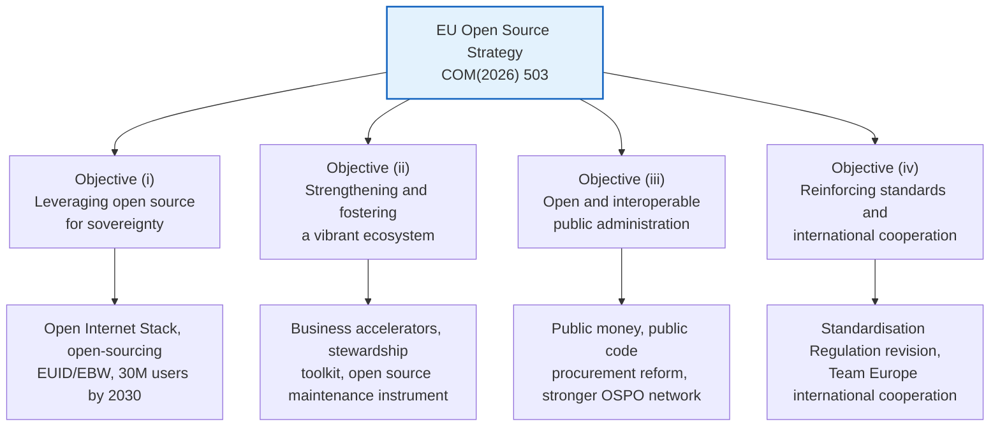
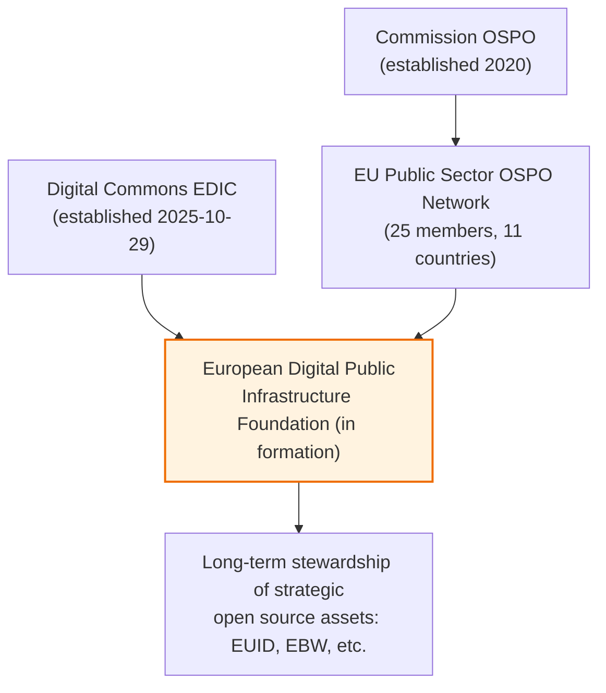
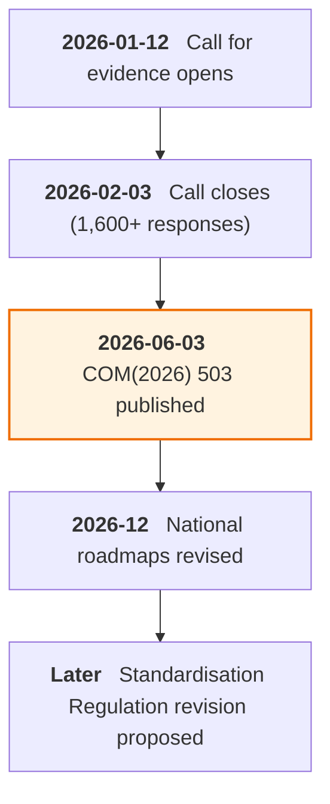

{}
This article was written with Claude Code, and the key facts cited here were cross-checked against primary sources.
{}

> **Summary**
>
> The European Commission's "Communication on European Tech Sovereignty" (COM(2026) 503 final), published on June 3, 2026, comes with an EU Open Source Strategy attached. It is the first time open source has been placed at the center of EU digital policy. The strategy sets four objectives — leveraging open source for sovereignty, strengthening the ecosystem, opening up public administration, and reinforcing standards and international cooperation — and calls for roughly EUR 2 billion in public and private funding to be mobilized for open-source-related measures over the next seven years. The aim is to reduce the EU's dependence on US proprietary IT, on which it spends an estimated EUR 264 billion annually. Civil society (FSFE) and policy analysts have welcomed the direction while flagging limits: whether the funding is sufficient, how open standards relate to open source, the light treatment of open hardware, and the practitioner skills gap. For Korean public-sector and enterprise practitioners, the points worth watching directly are the opening of EU procurement, the open-source steward regulation, and the open-source default for the EUDI Wallet.

## 1. Overview

The Commission unveiled its technological sovereignty package in Brussels on June 3, 2026. A Communication is not binding legislation; it is a document setting out the Commission's policy direction and planned follow-up actions.[A1](#a1)·[A2](#a2) The package consists of four interlinked initiatives: the Chips Act 2.0 for semiconductors, the Cloud and AI Development Act (CADA), the Open Source Strategy, and a roadmap for digitalizing the energy sector and AI. This report covers only the Open Source Strategy, which forms Chapter 4 of the COM document.[A1](#a1)

The problem the strategy sets out to answer is clear. The Draghi Report found that the EU depends on non-EU suppliers for more than 80% of its digital products, services, infrastructure, and intellectual property.[A1](#a1) The Open Source Strategy chose open source as the means to reduce that dependence. Europe, the birthplace of Linux, has more than three million open source contributors, and nearly half of all code commits come from companies with fewer than 50 employees. The asset base exists, but it faces structural limits in scaling and funding.[A1](#a1)

## 2. Core Content: Four Objectives

The strategy combines two tracks of action: supply-side measures that help EU communities and companies develop and maintain high-quality open source components, and demand-side measures that accelerate adoption across the private and public sectors. It pairs public funding with market- and demand-driven measures, and was built on more than 1,600 responses received through the Commission's call for evidence.[A1](#a1)·[B3](#b3)

**Figure 1.** The strategy's four objectives and their headline measures *(source: COM(2026) 503 final, Chapter 4, 2026-06-03)*

**Leveraging open source for sovereignty (Objective i).** The Commission is expanding the Open Internet Stack into a shared catalogue of European open source building blocks, and has mobilized EUR 41.3 million across three calls under the Horizon Europe 2026–2027 work programme.[A1](#a1) Open-sourcing the EU digital identity ecosystem is a core pillar. The EU Digital Identity Regulation (EUDIR) set a legal default requiring the application components of the EUDI Wallet to be open source; building on that, the Commission is developing open source reference implementations of the identity wallet (EUID) and the European Business Wallet (EBW), and transferring their long-term stewardship to the European Digital Public Infrastructure Foundation.[A1](#a1) It will cooperate with member states through the European Digital Infrastructure Consortium (EDIC) on Digital Commons, with a target of reaching 30 million active users of open source collaboration, productivity, and secure email tools by 2030.[A1](#a1)

**Strengthening the ecosystem (Objective ii).** Open source building blocks are mostly maintained through foundations, and most of the funding for them comes from US and Chinese big tech.[A1](#a1) The open source software steward concept introduced by the Cyber Resilience Act (CRA) is the regulatory backbone of this objective. The Commission is developing a stewardship toolkit to help establish foundations, and supporting the creation of a European Digital Public Infrastructure Stewards organization to govern EU-funded strategic assets from a single hub. To maintain and secure key components, it is also setting up an Open Source Maintenance Instrument to build European capacity to fork projects when necessary.[A1](#a1)

> [!IMPORTANT]
> The "EUR 350 million for the Open Source Maintenance Instrument" figure often cited in outside analysis does not appear in the COM(2026) 503 text itself. It is the TechPolicy.Press authors' own estimate of what the instrument would need; the original document attaches no figure.[A1](#a1)·[E1](#e1) By contrast, "about EUR 500 million for RISC-V" does appear in Annex II, but it is recorded as a Chips Joint Undertaking investment and is separate from the Open Source Strategy's EUR 2 billion budget.[A1](#a1)

**Opening up public administration (Objective iii).** The "public money, public code" principle has been explicitly written into the strategy.[A1](#a1)·[B2](#b2) The Commission already runs the Matrix-based communication platform, the openDesk collaboration environment, and Drupal across more than 300 europa.eu sites.[A1](#a1) On procurement, it is revising tendering guidelines so open source can compete with proprietary solutions, and strengthening the Open Source Programme Office (OSPO) and the EU Public Sector OSPO Network as a central hub.[A1](#a1)·[B2](#b2)

**Standards and international cooperation (Objective iv).** In its revision of the Standardisation Regulation, the Commission is improving cooperation between open source and standardization communities and creating conditions for certain standards to be implemented in open source. Through a Team Europe approach, it is deploying EU open source solutions to enlargement and partner countries.[A1](#a1)

### Governance Structure

Rather than creating new bodies, the strategy weaves together existing governance assets. Three tracks come together.

**Figure 2.** How the strategy's governance bodies connect *(source: COM(2026) 503 final, Chapter 4 and Annex II, 2026-06-03; OSPO Network membership as of 2026-05)*

The Commission OSPO (established 2020) and the EU Public Sector OSPO Network, with 25 members across 11 countries, cover the public-administration track, while the Digital Commons EDIC, established on October 29, 2025, covers the multi-country cooperation track.[A1](#a1)·[A5](#a5) Both converge on the European Digital Public Infrastructure Foundation, now being established, which will take on long-term stewardship of strategic assets such as EUID and EBW.[A1](#a1)

## 3. Background and Context

The Open Source Strategy is not standalone regulation but a policy umbrella layered on several EU legal acts. The Interoperable Europe Act (Regulation (EU) 2024/903) defines "open source licence" and underpins public-sector reuse,[A4](#a4) while the CRA (Regulation (EU) 2024/2847) provides the steward regulatory category and voluntary security attestation (Article 25).[A3](#a3) The AI Act places proportionate obligations on free and open source models, and the EUDIR sets the open-source default for the EUDI Wallet.[A1](#a1)·[C1](#c1)

The watershed in this policy lineage is 2020. On October 21, 2020, the Commission adopted the "Open Source Software Strategy 2020–2023" (C(2020) 7149 final), introducing a "think open" culture, and its first action was to establish the Commission OSPO.[A5](#a5) That was followed by code.europa.eu (4,500 users and 1,280 repositories as of May 2026) and the EU Open Source Solutions Catalogue (launched March 2025, 1,047 solutions).[A1](#a1) The new strategy explicitly cites these as its foundation.

The "public money, public code" principle originated in a campaign the Free Software Foundation Europe (FSFE) launched in 2017. The strategy adopts the principle nine years after the campaign began.[B4](#b4)

## 4. Recent Developments and Timeline

Because the announcement is only days old, developments so far consist of the immediate reaction and the procedural steps ahead.

**Figure 3.** Timeline of the EU Open Source Strategy *(source: COM(2026) 503 final and Commission announcements, as of 2026-06-05)*

On the day of the announcement, FSFE issued a cautious welcome. While welcoming the adoption of the "Public Money? Public Code!" principle, Johannes Näder said the Commission "still falls short on concrete goals, milestones, and secured funding," and Lucas Lasota said "the question now is implementation, which requires secured long-term funding, meaningful civil society participation, and effective enforcement of the Digital Markets Act."[B4](#b4)

TechPolicy.Press's policy analysis (Gates, Givropoulou, Karhu, 2026-06-03) called the strategy "Europe's most significant open source advancement to date" while identifying four gaps.[E1](#e1) The sequencing between open standards and open source remains unsettled, open hardware treatment is confined to RISC-V and EDA tools, the seven-year EUR 2 billion is modest against EUR 264 billion in annual dependence, and practitioner-level contribution, maintenance, and governance capacity-building remain weak. The law firm Covington also summarized the package's investment scale and business impact on June 4, 2026.[E3](#e3)

The nature of the funding adds to the uncertainty. The EUR 2 billion is not a fixed budget allocation but a combined estimate of what public and private actors "should mobilize" over seven years.[A1](#a1) The Open Source Maintenance Instrument, the European Digital Public Infrastructure Foundation, and the voluntary EU assessment framework are all at the stage of a commitment to "create," with no concrete design or figures yet set.

On the timeline ahead, the package will feed into member states' revision of their national Digital Decade strategy roadmaps in December 2026, and the proposed revision of the Standardisation Regulation together with the CADA and Chips Act 2.0 legislative processes will spell out open source requirements in more detail. The Commission will discuss progress annually in the Digital Decade Board and report to the European Parliament every three years.[A1](#a1)

## 5. Implications and Considerations

The strategy does not apply directly to Korean public institutions and companies, but there are several points worth watching in practice.

The opening of EU public procurement is the most concrete variable. If tender specifications come to include open standards and models and open source is allowed to compete with proprietary solutions, Korean software suppliers seeking to enter EU public markets will need open-source-friendly proposals and clear licensing to compete effectively.[A1](#a1)·[B2](#b2) Conversely, this widens the opportunity for Korean companies whose business is built on open source to enter EU procurement.

The open source steward regulation is a point that companies bringing CRA-covered products to the EU market should watch. Security attestation for products relying on open source components (CRA Article 25) and the scope of steward responsibility are expected to be spelled out through the strategy's voluntary EU assessment framework, so it is prudent to prepare a Software Bill of Materials (SBOM) and dependency management practices in advance.[A1](#a1)·[A3](#a3) The fact that the EUDI Wallet and European Business Wallet default to open source reference implementations is something Korean fintech and identity verification providers considering EU digital identity integration should watch.[A1](#a1)

From the perspective of Korea's public software policy, the institutionalization path for the "public money, public code" principle and the OSPO Network governance model are worth studying as reference models. That said, since the EU itself has left funding sufficiency and practitioner capacity as open questions, the gap between declaration and implementation is also worth watching.[B4](#b4)·[E1](#e1)

## 6. References

### A. Primary Legal and Regulatory Texts

**A1.** European Commission (2026). *Communication from the Commission on European Tech Sovereignty, accompanied by an EU Open Source Strategy*. COM(2026) 503 final, Brussels, 3.6.2026 (main text and ANNEXES 1–2). The primary source for this report. `sources/COM-2026-503-eu-tech-sovereignty.pdf` and `…-annexes.pdf`. Download: <https://digital-strategy.ec.europa.eu/en/library/communication-european-tech-sovereignty-accompanied-eu-open-source-strategy> (accessed 2026-06-05). <a href="#a1-ref-1" onclick="event.preventDefault(); history.back(); return false;" title="Back to text">↩</a>

**A2.** European Commission (2026). *Strengthening Europe's tech sovereignty* (press release). 2026-06-03. <https://commission.europa.eu/news-and-media/news/strengthening-europes-tech-sovereignty-2026-06-03_en> (accessed 2026-06-05). <a href="#a2-ref-1" onclick="event.preventDefault(); history.back(); return false;" title="Back to text">↩</a>

**A3.** European Parliament and Council (2024). *Regulation (EU) 2024/2847 — Cyber Resilience Act*. Official Journal, OJ L, 2024/2847, 20.11.2024. <https://eur-lex.europa.eu/eli/reg/2024/2847/oj/eng> (accessed 2026-06-05). <a href="#a3-ref-1" onclick="event.preventDefault(); history.back(); return false;" title="Back to text">↩</a>

**A4.** European Parliament and Council (2024). *Regulation (EU) 2024/903 — Interoperable Europe Act*. Official Journal, OJ L, 2024/903, 22.3.2024. <https://eur-lex.europa.eu/eli/reg/2024/903/oj/eng> (accessed 2026-06-05). <a href="#a4-ref-1" onclick="event.preventDefault(); history.back(); return false;" title="Back to text">↩</a>

**A5.** European Commission (2020). *Open Source Software Strategy 2020–2023*. C(2020) 7149 final, Brussels, 21.10.2020. <https://commission.europa.eu/system/files/2023-02/en_ec_open_source_strategy_2020-2023.pdf> (accessed 2026-06-05). <a href="#a5-ref-1" onclick="event.preventDefault(); history.back(); return false;" title="Back to text">↩</a>

### B. Official Publications and Policy Pages from Issuing Bodies

**B1.** European Commission — Shaping Europe's digital future (2026). *The EU Open Source Strategy* (policy page). Updated 2026-06-03. <https://digital-strategy.ec.europa.eu/en/policies/open-source-strategy> (accessed 2026-06-05).

**B2.** European Commission (2026). *Commission boosts open and interoperable digital ecosystems for public administrations* (press release). 2026-06-03. <https://commission.europa.eu/news-and-media/news/commission-boosts-open-and-interoperable-digital-ecosystems-public-administrations-2026-06-03_en> (accessed 2026-06-05). <a href="#b2-ref-1" onclick="event.preventDefault(); history.back(); return false;" title="Back to text">↩</a>

**B3.** European Commission — Shaping Europe's digital future (2026). *Commission opens call for evidence on Open-Source Digital Ecosystems*. 2026-01-12 (closed 2026-02-03). <https://digital-strategy.ec.europa.eu/en/news/commission-opens-call-evidence-open-source-digital-ecosystems> (accessed 2026-06-05). <a href="#b3-ref-1" onclick="event.preventDefault(); history.back(); return false;" title="Back to text">↩</a>

**B4.** Free Software Foundation Europe (2026). *EU Tech Sovereignty: A milestone for Public Code? Now implementation is key*. 2026-06-03. <https://fsfe.org/news/2026/news-20260603-01.en.html> (accessed 2026-06-05). <a href="#b4-ref-1" onclick="event.preventDefault(); history.back(); return false;" title="Back to text">↩</a>

### C. Standards and Frameworks

**C1.** European Commission (2024). *Regulation (EU) 2024/1689 — Artificial Intelligence Act*. Official Journal, OJ L, 2024/1689, 12.7.2024. <https://eur-lex.europa.eu/eli/reg/2024/1689/oj/eng> (accessed 2026-06-05). <a href="#c1-ref-1" onclick="event.preventDefault(); history.back(); return false;" title="Back to text">↩</a>

**C2.** European Parliament and Council (2023). *Regulation (EU) 2023/2854 — Data Act*. Official Journal, OJ L, 2023/2854, 22.12.2023. <https://eur-lex.europa.eu/eli/reg/2023/2854/oj/eng> (accessed 2026-06-05).

### D. Academic and Policy Research

**D1.** Blind, K. et al. (2021). *The impact of Open Source Software and Hardware on technological independence, competitiveness and innovation in the EU economy*. European Commission. <https://digital-strategy.ec.europa.eu/en/library/study-about-impact-open-source-software-and-hardware-technological-independence-competitiveness-and> (accessed 2026-06-05).

### E. Industry, Law Firm, and Media Analysis (Supplementary)

**E1.** Gates, N., Givropoulou, A., Karhu, J. (2026). *How the EU's Tech Sovereignty Package Finally Puts Open Source to the Test*. TechPolicy.Press, 2026-06-03. <https://www.techpolicy.press/how-the-eus-tech-sovereignty-package-finally-puts-open-source-to-the-test/> (accessed 2026-06-05). <a href="#e1-ref-1" onclick="event.preventDefault(); history.back(); return false;" title="Back to text">↩</a>

**E2.** TechPolicy.Press (2026). *EU Unveils Sweeping Tech Sovereignty Push, Balancing Autonomy with Openness*. 2026-06-03. <https://www.techpolicy.press/eu-unveils-sweeping-tech-sovereignty-push-balancing-autonomy-with-openness/> (accessed 2026-06-05).

**E3.** Covington & Burling (2026). *EU Tech Sovereignty Package*. Global Policy Watch, 2026-06-04. <https://www.globalpolicywatch.com/2026/06/eu-tech-sovereignty-package/> (accessed 2026-06-05). <a href="#e3-ref-1" onclick="event.preventDefault(); history.back(); return false;" title="Back to text">↩</a>

**E4.** Agence Europe (2026). *European Commission seeks to harness open source in its tech sovereignty strategy and develop European alternatives*. 2026-06. <https://agenceurope.eu/en/bulletin/article/13877/4/european-commission-seeks-to-harness-open-source-in-its-tech-sovereignty-strategy-and-develop-european-alternatives> (accessed 2026-06-05).
