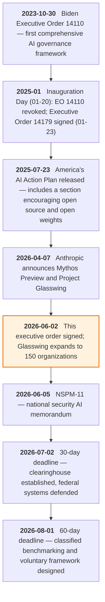
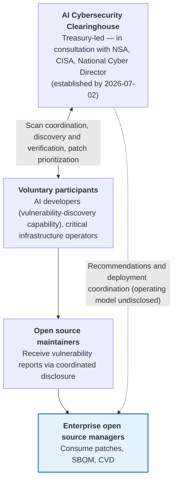

{}
This article was written with Claude Code, and the key facts cited here were cross-checked against primary sources.
{}

> **Summary**
>
> The executive order "Promoting Advanced Artificial Intelligence Innovation and Security," signed on June 2, 2026, imposes no obligations on enterprises. Its substance is the Treasury Department-led AI Cybersecurity Clearinghouse (a relay body that pools, verifies, and distributes vulnerability information, to be established within 30 days) and a voluntary pre-disclosure framework for frontier models (to be designed within 60 days); mandatory licensing and pre-approval are explicitly excluded [A1](#a1). No provision applies directly to enterprise open source managers either. Still, there is a reason to read this order: the context behind it. AI finding open source vulnerabilities faster than humans do has already become reality. Ahead of the executive order, an unreleased Anthropic model found 6,202 high- or critical-severity vulnerabilities in open source projects over two months, and patching has not kept pace [A6](#a6)·[C1](#c1). What open source managers need to prepare is not compliance with the executive order, but a response system that can handle a check of patch-processing capacity, cleanup of end-of-life (EOL) components, and the EU Cyber Resilience Act reporting obligation taking effect September 11, 2026, all at once.

## 1. What the Executive Order Actually Establishes

The executive order consists of five sections, all premised on voluntary cooperation. Section 1 declares a stance of "refusing to stifle innovation through excessive regulation" along with an America First cybersecurity posture, and Section 5 contains standard general provisions. The substance is in the three sections in between [A1](#a1).

Section 2 covers strengthening federal and private-sector cyber defense. Within 30 days, it prioritizes defense of national security systems, Department of War systems, and federal civilian systems, and within the same period the Treasury Secretary, in consultation with the National Cyber Director, the National Security Agency (NSA), and the Cybersecurity and Infrastructure Security Agency (CISA), establishes an AI cybersecurity clearinghouse. A clearinghouse originally referred to an interbank facility for exchanging and settling checks; here the term means a relay body that pools, verifies, and distributes information from multiple participants. In this order, it is tasked with coordinating software vulnerability scanning through voluntary cooperation with the AI industry and critical infrastructure operators to eliminate duplication, discovering and verifying vulnerabilities, and prioritizing patch development and deployment [A1](#a1).

Section 3 covers the safe deployment of frontier models. Within 60 days, it establishes a classified benchmarking process to assess the cyber offensive capability of AI models, and based on the results, the NSA Director sets the threshold for which models qualify as a "covered frontier model." Through a voluntary framework, developers consult with the government on whether their models meet the designated criteria, provide the government access to the model up to 30 days before the planned public release, and jointly select trusted partners who receive early access. Sec. 3(c) states explicitly that nothing in this section establishes mandatory licensing, pre-approval, or permitting requirements for the development, publication, disclosure, or deployment of new AI models [A1](#a1).

Section 4 covers investigation and enforcement. The Attorney General prioritizes enforcement of existing federal criminal law, including `18 U.S.C. § 1030` (Computer Fraud and Abuse), against unauthorized computer access and damage carried out using AI and other crimes committed in the process [A1](#a1).

**Figure 1.** Policy timeline around the executive order *(source: official White House documents [A1](#a1), [A2](#a2), [A3](#a3), [A4](#a4), [A5](#a5), Anthropic [A6](#a6), Wiley's deadline calculation [B1](#b1). As of 2026-06-10)*

The choice of lead agency has drawn comment as unexpected. Looking only at the function of vulnerability coordination, CISA or the Office of the National Cyber Director would seem the natural fit, yet the Treasury Department leads the clearinghouse. The Council on Foreign Relations (CFR) suggested this may be because Treasury is "one of the few agencies with institutional capacity left," while the Atlantic Council flagged the risk of overlap with existing vulnerability coordination systems [B4](#b4)·[B5](#b5). The threshold for the key term "covered frontier model" is also left undefined in the text. It will be set based on the classified benchmarking results, and WilmerHale expects defining this threshold to be the focus of agency rulemaking over the coming months [B2](#b2).

## 2. Why Now

The direct background to the executive order is Claude Mythos Preview, announced by Anthropic on April 7, 2026. This unreleased model scored 83.1% on the vulnerability-reproduction benchmark CyberGym (up from 66.6% for the prior model), and instead of a general release, Anthropic chose Project Glasswing, opening access only to 12 partners including AWS, Apple, Google, and Microsoft [A6](#a6). In under two months, participating organizations identified more than 10,000 high- or critical-severity vulnerabilities. Anthropic's own scans alone turned up 23,019 issues across more than 1,000 open source projects, of which 6,202 were high or critical severity, and an independent security firm verified a sample of 1,752 and confirmed more than 90% were real vulnerabilities [C1](#c1)·[C2](#c2). Notable examples include a remote crash flaw that lay dormant in OpenBSD for 27 years, a 16-year-old flaw in FFmpeg that had survived 5 million automated test runs, and a privilege escalation chain in the Linux kernel [A6](#a6).

This process revealed a sharp mismatch between the speed of finding vulnerabilities and the speed of fixing them. Anthropic itself stated that "the bottleneck for fixing these bugs is human capacity to triage, report, and design and ship patches," and once open source maintainers became the bottleneck, it began working with OpenSSF's Alpha-Omega project [C1](#c1)·[C2](#c2). Bruce Schneier assessed that, for now, "finding in order to fix" is easier than "finding in order to exploit," giving defenders a favorable window, but that this window is temporary and that an era of automated zero-day discovery will arrive before we finish preparing for it. He added the caveat that this capability is not any one company's exclusive property, noting that the security firm Aisle reproduced part of the results using an older public model [C3](#c3).

The executive order is the US government's response to this situation. The clearinghouse is a plan for the government to coordinate at a national level what private actors, such as Glasswing, had been doing individually: finding and verifying vulnerabilities with AI and coordinating patches [A1](#a1)·[B5](#b5).

## 3. What This Means for Enterprise Open Source Managers

### 3.1 A Document That Never Says "Open Source"

The term "open source" appears nowhere in the executive order's text or the White House fact sheet [A1](#a1)·[A2](#a2). Read favorably, this means no regulatory burden. The order imposes no obligations on open source developers or open-weight model distributors, and because the licensing-ban provision in Sec. 3(c) covers "development, publication, disclosure, and deployment" of a model altogether, distribution by releasing weights also falls within its protection [A1](#a1). The administration's official stance remains what it stated in the July 2025 AI Action Plan: the choice between open and closed is entirely up to the developer, and the federal government will create an environment favorable to open models [A5](#a5).

The open question is the threshold for a covered frontier model. Since it will be set by a classified benchmark, it is not yet possible to know what happens if an open-weight model crosses that threshold. The core mechanism of the voluntary framework, "government access 30 days before release," is designed around closed models whose release timing can be controlled; it does not fit open models, whose weights, once released, cannot be recalled. CFR's experts expect frontier-level vulnerability-reasoning capability to be reproduced in open-weight systems before long, and similar reproduction studies are already being cited [B5](#b5). If this capability spreads to open models, the gap in a design built on voluntary pre-disclosure will become apparent, and further regulatory discussion could then target open models. Enterprises that use open-weight models internally, or fine-tune and deploy them, should watch how the benchmarking process due by August 1 and the rulemaking that follows treat open models.

Open source foundations have also stayed quiet so far. As of a search on 2026-06-10, no statement on this executive order could be confirmed from the Open Source Initiative (OSI), the Linux Foundation, or OpenSSF. With no obligations imposed, the incentive to respond immediately appears to have been weak. The closest thing to an official position is OSI's response to the AI Action Plan comment request in March 2025 [B7](#b7).

### 3.2 Where the Clearinghouse Meets Enterprise Vulnerability Management

The clearinghouse's three functions — coordinating scans, discovering and verifying vulnerabilities, and prioritizing patches and coordinating deployment — overlap precisely with the vulnerability management systems that enterprise open source organizations (OSPOs or product security teams) already run [A1](#a1).

**Figure 2.** The position of enterprise open source managers in the clearinghouse and vulnerability information flow *(source: analysis based on Executive Order Sec. 2(d) [A1](#a1). The dotted line marks an operating model not yet disclosed)*

Most enterprises will encounter the clearinghouse as consumers of information. Once it is operating, information on the discovery, verification, and patch prioritization of open source component vulnerabilities will flow out through a new channel. This adds one more US-originated channel to a company's vulnerability intelligence pipeline, and one more coordinating body influencing patch-priority decisions.

Whether to participate directly in the clearinghouse is a separate decision. Companies in critical infrastructure sectors (energy, finance, healthcare, telecommunications, and others) are explicitly named as participants [A1](#a1). Participating means receiving vulnerability information earlier, having a voice in patch coordination, and gaining access to the government-supported security tools mentioned in Sec. 2(c)(iii). In exchange, a company takes on the legal review burden that comes with information sharing, and, as Crowell & Moring pointed out, inherits the uncertainty of liability protection for participants going unspecified and the consequences of non-participation going undefined [B3](#b3). If, as WilmerHale forecasts, the voluntary provisions migrate into federal procurement standards, there is a scenario in which participation becomes a de facto prerequisite for companies doing business with the US government [B2](#b2). There is no reason to rush a decision before the operating model is disclosed in early July.

### 3.3 The Most Direct Impact: A Surge in Patch Demand and EOL Risk

A change already underway independent of the executive order is being accelerated by it. Once AI-based discovery is institutionalized as a national system and backed with federal funding (Sec. 2(e)), the number of vulnerabilities reported in open source components can only increase. The Glasswing figures previewed the scale of this.

The first thing enterprises run into is throughput. As new CVEs increase for open source components included in a company's products, triage (impact analysis), patch application, and customer communication all have to scale up together. Organizations relying on manual triage are the first to accumulate a backlog.

End-of-life (EOL) components pose a deeper problem. AI scans code indiscriminately, whether or not it is still maintained, but a patch only comes from a maintainer. As HeroDevs, a commercial long-term-support (LTS) vendor, has pointed out, the gap between discovery speed and fix speed opens widest in EOL software. If an inventory still holds components where discovery keeps accelerating but a fix will never arrive, that risk only grows over time [C4](#c4). The 27-year-old OpenBSD flaw and the 16-year-old FFmpeg flaw show that the assumption "old and stable means safe" no longer holds [A6](#a6).

The burden on the upstream side also eventually comes back around as enterprise risk. Anthropic itself has confirmed that open source maintainers are becoming a bottleneck under the flood of reports [C2](#c2). When the maintainer of a core component a company depends on is buried in triage, it is the company that ends up absorbing the patch delay. Adding maintenance health (number of maintainers, security response history, foundation affiliation) as an evaluation criterion for core dependencies, and participating in upstream support such as Alpha-Omega where warranted, is a path to reducing that risk.

### 3.4 Contrast with the EU CRA: Handling Voluntary and Mandatory Regimes at Once

The problem the US clearinghouse addresses — the discovery and patching of software vulnerabilities — is the same territory the EU has made mandatory through the Cyber Resilience Act (CRA — Regulation (EU) 2024/2847).

| Category | US Executive Order (2026-06-02) | EU CRA Article 14 (effective 2026-09-11) |
|---|---|---|
| Nature | Voluntary cooperation (participation is a company choice) | Legal obligation (applies immediately upon EU market entry) |
| Scope | AI industry, critical infrastructure operators | Manufacturers, importers, and distributors of products with digital elements |
| Core mechanism | Clearinghouse coordinates scans and patch deployment | Tiered 24-hour/72-hour/14-day reporting of actively exploited vulnerabilities |
| Recipient | Treasury-led clearinghouse (operating model undisclosed) | ENISA's Single Reporting Platform (SRP) and member-state CSIRTs |
| Non-compliance | No penalty (procurement-standard adoption remains speculative) | Fines of up to €15 million or 2.5% of global annual turnover |
| Model regulation | Explicit exclusion of mandatory licensing and pre-approval | CRA regulates product security, not AI models |

**Table 1.** Comparing the US executive order and EU CRA vulnerability reporting regimes *(source: the executive order text [A1](#a1), Regulation (EU) 2024/2847 [A7](#a7), a separate report [D1](#d1). As of 2026-06-10)*

For a Korean company shipping products into both markets, the priority is clear: the one with binding force, a deadline, and fines comes first. The CRA Article 14 reporting workflow must be operational by September 11, three months out, and there is a confirmed practical constraint that, since ENISA does not currently offer an API to integrate with the SRP, the process has to be designed for manual human submission [A7](#a7)·[D1](#d1). The US clearinghouse comes after that. That said, both regimes run on the same underlying capabilities: a component inventory (SBOM), vulnerability triage, a coordinated vulnerability disclosure (CVD) intake channel, and a patch deployment process. Since the system built to prepare for the CRA becomes the foundation for voluntary participation on the US side, there is no need to build a separate system twice.

### 3.5 A Policy Divergence: US Voluntary Cooperation, EU Institutionalization

On June 3, the day after the executive order, the European Commission announced its tech sovereignty package, placing open source at the center of digital policy. Its substance is roughly €2 billion in public and private funding mobilized over seven years, a new Open Source Maintenance Instrument, and the opening up of public procurement [A8](#a8)·[D2](#d2). Issued a day apart, the two documents show opposing institutional designs for the same technological environment. The US model excludes regulation and has the government coordinate voluntary private-sector capability; the EU model institutionalizes the open source ecosystem itself through public funding and legal obligation, including the CRA's steward regime.

A global company's open source management policy has to be built on this divergence. In the US market, it must decide whether to join a voluntary cooperation channel; in the EU market, it must meet the obligations of CRA compliance and the steward regime. Since the same team ends up running both modes within one company, a structure that layers market-specific modules on top of shared capability is more realistic than splitting policy documents and response organizations by market.

### 3.6 A Different Axis from Managing AI-Generated Code

A separate analysis on the inflow of AI-generated code into open source and snippet screening [D3](#d3) and this issue both touch AI and open source management, but they sit on different axes. That analysis covered inflow management — the license and provenance problems that arise when AI coding tools bring undeclared code snippets into a codebase. This executive order points to operations — the response problem in an environment where AI makes vulnerabilities in already-present open source components surface faster and in greater numbers. AI now affects both the stage where code comes in and the stage where vulnerabilities surface, and the response systems for the two axes need to be checked separately.

## 4. Preparation

Since the executive order makes no direct demands of enterprises, preparation splits into what to do now and what to watch.

### What to Do Now

The starting point is an inventory of your own AI exposure surface. Consolidate, in one place, the models developed or fine-tuned in-house (especially open-weight-based ones), the AI coding and security tools adopted, and the current state of AI-generated code that has entered the codebase. The point is to be able to judge immediately, once the covered-frontier-model threshold takes shape after August 1, whether your company falls near that line.

Also check your open source vulnerability response system. Confirm that SBOMs are up to date across all products, that new-CVE triage can absorb a two- to three-fold increase in volume, and that the CVD intake channel works. This check is the same work as preparing for CRA Article 14 (with its September 11 deadline), so there is no need to create a separate project — fold it into CRA preparation [D1](#d1).

The most urgent item is cleaning up EOL components. Identify end-of-life components from the SBOM, set a schedule for those with an upgrade path, and for those that cannot be removed immediately, settle on a patch source such as commercial LTS or an in-house patch. Document items that can be shown not to be affected using Vulnerability Exploitability eXchange (VEX) to reduce the triage burden [C4](#c4).

Finally, assess the health of core upstream dependencies. Check the maintainer base size and security response history of upstream components that revenue-critical products depend on, and for projects at risk of becoming a bottleneck, consider support measures such as sponsorship or contribution [C2](#c2).

### What to Watch

| Item to Track | Timing | What to Check |
|---|---|---|
| Clearinghouse formation announced | By 2026-07-02 | Operating entity and participation process, scope of enterprise information sharing, whether liability protection exists [A1](#a1)·[B3](#b3) |
| Classified benchmarking and voluntary framework | By 2026-08-01 | Shape of the covered-frontier-model threshold, treatment of open-weight models [A1](#a1)·[B2](#b2) |
| Follow-on rulemaking | Over coming months | Whether voluntary provisions migrate into federal procurement standards [B2](#b2) |
| NSPM-11 classified annex and implementation | By early September 2026 | Treatment of open source AI in national security procurement [A3](#a3) |
| Open source foundation response | From July onward | Statements and participation approach from OSI, the Linux Foundation, and OpenSSF [B7](#b7) |
| EU CRA SRP goes live | 2026-09-11 | Reporting workflow going operational (tracked in a separate report [D1](#d1)) |

**Table 2.** Items to track and their timing *(as of 2026-06-10)*

## 5. Conclusion

This executive order imposes no new obligation on enterprise open source managers, but it signals that the premises of the working environment are shifting. An era in which AI finds open source vulnerabilities in bulk has been demonstrated, and the US government has decided to institutionalize that trend through coordination rather than regulation. Discovery is speeding up while patching still runs at human speed. In that gap, the only thing a company can control is its own inventory's processing capacity. Since the EU CRA reporting obligation taking effect three months from now requires SBOM, triage, and CVD capability regardless, preparing for both markets under one system is the most efficient path. As for the executive order itself, it is enough to mark two dates on the calendar: July 2 (the clearinghouse) and August 1 (the benchmarking standard).

---

## References

All URLs were checked for access and content match on 2026-06-10 (except where noted).

### A. Primary Sources (Official Government Documents, Party Announcements)

**A1.** The White House (2026). *Promoting Advanced Artificial Intelligence Innovation and Security* (Executive Order). Signed 2026-06-02. <https://www.whitehouse.gov/presidential-actions/2026/06/promoting-advanced-artificial-intelligence-innovation-and-security/> (accessed 2026-06-10). — *The primary source for this report.* <a href="#a1-ref-1" onclick="event.preventDefault(); history.back(); return false;" title="Back to text">&#8617;</a>

**A2.** The White House (2026). *Fact Sheet: President Donald J. Trump Promotes Advanced Artificial Intelligence Innovation and Security*. 2026-06-02. <https://www.whitehouse.gov/fact-sheets/2026/06/fact-sheet-president-donald-j-trump-promotes-advanced-artificial-intelligence-innovation-and-security/> (accessed 2026-06-10). <a href="#a2-ref-1" onclick="event.preventDefault(); history.back(); return false;" title="Back to text">&#8617;</a>

**A3.** The White House (2026). *National Security Presidential Memorandum/NSPM-11 — Artificial Intelligence in the National Security Enterprise*. 2026-06-05. <https://www.whitehouse.gov/presidential-actions/2026/06/national-security-presidential-memorandum-nspm-11/> (accessed 2026-06-10). <a href="#a3-ref-1" onclick="event.preventDefault(); history.back(); return false;" title="Back to text">&#8617;</a>

**A4.** The White House (2025). *Removing Barriers to American Leadership in Artificial Intelligence* (Executive Order 14179). 2025-01-23. <https://www.whitehouse.gov/presidential-actions/2025/01/removing-barriers-to-american-leadership-in-artificial-intelligence/> (accessed 2026-06-10). <a href="#a4-ref-1" onclick="event.preventDefault(); history.back(); return false;" title="Back to text">&#8617;</a>

**A5.** The White House (2025). *Winning the Race: America's AI Action Plan*. 2025-07. <https://www.whitehouse.gov/wp-content/uploads/2025/07/Americas-AI-Action-Plan.pdf> (accessed 2026-06-10, the relevant passage was verified directly against the PDF original). <a href="#a5-ref-1" onclick="event.preventDefault(); history.back(); return false;" title="Back to text">&#8617;</a>

**A6.** Anthropic (2026). *Project Glasswing: Securing critical software for the AI era*. Announced 2026-04-07 (updated since). <https://www.anthropic.com/glasswing> (accessed 2026-06-10). <a href="#a6-ref-1" onclick="event.preventDefault(); history.back(); return false;" title="Back to text">&#8617;</a>

**A7.** European Parliament and Council (2024). *Regulation (EU) 2024/2847 — Cyber Resilience Act*. OJ L, 2024/2847, 20.11.2024. <https://eur-lex.europa.eu/eli/reg/2024/2847/oj/eng> (accessed 2026-05-12, verified during this workspace's CRA report fact-check). <a href="#a7-ref-1" onclick="event.preventDefault(); history.back(); return false;" title="Back to text">&#8617;</a>

**A8.** European Commission (2026). *Communication on European Tech Sovereignty, accompanied by an EU Open Source Strategy*. COM(2026) 503 final, 2026-06-03. <https://digital-strategy.ec.europa.eu/en/library/communication-european-tech-sovereignty-accompanied-eu-open-source-strategy> (accessed 2026-06-10). <a href="#a8-ref-1" onclick="event.preventDefault(); history.back(); return false;" title="Back to text">&#8617;</a>

### B. Legal and Policy Analysis

**B1.** Wiley Rein LLP (2026). *New AI Executive Order Addresses Frontier Models and Cybersecurity Vulnerabilities*. <https://www.wiley.law/alert-New-AI-Executive-Order-Addresses-Frontier-Models-and-Cybersecurity-Vulnerabilities> (accessed 2026-06-10). <a href="#b1-ref-1" onclick="event.preventDefault(); history.back(); return false;" title="Back to text">&#8617;</a>

**B2.** WilmerHale (2026). *New Executive Order Addressing Early Government Access to Frontier AI Models*. 2026-06-02. <https://www.wilmerhale.com/en/insights/client-alerts/20260602-new-executive-order-addressing-early-government-access-to-frontier-ai-models> (accessed 2026-06-10). <a href="#b2-ref-1" onclick="event.preventDefault(); history.back(); return false;" title="Back to text">&#8617;</a>

**B3.** Crowell & Moring LLP (2026). *Executive Order Creates Voluntary Regulatory Regime of Frontier AI Models*. <https://www.crowell.com/en/insights/client-alerts/executive-order-creates-voluntary-regulatory-regime-of-frontier-ai-models> (accessed 2026-06-10). <a href="#b3-ref-1" onclick="event.preventDefault(); history.back(); return false;" title="Back to text">&#8617;</a>

**B4.** Atlantic Council (2026). *Reading between the lines of Trump's new executive order on AI*. <https://www.atlanticcouncil.org/dispatches/reading-between-the-lines-of-trumps-new-executive-order-on-ai/> (accessed 2026-06-10). <a href="#b4-ref-1" onclick="event.preventDefault(); history.back(); return false;" title="Back to text">&#8617;</a>

**B5.** Council on Foreign Relations (2026). *Assessing Trump's Executive Order on AI Oversight*. <https://www.cfr.org/articles/assessing-trumps-executive-order-on-ai-oversight> (accessed 2026-06-10). <a href="#b5-ref-1" onclick="event.preventDefault(); history.back(); return false;" title="Back to text">&#8617;</a>

**B6.** CSO Online (2026). *OpenAI responds to White House executive order on AI governance*. <https://www.csoonline.com/article/4181294/openai-responds-to-white-house-executive-order-on-ai-governance.html> (accessed 2026-06-10).

**B7.** Open Source Initiative (2025). *OSI and Apereo Foundation Respond to White House on AI Action Plan*. <https://opensource.org/blog/osi-and-apereo-foundation-respond-to-white-house-on-ai-action-plan> (accessed 2026-06-10). <a href="#b7-ref-1" onclick="event.preventDefault(); history.back(); return false;" title="Back to text">&#8617;</a>

### C. Industry and Security Community

**C1.** CyberScoop (2026). *Anthropic expanding access to Project Glasswing*. 2026-06-02. <https://cyberscoop.com/anthropic-project-glasswing-expansion-critical-infrastructure-claude-mythos/> (accessed 2026-06-10). <a href="#c1-ref-1" onclick="event.preventDefault(); history.back(); return false;" title="Back to text">&#8617;</a>

**C2.** Help Net Security (2026). *Anthropic: Claude Mythos identified 10,000+ software flaws*. 2026-05-26. <https://www.helpnetsecurity.com/2026/05/26/anthropic-project-glasswing-update/> (accessed 2026-06-10). <a href="#c2-ref-1" onclick="event.preventDefault(); history.back(); return false;" title="Back to text">&#8617;</a>

**C3.** Schneier, Bruce (2026). *On Anthropic's Mythos Preview and Project Glasswing*. Schneier on Security, 2026-04. <https://www.schneier.com/blog/archives/2026/04/on-anthropics-mythos-preview-and-project-glasswing.html> (accessed 2026-06-10). <a href="#c3-ref-1" onclick="event.preventDefault(); history.back(); return false;" title="Back to text">&#8617;</a>

**C4.** HeroDevs (2026). *AI Cybersecurity Executive Order 2026: What It Means for EOL Software*. <https://www.herodevs.com/blog-posts/ai-cybersecurity-executive-order-2026-what-it-means-for-eol-software> (accessed 2026-06-10). — *Cited with awareness that this is a commercial LTS vendor's blog post.* <a href="#c4-ref-1" onclick="event.preventDefault(); history.back(); return false;" title="Back to text">&#8617;</a>

### D. Related Analysis (This Blog)

**D1.** [EU Cyber Resilience Act (CRA) Vulnerability Reporting Obligations — An Investigative Report on Preparing for the 2026-09-11 Effective Date]() (updated 2026-06-09). <a href="#d1-ref-1" onclick="event.preventDefault(); history.back(); return false;" title="Back to text">&#8617;</a>

**D2.** [EU Open Source Strategy: Institutionalizing Open Source for Tech Sovereignty]() (2026-06-05). <a href="#d2-ref-1" onclick="event.preventDefault(); history.back(); return false;" title="Back to text">&#8617;</a>

**D3.** [AI-Generated Code: How Far Should Open Source Screening Go?]() (2026-06-08). <a href="#d3-ref-1" onclick="event.preventDefault(); history.back(); return false;" title="Back to text">&#8617;</a>
