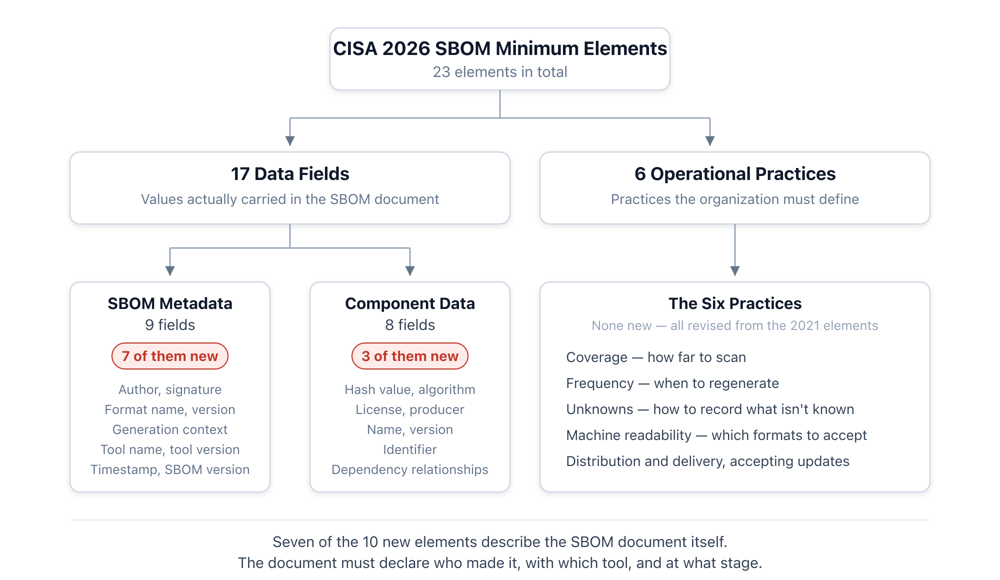
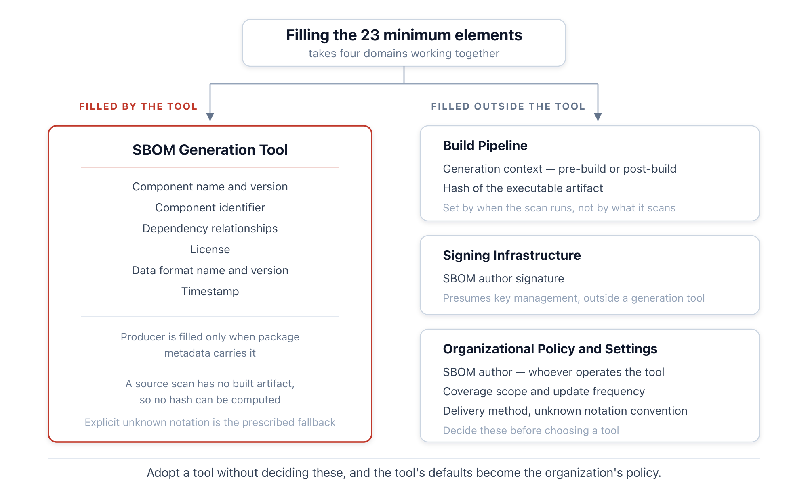
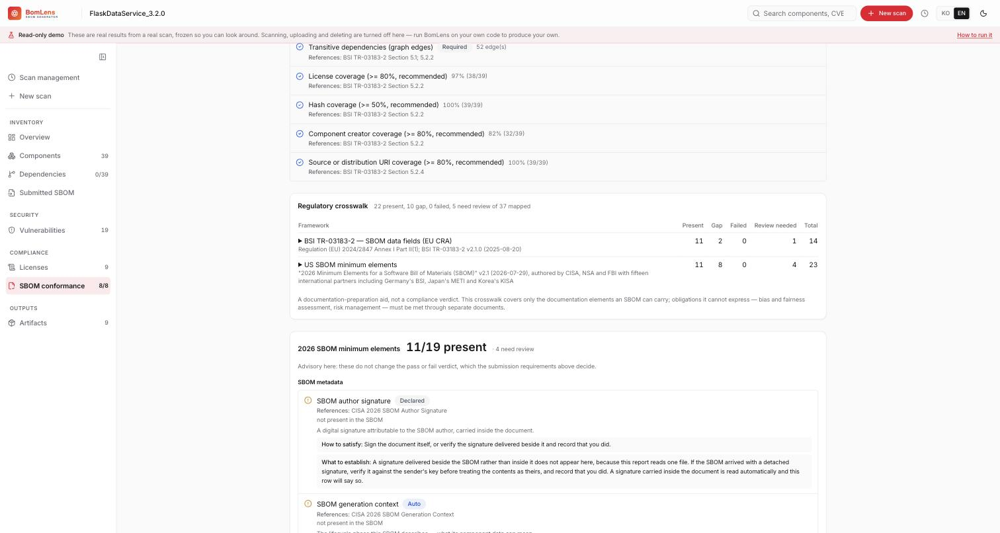

{}
This article was written with Claude Code, and the key facts cited here were cross-checked against primary sources.
{}

## Summary

On July 29, 2026, the Cybersecurity and Infrastructure Security Agency (CISA) and 17 other agencies published a revised set of minimum elements for a Software Bill of Materials (SBOM)[A2](#a2). The document states plainly that it replaces, rather than amends, the baseline established in 2021 by the National Telecommunications and Information Administration (NTIA).

The bar has risen noticeably. The data fields grew from 7 to 17, and six operational practices were specified alongside them. Ten of the elements are entirely new.

Three changes matter most in practice.

- Licensing entered the SBOM minimum baseline for the first time.
- Dependencies must now be recorded in full, down to transitive dependencies, with no depth limit.
- New fields were added to declare the origin and integrity of the SBOM document itself.

The document carries no effective date and no enforcement power. Preparation is still warranted, because national regulations increasingly require SBOMs without enumerating the fields those SBOMs must contain. The practical significance of this document is that it gives procurement contracts a multilateral consensus baseline to cite.

The nature of that preparation is easy to misjudge. Meeting the minimum elements is not a matter of picking a tool. Fewer than half of the 23 elements can be filled by a generation tool on its own. The rest are filled by the build pipeline, the signing infrastructure, and policies the organization decided on in advance.

I also checked how far an actual tool gets. BomLens is an SBOM generation and management tool that SK telecom developed for software supply chain security and released as open source. Assessing all 23 elements with it produced the following:

- The tool fills 11 of the 17 data fields directly with values.
- It inspects supplier-submitted SBOMs against all 23 elements, separating out the 4 that the organization must decide as items for human review.
- The remaining gaps exist not because the tool is deficient, but because those values must be determined by whoever runs it or by the build stage at which it runs.

The assessment screen can be viewed directly in the [public demo](https://sktelecom.github.io/bomlens/demo/#/scan/FlaskDataService_3.2.0/conformance), with nothing to install.

## 1. What Changed

### 1.1 The Structure of the Elements

The minimum elements fall into two categories. Seventeen data fields are the values actually carried in the SBOM document; six operational practices govern how an organization handles SBOMs.

**Figure 1.** The composition of the CISA 2026 SBOM minimum elements *(source: 2026 Minimum Elements for a SBOM, 2026-07-29)*

SBOM metadata is a category that did not exist in the 2021 edition. Where the earlier baseline asked for little more than an author and a timestamp, the document now requires the SBOM to declare for itself which tool produced it, when, at what stage, and who signed it.

### 1.2 Three Substantive Changes

**Licensing became mandatory.** The seven data fields of the 2021 edition did not include licensing, because that document was aimed at security and vulnerability management. The revision adds component licensing as a new element, requiring that it be conveyed in a machine-processable form such as an SPDX license identifier where possible, and that the presence of proprietary license terms be disclosed as well. Territory that belonged to the Open Source Program Office (OSPO) is now part of the SBOM minimum baseline.

**The floor on dependency resolution is gone.** The Depth element of the 2021 edition required only top-level dependencies. The revision replaces it with a Coverage element that requires all constituent components including transitive dependencies, and states explicitly that recording only to a certain depth is no longer sufficient. The document is candid about why. The 2021 baseline "reflected the capabilities of SBOM tooling at the time rather than the depth of information needed for informed security decisions," and since tooling has advanced in the interim, the requirement has been raised.

**Supplier Name became Component Producer.** This is a change of definition, not merely of label. The document states that Supplier Name "proved ambiguous in practice, particularly in relation to software distributors." The intent is to end the practice of naming redistributors and to point the field at the entity that originally created the software. Where the producer is unclear, as with open source projects, the document requires that the unknown provenance be stated explicitly.

Separately, Software Identification (SWID) tags were dropped from the list of accepted formats. Two remain: SPDX and CycloneDX.

## 2. What the OSPO Must Decide

The six operational practices are items an organization must answer, not a tool. The document says as much: organizations "should explicitly address these elements in all policies, contracts, and agreements that require or provide SBOMs."

### 2.1 How Much to Include

The Coverage element requires all transitive dependencies while permitting the exclusion of non-code files. It adds that security-relevant files, such as configuration files, may be included. Where to draw the line on security relevance is for the organization to decide.

The vulnerability management test offered by the document is a useful criterion: an SBOM recipient should be able to conclude that a newly reported vulnerability does not affect them if the associated component is absent from the list. A scope definition that fails this test does not satisfy the Coverage requirement.

Linking each subcomponent to a separate SBOM is also permitted, but with a condition. The recipient must be able to access every linked SBOM. Providing links without access rights does not meet the requirement.

### 2.2 When to Regenerate

The Frequency element requires a corresponding SBOM for each software version or update. Every new build or release calls for a new SBOM, and that includes builds where only dependencies changed.

One more obligation attaches here. If errors are found in existing SBOM data, or new facts about a component come to light, a revised edition must be issued. This means an SBOM may need to be reissued without any accompanying release, which in turn requires a way to track where already-distributed SBOMs went.

### 2.3 How to Record What Is Not Known

Explicit identification of unknowns is a major update. The requirement is specific: when a value is absent, it must be clear whether the information is unknown to the author or whether the author is knowingly withholding it.

The distinction conveys different information to the recipient. Unknown means the supply chain trace broke off at that point; withheld means the supplier has the information and is not providing it. For the latter case, the document requires a process through which recipients can inquire, and adds that an SBOM withholding essential component data may be treated as incomplete.

In practice, the notation convention has to be settled first. Simply leaving a field empty makes the three cases indistinguishable: whether the value does not exist, was never confirmed, or was deliberately not disclosed.

### 2.4 Which Formats to Accept

The machine-readable data element names SPDX and CycloneDX while directing organizations to accept widely used, interoperable formats. One condition attaches: SBOMs for new software generated with deprecated versions should not be accepted.

That condition creates a second acceptance criterion. Format version matters as much as format name, and the new SBOM data format name and version elements provide the basis for that judgment.

### 2.5 What to Put in Contracts

Translated into contract language, the items above come out as follows.

- The required format and minimum version
- The coverage scope, including transitive dependencies
- The obligation to supply an SBOM with each release, and to supply a revision when errors are found
- Distinct notation for unknown versus withheld, and an inquiry process for withheld items

The three actions the document recommends to organizations point the same way: require SBOMs that satisfy the updated minimum elements, use tooling to generate, collect, and analyze SBOM data, and generate SBOMs that satisfy the minimum elements themselves.

## 3. Who Fills Each Element

Sorting the 23 elements by who fills them clarifies what preparation actually involves.

**Figure 2.** The four domains that fill the 23 minimum elements *(source: compiled from the element definitions in the original document)*

What a generation tool can handle alone sits on the component data side. The rest must be filled from outside the tool.

**Generation context** must be recorded inside the build pipeline to be accurate. An SBOM built from source corresponds to "pre-build" and one built from binary analysis to "post-build" — a value determined by when the scan runs, not by what it scans.

**Component hashes** require an executable artifact to compute. At source-scan time that artifact does not yet exist, making it inherently impossible, and the document itself prescribes an unknown marking for this case. Requiring hashes means generating or updating the SBOM at a post-build stage.

**Author signatures** presuppose key management. The document directs organizations to use existing software signing infrastructure and key management, which falls outside the scope of an SBOM tool.

**SBOM Author** is a value the tool cannot know. Since the definition is the entity operating the tool, whoever runs it has to supply it.

### 3.1 Which Formats Carry the New Elements

Formats differ in how far they carry the 10 new fields, which makes the choice of format itself a practical decision[C3](#c3).

| Element | CycloneDX 1.6 | SPDX 2.3 | SPDX 3.0 |
|---|---|---|---|
| SBOM generation context | `metadata.lifecycles[].phase` | No dedicated field | `software_Sbom.sbomType` |
| SBOM author signature | Built into root `signature` | Not specified in the document | No signature class |
| SBOM version | Integer + `serialNumber` | Handled as a change of document identity | Document identity + `amendedBy` |
| SBOM tool version | `tools.components[].version` | Embedded in the creator string | No dedicated property |
| Unknown notation | No global marker; convention required | `NOASSERTION` | `NOASSERTION` |

**Table 1.** How each format can express the new elements *(source: RunSafe Security field mapping analysis, 2026)*

CycloneDX has the advantage on the new metadata. Generation context and signatures exist as native fields, and the lifecycle phase vocabulary the original document uses as an example maps across directly.

Conversely, SPDX offers the better mechanism for marking unknowns. Its standard `NOASSERTION` marker distinguishes "no value" from "not determined," whereas CycloneDX has no marker at that level, requiring a separate convention using properties or annotations. And marking unknowns is precisely one of the requirements this revision strengthened.

The judgment at this point is as follows. The combination that carries the minimum elements most completely is CycloneDX 1.6, provided the organization establishes its own convention for marking unknowns. Organizations using SPDX as their primary format have no place in 2.3 for generation context or signatures, which makes this the moment to consider migrating to 3.0.

## 4. Relationship to Regulation

The minimum elements carry no legal force in themselves. The disclaimer states that the publication "is not intended as compliance, regulatory, or legal advice."

Its real influence comes through citation. The European Union Cyber Resilience Act (Regulation (EU) 2024/2847) requires manufacturers to provide an SBOM as part of the technical documentation, but does not enumerate the fields in its text[A5](#a5). Germany's BSI TR-03183-2 filled that gap with concrete technical requirements, and India's CERT-In and Japan's Ministry of Economy, Trade and Industry have issued guidance of their own. The minimum elements are the baseline these all reference in common.

One caution applies. Although the European Commission's Directorate-General for Communications Networks, Content and Technology (DG CONNECT) contributed to the drafting, a footnote states that the document does not interpret European Union law, does not bind the Commission, and that not all of its elements reflect Union law. It cannot be used as-is to demonstrate Cyber Resilience Act compliance.

There is also a terminological trap. A footnote in the original explicitly warns against confusing the "producer" of Component Producer with the "manufacturer" of the Cyber Resilience Act. Every manufacturer is a producer, but not every producer is a manufacturer. Documents that address both regimes need to keep the terms distinct.

From Korea, two organizations participated as co-authors: the National Cyber Security Center under the National Intelligence Service, and the Korea Internet & Security Agency. That participation gives domestic procurement and internal policy a basis for citing this document. Because the international common baseline was updated immediately after the government's joint Software Supply Chain Security Roadmap was announced in June 2026, domestic policy now has a reference to draw on when it comes to specifying required fields.

Organizations working with AI systems should note the ordering. The original document introduces no AI-specific elements, deferring them to the G7 joint guidance[A10](#a10). The two documents are hierarchical: fill this general software baseline first, then add the AI-specific elements.

## 5. How Far Do Actual Tools Get Today

Reading a baseline and confirming that a tool actually meets it are separate exercises. Even when a format has a place for a value, the field stays empty if the tool does not put one there.

I assessed all 23 elements using BomLens, the SBOM generation and management tool that SK telecom developed for software supply chain security and released as open source. The basis was actual scan output and source code rather than estimation[D1](#d1).

### 5.1 What the Tool Fills with Values

The tool fills 11 of the 17 data fields directly.

- SBOM metadata: data format name and version, generation context, timestamp, tool name, SBOM version
- Component data: name, version, identifier, license, dependency relationships

Three of these are filled in ways that bear directly on the minimum element requirements.

- Generation context is determined automatically from the input type. Source scans are recorded as `pre-build` and container and binary scans as `post-build`, so the user never selects the value.
- Licensing is filled for 98.4% of components on the source path and 94.7% on the container path. The source side reads from package manifests, the container side from the operating system package database.
- The tool name records both BomLens itself and its underlying generators. The minimum elements ask for the tools that generated or modified the SBOM, so both are retained.

Among the six operational practices, it satisfies machine-readability and distribution and delivery. It emits CycloneDX 1.6 as its default format and supports conversion to SPDX 2.3, covering both formats the minimum elements designate.

### 5.2 What the Tool Cannot Fill

The remaining items are empty not because the tool falls short, but because of the structure described in section 3.

- SBOM author and author signature: the entity running the tool must supply the value. The author is passed via `--sbom-author`, and signing is a separate option that uses cosign.
- Component hash: at source-scan time no executable artifact exists to hash. On paths where an artifact does exist, such as containers and firmware, the scan target itself is hashed.
- Component producer: the package metadata must carry producer information for this to be filled. Coverage is 60.9% on the source path and 94.7% on the container path.

How the absence of a value is handled matters from the minimum elements perspective. When no author is specified, this tool does not write `unknown`; it leaves the field empty and adds a document-level declaration that empty fields were not determined by the author. Because the minimum elements define the author as the entity operating the tool, and that entity knows who it is, a tool writing `unknown` would not be marking an unknown but making a false statement. Hashes follow the same principle: no value is invented.

### 5.3 Assessing Received SBOMs Against the Minimum Elements

The tool can also inspect supplier-submitted SBOMs against all 23 elements. Results come out in three branches. The screen below comes from the public demo, where a single CycloneDX 1.6 document received from outside is inspected.

**Figure 3.** The conformance assessment screen in the public demo. All 23 elements are assessed, with the 4 the tool cannot judge separated out for human review *(BomLens public demo, FlaskDataService 3.2.0)*

- Present, 11 — six SBOM metadata fields (author, data format name and version, timestamp, tool name, SBOM version), four component data fields (name, version, hash algorithm, dependency relationship), and one operational practice (machine-processable data).
- Gap, 8 — author signature, generation context, tool version, component producer, component identifiers, component license, component hash value, and the explicit marking of unknown information.
- Human review, 4 — Coverage, Accommodation of Updates to SBOM Data, Distribution and Delivery, and Frequency. These are decided by the organization, so the tool passes them to a person rather than judging them.

Not treating what it cannot judge as a pass is what makes this useful in practice. The four items marked for human review are the same organizational decisions covered in section 2.

The same screen can be opened directly in the [public demo](https://sktelecom.github.io/bomlens/demo/#/scan/FlaskDataService_3.2.0/conformance). It runs in a browser with nothing to install, and each element carries a note on what is missing and how to fill it.

### 5.4 What Remains

Some gaps remain before the minimum elements are fully met.

- The tool version is recorded as an image tag rather than a release number. The minimum elements call for a value that identifies a specific delivery of code.
- The SBOM version stays fixed at 1 across regenerations and cannot express revision relationships. This connects directly to the accommodation of updates element, but a locally running tool cannot know where its previous output went, which makes user-specified versioning the realistic alternative.

## 6. Conclusion

What the revised minimum elements demand is not more fields but a different kind of preparation.

With licensing in the minimum baseline, the SBOM is no longer a document belonging to the security team alone. Filling in license identifiers in machine-processable form, disclosing the presence of proprietary terms, and stating plainly when something is not known — this is how an OSPO already works. What changed is that the result now has to leave the organization in a standard format.

Much of the preparation has to be finished before a tool is selected. Four items are for the organization to decide.

- How much to include
- When to regenerate
- How to mark what is not known
- Which formats and versions to accept

Adopt a tool without settling these, and whatever defaults the tool produces become the organization's policy.

It is equally necessary to separate what can be demanded of a tool from what cannot. A source-scanning tool cannot be asked for the hash of an executable artifact, and no tool can decide an organization's name on its behalf. Demand that unfillable values be filled and the tool will invent plausible ones, which is the direction the minimum elements prohibit.

Checking what your current tool fills and what it leaves empty is worth doing once. Format support and field satisfaction are different questions, and the gap between them only shows when you open the output yourself. If there is no obvious tool at hand to check, BomLens from section 5 is a starting point. It is open source and free to download, and it shows both how far a generated SBOM meets the 23 elements and whether a supplier-submitted SBOM meets the baseline, on the same screen.

## References

**A2.** Cybersecurity and Infrastructure Security Agency and 17 other agencies (2026). *2026 Minimum Elements for a Software Bill of Materials (SBOM)*. v2.1, published July 29, 2026, TLP:CLEAR. <https://www.cisa.gov/sites/default/files/2026-07/2026_cisa_sbom_minimum_elements_508c.pdf>. <a href="#a2-ref-1" onclick="event.preventDefault(); history.back(); return false;" title="Back to text">&#8617;</a>

**A5.** European Parliament and Council (2024). *Regulation (EU) 2024/2847 — Cyber Resilience Act*. Official Journal of the European Union, October 23, 2024. <https://eur-lex.europa.eu/legal-content/EN/TXT/?uri=OJ:L_202402847>. <a href="#a5-ref-1" onclick="event.preventDefault(); history.back(); return false;" title="Back to text">&#8617;</a>

**A10.** G7 Cybersecurity Working Group / CISA et al. (2026). *Software Bill of Materials for AI — Minimum Elements*. Published May 12, 2026, TLP:CLEAR. <https://www.cisa.gov/resources-tools/resources/software-bill-materials-ai-minimum-elements>. <a href="#a10-ref-1" onclick="event.preventDefault(); history.back(); return false;" title="Back to text">&#8617;</a>

**A1.** National Telecommunications and Information Administration (2021). *The Minimum Elements For a Software Bill of Materials (SBOM)*. Published July 12, 2021. <https://www.ntia.gov/report/2021/minimum-elements-software-bill-materials-sbom>.

**A3.** Federal Register (2025). *Request for Comment on 2025 Minimum Elements for a Software Bill of Materials*. Published August 22, 2025; comment period closed October 3, 2025. <https://www.federalregister.gov/documents/2025/08/22/2025-16147/request-for-comment-on-2025-minimum-elements-for-a-software-bill-of-materials>.

**B1.** SPDX. *The System Package Data Exchange*. <https://spdx.dev/>. ISO/IEC 5962:2021.

**B2.** CycloneDX. <https://cyclonedx.org/>. Ecma International, *ECMA-424: CycloneDX Bill of Materials Specification*, December 2025.

**C3.** RunSafe Security (2026). *Mapping CISA's 2026 SBOM Minimum Elements to CycloneDX and SPDX*. <https://runsafesecurity.com/blog/sbom-minimum-elements-cyclonedx-spdx/>. — The basis for Table 1. The per-format field mapping is taken from this analysis and was not verified directly against the specifications. <a href="#c3-ref-1" onclick="event.preventDefault(); history.back(); return false;" title="Back to text">&#8617;</a>

**D1.** BomLens. An SBOM generation and management tool developed and released by SK telecom for software supply chain security, Apache-2.0. <https://github.com/sktelecom/bomlens>. The coverage assessment in section 5 was determined from actual scan output and source code using version 1.10.3 of this tool. <a href="#d1-ref-1" onclick="event.preventDefault(); history.back(); return false;" title="Back to text">&#8617;</a>
