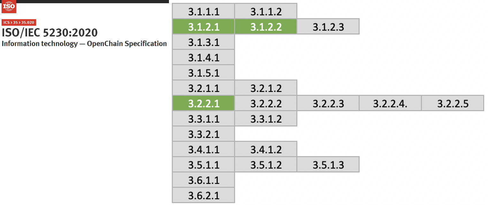

## Identify the roles and the corresponding responsibilities

In order to establish a company's open source governance, it is necessary to appoint a person in charge of it. It may be called an open source program manager, an open source compliance officer, etc., and this person in charge is responsible for the overall open source compliance of the company. 

A person with the following competencies is suitable for this role.

- Understanding and development experience in the open source ecosystem
- Broad understanding of the company's business
- Passion and communication skills to spread the effective use of open source to members of the company

An open source program manager should be guaranteed to be able to perform the role as full-time as possible.

Global ICT companies are working hard to hire such excellent open source program managers, and you can check various job postings at the following site. : [https://github.com/todogroup/job-descriptions](https://github.com/todogroup/job-descriptions)

To establish open source governance, you need to define the needs of each role and determine what responsibilities should be assigned. For small businesses, it is possible for an open source program manager to perform all the roles alone. Depending on the size of the enterprise, an infrastructure person who operates open source tools may be required, and the role of a legal person may be required to provide professional legal advice.

In general, the following roles are required to establish a corporate open source governance system.

- Legal
- Infrastructure
- Development culture
- Security



<i>Individuals and teams involved in ensuring open source compliance : https://www.linuxfoundation.org/wp-content/uploads/OpenSourceComplianceHandbook_2018_2ndEdition_DigitalEdition.pdf</i>



If you do the above, you can prepare the following evidence required by ISO/IEC 5230.

{}

* <b>3.1.2.1 : A documented list of roles with corresponding responsibilities for the different participants in the program.</b>

{}

{}

* <b>1.c : A documented list of roles with corresponding responsibilities for the different participants in the program.</b>

{}

## Define competencies

Once you have defined each role and its responsibilities, you need to figure out what competencies the person performing that role should have. This is because, through this, it is necessary to evaluate whether the person in charge of each role has the capability to perform the role, and if there is not enough, the company must provide the necessary training to him.

If you do this, you can prepare the following evidence required by ISO/IEC 5230.

{}

* <b>3.1.2.2 A document that identifies the competencies for each role.</b>

{}

{}

* <b>1.d : Have you identified and documented the competencies required for each role?</b>

{}

The table below is a sample representative that specifies the roles of open source-related organizations and people in charge, and the required competencies. You can refer to this and form an open source organization and document it.

이 내용은 다음 페이지에서도 확인할 수 있다. : [https://haksungjang.github.io/docs/openchain/#appendix-1-담당자-현황](https://haksungjang.github.io/docs/openchain/#appendix-1-%EB%8B%B4%EB%8B%B9%EC%9E%90-%ED%98%84%ED%99%A9)

## 담당자 지정

오픈소스 프로그램 매니저는 관련부서와 협의하여 각 역할을 위한 담당자를 지정하고 이를 문서화한다.  물론 이를 위해서는 CEO 등 최고 의사결정권자에게 오픈소스 컴플라언스 체계 구축을 위한 목표와 방향을 보고하여 필요한 지원을 받아야 할 것이다. 

오픈소스 관련 조직과 담당자는 반드시 풀타임으로 오픈소스 업무에 참여할 필요는 없다. OSRB (Open Source Review Board) 형태의 Virtual한 조직을 구성하여 필요한 역할을 수행하면 된다. 

SK텔레콤은 OSRB를 구성하여 기업 내 오픈소스 정책과 프로세스를 만들고, 이슈 발생 시 대응 방안을 마련하고 있다. 



<i>https://sktelecom.github.io/about/osrb/</i>



이와 같이 수행한다면 ISO/IEC 5230에서 요구하는 다음 입증 자료를 준비할 수 있다.

{}

* <b>3.2.2.1 프로그램 내 각 역할을 담당하는 인원, 그룹 또는 직무의 이름을 기재한 문서</b>

{}

| 자체 인증 2.d  | 프로그램 내 각 역할을 담당하는 인원, 그룹 또는 직무의 이름을 기재한 문서가 있습니까? |
|---|:---|
|  | Have you documented the persons, group or function supporting the Program role(s) identified? |

이렇게 조직을 구성하면 ISO/IEC 5230의 요구 사항 중 아래와 같이 세가지 요구사항을 충족하게 된다. 

