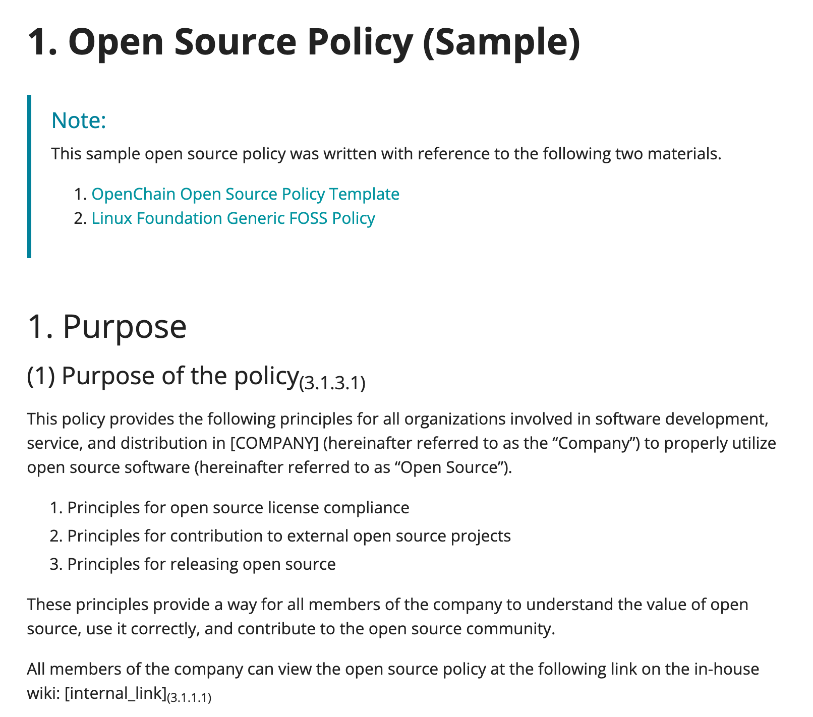
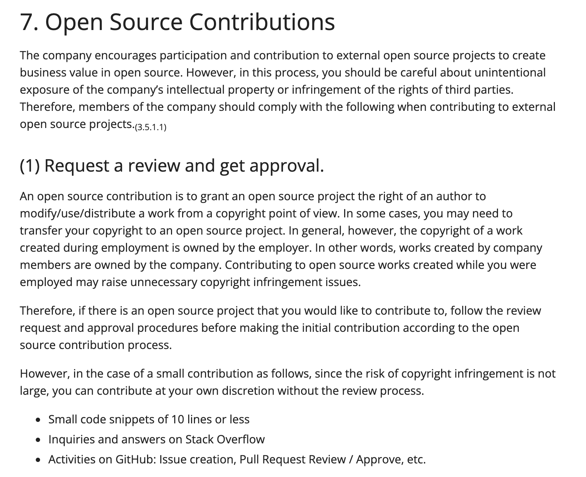
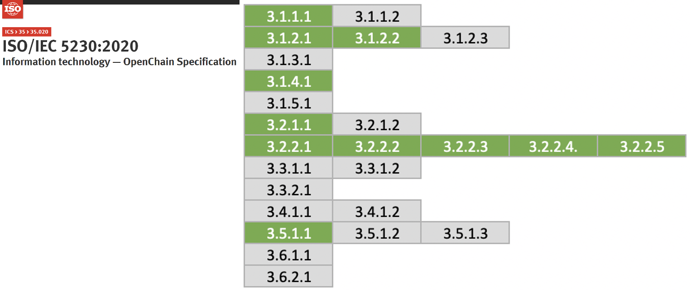

## Document open source policy

A company should establish, document, and disseminate an open source policy composed of principles for a company to properly use open source in software development, service, and distribution.

Common open source policies include:

- Principles for creating and distributing software products and services using open source
- Principles for contributing to the external open source community
- Principles for releasing open source

The following pages provide sample open source policy documents that meet the requirements of ISO/IEC 5230. : “[부록 1. 샘플 오픈소스 정책](https://haksungjang.github.io/docs/openchain/#%EB%B6%80%EB%A1%9D-1-%EC%83%98%ED%94%8C-%EC%98%A4%ED%94%88%EC%86%8C%EC%8A%A4-%EC%A0%95%EC%B1%85)” 



Each company can use this sample policy by modifying it according to the company's business strategy and environment.

If you do this, you can prepare the following evidence required by ISO/IEC 5230.

{}

* <b>3.1.1.1 A documented open source policy.</b>

{}

{}

* <b>1.a : Do you have a documented policy that governs open source license compliance of the Supplied Software distribution (e.g., via training, internal wiki, or other practical communication method)?</b>

{}


## Define scope

An open source program does not necessarily apply to the entire organization. The scope can be specified differently depending on the characteristics of each organization and product within the company. Different open source programs can be applied to different organizations and products. Similarly, organizations that do not distribute software at all may be excluded from the scope of the open source program. A company can clearly define the scope and limits of the application of an open source program in consideration of the characteristics of the organization and product, and specify it in the open source policy.

As a company's organization and its products and services change with the business environment, it may be necessary to determine or modify the scope of the program. A company should prepare a procedure to manage it as in the following example.

1. When starting a new project, the open source program manager determines whether the project falls within the scope of the program's coverage.
2. If it is determined that the project is not included, a proposal to include the project in the scope of application is submitted to the OSRB.
3. If accepted by OSRB, the scope of the open source program will be modified accordingly.
4. Other than that, if the open source program manager determines that it is necessary to review the program scope, it may start the program scope review according to the same process.

The following examples can be included in the open source policy.

```
2. Scope
This policy applies to the following three parts:

1. Applies to [all products provided or distributed by the company externally]. 
   However, the open source only for internal use is not included in the scope of 
   this policy.
2. Applied when contributing to external open source projects.
3. Applied when releasing internal code as open source.

The scope can be changed according to the business environment of the company, 
and the procedure for this is as follows.

1. If the open source program manager determines that it is necessary to change 
   the scope of policy according to changes in the company's business environment, 
   such as a new business or reorganization, submit a proposal for this to the OSRB.
2. OSRB approves proposals for scope changes at the appropriate level.
3. OSRB modifies the open source policy to change the scope of the policy.
```

If you do this, you can prepare the following evidence required by ISO/IEC 5230.

{}

* <b>3.1.4.1 A written statement that clearly defines the scope and limits of the program.</b>

{}


{}

* <b>1.g : Do you have a process for determining the scope of your Program?  
* 1.h : Do you have a written statement that clearly defines the scope and limits of the Program?</b>

{}

## Respond to external inquiries

For products or services developed using open source, customers and open source copyright holders may raise open source related inquiries, requests and claims to companies. The main contents of external inquiries and requests are as follows.

- Ask if open source is used for certain products and services
- Request to provide source code under the GPL, LGPL license mentioned in the Written Offer
- A request for a description of the open source found in the product and disclosure of the source code, although not specified in the open source notice
- Request to provide missing files and build methods in the source code published under GPL, LGPL, etc.
- Request for copyright notice

You should designate a contact person to handle these external inquiries. This is usually done by an open source program manager.

In addition, even if an external open source developer wants to contact a company representative to discuss an issue related to a specific company's open source compliance, they cannot find a way to contact them and eventually file a legal claim. In order to prevent this, you must always disclose publicly how to contact the company from outside to make inquiries and requests related to open source.

To disclose your contact information so that external open source related inquiries can be received, (1) publicly disclosed the email address of the company's open source program manager, or (2) the Linux Foundation's [Open Compliance Directory] (https://compliance.linuxfoundation. org/references/open-compliance-directory/).

It is also a good idea to disclose the representative email address of the company open source program office in the open source notice that accompanies the product and service.


These contents can be included in the open source policy as in the example below.

```
Respond to external inquiries

(1) Responsibility for responding to external inquiries
The open source program manager is responsible for responding 
to inquiries and requests for open source compliance from 
outside.<sub>(3.2.1.2)</sub>

* The open source program manager may assign all or part of 
  the handling of inquiries to appropriate personnel within the 
  company. If necessary, contact the legal team to deal with it.
* Anyone who receives an inquiry about open source compliance 
  from outside will notify the open source program manager so 
  that a prompt response can be made.

(2) Disclosure of contact information
The open source program manager publicly provides the contact 
information of the person in charge so that external inquiries 
and requests related to open source can be submitted to the 
company.<sub>(3.2.1.1)</sub>

* Include the email address of the person in charge in the open 
  source notice.
* Register your contact in the Linux Foundation's Open Compliance 
  Directory.

(3) External Inquiry Response Procedure
If you respond quickly and accurately to open source compliance 
inquiries from outside, you can significantly reduce the risk of 
going to a lawsuit. To this end, in order to respond to external 
open source compliance inquiries, you should follow the external 
inquiry response process defined in the company's open source 
compliance process.<sub>(3.2.1.2)</sub>
```

If you do this, you can prepare the following evidence required by ISO/IEC 5230.

{}

* <b>3.2.1.1 Publicly visible method that allows any third party to make an open source license compliance inquiry (e.g., via a published contact email address, or the Linux Foundation's Open Compliance Directory).</b>

{}


{}

* <b>2.a : Do you have a documented procedure that assigns responsibility for receiving and responding to open source compliance inquiries?</b>
* <b>2.b : Is the Open Source Liaison function publicly identified (e.g. via an email address and/or the Linux Foundation's Open Compliance Directory)?</b>

{}


## Provide staff and funding

You must provide sufficient resources for open source programs to function properly. Staff for each role in the program should be appropriately assigned, and sufficient funding and working hours should be ensured. If there is a shortage, there should be a procedure to make up for it. The following example sentences can be added to the open source policy document.

```
4. Roles, Responsibilities and Competencies

The head of the organization responsible for each role designates 
a person in charge within the organization, and allocates appropriate 
time and budget for the person in charge to fulfill the role.
 * The person in charge of each role should raise an issue with 
   the open source program manager if appropriate support is not 
   provided while performing his/her role.
 * The open source program manager discusses problem solving with 
   the head of the organization. If not properly resolved, the open 
   source program manager may request the OSRB to resolve the issue.
 * OSRB shares the problem with the head of the higher level organization 
   and asks for a solution.
```

If you do this, you can prepare the following evidence required by ISO/IEC 5230.

{}

* <b>3.2.2.2 The identified program roles have been properly staffed and adequate funding provided.</b>

{}


{}

* <b>2.e : Have the identified Program roles been properly staffed and has adequate funding provided?</b>

{}


## Identify Legal Expertise

You should provide a way for the person in charge of each role to seek legal advice when a legal review is needed to resolve an open source compliance issue.

The legal team within the company provides legal advice first, and if the issue is complex, you can seek advice from an external law firm with an open source lawyer. An example of an open source policy for this is as follows.

```
4. Roles, Responsibilities and Competencies

(2) Open Source Program Manager
* Provides a way to request legal advice on open source.
```

If you do this, you can prepare the following evidence required by ISO/IEC 5230.

{}

* <b>3.2.2.3 Identification of legal expertise available to address open source license compliance matters which could be internal or external.</b>

{}


{}

* <b>2.f : Is legal expertise pertaining to internal and external open source compliance identified?</b>

{}

For reference, the OpenChain project provides a list of global law firms that provide open source-related advice through partner programs. : [https://www.openchainproject.org/partners](https://www.openchainproject.org/partners)

## Assigns internal responsibilities

There should be a process for assigning internal responsibilities for open source compliance. This is the role of an open source program manager. The open source program manager must identify the issues and assign them appropriately to the person in charge of each role. To do this, you should include this in your open source policy document as follows:

```
4. Roles, Responsibilities and Competencies

(2) Open Source Program Manager

The open source program manager is responsible for the overall 
responsibility for the company's open source programs. 
To ensure open source compliance of products and services using 
open source, open source program manager is responsible for:

- Define the roles required for open source compliance, and 
  designate a responsible person and group in charge of each 
  role. Consult with OSRB if necessary.

```
If you do this, you can prepare the following evidence required by ISO/IEC 5230.

{}

* <b>3.2.2.4 A documented procedure that assigns internal responsibilities for open source compliance.</b>

{}


{}

* <b>2.g : Do you have a documented procedure assigning internal responsibilities for Open Source compliance?</b>

{}


## Handle non-compliant cases

Businesses should document procedures for promptly reviewing and responding to non-compliance cases. Refer to the following examples and include them in your open source policy.

```
6. Use open source

(5) Compliance Issue Remediation Procedure

Should a non-compliance issue be raised, the Open Source Program Manager 
responds promptly by performing the following procedures.

1. Acknowledge receipt of the query and state a reasonable time for resolution;
2. Determine whether the query discloses a genuine issue or not 
   (and if not, respond to the querier accordingly);
3. If the issue is genuine, apply to prioritise, and determine the appropriate response.
4. Carry out response and, where necessary, improve open source compliance processes.
5. Document the above using Jira Tracker.

```

If you do this, you can prepare the following evidence required by ISO/IEC 5230.

{}

* <b>3.2.2.5 A documented procedure for handling the review and remediation of non-compliant cases.</b>

{}


{}

* <b>2.7 : Do you have a documented procedure for handling review and remediation of non-compliant cases?</b>

{}


## Open Source Contribution Policy

Global IT companies value not only the use of open source to make products and services, but also the strategic value that can be created by contributing to open source projects. However, if you contribute without a sufficient understanding and strategy for the open source project ecosystem and how the community operates, unexpected legal risks may arise and the company's reputation may be damaged. Therefore, it is important for companies to create strategies and policies for participation and contribution to open source projects.

The following pages provide sample open source contribution policy documents. : [7. 오픈소스 기여](https://haksungjang.github.io/docs/openchain/#7-%EC%98%A4%ED%94%88%EC%86%8C%EC%8A%A4-%EA%B8%B0%EC%97%AC)




If you do this, you can prepare the following evidence required by ISO/IEC 5230.

{}

* <b>3.5.1.1 A documented open source contribution policy</b>

{}


{}

* <b>5.a : Do you have a policy that governs contributions to open source projects on behalf of the organization?</b>

{}


If you even establish an open source policy that includes the above, the following green items among the ISO/IEC 5230 requirements will be satisfied.

