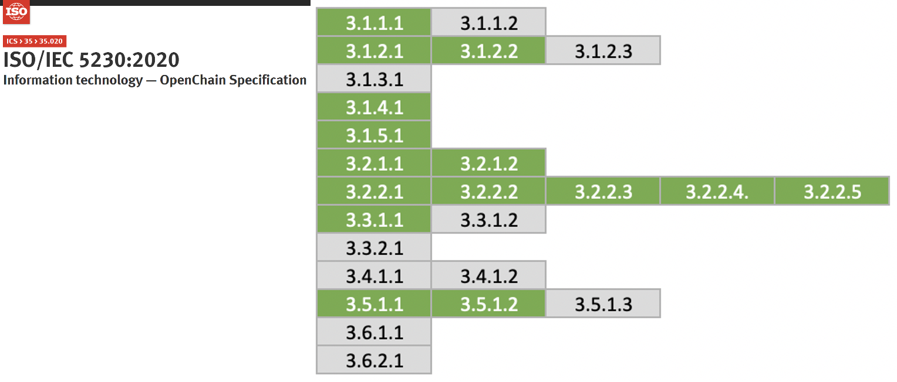

A process is an actionable procedure that enables a company to comply with open source policies during software development/distribution. Simply put, the open source compliance process is an activity to comply with the obligations required by each license for the open source used while developing and distributing software, and it generates artifacts such as open source notices and source code to be disclosed.


<center><i>Simplified view of the compliance end-to-end process : https://www.linuxfoundation.org/wp-content/uploads/OpenSourceComplianceHandbook_2018_2ndEdition_DigitalEdition.pdf</i></center>


If the open source compliance process is subdivided and schematized, it is shown in the figure below.


<center><i>End-to-end compliance process : https://www.linuxfoundation.org/wp-content/uploads/OpenSourceComplianceHandbook_2018_2ndEdition_DigitalEdition.pdf</i></center>


The image below is a sample open source compliance process that companies can commonly use.


You can refer to the next page for more details on this. : [2. Open Source Compliance Process (Sample)](https://openchain-project.github.io/OpenChain-KWG/en/guide/governance_iso5230/appendix/2-process/)

This chapter describes the elements that an open source compliance process should include.

## Identify and audit

In order to determine whether an open source can be used, it is necessary to first identify the license of the open source to be used and check the obligations required by the license. You should review and record whether you used open source, what the licenses are, and what obligations each license gives you. An example of the procedure for this is as follows.

1. The development team makes a preliminary assessment of the license based on the open source policy.
2. In case of any doubt, contact the open source program manager, and if necessary, the open source program manager refers the question to external legal experts.
3. The outcome of any determination, and associated rationale (whether internal or external) is recorded. 

The [Identification of Open Source](https://openchain-project.github.io/OpenChain-KWG/en/guide/governance_iso5230/appendix/2-process/#1-identification-of-open-source), [Auditing Source Code](https://openchain-project.github.io/OpenChain-KWG/en/guide/governance_iso5230/appendix/2-process/#2-auditing-source-code), [Resolving Issues](https://openchain-project.github.io/OpenChain-KWG/en/guide/governance_iso5230/appendix/2-process/#3-resolving-issues), [Reviews](https://openchain-project.github.io/OpenChain-KWG/en/guide/governance_iso5230/appendix/2-process/#4-reviews), and [Approval](https://openchain-project.github.io/OpenChain-KWG/en/guide/governance_iso5230/appendix/2-process/#5-approval) steps are an example of a documented process for reviewing and documenting the obligations, restrictions and rights imposed by each identified license.


If you prepare such a procedure, you can prepare the following evidence required by ISO/IEC 5230.

{}

* <b>3.1.5.1 A documented procedure to review and document the obligations, restrictions and rights granted by each identified license.</b>

{}

{}

* <b>1.i : Do you have a process for reviewing open source license obligations, restrictions and rights?</b>

{}

In the open source identification and audit phase, you use a code scan tool to inspect the source code. For details on this, refer to "[6. Tool](../6-tool/)".

## Create Bill of Materials
The most basic of open source compliance activities is to determine open source included in the supplied software. It is necessary to establish a process for creating and managing a Bill of Materials (BOM) containing the information by identifying the open source included in the supplied software and identified license. This is because it is necessary to know which open source is included in each version of the supplied software so that when distributing the software, you can comply with the obligations required by the identified license of each open source.

All open source must be reviewed and approved prior to integration into the supplied software. It should be reviewed in advance whether it can meet license requirements as well as the function and quality of open source. For this, a review request → review → approval process is required.

[Appendix 2. Open Source Compliance Process (Sample)](https://openchain-project.github.io/OpenChain-KWG/en/guide/governance_iso5230/appendix/2-process/) explains all the processes for open source compliance. BOM is created and managed through the process from [1. Identification of Open Source](https://openchain-project.github.io/OpenChain-KWG/en/guide/governance_iso5230/appendix/2-process/#1-identification-of-open-source) to [6. Registration](https://openchain-project.github.io/OpenChain-KWG/en/guide/governance_iso5230/appendix/2-process/#6-registration).

The tool for managing the open source BOM is described in detail in "[6. Tool](../6-tool/)".

In addition, all processes and results of such an open source compliance process should be documented. Rather than using e-mail, it is better to use an issue tracking system such as [Jira] (https://www.atlassian.com/software/jira) and [Bugzilla] (https://www.bugzilla.org/) to effectively document this process.

If you prepare such a procedure, you can prepare the following evidence required by ISO/IEC 5230.

{}

* <b>3.3.1.1 A documented procedure for identifying, tracking, reviewing, approving, and archiving information about the collection of open source components from which the supplied software is comprised.</b>

{}


{}

* <b>3.a : Do you have a documented procedure for identifying, tracking and archiving information about the collection of open source components from which a Supplied Software release is comprised?</b>

{}


## Create Artifacts

As mentioned above, the most basic of open source compliance activities is to determine the open source included in the supplied software. This is to properly meet the open source license requirements, which are the core of open source compliance. In other words, a process for generating a set of compliance artifacts for open source included in the supplied software should be established.

Compliance artifacts are divided into two main categories.

1. Open Source Notice: A document to provide full open source license and copyright information

    

    * The method of automatically generating an open source notice corresponding to an open source BOM is further described in "[6. Tool](../6-tool/)".

2. Source code package to be disclosed: A package that collects source codes to be disclosed to fulfill open source license obligations that require source code disclosure such as GPL, LGPL, etc.

Compliance artifacts must be provided when distributing supplied software.

In “[Appendix 2. Open Source Compliance Process (Sample)](https://openchain-project.github.io/OpenChain-KWG/en/guide/governance_iso5230/appendix/2-process/)”, the compliance artifacts are created and distributed through [7. Notices](https://openchain-project.github.io/OpenChain-KWG/en/guide/governance_iso5230/appendix/2-process/#7-notices) to [9. Distribution](https://openchain-project.github.io/OpenChain-KWG/en/guide/governance_iso5230/appendix/2-process/#9-distribution).


When distributing supplied software, if it is difficult to enclose the source code package to be disclosed, it can be replaced by providing a written offer to provide the source code for at least 3 years. Typically, a written offer is provided through the product's user manual, examples of which are as follows.

```
The software included in this product contains copyrighted software 
that is licensed under the GPL. A copy of that license is included 
in this document on page X. You may obtain the complete Corresponding 
Source code from us for a period of three years after our last shipment 
of this product, which will be no earlier than 2011-08- 01, by sending 
a money order or check for $5 to:

GPL Compliance Division
Our Company
Any Town, US 99999

Please write“source for product Y” in the memo line of your payment.
You may also find a copy of the source at http://www.example.com/sources/Y/.
This offer is valid to anyone in receipt of this information.

<SFLC Guide to GPL Compliance>
```

Therefore, a process must be established to store compliance artifacts for at least 3 years. To this end, a company needs to build an open source website, which is described in detail in "[6. Tool](../6-tool/)".

If you prepare such a procedure, you can prepare the following evidence required by ISO/IEC 5230.

{}

* <b>3.4.1.1 A documented procedure that describes the process under which the compliance artifacts are prepared and distributed with the supplied software as required by the identified licenses.</b>

{}


{}

* <b>4.a : Do you have a documented procedure that describes a process that ensures the Compliance Artifacts are distributed with Supplied Software as required by the Identified Licenses?</b>

{}


## Respond to third party inquiries

It is important for a company to respond to third party inquiries as quickly and accurately as possible in order to avoid legal litigation. For this, a company must have a process that can respond quickly and effectively to third party open source inquiries.

The figure below shows the process a company must have to respond to third party inquiries.


Details can be found in “[Appendix 2. Open Source Compliance Process (Sample) 2. External Inquiry Response Process](https://openchain-project.github.io/OpenChain-KWG/en/guide/governance_iso5230/appendix/2-process/#2-external-inquiry-response-process)”.

If you prepare such a procedure, you can prepare the following evidence required by ISO/IEC 5230.

{}

* <b>3.2.1.2 An internal documented procedure for responding to third party open source license compliance inquiries.</b>

{}

{}

* <b>2.c : Do you have a documented procedure that assigns responsibility for receiving and responding to open source compliance inquiries? </b>

{}


## Open Source Contribution Process

If you have a policy to allow contributions to external open source projects, there should be a documented procedure to manage how in-house developers can contribute to external projects.

The [Open Source Contribution Procedure] (https://sktelecom.github.io/guide/contribute/process/) released by SK telecom is a good example.


[https://sktelecom.github.io/guide/contribute/process/](https://sktelecom.github.io/guide/contribute/process/)


If you prepare such a procedure, you can prepare the following evidence required by ISO/IEC 5230.

{}

* <b>3.5.1.2 A documented procedure that governs open source contributions</b>

{}


{}

* <b>5.b : Do you have a documented procedure that governs Open Source contributions?</b>

{}


If you build the process up to this point, you will comply with the ISO/IEC 5230 requirements as follows.



