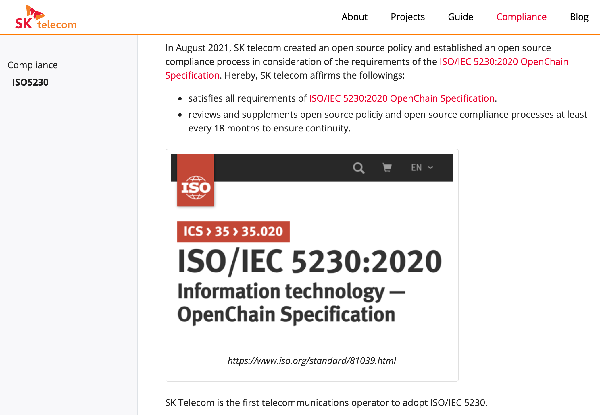
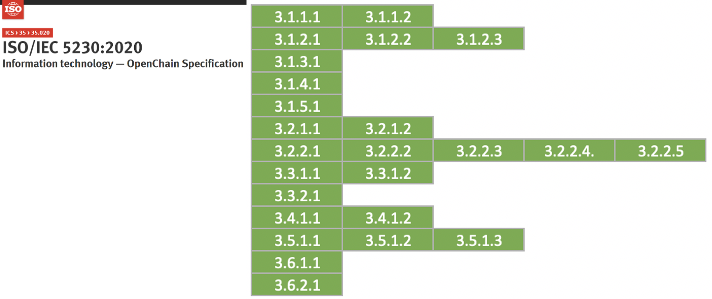

If you build an open source program (open source policy / process / tool / organization) that complies with all requirements except Article 6 of the ISO/IEC 5230 standard, you can write and publish a document specifying the following two.

1. A document affirming the program specified in requirement §3.1.4 satisfies all the requirements of this specification.
2. A document affirming the program meets all the requirements of this version of the specification (version 2.1), within the past 18 months of obtaining conformance validation

You may include the above document in the open source policy, or you may publish it through an externally public website.

As shown in the image below, you can refer to the content that SK Telecom posted on the open source portal site.

[https://sktelecom.github.io/en/compliance/iso5230/](https://sktelecom.github.io/en/compliance/iso5230/)
 

If you document that you meet all the requirements of ISO/IEC 5230 in this way, you can prepare the following evidence required by ISO/IEC 5230.

{}

* <b>3.6.1.1 A document affirming the program specified in requirement §3.1.4 satisfies all the requirements of this specification.</b>
* <b>3.6.2.1 A document affirming the program meets all the requirements of this version of the specification (version 2.1), within the past 18 months of obtaining conformance validation</b>
{}

{}

* <b>6.a : Do you have documentation confirming that your Program meets all the requirements of this specification?</b>
* <b>6.b : Do you have documentation confirming that your Program conformance was reviewed within the last 18 months?</b>
{}

If you've made it this far, your company will finally meet all the requirements of ISO/IEC 5230.

