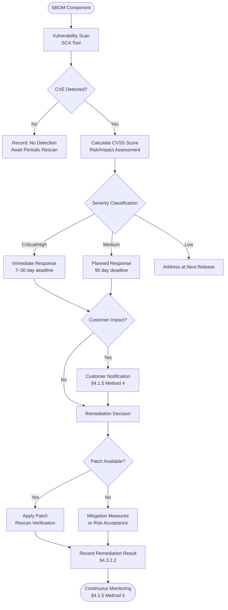

{}
§4.3.2.1·§4.3.2.2 are ISO 18974 exclusive (★) items requiring **Documented Evidence**. Not merely a "vulnerability response procedure document," but **actual execution records for each CVE** (scan results, CVSS scores, remediation history, VEX issuance, customer notification history) must be retained. For a detailed explanation of the strength difference, see [§4.1.5 Standard Practices — Documented Evidence Notice](../../1-program-foundation/5-standard-practice/#evidence-strength-for-iso-18974-exclusive--items--documented-evidence).
{}

## 1. Clause Overview

§4.3.2 is the core clause of ISO/IEC 18974 and is a new clause exclusive to 18974 that does not exist in ISO/IEC 5230. It requires establishing a procedure covering the entire process — **vulnerability detection → risk assessment → remediation decision → customer consent (where applicable) → remediation → post-deployment newly disclosed vulnerability response → continuous monitoring** — for each open source component in the SBOM, and maintaining implementation records. If §4.1.5 requires the existence of vulnerability handling methods, §4.3.2 requires that those methods have actually been applied to each component with records retained.

## 2. What to Do

- Detect the existence of known vulnerabilities in each open source component in the SBOM.
- Assign a risk/impact score (CVSS) to each detected vulnerability.
- Determine and document the necessary remediation or mitigation steps for each vulnerability.
- Obtain customer consent above a pre-determined threshold, where applicable.
- Perform appropriate actions based on the risk/impact score and record them.
- Perform appropriate actions for newly disclosed vulnerabilities in already-deployed software.
- Monitor and respond to vulnerability disclosures for the supplied software after its release.
- Maintain detection and remediation results per vulnerability as component records.

## 3. Requirements and Verification Materials

| Clause | Requirement | Verification Material(s) |
|-----------|--------------|---------|
| §4.3.2 | A process shall exist to apply security assurance activities to each open source software component in the SBOM: known vulnerability detection / risk/impact score assignment / determination and documentation of remediation or mitigation steps / obtaining customer consent where applicable / performing actions based on risk score / addressing newly disclosed vulnerabilities / post-release monitoring and vulnerability disclosure response | **4.3.2.1** A documented procedure for handling detection and resolution of known vulnerabilities for the open source software components of the supplied software<br>**4.3.2.2** For each open source software component, a record is maintained of the identified known vulnerabilities and action taken (including a determination that no action was required) |

> **§4.3.2 Security Assurance**
> There shall exist a process to apply security assurance activities to each
> open source software component that is to be included in the bill of
> materials (SBOM):
> - Applying a method to detect the existence of known vulnerabilities;
> - Assign a risk/impact score to each identified known vulnerability;
> - Determine and document the necessary remediation or mitigation steps for
>   each detected and scored known vulnerability;
> - Obtain customer approval above a pre-determined threshold, where
>   applicable;
> - Perform appropriate action based on risk/impact score;
> - Perform appropriate action for newly disclosed known vulnerabilities in
>   previously released supplied software;
> - Ability to monitor and respond to vulnerability disclosures for the
>   supplied software after its release.
>
> **Verification Material(s):**
> 4.3.2.1 A documented procedure for handling detection and resolution of
> known vulnerabilities for the open source software components of the
> supplied software.
> 4.3.2.2 For each open source software component, a record is maintained of
> the identified known vulnerabilities and action taken (including a
> determination that no action was required).

## 4. How to Comply and Samples per Verification Material

### 4.3.2.1 Vulnerability Detection and Resolution Procedure

**How to Comply**

A documented procedure covering the entire process from vulnerability detection to resolution for each open source component in the SBOM is Verification Material 4.3.2.1. This procedure is a concrete operational flow that integrates the individual methods defined in §4.1.5.

The flowchart below illustrates the entire flow from CVE detection to remediation completion.



**Detailed Steps**

The following is a sample describing each step of the flowchart in procedure document form.

```
[Vulnerability Detection and Resolution Procedure]

Step 1 — Vulnerability Detection
- At CI/CD pipeline build, SCA tools (Dependency-Track, OSV-SCALIBR, etc.)
  automatically scan for vulnerabilities based on the SBOM.
- Reference multiple vulnerability DBs in parallel: NVD, OSV.dev, GitHub Security Advisories (GHSA),
  and KISA KNVD (Korea Internet & Security Agency) — to compensate for omissions/delays in any single source.
- Even after deployment, automatically cross-reference against archived SBOMs
  when new CVEs are published.

Step 2 — Risk/Impact Score Assessment
- Calculate the CVSS v3.1 or v4.0 base score for each detected CVE.
  (When both versions are assigned, use the higher score as the basis for action.)
- Adjust the Environmental Score by considering the actual usage context of the
  company's product (network exposure, privilege requirements, etc.).
- **Use EPSS** (Exploit Prediction Scoring System) scores and **CISA KEV** (Known Exploited
  Vulnerabilities) catalog entries as supplementary indicators — even at the same CVSS score,
  CVEs listed in KEV are classified as priority remediation targets.
- Severity classification: Critical (9.0+) / High (7.0-8.9) / Medium (4.0-6.9) / Low (0.1-3.9) — same for v3.1·v4.0

Step 3 — Remediation Decision and Documentation
- Determine the remediation method based on severity and customer impact scope:
  · Patch application: Upgrade to a newer version or apply a patch
  · Mitigation: Network isolation, disabling functionality, etc. when no patch is available
  · Risk acceptance: When the actual exploitability is low and mitigation is also unnecessary
    (joint approval from security team + open source PM required)
- Record the basis for the remediation decision in the vulnerability tracking system.

Step 4 — Customer Consent (where applicable)
- For Critical/High vulnerabilities affecting customer-distributed products:
  · Proactively notify the customer's security contact of vulnerability information
    and the response plan.
  · Share the patch deployment schedule and mitigation methods.
- **VEX issuance recommended**: Notify supply chain partners and customers of impact status using a
  standard format. Use CSAF 2.0 (OASIS) or CycloneDX VEX, with four status values:
  · `not_affected` — CVE exists but no impact in usage context (justification required)
  · `affected` — Impact confirmed (remediation in progress)
  · `fixed` — Patch applied
  · `under_investigation` — Investigating impact
  In particular, `not_affected` has high value in preventing unnecessary customer patching, so include
  a justification (e.g., `vulnerable_code_not_in_execute_path`).

Step 5 — Remediation
- Perform the determined remediation within the remediation deadline.
- Run a rescan after patch application to confirm the vulnerability is eliminated.
- Update the remediation completion result in the §4.3.2.2 record.
- After remediation, update the VEX status to `fixed` and reissue.

Step 6 — Continuous Monitoring
- Continuously monitor the vulnerability status of deployed software using tools
  such as Dependency-Track.
- When new CVEs are published, automatically or immediately re-execute steps 1–3.
```

---

### 4.3.2.2 Vulnerability and Action Records

**How to Comply**

For each open source component in the SBOM, records of identified vulnerabilities and actions taken (including a determination that no action was required) must be maintained. These records are Verification Material 4.3.2.2. The phrase "including a determination that no action was required" is important — components where no vulnerability was detected must also record the fact that a scan was performed and the detection result.

Records can be managed using various tools such as Dependency-Track, a Jira security issue tracker, or spreadsheets, and must be maintained in a form that can be produced immediately during an audit.

**Considerations**

- **Record per component**: Maintain individual records for each component in the SBOM.
- **Record "no detection" as well**: Record the scan date and result even for components where no vulnerability was detected.
- **Track remediation history**: Manage the history of vulnerability occurrence, remediation, and rescan for the same component in chronological order.
- **Retention period**: Retain for the support period of the relevant software plus a minimum of 3 years.
- **Three-axis priority model (CVSS · EPSS · KEV)**: Do not prioritize by CVSS alone — evaluate using
  EPSS (exploit prediction) and KEV (actually exploited) on three axes. Even at the same CVSS 7.0,
  if KEV-listed and EPSS ≥ 0.9, treat at the same priority as Critical.
- **Reachability Analysis recommended**: Do not judge impact by mere dependency presence — analyze whether
  the vulnerable function is actually in the call path (reachability) to reduce false positives by 90%+.
  Tools: Snyk Reachability, Endor Labs, SCA reachability analysis modules.
- **Mandatory regression testing**: In addition to rescan after patch application, automate deny-list
  checks at the CI stage so that the same CVE does not re-enter when a new dependency with the same pattern is added.
- **VEX `not_affected` justification**: When determined as unaffected, record a justification (e.g.,
  `vulnerable_code_not_in_execute_path`, `inline_mitigations_already_exist`) to ensure audit traceability.

**Sample**

The following is a sample per-component vulnerability and action record.

```
| Software | Version | Component | Component Version | CVE ID | CWE | CVSS v3.1/v4.0 | EPSS | KEV | Severity | Reachable? | Action | VEX Status | Action Date | Assignee | Notes |
|----------|---------|-----------|-------------------|--------|-----|---------------|------|-----|----------|-----------|--------|------------|-------------|----------|-------|
| MyProduct | v1.2.0 | openssl | 3.0.7 | CVE-2023-0286 | CWE-843 | 7.4 / 7.5 | 0.42 | No | High | Yes | Upgraded to 3.0.8 | fixed | 2023-02-10 | Chul-su Kim | Rescan confirmed |
| MyProduct | v1.2.0 | zlib | 1.2.11 | CVE-2022-37434 | CWE-787 | 9.8 / 9.8 | 0.78 | Yes | Critical | Yes | Upgraded to 1.2.13 | fixed | 2022-10-15 | Chul-su Kim | KEV-listed, prioritized; customer notified |
| MyProduct | v1.2.0 | libpng | 1.6.37 | None | - | - | - | - | - | - | No action required | not_affected | 2023-03-01 | Chul-su Kim | Periodic scan result |
| MyProduct | v1.2.0 | log4j | 2.14.0 | CVE-2021-44228 | CWE-502 | 10.0 / 10.0 | 0.97 | Yes | Critical | **No** | No impact | not_affected (justification: vulnerable_code_not_in_execute_path) | 2021-12-12 | Chul-su Kim | Reachability analysis — outside call path |
| FirmwareX | v2.3.0 | busybox | 1.35.0 | CVE-2022-28391 | CWE-78 | 9.8 / - | 0.31 | No | Critical | Yes | Risk acceptance (network isolation mitigation) | affected | 2022-11-20 | Chul-su Kim | No patch available, PM approval obtained |
```

## 5. References

- No corresponding ISO/IEC 5230 clause (new clause exclusive to 18974)
- Related guide: [Enterprise Open Source Management Guide — 3. Process](../../../opensource_for_enterprise/3-process/)
- Related tools: [Dependency-Track](../../../tools/7-dependency-track/), [OSV-SCALIBR](../../../tools/4-osvscalibr/)
- Related clauses: [§4.1.5 Standard Practice Implementation](../../../iso18974_guide/1-program-foundation/5-standard-practice/), [§4.3.1 SBOM](../1-sbom/)
