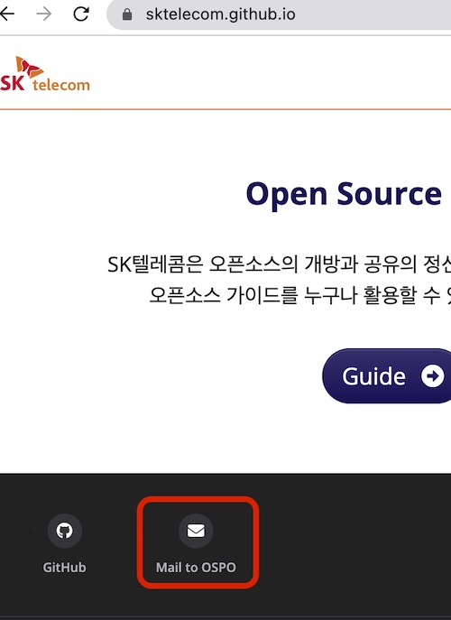
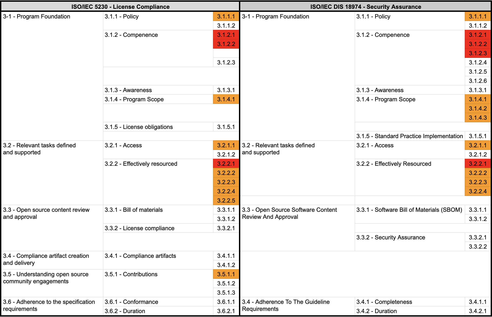

## 1. Open Source Policy Documentation

Enterprises should establish and document an open source policy, which consists of principles for organizations involved in software development, service, and distribution to properly utilize open source. This policy should be disseminated within the organization.

For this, the ISO standard commonly requires the following documented open source (security assurance) policies:

{}

* 3.1.1.1 - A documented open source policy.

{}


{}

* 3.1.1.1: A documented Open Source Software Security Assurance policy

{}

A typical open source policy includes the following. Enterprises should create and document an open source policy that includes these principles:

- Principles to minimize license and security vulnerability risks when distributing software products and services
- Principles for contributing to external open source communities
- Principles for releasing the company's software as open source


## 2. Contents to be Covered in Open Source Policy

Let's take a closer look at what an open source policy should include.

### Open Source Risk Response

When developing products/services using open source, the policy should include the following principles to minimize license and security vulnerability risks:

1. Identification of open source and review of license obligations
2. Design considering open source licenses
3. Creation of open source compliance deliverables
4. Creation of SBOM (Software Bill of Materials)
5. Response to open source license compliance issues
6. Response to open source security vulnerabilities

You can refer to the principles documented in [6. Open Source Use](../../templates/1-policy/#6-open-source-use) of [Appendix 1] Open Source Policy template.

```

1. Open Source Use

When developing and distributing products and services using open source, you must comply with the obligations required by each open source license. This activity is called open source compliance.

For proper open source compliance activities, software development/distribution organizations comply with the following matters and record all processes in the Jira Tracker for preservation.

(1) Identification of open source and review of license obligations

When introducing open source to product/service development, first identify what the open source license is, and review and confirm the obligations required by the license.

The company's [Open Source License Guide] includes a list of major open source licenses, and distinguishes the obligations required by each license according to the following types of distribution:

- Binary form
- Source form
- Strong/weak Copyleft
- SasS-based provision
- Whether modification is made
- Requirement to indicate the author's open source, etc.

Software development/distribution organizations can refer to this guide when reviewing open source license obligations. If a review of an open source license not mentioned in this guide is required, contact the open source program manager.

(2) Design considering open source licenses

Understand the combination relationship of open source and design the software architecture so that the company's code is not affected by the open source license.

The company's [Open Source License Guide] explains the range of source code disclosure for each open source license and the design method to prevent the disclosure of the company's code.

(3) Creation of open source compliance deliverables

The most basic of open source compliance activities is to understand the status of open source included in the distribution software. This is to properly meet the core of open source compliance, which is the requirements of the open source license. In other words, you need to create a set of compliance deliverables for the open source included in the distribution software.

Open source compliance deliverables are largely divided into two.

1. Open source notice: A document for providing open source license text and copyright information
2. Package of source code to be disclosed: A package that collects source code to be disclosed to fulfill the obligations of open source licenses that require source code disclosure

To collect, distribute, and store these compliance deliverables, comply with the following matters.

- The open source notice or package of source code to be disclosed is collected according to the conditions required by each license. For example, if the license requires the entire text of the license to be enclosed, you should not just provide a link.
- The collected deliverables are stored in a separate repository.
- If the source code to be disclosed is provided by a written agreement, the download link is disclosed so that the repository of the collected deliverables can be accessed from the outside.

You can issue an open source notice and collect a package of source code to be disclosed through the company's open source process.

(4) Creation of SBOM (Bill of Materials)

You need to create and manage the status of open source included in the distribution software (BOM: Bill of Materials).

You can create and preserve SBOM using open source tools through the company's open source process.

(5) Compliance issue response procedure

If a compliance issue is raised, the open source program manager performs the following procedures to respond quickly.

1. Confirm the receipt of the inquiry and specify the appropriate resolution time.
2. Confirm whether the content of the issue points out a real problem. (If not, notify the issue raiser that it is not a problem.)
3. If it is a real problem, prioritize and decide on an appropriate response.
4. Perform the response, and if necessary, appropriately supplement the open source process.
5. The above contents are preserved using the Jira Tracker.

(6) Response to open source security vulnerabilities

- Identify open source vulnerabilities and evaluate their severity.
- Modify vulnerabilities or apply security patches according to the results of open source vulnerability analysis. The decision to take action on vulnerabilities considers the severity of the vulnerability, the importance of the system, the availability of vulnerability modifications or security patches, etc.
- Monitor the announcement of new open source security vulnerabilities and respond quickly when vulnerabilities occur. Open source vulnerability monitoring can be performed through vulnerability databases such as CVE, websites of security professional organizations, etc.

```

### Internal Responsibility Assignment Procedure

The open source policy should cover the procedure for assigning responsibility internally to resolve open source management issues.

The ISO standard commonly requires the following documented procedures that assign internal responsibilities:

{}

* 3.2.2.4 - A documented procedure that assigns internal responsibilities for open source compliance.

{}


{}

* 3.2.2.4: A documented procedure that assigns internal responsibilities for Security Assurance.

{}

Firstly, the open source program manager must identify compliance issues and appropriately assign responsibilities to the role holders to resolve them. Similarly, for open source security vulnerability issues, the security manager identifies the issues and assigns responsibilities to the appropriate personnel to resolve them.

To do this, you can reflect a documented procedure for assigning internal responsibilities in the open source policy, as shown in the example below:

```
1. Roles, Responsibilities, and Competencies

To ensure the effectiveness of the policy, we define the roles, responsibilities, and competencies that each role holder should possess.

(2) Open Source Program Manager

- Defines the roles necessary for open source compliance, and designates the responsible organization and person for each role. Consults with the OSRB as necessary. The security manager assigns internal responsibilities for open source security assurance.

(6) Security Manager

- Assigns responsibilities for each task to ensure the success of open source security assurance.

```

### Response to Non-compliance Cases

Companies should document procedures to quickly review and respond when non-compliance cases occur.

ISO/IEC 5230 requires a documented procedure for reviewing and remedying non-compliant cases, as follows:

{}

* 3.2.2.5 - A documented procedure for handling the review and remediation of non-compliant cases.

{}

For this, companies can reflect a documented procedure for reviewing and remedying non-compliance cases in the open source policy, as shown in the example below:

```
6. Open Source Use

(5) Compliance Issue Response Procedure

When a compliance issue is raised, the open source program manager quickly responds by following the procedure below:

1. Confirm the inquiry and specify an appropriate resolution time.
2. Verify whether the issue content points to an actual problem. (If not, inform the issue raiser that it is not a problem.)
3. If it is an actual problem, prioritize and decide on an appropriate response.
4. Perform the response and, if necessary, appropriately supplement the open source process.
5. Preserve the above content using the Jira Tracker.

```

### Support for Personnel and Budget

Companies should provide sufficient resources to ensure the smooth operation of the open source program. They should properly allocate personnel to handle each role within the program, and guarantee sufficient budget and working hours. If not, procedures should be in place to supplement this.

The ISO standard commonly requires that personnel handling each role within the program be properly allocated and that the budget be adequately supported, as follows:

{}

* 3.2.2.2 - The identified program roles have been properly staffed and adequate funding provided.

{}

{}

* 3.2.2.2: The identified Program roles have been properly staffed and adequate funding provided;

{}

For this, companies can reflect content on personnel and budget support in the open source policy, as shown in the example below:

```
4. Roles, Responsibilities, and Competencies

The head of the organization responsible for each role designates a person in charge within the organization and allocates appropriate time and budget for the person in charge to faithfully perform the role.

- If the person in charge of each role finds that they are not receiving appropriate support while performing their role, they should raise the issue with the open source program manager.
- The open source program manager discusses problem-solving with the head of the organization. If it is not resolved appropriately, the open source program manager can request problem-solving from the OSRB.
- The OSRB shares the problem with the head of the upper organization and requests a solution.

```

### Provision of Expert Advice

Companies should provide a way for role holders to request advice when professional review is needed to resolve open source issues.

The ISO standard commonly requires a method to use internal or external expert advice to solve problems, as follows:

{}

* 3.2.2.3 - Identification of legal expertise available to address open source license compliance matters which could be internal or external.

{}

{}

* 3.2.2.3: Identification of expertise available to address identified Known Vulnerabilities

{}

For open source license compliance issues, the company's legal team is primarily responsible, and if the issue is acute, an external law firm with an open source specialist lawyer can be used.

For open source security vulnerability issues, the company's security team is primarily responsible, and if the issue is complex and acute, advice can be requested from an external security technology company.

For this, companies can reflect content on providing advice in the open source policy, as shown in the example below:

```
4. Roles, Responsibilities, and Competencies

(4) Legal Manager

The legal manager provides advice on legal risks and mitigation measures that may arise during the process of using open source, such as interpreting open source licenses and obligations.

- Provides a reasonable way for members to inquire about open source compliance issues.
- Provides advice on license and intellectual property issues, including conflicts due to incompatible open source licenses.
- Reviews necessary legal matters such as open source licenses, CLA (Contributor License Agreement), etc. when contributing to external open source projects.
- If the issue is acute, requests advice from an external law firm with an open source specialist lawyer.

(6) Security Manager

The security manager operates an open source vulnerability analysis tool to build a system that allows security vulnerability analysis to be performed smoothly for all distribution software.

- Provides a reasonable way for members to inquire about security vulnerabilities, and uses external technical advice as needed to resolve vulnerabilities.

```

For reference, the OpenChain Project provides a list of global law firms that provide open source related advice through its partner program: [https://www.openchainproject.org/partners](https://www.openchainproject.org/partners)

Law firms registered as OpenChain partners have met the requirements of the OpenChain Project.

### Specifying the Scope of Application

A single open source policy (program) does not necessarily have to be applied to the entire organization. Depending on the characteristics of each organization and product within the company, the scope of application can be specified differently. For example, an organization that does not distribute software at all can be excluded from the scope of the open source program.

The ISO standard commonly requires a documented statement that clearly defines the scope and limits of the program, as follows:

{}

* 3.1.4.1 - A written statement that clearly defines the scope and limits of the program.

{}

{}

* 3.1.4.1: A written statement that clearly defines the scope and limits of the Program
* 3.1.4.2: A set of metrics the program shall achieve to improve
* 3.1.4.3: Documented Evidence from each review, update, or audit to demonstrate continuous improvement.

{}

Companies should clearly define the scope and limits of the open source program considering the characteristics of the organization and products, and specify this in the open source policy.

Also, as changes occur in accordance with changes in the business environment, situations may arise where the organizational structure, products, and services determine or modify the scope of the program. Companies should establish metrics for evaluating the scope of application and improve deficiencies by performing reviews and inspections for continuous improvement.

For this, companies should have a system that clearly defines the scope of application in the open source policy and documents the activity history, as shown below:

```
1. Scope of Application

This policy applies to the following three parts:

1. It applies to all products provided or distributed externally by the company. However, the use of open source for internal use only is not included in the scope of this policy.
2. It applies when members contribute to external open source projects.
3. It applies when internal code is disclosed as open source.

The scope of application can be changed to suit the company's business environment. In particular, the open source program manager investigates at least once a month whether there are products that are not subject to this policy and are distributed or serviced externally to ensure continuous effectiveness. This is measured and used as a criterion for changing the scope of application when even one case is found.

The procedure for changing the scope of application is as follows:

1. If the open source program manager determines that it is necessary to change the scope of application of the policy due to changes in the company's business environment such as new business and organizational restructuring, it submits a proposal for this to the OSRB.
2. The OSRB approves an appropriate level of change in the scope of application.
3. The OSRB modifies the open source policy to change the scope of application.

The open source program manager continuously documents the review, update, and inspection history for improving the scope of application at least once a month using the Jira Issue Tracker.

```

Therefore, companies should have a system that clearly defines the scope of application in the open source policy and documents the activity history.

### Responding to External Inquiries

There are cases where customers and open source copyright holders contact the company to make inquiries, requests, and claims about products or services developed using open source.

The main contents of external inquiries and requests are as follows:

- Inquiry about whether open source has been used in a specific product or service
- Request for source code provision under the GPL, LGPL license mentioned in the written agreement (Written Offer)
- Explanation and source code disclosure request for open source that was not specified in the open source notice but was found in the product
- Request for missing files and build methods in the source code disclosed due to obligations such as GPL, LGPL
- Request for copyright notice
- Inquiries and requests related to open source security vulnerabilities

Companies should designate a person in charge of handling these external inquiries. Typically, the open source program manager is in charge.

There are cases where an external open source developer wants to contact a company's person in charge to discuss an open source related issue of a specific company, but cannot find a way to contact and eventually files a legal claim directly. To prevent this, companies should always publicly disclose a way for third parties to contact the company about open source.

The ISO standard commonly requires a publicly visible method that allows any third party to make an open source license compliance inquiry, as follows:

{}

* 3.2.1.1 - Publicly visible method that allows any third party to make an open source license compliance inquiry (e.g., via a published contact email address, or the Linux Foundation's Open Compliance Directory).

{}

{}

* 3.2.1.1: Publicly visible method to allow third parties to make Known Vulnerability or Newly Discovered Vulnerability enquires (e.g., via an email address or web portal that is monitored by Program Participants)

{}

Companies can provide a way to contact the company about open source, as shown below:

Sure, here's the translation of the guide in professional style:

1. The representative email address of the open source responsible organization is made public.
2. The [Open Compliance Directory](https://compliance.linuxfoundation.org/references/open-compliance-directory/) of the Linux Foundation is used.
3. If the company has an open source website, the email address is made public through it.

Including the representative email address of the open source responsible organization in the open source notice that comes with the product and service and making it public is also a good method.

Companies can reflect the following content on external inquiries in their open source policies:

```
9. Response to External Inquiries

(1) Responsibility for Responding to External Inquiries

The open source program manager is responsible for responding to inquiries and requests about open source from outside.

- The open source program manager can assign the handling of all or part of the inquiry to appropriate personnel within the company. If necessary, the legal representative is consulted for handling.
- Anyone who receives an inquiry about open source from outside informs the open source program manager so that a quick response can be made.

(2) Disclosure of Contact Information

The open source program manager provides the contact information of the person in charge publicly so that inquiries and requests related to open source can be made from outside.

- Provides email address information that can be contacted in the open source notice.
- Provides email address information on the open source website.
- Registers the contact information in the Open Compliance Directory of the Linux Foundation.

(3) Procedure for Responding to External Inquiries

If you respond quickly and accurately to open source inquiries from outside, you can greatly reduce the risk of claims or legal litigation. To this end, the company complies with the procedure for responding to external inquiries defined in the company's open source process.

```

SK Telecom includes an open source notice in all products. The open source notice provides the address of the SK Telecom open source website and the email address that can contact the open source program office.


<center><i>SK Telecom Open Source Notice</i></center><br>

Also, the [SK Telecom Open Source Website](https://sktelecom.github.io/) provides an email address that can contact the open source program office.


<center><i>SK Telecom Open Source Website</i></center><br>


### Open Source Contribution

Global software companies not only use open source to create products and provide services, but also value the strategic value that can contribute to and create open source projects. However, if you approach without sufficient understanding of the open source project ecosystem and community operation methods and strategies, the company's reputation may be unexpectedly damaged and legal risks may occur. Therefore, it is important for companies to establish strategies and policies for participating in and contributing to open source projects.

ISO/IEC 5230 requires a documented open source contribution policy.

{}

* 3.5.1.1 - A documented open source contribution policy

{}


You can check the open source contribution policy in [Appendix 1] Open Source Policy template [7. Open Source Contribution](../../templates/1-policy/#7-open-source-contribution).

```
7. Open Source Contribution

The company encourages participation and contribution to external open source projects to create business value from open source. However, care must be taken to avoid unintentional exposure of the company’s intellectual property or infringement of third-party rights during this process. To this end, members of the company must comply with the following when contributing to external open source projects:

(1) Request for Review and Approval

Contributing to open source is granting the open source project the right to modify, use, and distribute the work from a copyright perspective. Sometimes, you may need to transfer your copyright to the open source project. However, the copyright of works created during the employment period is generally owned by the employer. In other words, the works created by company members are owned by the company. The act of arbitrarily contributing works to open source can trigger unnecessary copyright infringement issues.

Therefore, if there is an open source project you want to contribute to, you must comply with the review request and approval process before making the initial contribution according to the open source contribution process.

However, in the case of simple content such as the following, you can contribute according to the judgment of the member without the review process because the risk of copyright infringement is not high:

- Small code snippets of 10 lines or less
- Questions / Answers on Stack Overflow
- Management activities on GitHub: Creating Issues, Reviewing / Approving Pull Requests, etc.

...

```


Companies should refer to this and include principles for open source contributions that suit the company's situation in the open source policy.

## Summary
 
Documenting the open source policy is the most important process for effective open source management.

The next page provides a sample open source policy document that meets the requirements mentioned above in ISO/IEC 5230 and ISO/IEC 18974: [[Appendix 1] Open Source Policy template](../../templates/1-policy)

It is necessary to establish appropriate principles for each requirement according to the company's situation and to consider executable procedures, not just documents. A policy that is only spoken is useless.

By establishing and documenting an open source policy like this, you can meet the requirements marked in orange in the ISO standard specifications.


