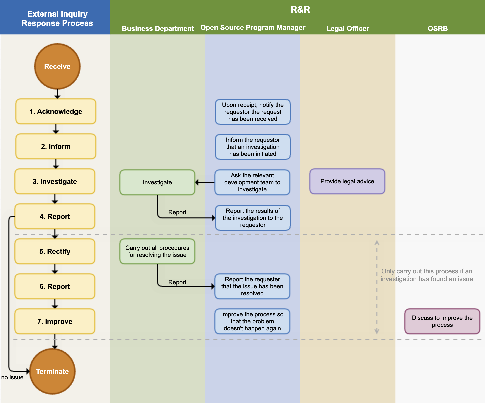

The open source process is an executable procedure that allows companies to comply with open source policies during the software development and distribution process.

From the perspective of open source license compliance, activities are carried out to comply with the conditions required by each license for the open source used in developing and distributing software, resulting in the creation of deliverables such as open source notices and source code to be disclosed.


<center><i>Simplified view of the compliance end-to-end process : https://www.linuxfoundation.org/wp-content/uploads/OpenSourceComplianceHandbook_2018_2ndEdition_DigitalEdition.pdf</i></center>


For open source security assurance, activities must be carried out to detect the presence of security vulnerabilities in the software to be distributed, identify structural/technical threats, and resolve issues before release.

In order for a company to effectively achieve open source license compliance and security assurance, the following processes must be established:

* Open source process
* Open source vulnerability response process
* External inquiry response process
* Open source contribution process

Let's take a look at how each process should be structured.


## 1. Open Source Process

Companies should establish an open source process for open source license compliance and security vulnerability management according to the software development process.

The image below is a sample open source process that companies can generally adopt and use.


The procedures to be taken at each stage according to the open source process are as follows:

### (1) Identification and Inspection of Open Source

In the identification and inspection stage of open source, it is necessary to identify what license the open source you want to use is, what obligations the license requires, and whether there are known vulnerabilities.

Review and record which open source you want to use, what its license is, what obligations each license imposes, and what known vulnerabilities are.

The ISO/IEC 5230 standard requires a documented procedure to handle common open source license use cases and to review and record the obligations, restrictions, and rights granted by each identified license.

{}

* 3.3.2.1 - A documented procedure for handling the common open source license use cases for the open source components of the supplied software.
  
* 3.1.5.1 - A documented procedure to review and document the obligations, restrictions and rights granted by each identified license.

{}

An example of a procedure for this is as follows:

1. The open source program manager provides a guide on the obligations, restrictions, and rights of major open source licenses. This guide should include the following use cases to handle common open source license use cases:

   - Distribution in binary form
   - Distribution in source form
   - Integration with other open source that triggers additional license obligations
   - Inclusion of modified open source
2. The business unit checks the license and known vulnerabilities according to the criteria defined in the open source policy.
3. The business unit consults with the open source program manager and security officer on any questions. If necessary, advice is sought from external experts.
4. All decisions and related grounds are documented and kept.

For this, companies should establish a documented procedure to review and record the obligations, restrictions, and known vulnerabilities granted by each identified license before product release through the open source identification and inspection stage.

```

(1) Open Source Identification

The business unit complies with the following matters at the software design stage.

- Identify the anticipated open source usage status and check the license while designing the software.
- Check the obligations of each open source license. The obligations of each license can be checked in the company's open source license guide. : https://sktelecom.github.io/guide/use/obligation/
- Design the software considering the source code disclosure range of each open source license.

The open source program manager creates and publishes a guide on the obligations, restrictions, and rights of major open source licenses so that the business units of the company can refer to it. This guide should include the following use cases to handle common open source license use cases:

- Distribution in binary form
- Distribution in source form
- Integration with other open source that triggers additional license obligations
- Inclusion of modified open source

The business unit marks copyright and license in the source code according to the company rules. The company's source code copyright and license marking rules can be found on the following page. (insert_link)

When the business unit considers introducing new open source, it first identifies the license. According to the company's open source license guide, check the obligations, restrictions, and rights of the license. If the license is not explained in the company's open source license guide, ask the open source program manager about the possibility of introduction and precautions. Create a Jira Ticket for inquiries.

The open source program manager analyzes the obligations of the open source license and guides the software development organization.

- If there is any doubt, consult with the legal officer and provide clear guidance.
- The newly analyzed license information is reflected in the company-wide license guide.

The security officer provides a guide for the company's security assurance.

(2) Source Code Inspection

The business unit requests an open source check according to the guidance of the IT manager and provides the source code.

The IT manager uses the open source analysis tool to check the open source and create an SBOM (Software Bill of Materials).

The open source program manager reviews the possibility of complying with the open source license obligations, checks for conflicts between open source licenses, and if there are issues, requests the business unit to resolve them. Issues are created as Jira Tickets and assigned to the business unit.

The security officer reviews the detected known vulnerabilities and provides a response guide to the business unit according to the pre-defined Risk classification criteria. Risk is classified by CVSS (Common Vulnerability Scoring System) Score, and Critical Risk is guided to establish a plan that can be addressed within 1 week.

```

In the open source identification and inspection stage, source code scanning tools can be used. More details on this can be found in "[1. Source Code Scanning Tools](../4-tool/#1-source-code-scanning-tools)".

### (2) Problem Solving

After identifying open source through open source identification and inspection, and confirming the risks of licenses and security vulnerabilities, a procedure is needed to solve the problem. All detected problems should be solved in the following ways:

- Remove the open source that is causing the issue.
- Replace with open source under a different license to resolve open source license issues.
- Replace with a version of open source where known vulnerabilities have been resolved.

An example of a documented process for this is as follows:

```
(3) Problem Solving

The business department solves all problems found in the source code inspection stage.

Remove the open source that is causing the issue, or replace it with open source under a different license. In the case of security vulnerability issues, measures such as replacing with a version where known vulnerabilities have been fixed are taken.

Once the business department has resolved all discovered issues, they resolve the Jira Ticket issue and request a re-review.

```

### (3) SBOM Identification, Review, and Storage

The most basic of open source license compliance activities is to understand the status of open source included in the distributed software. You need to build a process to create and manage an SBOM (Software Bill of Materials) that contains information identifying the open source and its licenses included in the distributed software. Knowing which open source is included in each version of the distributed software is essential for complying with the obligations required by each open source license when distributing software. This is also an essential process for discovering and responding to open source security vulnerabilities.

All open source must be reviewed and approved before being integrated into the distributed software. Not only the functionality and quality of the open source, but also whether the origin, license requirements can be met, and whether known vulnerabilities have been resolved, etc., must be reviewed in advance. A review request → review → approval process is required for this.

ISO standards commonly require a documented procedure that ensures that all open source software used in the supplied software is continuously recorded during the lifecycle of the supplied software.

For this, companies can reflect the following content about SBOM in the open source process:

```

(4) Review

The open source program manager reviews whether all issues have been properly supplemented. If necessary, the source code inspection is re-performed using the open source analysis tool.

The security officer reviews whether all serious vulnerabilities have been resolved. If there are vulnerabilities that are difficult to resolve, they review whether they can be approved considering the business form and service exposure status.

(5) Approval

The open source program manager finally approves or rejects whether the open source compliance procedure has been properly performed. If rejected, they propose a reason and a modification method to the business department.

(6) Registration

The open source program manager finalizes the BOM to track the list of open source used in each version of the software.

The IT officer registers the finalized BOM in the system. The BOM includes a list of open source included in the distributed software and the following information:

- Product (or service) name and version of the distributed software
- Open source list
  - Open source name / version
  - Open source license

The open source program manager finalizes the BOM to track the list of open source used in each version of the software.

```

For more details on tools for managing SBOM, see "[SBOM Management Tools](../4-tool/#3-sbom-management-tools)".

Also, all processes and results of such open source processes must be documented. It is more efficient to use an issue tracking system such as [Jira](https://www.atlassian.com/software/jira), [Bugzilla](https://www.bugzilla.org/) than using email.

### (4) Creation of License Compliance Artifacts

As mentioned above, the most basic of open source license compliance activities is to understand the status of open source included in the distributed software. This is precisely because it is the core of open source license compliance to properly meet the requirements of open source licenses. In other words, a process must be established to create a set of compliance artifacts for the open source included in the distributed software.

The ISO/IEC 5230 standard requires a documented procedure that describes the process under which the compliance artifacts are prepared and distributed with the supplied software as required by the identified licenses.

Compliance artifacts are divided into two main categories:

1. Open Source Notice: A document for providing open source license text and copyright information

    

    * For how to create an open source notice that aggregates the SBOM using tools, see "[Open Source Compliance Artifact Creation Tools](../4-tool/#5-open-source-compliance-artifact-creation-tools)".


Sure, here is the English translation of the Korean guide you provided, written in a professional style suitable for user manuals, help documents, and technical documents:

2. Source Code Package to be Disclosed: A package that consolidates source code to be disclosed in order to comply with the obligations of open source licenses that require source code disclosure, such as GPL, LGPL.

Compliance deliverables must be provided along with the distribution of the software for distribution.

For this, companies can reflect the content on the creation of compliance deliverables from the notification stage to the distribution stage in the open source process as follows:

```
(7) Notification

The open source program manager creates an open source notice to comply with the notification obligation. The open source notice includes the following:

- Open source contact point where open source related inquiries can be made
- Notice content for each open source
  - Copyright
  - Open source license name
  - Copy of open source license
  - (If applicable) Written agreement to obtain a copy of the source code (Written Offer)

The open source program manager creates an open source notice and delivers it to the business department. At this time, if source code disclosure is necessary, the method of collecting the source code to be disclosed is guided to the business department.

The business department includes the open source notice when distributing the product. If the product has a screen, measures are taken so that the user can check it through the menu. (Example: App > Menu > Settings > Copyright Information > Open Source License)

The business department, when using open source under a license that requires source code disclosure such as GPL, LGPL, checks the scope of source code disclosure for this and collects the source code to be disclosed.

- The source code collected to comply with the obligations of licenses such as GPL, LGPL must match the source code that constitutes the binary loaded on the product. In other words, if you build the collected source code, it must be the same as the binary loaded on the product.

(8) Confirmation before distribution

The business department submits the following deliverables to prove that the open source compliance activities have been properly performed.

1. Final open source notice included in the product
2. Materials confirming that the open source notice is included in the product (Example: Screen capture image showing the open source notice)
3. (If applicable) Source code to be disclosed (Submit as a single file compressed)

The open source program manager reviews the materials submitted by the business department and checks for any abnormalities.

(9) Distribution

The open source program manager submits the compliance deliverables submitted by the business department to the IT manager.

The IT manager registers the compliance deliverables on the company's open source distribution site.
```

When distributing software for distribution, it may be difficult to include a package of source code to be disclosed. In this case, you can substitute it by providing a written agreement (Written Offer) that you will provide the source code for at least 3 years. Typically, the written agreement is provided through the product's user manual, and the example is as follows:

```
The software included in this product contains copyrighted software 
that is licensed under the GPL. A copy of that license is included 
in this document on page X. You may obtain the complete Corresponding 
Source code from us for a period of three years after our last shipment 
of this product, which will be no earlier than 2011-08- 01, by sending 
a money order or check for $5 to:

GPL Compliance Division
Our Company
Any Town, US 99999

Please write“source for product Y” in the memo line of your payment.
You may also find a copy of the source at http://www.example.com/sources/Y/.
This offer is valid to anyone in receipt of this information.

<Source: SFLC Guide to GPL Compliance>
```

Therefore, compliance deliverables must be kept for more than 3 years, and a process for this must be established.

For this, companies can consider building an open source website. You can check the details in "[Open Source Compliance Deliverable Storage](../4-tool/#6-오픈소스-컴플라이언스-산출물-보관)".

## 2. Open Source Security Vulnerability Response Process

Companies must perform activities for security assurance, such as detecting and resolving open source security vulnerabilities, while developing products/services.

The ISO/IEC 18974 standard requires documented procedures and records of actions taken for security assurance methods as follows:

{}

3.1.5 - Standard Practice Implementation

The Program demonstrates a sound and robust handling procedures of Known Vulnerabilities and Secure Software Development by defining and implementing following procedures:

* Method to identify structural and technical threats to the Supplied Software is defined;
* Method for detecting existence of Known Vulnerabilities in Supplied Software;
* Method for following up on identified Known Vulnerabilities;
* Method to communicate identified Known Vulnerabilities to customer base when warranted;
* Method for analyzing Supplied Software for newly published Known Vulnerabilities post release of the Supplied Software;
* Method for continuous and repeated Security Testing is applied for all Supplied Software before release;
* Method to verify that identified risks will have been addressed before release of Supplied Software;
* Method to export information about identified risks to third parties as appropriate.

* 3.1.5.1: A documented procedure exists for each of the methods identified above.


3.3.2 - Security Assurance

* 3.3.2.1: A documented procedure for handling detection and resolution of Known Vulnerabilities for the Open Source Software components of the Supplied Software;
* 3.3.2.2: For each Open Source Software component a record is maintained of the identified Known Vulnerabilities and action(s) taken (including even if no action was required).

{}


In order to address vulnerabilities in the deployed software, enterprises must detect the presence of known vulnerabilities in the distribution-ready software and resolve identified risks before release. Furthermore, they need to establish methods and procedures to respond to newly discovered vulnerabilities post-release.

Initially, enterprises should detect known vulnerabilities in the distribution-ready software and resolve identified risks before release. The procedure for detecting and addressing these known vulnerabilities can be carried out through the open-source identification phase, source code inspection phase, and issue resolution phase of the open-source process, as outlined in [Open Source Process](#1-open-source-process).

Additionally, when newly identified vulnerabilities are disclosed after the release of the deployed software, it is imperative to establish a process for confirming their existence in the already distributed software and taking necessary measures to address them.

Below is a sample process for responding to the discovery of new security vulnerabilities:

---


<center><i>New Security Vulnerability Response Process (Sample)</i></center><br>

```
1. New Security Vulnerability Response Process

After a product/service is launched in the market, we adhere to the following process to take appropriate measures according to the risk level when a new security vulnerability is reported.

(1) Monitoring

The IT department operates a system that monitors new security vulnerabilities. This system performs the following functions:

- Regularly collects information about newly disclosed security vulnerabilities.
- If an open source with a new known vulnerability is used in a product/service that has already been released, it sends a notification to the business department in charge of the product/service. From notification to review, action, and resolution, everything is documented and recorded using the Jira Issue Tracker.

(2) Initial Response

The security officer provides a response guide to the business department according to the pre-defined risk classification criteria. Risks are classified by CVSS (Common Vulnerability Scoring System) scores, and Critical Risk is guided to establish a plan that can be implemented within 1 week.

If a new security vulnerability is found in a product/service that has already been released, the business department establishes a response plan according to the response guide provided by the security officer.

If there are customers who need assurance, the business department notifies the confirmed known vulnerabilities by email or other means as needed, depending on the risk level.

(3) Problem Solving

The business department solves the security vulnerability problem by deleting the problematic open source or replacing it with a patched version, etc., according to the established response plan. Once all issues are resolved, a re-review is requested.

(4) Review

The IT department uses an open source analysis tool to check whether the problem has been properly resolved.

(5) Approval

The security officer reviews whether all serious vulnerabilities have been resolved. If there are vulnerabilities that are difficult to resolve, the approval is reviewed considering the business form and service exposure status.

(6) Registration

The IT department registers the SBOM, which has resolved the open source security vulnerability, in the system.

(7) Notification

The open source program manager creates an open source notice based on the SBOM that has resolved the open source security vulnerability and delivers it to the business department.

The business department replaces the open source notice included in the product distribution.

The IT department registers the modified open source notice on the company's open source distribution site.

(8) Distribution

The business department redistributes the software version that has resolved the open source security vulnerability.

The security officer identifies whether there is risk information that needs to be disclosed to third parties, and if so, delivers it to the IT department.

The IT department registers the identified risk information on the open source website so that third parties can check it.

```

## 3. External Inquiry Response Process

In order for a company not to lead to legal litigation due to external claims, it is important to respond as quickly and accurately as possible to external inquiries and requests. To this end, companies should establish a process that can respond quickly and effectively to external open source inquiries.

ISO standards commonly require the following internal documented procedures to respond to third-party inquiries.

{}

* 3.2.1.2 - An internal documented procedure for responding to third party open source license compliance inquiries.

{}


{}

* 3.2.1.2: An internal documented procedure exists for responding to third party Known Vulnerability or Newly Discovered Vulnerability inquiries.

{}

The following figure is a sample process that a company should have in order to respond to external inquiries.


<center><i>External Inquiry Response Process (Sample)</i></center><br>

```
If you respond quickly and accurately to open source compliance inquiries from outside, you can greatly reduce the risk of proceeding to litigation. To this end, the company adheres to the following process to respond to external open source compliance inquiries.

(1) Receipt Notification

As soon as the open source program manager receives an inquiry, they notify the requester that the inquiry has been received. At this time, they also notify the expected date of action. If the inquiry is unclear, they request additional explanation.

The main contents of the inquiries and requests that require response are as follows:

- Inquiry whether open source has been used in a specific product or service
- Request for source code provision under GPL, LGPL license mentioned in written agreement (Written Offer)
- Explanation and source code disclosure request for open source found in the product but not specified in the open source notice
- Request for missing files and build methods in the source code disclosed due to obligations such as GPL, LGPL
- Copyright notice request

The open source program manager creates a Jira Issue for the received request and records all the response situations in detail.

(2) Investigation Notification

The open source program manager notifies the requester that they are investigating the open source compliance. It is good to notify whenever the internal investigation progress is updated.

(3) Internal Investigation

The open source program manager conducts an internal investigation on the request. They check whether the compliance process has been properly performed for the version of the product in question through the BOM and documented review history. If necessary, they request advice from the legal department.

If it is a matter that needs to be confirmed by a specific business department, the open source program manager requests an investigation from the business department. The business department immediately checks whether there is a problem with the compliance deliverables upon receiving the investigation request and reports the results to the open source program manager.

(4) Report to Requester

The open source compliance officer completes the internal investigation within the expected date of action and notifies the requester of the result.

- If the requester's inquiry was a misdirected point due to misunderstanding, they notify the requester and end the process without any additional action.
- If there is a problem, they notify the requester of the exact method and timing to fulfill the obligations of the open source license in question.

(5) Problem Supplement / Notification

If a compliance problem is actually found in the internal investigation, the relevant business department performs all procedures necessary to solve the compliance problem.

(6) Problem Resolution Notification

After solving the problem, they immediately notify the requester and provide the best way to confirm that the problem has been resolved.

(7) Process Improvement

If there was a compliance problem, the OSRB meeting reviews the case, identifies the circumstances of the problem, and improves the process so that the problem does not recur.

```
Sure, here is the translation of the text you provided:

---

## 4. Open Source Contribution Process

If a company has a policy that allows contributions to external open source projects, there should be a documented procedure for how in-house developers can contribute to external projects.

The ISO/IEC 5230 standard requires a documented procedure for managing open source contributions.

{}

3.5.1.2 - A documented procedure that governs open source contributions;

{}

The [Open Source Contribution Process](https://sktelecom.github.io/guide/contribute/process/) published by SK Telecom is a good example.


[https://sktelecom.github.io/guide/contribute/process/](https://sktelecom.github.io/guide/contribute/process/)


## 5. Process Modernization

It is not desirable for the process to be documented but not actually operated. Also, it is a problem if it does not fit the business situation or organizational composition. Companies should always keep the process up-to-date to match the internal organization and situation of the company.

The ISO/IEC 18974 standard requires periodic review and improvement of the process.

{}

* 3.1.2.5: Documented Evidence of periodic reviews and changes made to the process;
* 3.1.2.6: Documented verification that these processes are current with company internal best practices and who is assigned to accomplish them.

{}

Companies can define in the open source policy document that they improve the open source policy and open source process every year and document and record all processes.

```
1. Roles, Responsibilities, and Competencies

To ensure the effectiveness of the policy, we define the roles and responsibilities and the competencies that each role holder should have as follows.

(1) OSRB

The OSRB (Open Source Review Board) is a consultative body composed of the open source program manager and the heads of related organizations such as the legal team, patent team, development team, and infrastructure team for the company's open source management.

The OSRB improves policies and processes on a regular basis every year. All improvement processes are documented and recorded.
  - The OSRB always modernizes the company's process performance results, shortcomings, best practices, and reflects the business environment.
  - The policy and process for open source compliance are managed by the open source program manager.
  - The policy and process for open source security assurance are managed by the security officer.

```

## 6. Summary

By building the process up to this point, you can meet the requirements marked in yellow in the ISO standard specifications.

