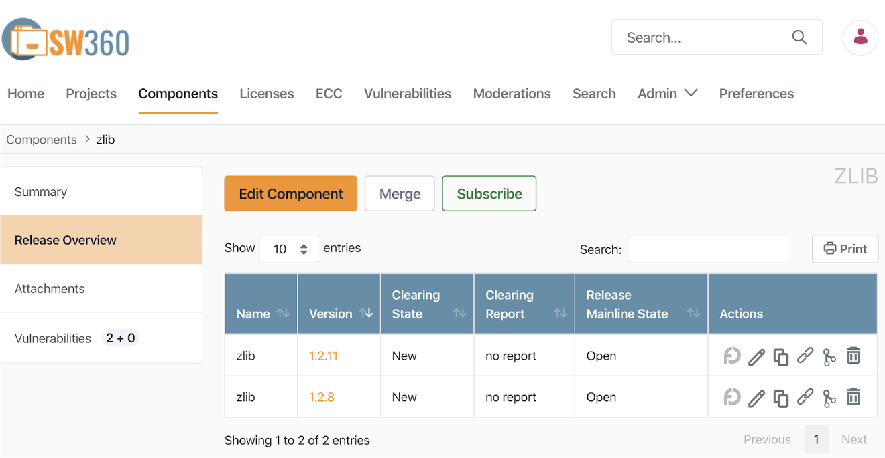

## 1. Source Code Scanning Tools

In the open source identification and inspection stages of the open source process, you can use source code scanning tools. These tools range from open source-based tools that can be used for free to commercial tools. Each tool has its strengths, but no tool provides a perfect solution to all problems. Therefore, companies should select the appropriate tool that fits the characteristics and requirements of their products.

Many companies use these automated source code scanning tools in conjunction with manual reviews. The Linux Foundation's [FOSSology](https://www.fossology.org/) project is an open source source code scanning tool that companies can easily use for free.



<i>https://www.fossology.org/</i>



For information on how to install and use FOSSology, please refer to [Get Started with FOSSology](https://www.fossology.org/get-started/).

## 2. Dependency Analysis Tools

In recent software development, build environments that support package managers such as Gradle and Maven are used. In these build environments, even without source code, the necessary Dependency libraries are fetched from a remote space at build time to compose the distribution software. However, these Dependency libraries are included in the distribution software but are not detected by the source code scanning tools. Therefore, it is also important to use tools for Dependency analysis.

The OSS Review Toolkit, which is open source, provides a Dependency analysis tool called Analyzer.



<i>https://github.com/oss-review-toolkit/ort#analyzer</i>



In addition, LG Electronics has released the [FOSSLight Dependency Scanner](https://github.com/fosslight/fosslight_dependency_scanner) as open source. The FOSSLight Dependency Scanner supports various package managers such as Gradle, Maven, NPM, PIP, Pub, and Cocoapods.



<i>https://fosslight.org/ko/scanner/</i>



## 3. SBOM Management Tools

ISO/IEC 5230 standard 3.3.1.2 requires that the SBOM list included in the distribution software be documented and stored.

{}

* 3.3.1.2 - Open source component records for the supplied software that demonstrates the documented procedure was properly followed.

{}

{}

* 3.3.1.2: Open Source Software Component Records for the Supplied Software that demonstrates the documented procedure was properly followed.

{}

SBOM can be managed with spreadsheet programs like Excel, but it is not easy to manage manually when the number and version of distribution software exceed hundreds. Therefore, it is recommended to introduce open source automation tools for this purpose.

The [SW360](https://github.com/eclipse-sw360/sw360) project, sponsored by the Eclipse Foundation, provides the ability to track the list of open sources included in each distribution software.

The installation and usage of SW360 can be referred to in the [SW360 Docker](https://github.com/eclipse-sw360/sw360/blob/main/README_DOCKER.md).

And the aforementioned FOSSLight also provides features for SBOM management.



<i>https://fosslight.org/fosslight-guide/started/2_try/4_project.html</i>



LG Electronics has been managing the SBOM for all business units' distribution software for the past several years using FOSSLight, which it developed in-house. In June 2021, it announced that it had released it as open source so that anyone can use it.



<i>https://fosslight.org/</i>



## 4. Open Source Vulnerability Management Tools

Companies need to track products/services that contain known vulnerabilities and resolve them. To do this, companies need to build a tool environment that automates this.

SW360 can automatically check if there are any security vulnerabilities in the registered Release. For this, SW360 provides a feature to schedule the collection of CVE information every 24 hours. If you set up this scheduling, SW360 will collect CVE information from the CVE Search site (https://cve.circl.lu/) at the set time. After the Vulnerabilities information is collected, you can check if there are any security vulnerabilities in the created Project, so you can also track whether newly disclosed vulnerabilities exist in products that have already been released.

The method of managing security vulnerabilities with SW360 can be referred to in the [SW360 guide](https://openchain-project.github.io/OpenChain-KWG/guide/governance_iso5230/appendix/3-tools/sw360/).

[FOSSLight](https://fosslight.org/ko/) also automatically acquires security vulnerability information and automatically checks project information where security vulnerabilities have been detected, providing notifications such as emails as needed.

## 5. Open Source Compliance Artifact Generation Tool

The main open source compliance artifact, the open source notice, is a document that provides copyright and license information for the open source included in the distributed software. Open source notices can be created using a document editor tool, but it is recommended to use a tool that generates them automatically.

SK Telecom has released an open source notice automatic generation tool (`onot`: https://github.com/sktelecom/onot) used internally as open source, and Kakao has participated in joint development by contributing major features.

<i>onot installation method</i>
 

`onot` is a tool that automatically converts SBOMs written in SPDX document format into open source notice format. It is a Python program that is lightweight and easy to use.

<i>onot generated open source notice sample</i>
 

FOSSLight also provides a feature to automatically generate open source notices based on the acquired SBOM.



<i>https://fosslight.org/fosslight-guide/started/2_try/4_project.html</i>



## 6. Open Source Compliance Artifact Storage

It is recommended that companies build an open source website and register open source compliance artifacts so that external customers can conveniently download open source notices and source code packages to be disclosed for distributed software at any time.

For this, the ISO/IEC 5230 standard requires a documented procedure for archiving copies of the compliance artifacts of the supplied software.

{}

* 3.4.1.2 - A documented procedure for archiving copies of the compliance artifacts of the supplied software - where the archive is planned to exist for a reasonable period of time (Determined by domain, legal jurisdiction and/or customer contracts) since the last offer of the supplied software; or as required by the identified licenses (whichever is longer). Records exist that demonstrate the procedure has been properly followed.

{}

You can refer to this tool environment on SK Telecom's open source website.



<i>https://sktelecom.github.io/compliance/</i>



This website was developed as open source, and the source code is open, so other companies can easily build a similar environment.



<i>https://github.com/sktelecom/sktelecom.github.io</i>



## 7. Summary

If you build up to the tool environment, you can meet the requirements marked in green in the ISO standard specification.

