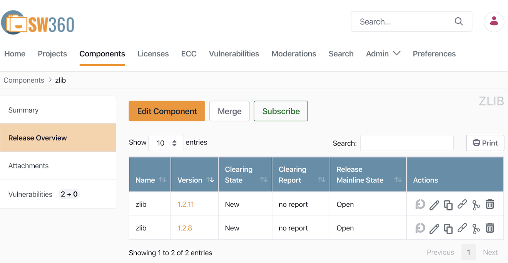
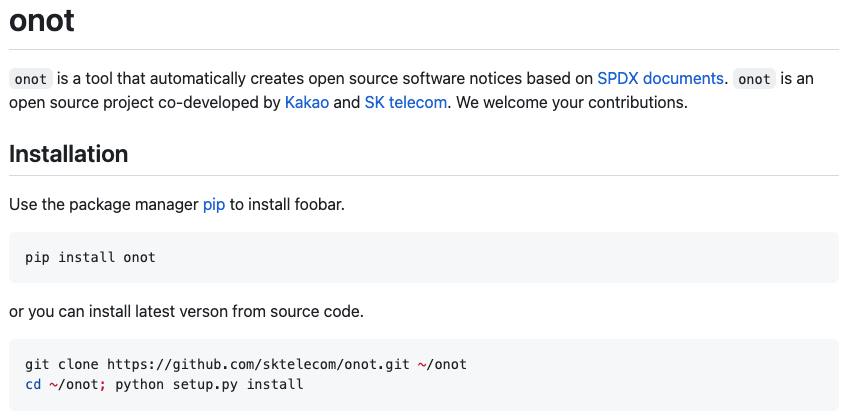
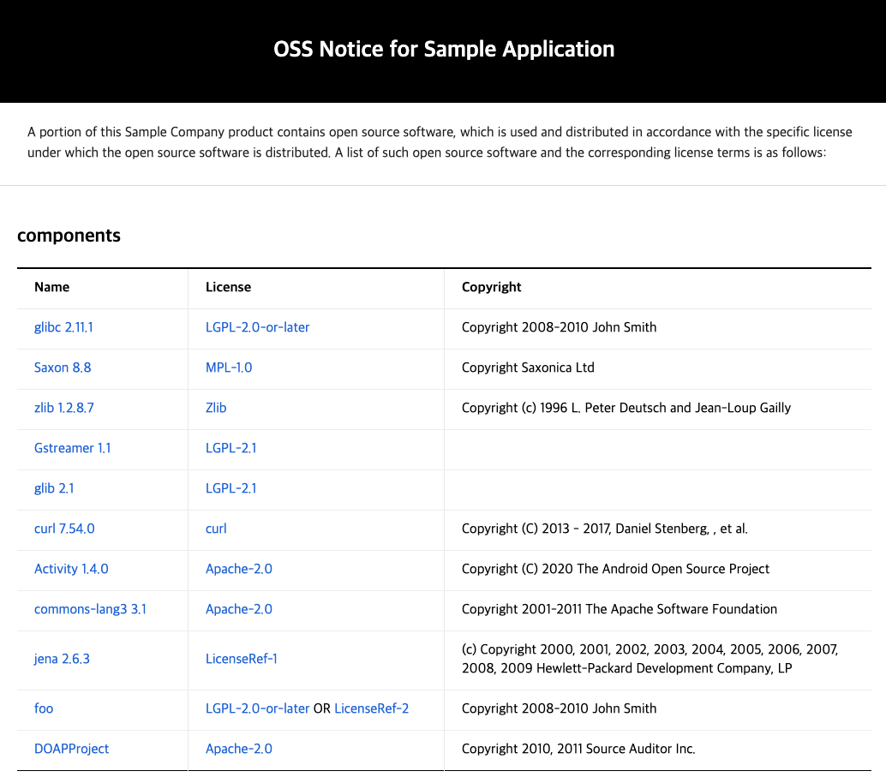
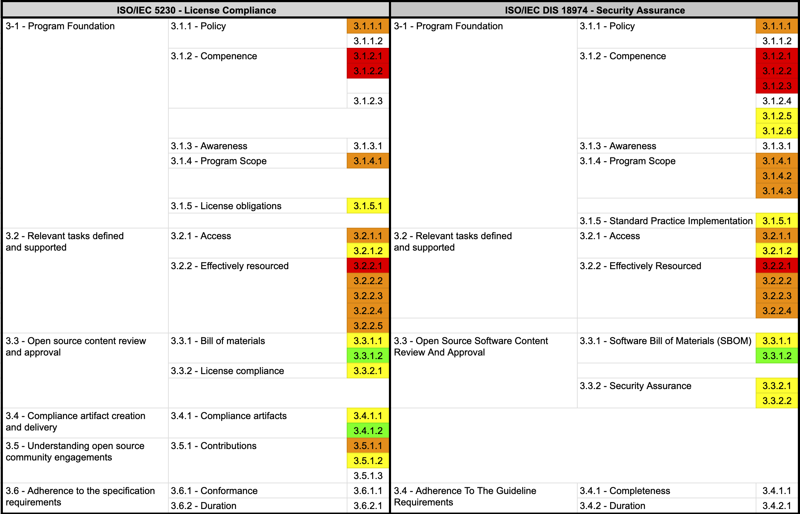

{}
**ISO/IEC 5230**: 3.3.1.2  
**ISO/IEC 18974**: 4.3.1.2
{}

## 1. Source Code Scanning Tools

In the open source identification and inspection stages of the open source process, you can use source code scanning tools. Source code scanning tools help identify the open source included in the supplied software and extract license and copyright information. These tools range from open source-based tools that can be used for free to commercial tools. Each tool has its strengths, but no tool provides a perfect solution to all problems. Therefore, companies should select the appropriate tool that fits the characteristics and requirements of their supplied software.

Many companies use these automated source code scanning tools in conjunction with manual reviews. Here, we introduce two major open source source code scanning tools.

### (1) FOSSology

[FOSSology](https://www.fossology.org/) is an open source project managed by the Linux Foundation. It is a source code scanning tool that supports the license compliance workflow.


<center><i>https://www.fossology.org/</i></center>


Key features:
- Source code scanning and license identification
- Extraction of license and copyright information
- Web-based user interface
- Support for large-scale codebase analysis

FOSSology can be used by companies free of charge and benefits from continuous improvement and support from the open source community.

For information on how to install and use FOSSology, please refer to the [FOSSology guide](../../tools/1-fossology/).

### (2) SCANOSS

[SCANOSS](https://www.scanoss.com/) is a platform for identifying and managing open source software components.

Key features:
- Fast source code scanning and open source component identification
- License and vulnerability information
- Integration support through APIs
- SBOM (Software Bill of Materials) generation

SCANOSS provides both free and paid versions, and supports both cloud-based services and on-premises solutions.

For information on how to install and use SCANOSS, please refer to the [SCANOSS guide](../../tools/9-scanoss/).

By using these source code scanning tools, you can effectively identify and manage the open source components of the supplied software. However, rather than relying entirely on the results of the tools, professional review and judgment by program participants should be conducted together.

## 2. Dependency Analysis Tools

In recent software development, build environments that support package managers such as [Gradle](https://gradle.org/) and [Maven](https://maven.apache.org/) are used. In these build environments, even without source code, the necessary dependency libraries are fetched from a remote repository at build time to compose the supplied software. These dependency libraries are included in the supplied software but are not detected by source code scanning tools. Therefore, it is important to use tools for dependency analysis.

### (1) OSS Review Toolkit

The [OSS Review Toolkit (ORT)](https://github.com/oss-review-toolkit/ort) is a suite of tools for automating open source license compliance. ORT provides a dependency analysis tool called Analyzer.

Key features of Analyzer:
- Support for various package managers (Maven, Gradle, NPM, etc.)
- Generation of the project's dependency tree
- Extraction of license and copyright information
- Generation of reports in SPDX format


<center><i>https://github.com/oss-review-toolkit/ort#analyzer</i></center>


### (2) FOSSLight Dependency Scanner

The [FOSSLight Dependency Scanner](https://github.com/fosslight/fosslight_dependency_scanner), developed and released as open source by [LG Electronics](https://www.lg.com/), is a dependency analysis tool that supports various package managers.

Key features:
- Support for various package managers such as Gradle, Maven, NPM, PIP, Pub, and Cocoapods
- Extraction of open source license and version information
- SBOM (Software Bill of Materials) generation


<center><i>https://fosslight.org/ko/scanner/</i></center>


### (3) cdxgen

[cdxgen](https://github.com/CycloneDX/cdxgen) is an open source SBOM generation tool developed as part of the OWASP CycloneDX project. It supports various languages and package managers and can be easily integrated into CI/CD pipelines.

Key features:
- Support for 20+ languages and package ecosystems such as Java, JavaScript, Python, Go, and Rust
- Generation of SBOMs in CycloneDX and SPDX formats
- Support for container image and binary analysis
- CI/CD integration with GitHub Actions, Jenkins, etc.

For information on how to install and use cdxgen, please refer to the [cdxgen guide](../../tools/5-cdxgen/).

### (4) Syft

[Syft](https://github.com/anchore/syft) is an open source SBOM generation tool developed by Anchore that analyzes container images and filesystems to generate SBOMs.

Key features:
- Analysis of various sources such as container images, filesystems, and archives
- Output in various SBOM formats such as SPDX, CycloneDX, and Syft JSON
- Vulnerability analysis through integration with Grype (vulnerability scanner)
- Support for Kubernetes and CI/CD pipeline integration

For information on how to install and use Syft, please refer to the [Syft guide](../../tools/6-syft/).

By using these dependency analysis tools, you can accurately identify the open source components included in the supplied software and generate SBOMs. This helps satisfy the requirements of ISO/IEC 5230 and ISO/IEC 18974.

## 3. Open Source Governance / SBOM Management Tools

Open source governance and SBOM (Software Bill of Materials) management are essential for effective open source license compliance and security assurance. The ISO/IEC 5230 and ISO/IEC 18974 standards require documenting and storing records of the open source software components included in the supplied software.

{}

* 3.3.1.2 - Open source component records for the supplied software that demonstrates the documented procedure was properly followed.<br>`문서화된 절차가 적절히 준수되었음을 보여주는 공급 소프트웨어에 대한 오픈소스 컴포넌트 기록`

{}


{}

* 4.3.1.2: Open Source Software Component Records for the Supplied Software that demonstrates the documented procedure was properly followed.<br>`문서화된 절차가 적절히 준수되었음을 보여주는 공급 소프트웨어에 대한 오픈소스 소프트웨어 컴포넌트 기록`

{}

SBOM can be managed with spreadsheet programs, but manual management becomes difficult when the number and versions of supplied software increase. Therefore, it is efficient to introduce automated open source tools.

### (1) SW360

[SW360](https://github.com/eclipse-sw360/sw360) is an open source project sponsored by the Eclipse Foundation that provides the ability to track the list of open sources for each supplied software.



Key features:
- Project, component, and license management
- SBOM generation and management
- Vulnerability management
- License obligation tracking

For information on how to install and use SW360, see the [SW360 guide](../../tools/2-sw360/).

### (2) FOSSLight

[FOSSLight](https://fosslight.org/) is a comprehensive open source management tool developed and released as open source by [LG Electronics](https://www.lg.com/).

Key features:
- SBOM generation and management
- Open source license compliance checking
- Vulnerability management
- Open source notice generation


<center><i>https://fosslight.org/fosslight-guide/started/2_try/4_project.html</i></center>


LG Electronics has used FOSSLight for several years to manage SBOMs across the entire company, and released it as open source in June 2021. It provides a Korean-language guide to help domestic companies use it.

For information on how to install and use FOSSLight, please refer to the [FOSSLight guide](../../tools/3-fosslight/).


<center><i>https://fosslight.org/</i></center>


### (3) Dependency-Track

[Dependency-Track](https://dependencytrack.org/) is an open source SBOM management and vulnerability analysis platform managed by OWASP. It collects and manages SBOMs and continuously monitors the vulnerabilities of each component.

Key features:
- Collection and management of SBOMs in CycloneDX and SPDX formats
- Automatic vulnerability detection through integration with vulnerability databases such as NVD and OSV
- Per-project component and license status dashboard
- REST API and CI/CD pipeline integration

For information on how to install and use Dependency-Track, please refer to the [Dependency-Track guide](../../tools/7-dependency-track/).

> **Quick start**: To build a license policy and vulnerability monitoring environment from scratch by generating an SBOM with cdxgen and uploading it to Dependency-Track, please refer to [Building an Open Source Management Automation Environment: cdxgen + Dependency-Track](../../tools/8-cdxgen-dt/).

By using these tools, companies can effectively perform open source governance and manage SBOMs, satisfying the requirements of ISO/IEC 5230 and ISO/IEC 18974.

## 4. Open Source Vulnerability Management Tools

To effectively manage known vulnerabilities or newly discovered vulnerabilities included in the supplied software, companies need to build an automated tool environment. Here, we introduce four major open source vulnerability management tools.

### (1) OWASP Dependency-Check

[OWASP Dependency-Check](https://owasp.org/www-project-dependency-check/) is an open source tool that analyzes a project's dependencies to detect whether known vulnerabilities exist.

Key features:
- Support for various languages and package managers (Java, .NET, JavaScript, Ruby, etc.)
- Integration with the CVE (Common Vulnerabilities and Exposures) database
- Easy integration with CI/CD pipelines
- Generation of reports in various formats such as HTML, XML, CSV, and JSON

### (2) SW360

[SW360](https://github.com/eclipse/sw360) is an open source software component management tool managed by the Eclipse Foundation, and it also provides security vulnerability management features.

Key features:
- Automatic vulnerability checking for registered Releases
- Periodic collection of CVE information (scheduled every 24 hours)
- Per-project security vulnerability lookup
- Tracking the impact of newly disclosed vulnerabilities on existing products

For information on how to manage security vulnerabilities with SW360, please refer to the [SW360 guide](../../tools/2-sw360/).

### (3) FOSSLight

[FOSSLight](https://fosslight.org/ko/) similarly acquires security vulnerability information automatically, automatically checks project information where security vulnerabilities have been detected, and provides notifications such as emails as needed.

### (4) OSV-SCALIBR

[OSV-SCALIBR](https://github.com/google/osv-scalibr) is an open source software composition analysis (SCA) library developed by Google. It extracts open source components from filesystems and container images and detects vulnerabilities by integrating with the OSV (Open Source Vulnerabilities) database.

Key features:
- Package extraction from filesystems, container images, and archives
- OSV database-based vulnerability detection
- Support for major package ecosystems such as Python, Go, Java, and npm
- Can be integrated into existing tools as a library

For information on how to install and use OSV-SCALIBR, please refer to the [OSV-SCALIBR guide](../../tools/4-osvscalibr/).

By using these tools, companies can effectively manage open source security vulnerabilities while satisfying the requirements of ISO/IEC 18974.

## 5. Open Source Compliance Artifact Generation Tools

The main open source compliance artifact, the open source notice, is a document that provides copyright and license information for the open source included in the supplied software. Open source notices can be created manually, but it is efficient to use a tool that generates them automatically.

### (1) onot

[SK Telecom](https://www.sktelecom.com/) has released an open source notice automatic generation tool used internally as open source under the name [onot](https://github.com/sktelecom/onot). [Kakao](https://www.kakaocorp.com/) also participated in joint development by contributing major features.



<center><i>onot installation method</i></center><br>

`onot` is a tool that automatically converts SBOMs written in [SPDX](https://spdx.dev/) document format into open source notice format. It is a Python program that is lightweight and easy to use.


<center><i>onot generated open source notice sample</i></center><br>

For information on how to install and use onot, please refer to the [onot guide](../../tools/10-onot/).

### (2) FOSSLight

[FOSSLight](https://fosslight.org/) also provides a feature to automatically generate open source notices based on the acquired SBOM.


<center><i>https://fosslight.org/fosslight-guide/started/2_try/4_project.html</i></center>


By using these tools, you can automate and standardize the open source notice generation process, improving the efficiency and accuracy of the open source license compliance process. It also helps satisfy the requirements of ISO/IEC 5230 and ISO/IEC 18974.

## 6. Open Source Compliance Artifact Storage

Systematically storing and managing open source compliance artifacts is very important for open source license compliance. In particular, for licenses that require source code disclosure such as GPL and LGPL, source code must be available for at least three years after the supplied software is distributed.

For this, the ISO/IEC 5230 standard requires a documented procedure for archiving copies of the compliance artifacts of the supplied software, as follows.

{}

* 3.4.1.2 - A documented procedure for archiving copies of the compliance artifacts of the supplied software - where the archive is planned to exist for a reasonable period of time (Determined by domain, legal jurisdiction and/or customer contracts) since the last offer of the supplied software; or as required by the identified licenses (whichever is longer). Records exist that demonstrate the procedure has been properly followed.<br>`배포용 소프트웨어의 컴플라이언스 산출물 사본을 보관하기 위한 문서화된 절차 - 산출물 사본은 배포용 소프트웨어의 마지막 배포 이후 합리적인 기간 동안 혹은 식별된 라이선스에서 요구하는 기간 동안 보관해야 한다(둘 중 더 긴 기간을 따름). 이러한 절차가 올바르게 수행되었음을 입증하는 기록이 존재해야 한다.`

{}

To this end, companies should build a system that can safely store open source compliance artifacts and disclose them externally when necessary.

### (1) GitHub Pages

[GitHub Pages](https://pages.github.com/) is a service that allows you to host a website directly from a GitHub repository. You can use it to store and disclose open source compliance artifacts.

The method for storing open source compliance artifacts using GitHub Pages is as follows:

1. Create a dedicated repository on GitHub
2. Upload open source notices and source code to the repository
3. Enable the website through GitHub Pages settings
4. Configure it to be accessible externally via a public URL

Using GitHub Pages provides the following benefits:

- Free to use
- Version control features
- High availability and stability
- Easy updates and management

You can refer to this tool environment on SK Telecom's open source website.


<center><i>https://sktelecom.github.io/compliance/</i></center>


This website was developed as open source, and the source code is open, so other companies can easily build a similar environment.


<center><i>https://github.com/sktelecom/sktelecom.github.io</i></center>


By storing and disclosing open source compliance artifacts using GitHub Pages, companies can effectively fulfill open source license obligations and improve transparency.

## 7. Integration with Continuous Integration/Deployment (CI/CD) Tools

Integrating open source compliance and security assurance activities into the continuous integration/deployment (CI/CD) pipeline enables automated checking and management throughout the development process. This allows open source-related issues to be discovered and resolved early.

### (1) Jenkins Plugins

[Jenkins](https://www.jenkins.io/) is a widely used open source automation server that can be integrated with various open source compliance and security assurance tools through plugins.

Major Jenkins plugins:

- [FOSSology Plugin](https://plugins.jenkins.io/fossology/): Integrates FOSSology scans into the Jenkins pipeline.
- [OWASP Dependency-Check Plugin](https://plugins.jenkins.io/dependency-check-jenkins-plugin/): Automates checking for known or newly discovered vulnerabilities.
- [SW360 Plugin](https://github.com/eclipse/sw360/tree/main/jenkins-pipeline): Integrates SW360 with Jenkins to automate SBOM management.

Example Jenkins pipeline (**conceptual diagram — when applying in practice, replace with verified step names and parameters by referring to each plugin's official documentation**):

```groovy
pipeline {
    agent any
    stages {
        stage('Checkout') {
            steps {
                checkout scm
            }
        }
        stage('Dependency Scan') {
            steps {
                dependencyCheck additionalArguments: '', odcInstallation: 'Default'
            }
        }
        stage('License Scan') {
            steps {
                fossology()
            }
        }
        stage('SBOM Update') {
            steps {
                sw360UpdateProject()
            }
        }
    }
    post {
        always {
            dependencyCheckPublisher pattern: '**/dependency-check-report.xml'
        }
    }
}
```

This pipeline sequentially performs source code checkout, dependency vulnerability scanning, license scanning, and SBOM update.

### (2) GitLab CI/CD Pipeline

[GitLab CI/CD](https://docs.gitlab.com/ee/ci/) is a continuous integration/deployment tool built into GitLab that defines pipelines through a `.gitlab-ci.yml` file.

Example GitLab CI/CD pipeline (**conceptual diagram — when applying in practice, replace with verified commands by referring to official images and CLI commands**):

```yaml
stages:
  - scan
  - analyze
  - report

dependency_scan:
  stage: scan
  script:
    - docker run --rm -v $(pwd):/src owasp/dependency-check --scan /src --format "ALL" --out /src/reports

license_scan:
  stage: scan
  script:
    - docker run --rm -v $(pwd):/project fossology/fossology:latest /usr/local/fossology/fo_cli -c /project

sbom_update:
  stage: analyze
  script:
    - sw360 update-project

vulnerability_report:
  stage: report
  script:
    - generate_vulnerability_report
  artifacts:
    reports:
      dependency_scanning: reports/dependency-check-report.json

license_report:
  stage: report
  script:
    - generate_license_report
  artifacts:
    reports:
      license_scanning: reports/license-scan-report.json
```

This pipeline performs dependency vulnerability scanning, license scanning, SBOM update, and the generation of vulnerability reports and license reports.

By integrating these processes into the CI/CD pipeline, open source compliance and security assurance activities can be automated and seamlessly integrated into the development workflow. This helps effectively satisfy the requirements of ISO/IEC 5230 and ISO/IEC 18974.

## 8. Summary

If you build up to this tool environment, you can meet the major requirements of the ISO/IEC 5230 and ISO/IEC 18974 standard specifications.



By using these tools, you can obtain the following benefits:

1. Through source code scanning and dependency analysis tools, you can accurately identify the open source included in the supplied software and determine its licenses.

2. Using open source governance and SBOM management tools, you can systematically manage and track the open source components of the supplied software.

3. Through open source vulnerability management tools, you can continuously monitor and respond to known vulnerabilities or newly discovered vulnerabilities.

4. Using open source compliance artifact generation and storage tools, you can efficiently generate and manage the documents needed to comply with license obligations.

5. Through integration with CI/CD tools, you can integrate and automate the open source management process within the development workflow.

By building this tool environment, companies can systematically and efficiently perform open source license compliance and security assurance activities, receiving significant help in satisfying the requirements of ISO/IEC 5230 and ISO/IEC 18974.

By effectively using open source management tools, companies can minimize the legal risks associated with open source use, respond quickly to security vulnerabilities, and build a transparent and trustworthy software supply chain. This will ultimately lead to improved competitiveness and increased customer trust.

---

> **ISO/IEC 5230 / 18974 Compliance Guide** — Clauses related to this section:
> - [§3.4.1 Compliance Artifacts](../../iso5230_guide/4-artifacts/1-compliance-artifacts/) — Artifact retention period and version control procedures
> - [§4.1.5 Implementing Standard Practices](../../iso18974_guide/1-program-foundation/5-standard-practice/) — How to use SCA, SAST, and DAST tools
> - [§4.3.2 Security Assurance](../../iso18974_guide/3-content-review/2-security-assurance/) — SBOM-based vulnerability detection and recording
>
> **Additional considerations when using AI:**
> - [§7. AI Compliance](../7-ai-compliance/) — AI coding tool usage policy and automatic CI/CD blocking
> - [AI SBOM Guide](/OpenChain-KWG/guide/iso42001_guide/4-operation/2-ai-sbom/) — Generating AI SBOMs with cdxgen, Syft, and Dependency-Track (Korean)
> - [§6.3 OpenSSF Model Signing](/OpenChain-KWG/guide/iso42001_guide/4-operation/3-supply-chain/#63-openssf-model-signing-도입-절차) — Model weight signing tools (Korean)
