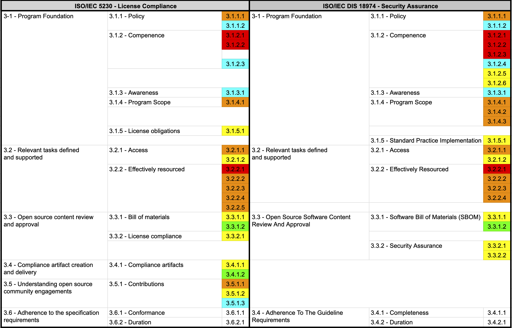

## 1. Education

No matter how excellent the policies and processes are, they will be useless if no one in the organization pays attention to them. For open source policies and processes to work effectively in a company, member education is crucial.

Companies should provide practical means such as education and internal wikis so that all program participants are aware of the existence of open source policies within the organization and can perform necessary activities. Program participants here refer to all employees involved in the development, distribution, and contribution of software, including software developers, distribution engineers, and quality engineers.

For this, the ISO standard commonly requires the following documented procedures to inform about the open source policy:

{}

* 3.1.1.2 - A documented procedure that makes program participants aware of the existence of the open source policy (e.g., via training, internal wiki, or other practical communication method).

{}


{}

* 3.1.1.2: A documented procedure to make Program Participants aware of the Security Assurance policy.

{}

Many companies make their open source policy documents available through internal wiki sites so that any employee can check the necessary items. In addition, they mandate education on open source policies during the orientation of new hires and provide regular education once a year or every two years to all program participants, ensuring that all program participants are aware of the existence of the open source policy.

Companies should include these methods in the open source policy document as follows:

```
5. Education and Evaluation

All members in charge of each role defined in Chapter 4 must take the advanced open source education course provided by [Learning Portal]. Through this, they will familiarize themselves with the open source policy, related education policy, and inquiry methods. The education history and evaluation results are kept in [Learning Portal] for at least 3 years.

```

Companies should ensure that program participants are aware of the company's open source policy, open source-related goals, participant's contribution methods for an effective open source program, and the impact of non-compliance with program requirements. To do this, companies should provide education, perform evaluations to confirm correct understanding by program participants, and document and keep the evaluation results.

The ISO standard commonly requires the following documented evidence indicating the assessed awareness of program participants:

{}

* 3.1.3.1 - Documented evidence of assessed awareness for the program participants - which should include the program's objectives, one's contribution within the program, and implications of program non-conformance.

{}


{}

* 3.1.3.1: Documented Evidence of assessed awareness for the Program Participants - which should include the Program’s objectives, one’s contribution within the Program, and implications of Program non-conformance.

{}

Therefore, companies can include the following content in the company's open source policy:

```
1. Purpose

(1) Purpose of the policy

This policy provides the following principles for the entire organization involved in software development, service, and distribution at OOO Co., Ltd. (hereinafter referred to as "the company") to properly utilize open source software (hereinafter referred to as "open source").

1. Open source compliance / security assurance principles
2. Principles for contributing to external open source projects
3. Principles for disclosing in-house projects as open source

These principles provide a way for all members of the company to understand the value of open source, use open source correctly, and contribute to the open source community.

All members of the company can check the open source policy at the following link on the internal wiki: [internal_link]

(2) Impact of non-compliance

If this policy is not complied with, the following situations may occur:

- You may receive a request for open source license compliance from the outside.
- You may have to disclose the source code developed by the company against your will.
- You may be sued by the open source copyright holder.
- You may be fined for copyright infringement and contract violation, or receive a product sales suspension order.
- The company's reputation may be damaged.
- You may be claimed for damages due to a contract violation with the supplier.
- You may be exposed to serious security incidents, causing significant damage to the company.

For these reasons, the company takes violations of the open source policy seriously, and members or organizations that violate this may be subject to disciplinary procedures.

(3) Contribution method of members

All members of the company can contribute to the effectiveness of the policy and the improvement of the company's compliance level by understanding the basis and content of this policy and faithfully performing the necessary activities.

```

The evaluation will be explained in more detail below.

The open source education includes content on the open source contribution policy. Even if an open source contribution policy is created, if no one in the company is aware of its existence, there is a risk of damage to individuals and companies due to indiscriminate contribution activities.

For this, the ISO/IEC 5230 standard requires the following documented procedure to make all program participants aware of the existence of the open source contribution policy.

{}

* 3.5.1.3 - A documented procedure that makes all program participants aware of the existence of the open source contribution policy (e.g., via training, internal wiki, or other practical communication method).

{}


Therefore, companies should provide open source education so that all in-house developers are aware of the existence of an open source contribution policy.

Creating new educational materials may not be easy for those who are just starting out. To help with these difficulties, NCSoft has made its in-house open source educational materials available to everyone by publishing the lecture (PPT) and lecture script on GitHub.



<center><i>https://github.com/ncsoft/oss-basic-training</i></center>


In addition, Kakao, a leading platform company in Korea, has also made its open source educational materials available for anyone to view.


<center><i>http://t1.kakaocdn.net/olive/assets/opensource_guide_kakao.pdf</i></center>


If you haven't created educational materials yet, it's a good idea to use the open source educational materials from these excellent open source management companies.

## 2. Evaluation

Once a company has assigned roles, it must ensure that the assigned individuals are qualified to perform their roles based on education, training, and experience. Adequate education should be provided to program participants who lack competence. And the company must evaluate whether each participant is competent and keep the results.

For this, the ISO standard commonly requires documented evidence of assessed competence for each program participant.

{}

* 3.1.2.3 - Documented evidence of assessed competence for each program participant.

{}


{}

* 3.1.2.4 - Documented evidence of assessed competence for each Program Participant;

{}

Therefore, companies should perform education and evaluation as follows:

1. The company provides education so that each participant can have the necessary competence.
2. Perform an evaluation based on the content of the education.
3. The evaluation results are kept in the company's education system or HR department.

If there are hundreds of program participants and it is not easy to provide education, it is a good idea to use the company's online education and evaluation system.

This content can be included in the company's open source policy as follows:

```
4. Roles, Responsibilities, and Competencies

To ensure the effectiveness of the policy, we define the roles and responsibilities and the competencies that each role's manager should have.

The organization/manager in charge of each role and the required competency level are defined in [Appendix 1. Manager Status].

5. Education and Evaluation

All members who are in charge of each role defined in Chapter 4 must take the advanced open source education course provided by [Learning Portal]. Through this, you will be familiar with the open source policy, related education policy, and how to inquire.

The education history and evaluation results are kept in [Learning Portal] for at least 3 years.
```

## 3. Open Source License Guide

To properly comply with open source licenses, you need to know exactly what each open source license requires. However, it is difficult for individual software developers to identify this on a daily basis, so the open source program manager should summarize the requirements/precautions for common use cases for frequently used open source licenses and share them internally.

The open source license guide should enable development departments to perform correct license compliance activities when using open source, including general requirements for common open source license use cases.

For this, the ISO/IEC 5230 standard requires a documented procedure for handling common open source license use cases for the open source components of the supplied software.


{}

* 3.3.2.1 - A documented procedure for handling the common open source license use cases for the open source components of the supplied software.

{}


To handle open source license use cases, you need a license guide classified by open source license. General guides and license obligation summary materials for open source licenses can be referred to the [License Guide](https://www.olis.or.kr/license/licenseGuide.do) provided by the Korea Copyright Commission.

The [License Obligation](https://sktelecom.github.io/guide/use/obligation/) document in the open source guide of SK Telecom is also a good resource.


[https://sktelecom.github.io/guide/use/obligation/gpl-2.0/](https://sktelecom.github.io/guide/use/obligation/gpl-2.0/)

Companies should provide an open source license guide in a space where members can easily access and refer to.

## 4. Summary

If you have built up to the education, evaluation, and guide provision environment, you can meet the requirements of the ISO standard specifications indicated in sky blue.


