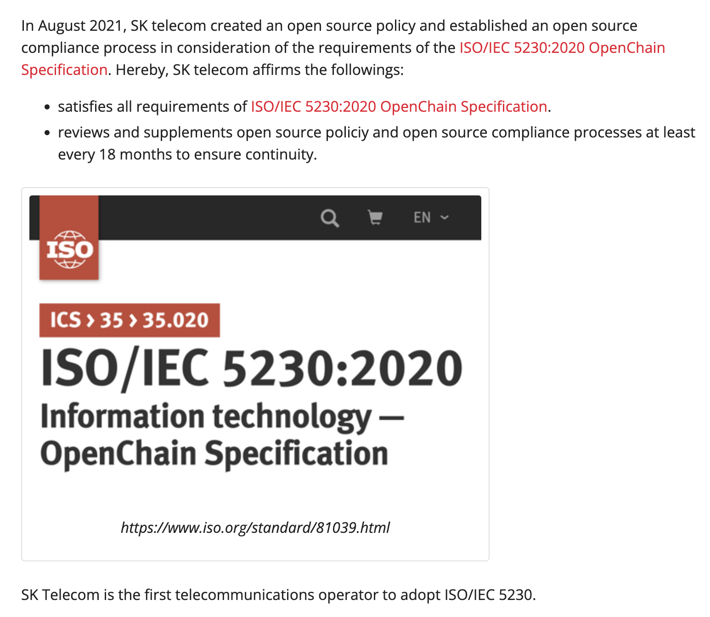
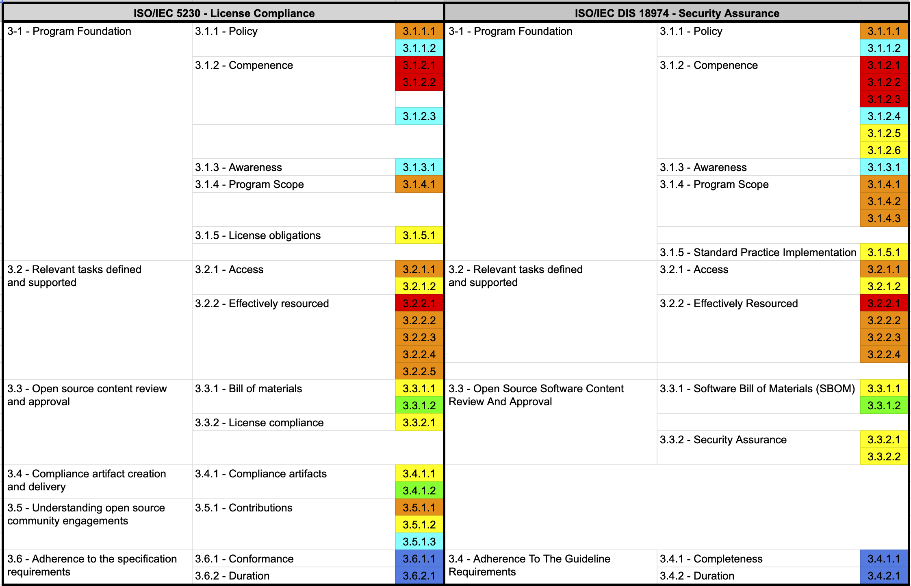

Companies that have built an open source program (open source policy / process / tools / organization) that complies with all requirements except ISO/IEC 5230 3.6, ISO/IEC 18974 3.4 can document and specify the following two things.

For this, ISO standards commonly require the following documented procedures to announce open source policies.

{}

* 3.6.1.1 A document affirming the program specified in §3.1.4 satisfies all the requirements of this document.
* 3.6.2.1 A document affirming the program meets all the requirements of this document, within the past 18 months of obtaining conformance validation.

{}

{}

* 3.4.1.1: Documented Evidence affirming the Program specified in §3.1.4 satisfies all the requirements of this document.
* 3.4.2.1: A document affirming the Program meets all the requirements of this specification, within the past 18 months of obtaining conformance validation.

{}

Therefore, you can document the following:

1. The company's open source program complies with all the requirements of ISO/IEC 5230, ISO/IEC 18974
2. Guarantee to maintain a state that meets all the requirements of ISO/IEC 5230, ISO/IEC 18974 for more than 18 months after obtaining conformance validation

The company can include the above in its open source policy, or it can be posted through a publicly available website.

You can refer to the content posted on the open source portal site of SK Telecom as shown in the image below.

[https://sktelecom.github.io/compliance/iso5230/](https://sktelecom.github.io/compliance/iso5230/)

By doing so, you can meet the requirements marked in blue in the ISO standard specifications.

Once you have completed this, your company will finally meet all the requirements of ISO/IEC 5230, ISO/IEC 18974.