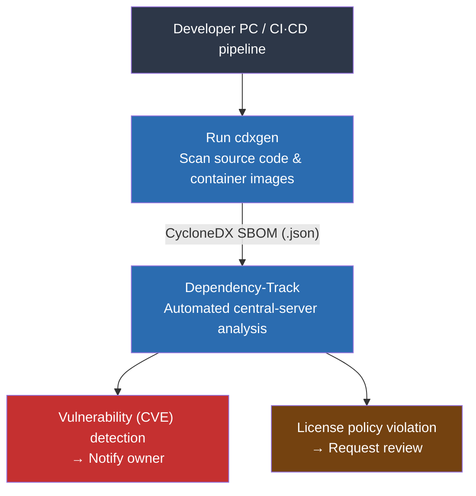
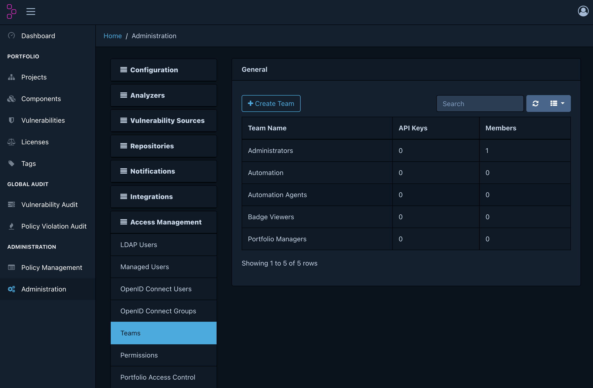
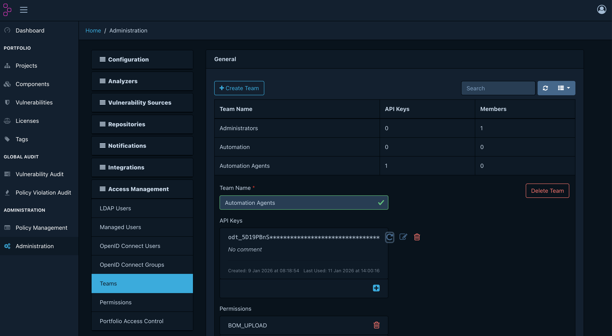
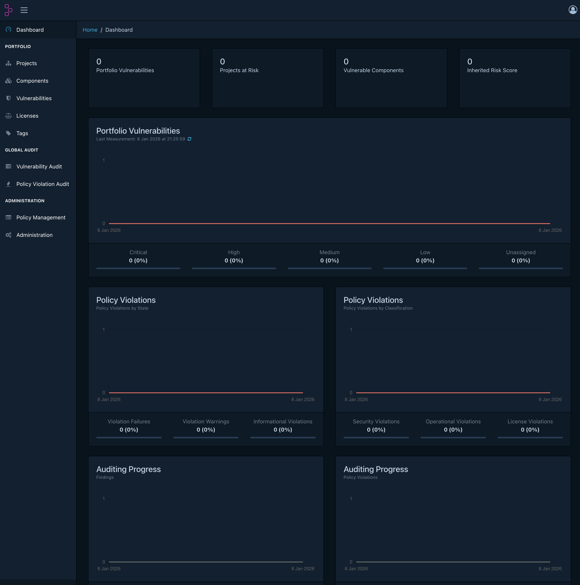
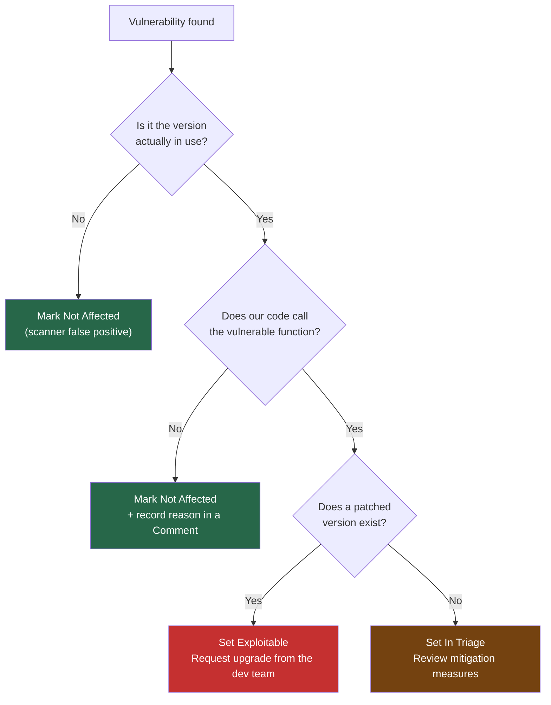

For companies just starting with open source management, we recommend the
**cdxgen + Dependency-Track** combination as a toolset that can establish a basic
automation environment within a single day.

This guide walks you through every step, from installation and configuration to
setting up a license and vulnerability inspection environment and running day-to-day operations.

## Why cdxgen + Dependency-Track

Open source management comes down to two essentials.

1. **Know what is inside** — generating an SBOM (Software Bill of Materials)
2. **Continuously monitor risk** — detecting vulnerabilities (CVEs) and license policy violations

cdxgen handles the first, and Dependency-Track handles the second.
Both tools are **free open source** under the Apache-2.0 license.

### End-to-end automation flow



### Why we chose this combination

| Criterion | Description |
|------|------|
| **Cost** | Both tools are free open source (Apache-2.0) |
| **Standards compliance** | CycloneDX format — meets ISO/IEC 5230 and NTIA SBOM requirements |
| **Broad language support** | Java, Node.js, Python, Go, Rust, and 20+ more |
| **Centralized management** | View vulnerability and license status across all company projects on one screen |
| **Ease of automation** | REST API based — simple to integrate into CI/CD pipelines |

> Comparison with other tools: FOSSology, SW360, and others are also powerful tools, but they involve high initial setup complexity.
> The combination in this guide is minimized so you can establish a basic environment **within a day**.
> For detailed features of each tool, see the [cdxgen guide](../5-cdxgen/) and the
> [Dependency-Track guide](../7-dependency-track/).

## Installing Dependency-Track

### Prerequisite: Docker environment

Dependency-Track runs with Docker Compose.
If you do not have Docker, install [Rancher Desktop](https://rancherdesktop.io/) (macOS·Windows, free).
After installation, confirm it is installed correctly by running the command below in a terminal.

```bash
docker --version
```

> **docker compose command compatibility**: On Docker Desktop and Rancher Desktop environments, use `docker compose` (the plugin).
> If you installed Docker on macOS via Homebrew or Colima, you may need to use `docker-compose` (with a hyphen).
> If any `docker compose` command in this guide fails, replace it with `docker-compose`.

### Installation and startup

Create a dedicated folder in your home directory, download the official configuration file, and run it.

```bash
# 1. Create a working folder (under the home directory)
mkdir ~/dependency-track && cd ~/dependency-track

# 2. Download the official docker-compose.yml
curl -LO https://raw.githubusercontent.com/DependencyTrack/dependency-track/HEAD/src/main/docker/docker-compose.yml

# 3. Run (the first run takes 1–2 minutes to download images)
docker compose up -d
```

The API server runs on port **8081**, and the frontend runs on port **8080**.

### Initial login

Open `http://localhost:8080` in your browser.


Log in with the initial account `admin` / `admin`.
Immediately after login, a password change screen is shown automatically. Change to a new password right away.

> If you cannot log in properly in the browser, wait an additional 1–2 minutes until the
> API server (port 8081) has fully started, then try again.

### Server management

```bash
# Start (after rebooting the PC)
cd ~/dependency-track && docker compose up -d

# Stop
docker compose down

# Check status
docker compose ps
```

> After the initial installation, syncing vulnerability databases such as NVD takes **at least 24 hours**.
> It is normal to see `Mirroring` messages in the server logs.
> Vulnerabilities may not be detected until the sync completes.

## Minimum recommended Vulnerability Sources settings

By default, many vulnerability sources are enabled. Turning them all on from the start
generates excessive duplicate alerts and increases the management burden.

**Recommended: start with NVD + GitHub Advisories at the core**

In `Administration` → `Vulnerability Sources`, configure settings using the table below as a reference.

| Source | Recommended setting | Reason |
|------|----------|------|
| **NVD** | Enabled + API mirroring ON | Standard CVE-based DB. Includes CVSS scores. Required |
| **GitHub Advisories** | Enabled + enter PAT | Security advisories for npm·Python·Go·Ruby ecosystem packages. Complements NVD |
| Google OSV | Disabled initially | Heavy overlap with NVD·GitHub, a cause of alert spikes. Add later if needed after stable operation |
| OSS Index | Disabled initially | Requires account registration. Duplicate coverage |
| VulnDB | Disabled | Paid service |

> **Operational tip**: After running for 6+ months, if you find detection gaps, enable OSV additionally.
> We recommend expanding gradually rather than turning everything on from the start.

### NVD (required): configure with API mirroring

If `Enable mirroring via API` is OFF, it may operate using the legacy feed method, which has a high
likelihood of sync failures or delays in modern environments. Always use API mirroring.

- `Enable NVD mirroring`: ON
- `Enable mirroring via API`: ON
- `API endpoint`: `https://services.nvd.nist.gov/rest/json/cves/2.0` (keep the default)
- `API key`: enter the key issued by NVD
- `Additionally download feeds`: keep OFF (not needed for normal operation)

After applying, if `Last Modification` is empty, the initial sync may be in progress.
Verify the value is populated after the initial sync completes.

### GitHub Advisories: does not work without a PAT

GitHub Advisory mirroring requires entering a Personal Access Token (PAT).

- `Enable GitHub Advisory mirroring`: ON
- `Enable vulnerability alias synchronization`: keep ON
- `Personal Access Token`: enter a classic PAT (`ghp_...`)

> Note: fine-grained PATs (`github_pat_...`) have been reported to cause authentication issues
> in some environments, so we recommend using a classic PAT.

### Google OSV: requires an ecosystem selection to enable

OSV requires selecting at least one ecosystem for mirroring to actually work.

- `Select ecosystem to enable Google OSV Advisory mirroring`: ON
- `Enable vulnerability alias synchronization`: ON
- `OSV Base URL`: keep the default
- Ecosystems (examples): `PyPI`, `npm`, `Maven`, `Go`, `Linux`
  (add `NuGet`, `RubyGems`, `crates.io` depending on your environment)

### Order of application (recommended)

```bash
# After saving settings, check the mirroring logs
docker compose logs -f dtrack-apiserver | grep -iE "nvd|github|osv|mirror"
```

If needed, restart the API server to apply the initial settings.

```bash
docker compose restart dtrack-apiserver
```

## Configuring license policies

Using Dependency-Track's Policy Engine, you can automatically detect license violations.

Left menu → `Policy Management` → click `Create Policy` at the top right of the screen

### Policy 1: Copyleft license warning

If a proprietary software product includes a Copyleft-licensed component,
a source disclosure obligation may arise. Configure this as a warning to trigger a review.

**Basic policy settings**:

| Item | Value |
|------|--------|
| Policy Name | `Copyleft License Warning` |
| Policy Operator | `ANY` (triggers if any one condition matches) |
| Violation State | `WARN` |

After saving the policy with the `Create` button, click the created policy to enter the detail screen.
In the **Conditions** section, click `+ Add Condition` to add one condition per license.

| Condition Subject | Condition Operator | Condition Value |
|-------------------|--------------------|-----------------|
| License | `IS` | `GPL-2.0-only` |
| License | `IS` | `GPL-3.0-only` |
| License | `IS` | `AGPL-3.0-only` |
| License | `IS` | `LGPL-2.1-only` |
| License | `IS` | `LGPL-3.0-only` |

Setting it to `WARN` does not stop the build; it only sends a review-request notification.

### Policy 2: Blocking licenses that restrict commercial use

Licenses that restrict commercial use itself should be blocked from use from the start.
Create a second policy the same way.

| Item | Value |
|------|--------|
| Policy Name | `Restricted License Block` |
| Policy Operator | `ANY` |
| Violation State | `FAIL` |

| Condition Subject | Condition Operator | Condition Value |
|-------------------|--------------------|-----------------|
| License | `IS` | `BUSL-1.1` |
| License | `IS` | `SSPL-1.0` |

Setting it to `FAIL` marks projects that include the component as in violation.

> **Policy scope**: After creating a policy, you can apply it to a specific project on the Projects tab,
> or apply it to the entire Portfolio.

## Getting started quickly with SKT SBOM Scanner (Easy Mode)

This is a way to generate an SBOM using only Docker, without installing cdxgen directly.
It is an **open source tool developed by SK Telecom for supply chain management** that analyzes
source code, Docker images, and binaries without installing Node.js, and outputs CycloneDX JSON directly.

{}
Since the output format is CycloneDX JSON, you can upload it directly to the Dependency-Track described in this section.
{}

### Prerequisites

You need Docker v20.10 or later and about 4–5 GB of free disk space.
The first run takes 5–10 minutes to download the Docker image.

### Installation and execution

```bash
# Linux / macOS
curl -O https://raw.githubusercontent.com/sktelecom/sbom-tools/main/scripts/scan-sbom.sh
chmod +x scan-sbom.sh

# Analyze source code (run from the project root)
./scan-sbom.sh --project "MyApp" --version "1.0.0" --generate-only
# Result: MyApp_1.0.0_bom.json is generated
```

```cmd
:: Windows
curl -O https://raw.githubusercontent.com/sktelecom/sbom-tools/main/scripts/scan-sbom.bat
scan-sbom.bat --project "MyApp" --version "1.0.0" --generate-only
```

It also supports analyzing Docker images, binaries/firmware, and RootFS.

```bash
# Analyze a Docker image
./scan-sbom.sh --target "myapp:v1.0" --project "MyApp" --version "1.0" --generate-only

# Analyze firmware
./scan-sbom.sh --target firmware.bin --project "RouterOS" --version "2.0" --generate-only
```

### Uploading to Dependency-Track

Upload the generated `*_bom.json` file with the command below.

```bash
curl -X "POST" "http://localhost:8081/api/v1/bom" \
  -H "X-Api-Key: ${DT_API_KEY}" \
  -F "autoCreate=true" \
  -F "projectName=MyApp" \
  -F "projectVersion=1.0.0" \
  -F "bom=@MyApp_1.0.0_bom.json"
```

### Supported languages

It analyzes Java, Python, Node.js, Go, Rust, Ruby, PHP, .NET, and C/C++ (when using a package manager) at once.
There are limits to detecting C/C++ projects that manage headers directly or use statically linked binaries.

> **Source**: [github.com/sktelecom/sbom-tools](https://github.com/sktelecom/sbom-tools) (Apache-2.0)

---

## Generating SBOMs with cdxgen and auto-uploading

### Issuing an API Key

For an automation script to upload SBOMs to Dependency-Track, an API Key is required.

`Administration` → `Access Management` → `Teams`



1. Click `+ Create Team` → enter the team name `Automation Agents` and click `Create`
2. Click the created team to enter its detail screen
3. In the **Permissions** section, check the following two items:
   - `BOM_UPLOAD` (permission to upload SBOMs)
   - `PROJECT_CREATION_UPLOAD` (permission to auto-create projects)
4. In the **API Keys** section → click `+ Create API Key`



Copy the generated key (in `odt_publicId_...` format) and store it somewhere safe.
You can only view the full key value immediately after creation.

### Installing cdxgen

```bash
npm install -g @cyclonedx/cdxgen
```

In environments without Node.js, you can use the Docker image.
For detailed installation instructions, see the [cdxgen guide](../5-cdxgen/).

### SBOM generation and upload script

Saving the script below as `scan-upload.sh` handles SBOM generation and upload in one step.

> **Version compatibility**: The latest cdxgen versions (v12+) generate the CycloneDX 1.7 format by default,
> but Dependency-Track v4.14 supports up to CycloneDX 1.6.
> Be sure to specify the `--spec-version 1.6` option.

```bash
#!/bin/bash
# Usage: ./scan-upload.sh <project-name> <version>
# Example: ./scan-upload.sh "my-app" "1.0.0"

PROJECT_NAME="${1:?Enter a project name}"
PROJECT_VERSION="${2:?Enter a version}"
DT_URL="http://localhost:8081"
API_KEY="${DT_API_KEY:?Set the DT_API_KEY environment variable}"

# Generate SBOM
echo "[1/2] Generating SBOM..."
cdxgen -r --spec-version 1.6 -o sbom.json .

if [ ! -s sbom.json ]; then
  echo "SBOM generation failed: check that dependency files such as package.json or pom.xml exist."
  exit 1
fi

# Upload to Dependency-Track
echo "[2/2] Uploading to Dependency-Track..."
RESPONSE=$(curl -s -X POST "${DT_URL}/api/v1/bom" \
  -H "X-Api-Key: ${API_KEY}" \
  -F "autoCreate=true" \
  -F "projectName=${PROJECT_NAME}" \
  -F "projectVersion=${PROJECT_VERSION}" \
  -F "bom=@sbom.json")

if echo "${RESPONSE}" | grep -q '"token"'; then
  echo "Upload complete: check the results at http://localhost:8080."
else
  echo "Upload failed: ${RESPONSE}"
  exit 1
fi
```

```bash
# How to run
export DT_API_KEY="your_issued_API_KEY"
chmod +x scan-upload.sh
./scan-upload.sh "my-app" "1.0.0"
```

After uploading, confirm that the project was automatically created in Dependency-Track.


## Reviewing results and day-to-day operations

### Dashboard overview

`http://localhost:8080` → **Dashboard**



| Item | Description |
|------|------|
| **Portfolio Vulnerabilities** | Vulnerability status across all company projects, by severity |
| **Projects at Risk** | List of high-risk projects |
| **Policy Violations** | License policy violation status |

### Vulnerability triage criteria

`Projects` → select a project → `Audit Vulnerabilities` tab

You do not need to treat every Critical vulnerability as an emergency.
Make decisions using the three steps below.



### Responding to license policy violations

Left menu → in `Policy Violation Audit`, review violations across the company.

- **WARN**: After discussing license usage with the dev team, mark as `Approved` if there is no issue
- **FAIL**: Request replacement of the component with an allowed-license version

### Daily inspection checklist

| Frequency | Inspection item |
|------|----------|
| **Daily** | Check the Dashboard for newly occurring Critical vulnerabilities |
| **Weekly** | Classify vulnerabilities in `Not Set` status as `Exploitable` or `Not Affected` |
| **Monthly** | Review the trend of each team's Risk Score (a downward trend is normal) |
