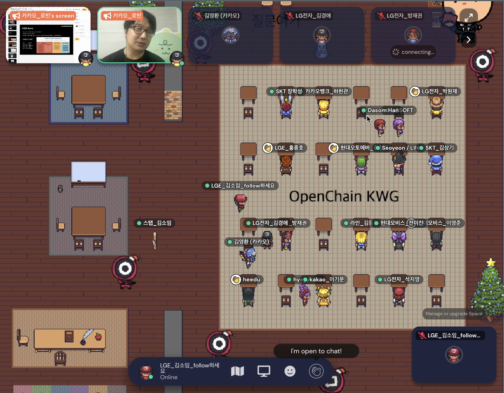

  

## Schedule

* Schedule: 2021-12-20 (Mon) 2:00~4:00 PM
* How to join
  - [Gather Town](https://www.gather.town/) (Please refer to the e-mail for the access address)

## Agenda
| No | Agenda           | Speaker | Slide |
|----|-----------------|------|------|
| 1  | OpenChain Update  | 	Shane Coughlan, Linux Foundation | - |
| 2  | OpenChain KWG Update | Haksung Jang, SK telecom | [pdf](./OpenChain_Korea_update_20211220.pdf) |
| 4  | GPL litigation case in China | Haksung Jang, SK telecom | [pdf](./virtualapp_case_20211220.pdf) | 
| 4  | Recent case : Stockfish v. ChessBase, SFC v. Vizio | Wonjae Park, LG Electronics | [pdf](./stockfish_n_sfc_case_211220.pdf) | 
| 5  | Shift-left and Automate Compliance Checks | Arlo Ha, Kakao Band | [pdf](./Shift-Left_and_Automate_Compliance_Checks.pdf) | 
| 6  | Case Study | All | - |
| 7  | Squid Game | All | - |
| 8  | Open Source Security Vulnerability Attack Types | Robin Hwang, Kakao | [pdf](./OpenSourceVulnerability_20211220.pdf) |

## Small group meeting topics
1. (Individual, company) How was this year? Do you have any plans for next year?
2. If there is anything you want from KWG (Please collect and share with one representative.)

## Attendees

## Video

## Minutes

## Photo Gallery

## Sponsor

