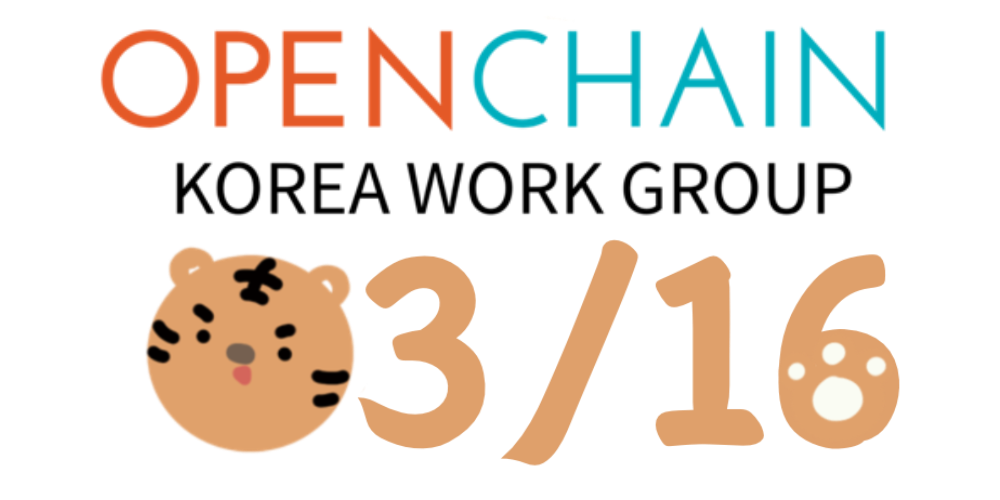

## Schedule

* 2022-03-16 (Wednesday) 2pm-4pm (KST)
* Venue: Zoom (connection method will be notified by e-mail separately)

## Agenda
| No | Agenda | Speaker | Slide |
|----|-----------------|------|------|
| 1 | OpenChain Update | Shane Coughlan, Linux Foundation | - |
| 2 | OpenChain KWG Update | Haksung Jang, SK Telecom | [pdf](https://github.com/OpenChain-Project/OpenChain-KWG/releases/download/meeting-slides-2022/OpenChain_Korea_update_20220316.pdf) |
| 3 | Latest Trends in Open Source - Movement of Open Source Ecosystem in the Face of Russia's Invasion of Ukraine | Robin Hwang, Kakao | [pdf](https://github.com/OpenChain-Project/OpenChain-KWG/releases/download/meeting-slides-2022/StandWithUkraine-OpenSource-2022-03-16.pdf) |
| 4 | ISO/IEC 5230 Certification Cases of Kakao and Kakao Bank | Violet Hwang, Kakao  Arlo Ha / May Lee, Kakao Bank | [pdf](https://github.com/OpenChain-Project/OpenChain-KWG/releases/download/meeting-slides-2022/Kakao_ISO_IEC_5230_certification_case.pdf)   [pdf](https://github.com/OpenChain-Project/OpenChain-KWG/releases/download/meeting-slides-2022/KakaoBank_ISO_IEC_5230_certification_case.pdf) |
| 5 | Hyundai Mobis Open Source Management System and Current Issues | Mi-Jin Jeon, Hyundai Mobis | [pdf](./220316_현대모비스%20오픈소스%20관리%20체계%20및%20현안(OpenChainKWG).pdf) |
| 6 | Open Source Promotion Plan for Open Source License Advance/Real-Time Verification Tool  | Yunhwan Jung / Munki Hong, Samsung Electronics | [pdf](https://github.com/OpenChain-Project/OpenChain-KWG/releases/download/meeting-slides-2022/SOSHUB_OpenSource_Plan_OpenChain_KWG_20220316.pdf) |
| 7 | Small Group Meetings (Case Study) | All | - |

## Video
### OpenChain Update 

<iframe width="560" height="315" src="https://www.youtube.com/embed/n0SN6mUwals" title="YouTube video player" frameborder="0" allow="accelerometer; autoplay; clipboard-write; encrypted-media; gyroscope; picture-in-picture" allowfullscreen></iframe>

### OpenChain KWG Update

<iframe width="560" height="315" src="https://www.youtube.com/embed/yn5y_wumgXw" title="YouTube video player" frameborder="0" allow="accelerometer; autoplay; clipboard-write; encrypted-media; gyroscope; picture-in-picture" allowfullscreen></iframe>

### Latest Trends in Open Source

<iframe width="560" height="315" src="https://www.youtube.com/embed/1OZKlOu-SIQ" title="YouTube video player" frameborder="0" allow="accelerometer; autoplay; clipboard-write; encrypted-media; gyroscope; picture-in-picture" allowfullscreen></iframe>

### ISO/IEC 5230 Certification Cases of Kakao and Kakao Bank 

<iframe width="560" height="315" src="https://www.youtube.com/embed/lKnZ-Jhw2bg" title="YouTube video player" frameborder="0" allow="accelerometer; autoplay; clipboard-write; encrypted-media; gyroscope; picture-in-picture" allowfullscreen></iframe>

<iframe width="560" height="315" src="https://www.youtube.com/embed/jt54J5iiIOU" title="YouTube video player" frameborder="0" allow="accelerometer; autoplay; clipboard-write; encrypted-media; gyroscope; picture-in-picture" allowfullscreen></iframe>

### Hyundai Mobis Open Source Management System and Current Issues

<iframe width="560" height="315" src="https://www.youtube.com/embed/-8eDeyGhNNg" title="YouTube video player" frameborder="0" allow="accelerometer; autoplay; clipboard-write; encrypted-media; gyroscope; picture-in-picture" allowfullscreen></iframe>

### Open Source Promotion Plan for Open Source License Advance/Real-Time Verification Tool

<iframe width="560" height="315" src="https://www.youtube.com/embed/DZD5DcYmS0U" title="YouTube video player" frameborder="0" allow="accelerometer; autoplay; clipboard-write; encrypted-media; gyroscope; picture-in-picture" allowfullscreen></iframe>

## Sponsor
### Platinum

<!-- 
## Minutes
...

## Photo Gallery
... -->
