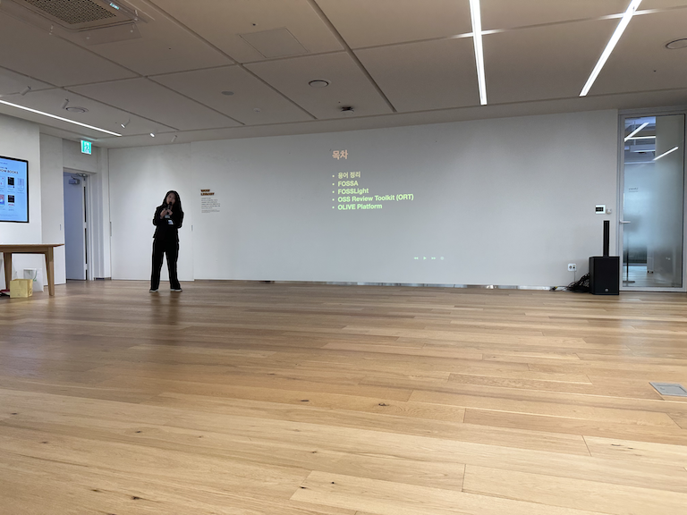
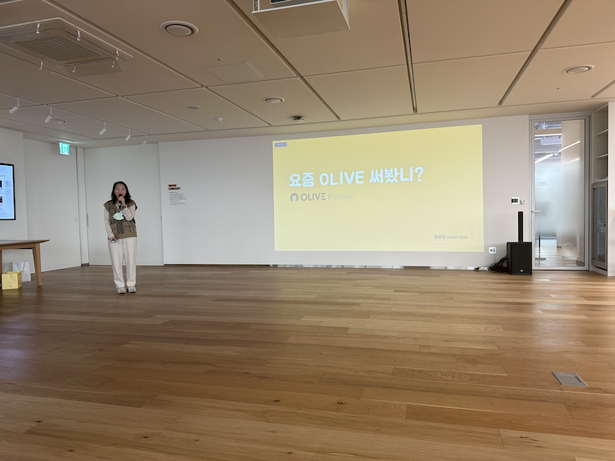

## Schedule

* Schedule: 2023-03-28 (Tue) 2pm - 4pm
* Venue: Line Plus (Seohyeon 1-dong, Bundang-gu, Seongnam-si, Gyeonggi-do)

## Agenda
### Part 1 Presentation Session

| No | Agenda | Speaker | Slide |
|----|-----------------|------|------|
| 0 | Welcome & OpenChain KWG Update | Seoyeon Lee / Line Plus | [pdf](./OpenChain_Korea_update_20230328.pdf) |
| 1 | OpenChain Update | Shane Coughlan, The Linux Foundation | [pdf](./global-updates-public.pdf) |
| 2 | Intro of OpenChain Security Assurance Specification | Haksung Jang, SK Telecom  | [pdf](./OpenChain%EB%B3%B4%EC%95%88%EB%B3%B4%EC%A6%9D%EA%B7%9C%EA%B2%A9%EC%86%8C%EA%B0%9C_20230328_%EC%9E%A5%ED%95%99%EC%84%B1.pdf)
| 3  | Legal Issues of AI Technologies  / Case Study: Getty Images v. Stability AI | ETRI 박정숙 | [pdf](./OpenChain-KWG_2023%EB%85%843%EC%9B%94_ETRI_%EB%B0%95%EC%A0%95%EC%88%99.pdf)|
| 4 | networking time | all | - |

### Part 2 Mini Summit - "Let's manage open source!"
| No | Agenda | Speaker | Slide |
|----|-----------------|------|------|
| 5 | Dependency analysis method by tool | Rain (Hyunji Lim), Kakao | [pdf](./%EB%8F%84%EA%B5%AC%EB%B3%84_%EC%9D%98%EC%A1%B4%EC%84%B1_%EB%B6%84%EC%84%9D_%EB%B0%A9%EC%8B%9D.pdf) |
| 6 | Sorisori OSORI | Soim Kim, Senior Manager, LG Electronics  | [pdf](./230328_FOSSLight_2023_%EB%A1%9C%EB%93%9C%EB%A7%B5_%EA%B3%B5%EC%9C%A0.pdf) |
| 7 | FOSSLight super makeover | Kyoungae Kim, LG Electronics | [pdf](./230328_FOSSLight_2023_%EB%A1%9C%EB%93%9C%EB%A7%B5_%EA%B3%B5%EC%9C%A0.pdf) |
| 8 | Have you used OLIVE lately? | Violet (Eunkyung Hwang), Kakao  | [pdf](./Openchain_KWG_17th_OLIVE.pdf) |
| 9 | onot, now it's quite usable! | Rogers (Hyun-min Han), Kakao  | [pdf](./openchain_kwg_17th_onot.pdf) |

## Sponsors

## Photo

  

 

  
  

 

  

 

  
  

 

  

 

  
  

 

  

 

  
  

 

  

