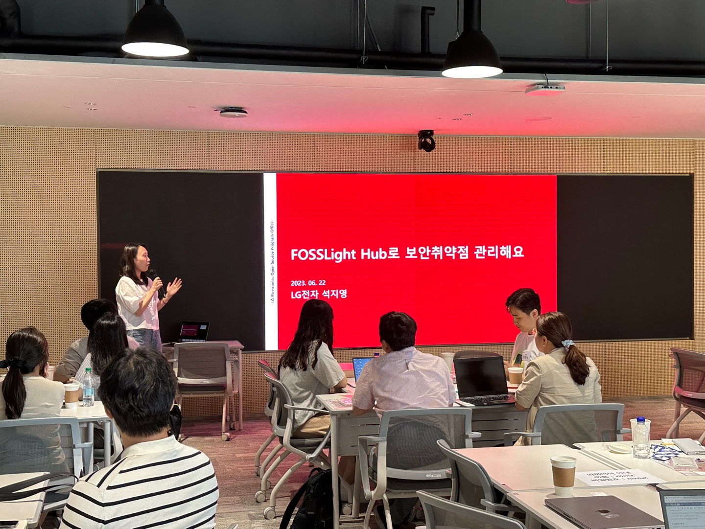

## schedule

* Schedule: 2023-06-22 (Thu) 2pm-5pm
* Location: Kakao Pangyo Agit (166 Pangyoyeok-ro, Bundang-gu, Seongnam-si, Gyeonggi-do)

## agenda

| No | Time | Agenda | Speaker | Slide |
|----|----|-----------------|------|------|
| 0 | 14:00 | Welcome & Intro | Violet Hwang, Kakao | - |
| 1 | 14:10 | OpenChain Global Update | Shane Coughlan, The Linux Foundation | [slide](https://www.slideshare.net/ShaneCoughlan3/openchain-korea-work-group-meeting-18)  |
| 2 | 14:20 | OpenChain KWG Update | Haksung Jang, SK Telecom / Seoyeon Lee, Line Plus | [slide](./OpenChain_Korea_update_20230622.pdf)  |
| 3 | 14:30 | Copilot Litigation Status Analysis | Jeongsook Park, ETRI | [slide](./Copilot%EC%86%8C%EC%86%A1%EC%A7%84%ED%96%89%ED%98%84%ED%99%A9_ETRI%EB%B0%95%EC%A0%95%EC%88%99-R4.pdf)  |
| 4 | 15:00 | Break & Networking | - | - |
| 5 | 15:15 | FOSSLight + Security Release | Ji-young Seok, LG Electronics | [slide](./230622_FOSSLight_Hub_Security%EA%B8%B0%EB%8A%A5%EC%86%8C%EA%B0%9C.pdf)  |
| 6 | 15:30 | Introducing the OSORI project | Yunhwan Jung, Samsung Electronics | [slide](./OSORI_%EC%98%A4%ED%94%88%EC%B2%B4%EC%9D%B8KWG_20230622_%EB%B0%9C%ED%91%9C-2.pdf)  |
| 7 | 16:00 | Group discussion | all | - |

* Review: [Leave open source to us! Review of OpenChain Korea Work Group meeting](https://tech.kakao.com/2023/07/10/openchain-kwg-18th-meeting/)

## Sponsor

 

## Participant
- Kookmin bank
- KFTC
- Line Plus
- Samsung
- AhnLab
- NCsoft
- cacao
- Kakao Bank
- Hangeul and computer
- Hyundai Autoever
- Hyundai Mobis
- Hyundai Motor
- CJ
- ETRI
- KT
- KTDS
- LG Electronics
- NIPA
- SK Telecom
- SK Hynix

## Photo

  

  

  

  

  

  

  

  

### Full Album

