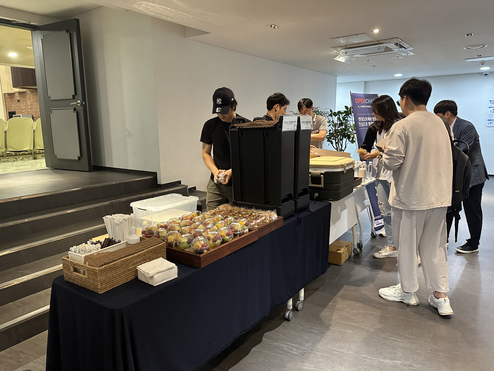

## schedule

* Schedule: 2023-09-19 (Tue) 1:30pm-5:00pm
* Venue: Hyundai Autoever (510 Teheran-ro, Gangnam-gu, Seoul)

## agenda

### Session 0. Intro & Update

| Time | Agenda | Speaker | Slide |
|----|-----------------|------|------|
| 13:30~13:40 | Welcome & Intro | Seokgi Min/Changhan Ryu, Hyundai Autoever | - |
| 13:40~13:50 | OpenChain Global Update | Shane Coughlan, Linux Foundation | - |
| 13:50~14:00 | OpenChain KWG Update   About Legal subgroup | Haksung Jang, SK Telecom / Seo-yeon Lee, Line Plus   Jeong-sook Park, ETRI | [slide](./OpenChain_Korea_update_20230919.pdf)   [slide](./LegalSubgroup소개자료-20230919-R1.pdf)   |

### Session 1. Hyundai Motor Group and Open Source

| Time | Agenda | Speaker | Slide |
|----|-----------------|------|------|
| 14:00 - 14:10 | Hyundai Motor Group open source list release | Changhan Ryu, Hyundai Autoever |  [slide](./현대차그룹_기술분야별_활용_오픈소스_리스트공개_F.pdf) |
| 14:10~14:40 | Hyundai Motor Group Open Source Management System Case Study    - Hyundai Motor Company   - Hyundai Mobis   - Hyundai Autoever |  Changwoo Lee, Hyundai Motor Company Youngjun Lee, Hyundai Mobis Jihyun Lee, Hyundai Autoever |   [slide](./KWG현대차발표자료.pdf)   [slide](./모비스_KWG_발표자료.pdf)   [slide](./fosslight_적용사례_20230919_Autoever.pdf) |
| 14:40~15:00 | Networking | ALL | - |

### Session 2. Best Practices

| Time | Agenda | Speaker | Slide |
|----|-----------------|------|------|
| 15:00-15:20 | Security Management System - Based Open Source Security Assurance Standard | Jaewook Jeong, LG Electronics | [slide](./LG전자제품보안관리체계기반_오픈소스보안보증표준준수사례소개_정재욱.pdf)  |
| 15:20~15:40 | LINE's OpenChain Certification Journey | Seoyeon Lee, Donghyuk Kim, Line Plus | [slide](./LINE-OpenChain-Conformance.pdf) |
| 15:40~16:00 | Chaotic AI open source license! | Hyeseong Choi, LG Electronics | [slide](./혼돈의AI오픈소스라이선스.pdf) |
| 16:00-16:20 | Networking | ALL | - |

### Session 3. Group discussion

| Time | Agenda | Speaker | Slide |
|----|-----------------|------|------|
| 16:20~17:00 | Group discussion | ALL (Moderator: Seoyeon Lee, Line Plus) | - |

## Sponsors

 

 
 

## Attending companies
* AhnLab
* CJ OliveNetworks
* ETRI
* KB Data System
* KT ds
* LG Electronics
* NHN
* SK Corporation
* SK Telecom
* Kookmin bank
* Korea Financial Telecommunications & Clearings Institute
* Naver
* Line Plus
* Samsung SDS
* Samsung
* S-core
* Open up
* National IT Industry Promotion Agency
* Genius
* Kakao
* Kakao Bank
* HANCOM
* Hyundai Mobis
* Hyundai Autoever
* Hyundai Motor

## Photo

  

  

  

  

  

  

### Full Album

