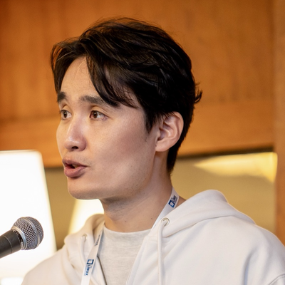

  

    
31st Meeting

    <h1 class="kwg-conf-hero__title">Software Supply Chain Security and Open Source Governance</h1>
    
We look at the state of open source governance at CJ Group, how an open source management framework runs from an operations team's perspective, and tools for software supply chain security.

    

      <strong>Date</strong> 2026-09-08 (Tue) 14:00–17:00
      <strong>Venue</strong> CJ Human Resources Development Center · Jung-gu, Seoul
    

    
Directions
      <a href="https://maps.app.goo.gl/nQUogVHPvF4VuapX9" target="_blank" rel="noopener">Google Maps</a>
      <a href="https://map.naver.com/p/search/CJ%EC%9D%B8%EC%9E%AC%EC%9B%90" target="_blank" rel="noopener">Naver Map</a>
      <a href="https://map.kakao.com/link/search/CJ%EC%9D%B8%EC%9E%AC%EC%9B%90" target="_blank" rel="noopener">Kakao Map</a>
    

    
Registration and the detailed program are announced via the OpenChain KWG mailing list. Subscribe to receive the sign-up link.

    

      <a class="kwg-conf-cta" href="../../../about/subscribe/">Join the mailing list</a>
    

  

  

    08
    Sep 2026 · Tue
  

<ul class="kwg-conf-chips">
  <li class="kwg-conf-chip">OpenChain</li>
  <li class="kwg-conf-chip">EU CRA</li>
  <li class="kwg-conf-chip">OSS Governance</li>
  <li class="kwg-conf-chip">Supply Chain Security</li>
  <li class="kwg-conf-chip">SBOM</li>
</ul>

## Who Should Attend

- Practitioners preparing for ISO 5230 or ISO 18974 self-certification, or working out the scope of their EU Cyber Resilience Act (CRA) response
- Organizations looking to streamline open source management and cut operational load with tooling
- Teams starting on software supply chain security or needing to verify SBOMs received from suppliers
- Anyone who wants to hear other companies' cases and expand their practitioner network

## Agenda

  

    
14:00–14:10

    

    

      
Welcome &amp; Greetings

      
CJ

    

  

  

    
14:10–14:30

    

    

      
OpenChain Updates

      
KWG Steering Committee · OpenChain Project (global update)

    

  

  

    
14:30–14:55

    

    

      
Session 1. The State of Open Source Governance at CJ Group

      
Kiyoung Sung, Patent Attorney · CJ

      
CJ Group's open source governance framework, told through three core topics: certification status across the group, data contributions to the OSSORI project, and the response to the EU Cyber Resilience Act (CRA).

    

  

  

    
14:55–15:10

    

    

      
Break &amp; Networking

      
Coffee break

    

  

  

    
15:10–15:55

    

    

      
Group Discussion

      
All Participants

    

  

  

    
15:55–16:20

    

    

      
Session 2. OSS Governance That Centers People and Grows with the System

      
Byeongseok Choi, General Manager · Olive Networks

      
Experience running OSS Governance across CJ Group's many organizations and affiliates, and how it grew into a framework that carries on even when the people change.

    

  

  

    
16:20–16:45

    

    

      
Session 3. Open Source Supply Chain Security Tools: Trusted OSS, TRUSCA, and BomLens

      
Haksung Jang · SK telecom

      
An introduction to <a href="https://trustedoss.github.io/" target="_blank" rel="noopener">Trusted OSS</a>, an initiative that began in the KWG community, and <a href="https://github.com/sktelecom/bomlens" target="_blank" rel="noopener">BomLens</a>, released by SK telecom. The talk covers what tools can take over: producing ISO 5230 and ISO 18974 self-certification artifacts (<a href="https://github.com/trustedoss/trustedoss-agents" target="_blank" rel="noopener">Trusted OSS Agents</a>), running a self-hosted software composition analysis portal (<a href="https://github.com/trustedoss/trusca" target="_blank" rel="noopener">TRUSCA</a>), and generating and checking supplier SBOMs (BomLens).

    

  

  

    
16:45–17:00

    

    

      
Closing &amp; Group Photo

      
KWG Steering Committee

    

  

Session titles and times may change as preparation continues. Confirmed details will be published on this page and announced via the mailing list.

## Dinner After the Meeting

A dinner gathering follows the regular meeting. Attendance is optional, and details will be announced via the mailing list.

## Speakers

  

    
    
Kiyoung Sung, Patent Attorney

    
CJ Corporation · Session 1

    
Open source and patent management for CJ Group.

  

  

    
    
Byeongseok Choi, General Manager

    
CJ OliveNetworks · Session 2

    
Runs the open source management system for CJ Group.

  

  

    
    
Haksung Jang, Manager

    
SK telecom · Session 3

    
Open Source Program Manager at SK telecom and OpenChain Ambassador.

  

## Sponsor

  Sponsored by
  

