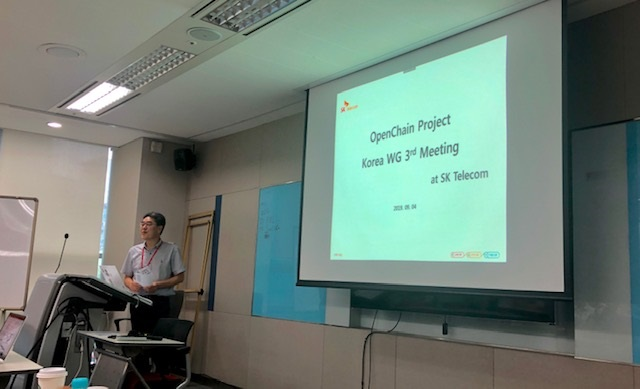

## Organizer

* SK telecom

## Intro

* Schedule: 2019-09-04 (Wed) 3:00~5:00 pm
* Venue : Samhwa Tower 3F Room 4

## Agenda

| No | Agenda           | Speaker | Slide |
|----|-----------------|------|------|
| 1  | State of the Union  | 	Shane Coughlan, Linux Foundation | [Download](openchain_update_2019-09-04.pdf) |
| 2  | Introducing the T-hub System | SK telecom, Sang-gi Kim |  [Download](t-hub_v1.0.pdf) | 
| 3  | Open Source Software License Analysis History | NCsoft, Jiho Han | [Download](ncsoft_20190904.pdf)  | 
| 4  | Catch up with OpenChain | Haksung Jang, LG Electronics |[Download](openchainthirdkoreanworkshop-190909143700.pdf)  | 

## Attenddes
* KT
* KTDS
* LG Electronics
* SK telecom
* Line
* Samsung Electronics
* NCSoft
* Kakao
* Hyundai Motors
* Hyundai Mobis
* Hyundai MN Soft

## Photo Gallery

  
  

 

  

