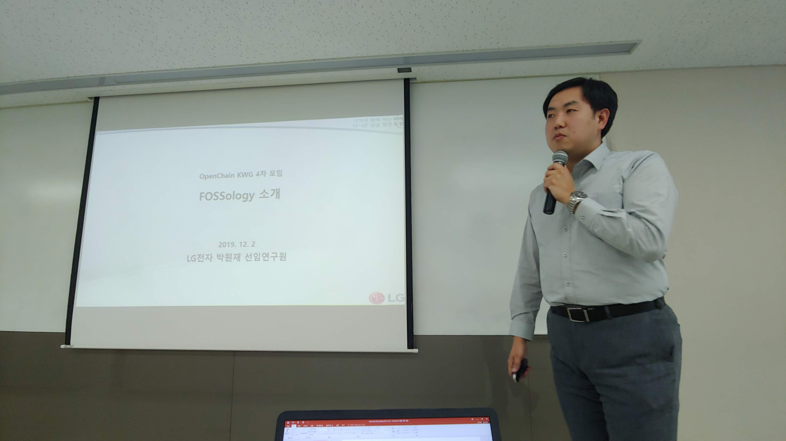

## Organizer

* KTDS

## Intro

* Schedule: 2019-12-02 (Mon) 2:00~5:00 pm
* Venue: Ktds Bangbae office, Room 207

## Agenda

| No | Agenda           | Speaker | Slide |
|----|-----------------|------|------|
| 1  | OpenChain Update  | 	Shane Coughlan, Linux Foundation | [Download](a_brief_introduction_to_openchain.pdf) |
| 2  | Open Source Management Portal and Open Source Management Plan | Sangmi Kim, Jihyun Lee / Ktds |  - | 
| 3  | How to Install and Use FOSSology | Wonjae Park / LG Electronics | [Download](fossology_introduction_openchain_kwg.pdf)  | 
| 4  | Haksung Jang, LG Electronics |[Download](openchain_kwg_update_2019-12-02)  | 
| 5  | Case Study| All | -  | 
| 6  | Free Discussion | All | -  | 

## Case Study

* Theme : Open Source Governance Organization

| No | Speaker         | Slide |
|----|-----------------|------|
| 1 | SK telecom, Woody Park       | [Download](openchainkwg_organization_skt_20191202.pdf) |
| 1 | NCSoft, Dasom Han      | [Download](openchain_kwg_case_study_ncsoft_2019-12-02.pdf) |

## Attenddes
* KTDS
* LG Electronics
* SK telecom
* SK holdings
* Samsung Electronics
* NCSoft
* Kakao
* Hyundai Mobis

## Photo Gallery

  
  
  

 

  
  
  

 

  
  
  

 

  

 