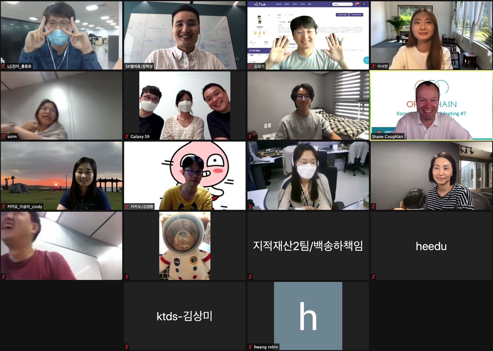

## Intro

* Schedule: 2020-09-22 (Tue) 2:00~4:00 pm (KST)
* How to join
  - Join Zoom Meeting ( https://us02web.zoom.us/j/9990120120?pwd=NzVCaFE2L1RRRFZaSkk0dm8xdlplUT09 )
  - Meeting ID: 999 012 0120
  - Password: 123456

## Agenda

| No | Agenda           | Speaker | Slide |
|----|-----------------|------|------|
| 1  | OpenChain Update  | 	Shane Coughlan, Linux Foundation | - |
| 2  | Introduction of LG Electronics' Open Source Compliance Management System (OSC System) |LG Electronics, Soim Kim |  - | 
| 3  | Intro and summary of a book, Forge Your Future with Open Source | Line, Seoyeon Lee | [Download](forge-your-future.pdf)  | 
| 4  | Case Study : Open source release practices (GitHub, CLA) | All | - |
| 5  | OpenChain KWG Update | SK telecom, Haksung Jang | [Download](openchain-kwg-7th-2020-09-22.pdf) |
| 6  | Free Discussion | All | - |

## Attenddes
* Hyundai Mobis
* Hyundai Motors
* Kakao
* ktds
* LINE Plus
* LG Electronics
* NCSOFT
* SamSung Electronics
* SK telecom

## Minutes

### 1. OpenChain Update (Shane Coughlan / Linux Foundation)

* OpenChain is going to be approved as ISO standard soon
	* According to this, we're going to create educational materials. And we'll need translations by multiple languages
* We're going to make OpenChain T-shirt

---

### 2. Introduction of LG Electronics' Open Source Compliance Management System, OSC System (Soim Kim / LG Electronics)

#### Main features

* Project : Perform the OSC process by creating it for each software you distribute

	* When the included OSS list is uploaded, the reviewer reviews, and the system shows the part that needs disclosure.(The details for each license are shown, so that the user can check the scope of source code disclosure)
	* Finally the OSS Notice is issued, and the file and source code to be disclosed are distributed to  [http://opensource.lge.com](http://opensource.lge.com)

* 3rd Party Project : Manage OSS list by 3rd party software

* OSS / License details : Obligation according to OSS, License, and Restriction can be checked. (Each nickname is managed and mapped even if the same license are indicated differently)

* Vulnerability : Check security vulnerabilities by OSS

* BAT (Binary analysis tool) : When a binary is uploaded, OSS is detected and displayed

#### Future plan

OSC System will be open sourced soon! 

---

### 3. Summary of open source related book - ['Fourge your future with open source'](https://g.co/kgs/KkXrAJ) (Seoyeon Lee / LINE Plus)

A book that tells readers how to contribute to the FOSS project, regardless of skill level or area of expertise.

#### What Free and Open Source can do for you
* benefits to your skillset, benefits to your career, benefits to your personal network

#### Prepare to contribute

* Let's make a checklist to see what kind of contributions you can make

* Contribution process

	* Realize that you want to contribute - Find a project - Find a task - Configure the environment - Work on your contribution - Submit a contribution - Get feedback and repeat code improvements - Contributions are accepted - (Repeat)

#### Find a project

* Set your goals
* Collect your requirements: skills, interests, time slots, goals
* Search candidate projects

	* Let's check if the software we use every day is FOSS
	* Let's search for `your interest` + `open source` 

* Things to check before making your final choice

	* How easy is it to contribute? Are the guides well-documented?
	* Take a look at the issue tracker and ask a question
	* Start small and have a long-term perspective

#### How to make use of this book

* Use as an open source contribution guide
* Open source contribution workshop
* Use as a standard on how friendly open source projects of your company is to new contributors

---

### 4. Case Study: Open source release practices(GitHub, CLA, etc)

* 

---

### 5. OpenChain KWG Update

* Brand new KWG logo! (Thanks to [@soimkim](https://github.com/soimkim))
* We are going to make T-shirts with our new logo. (TBD)

## Video

* ...

## Photo Gallery
## Photo Gallery

  

