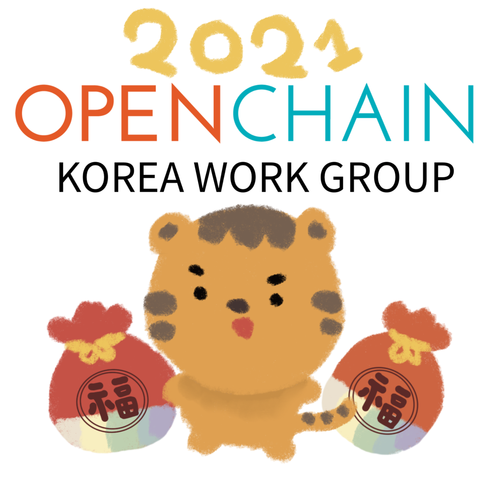

  

## Intro

* Schedule: 2021-03-11 (Thu) 2:00~4:00 pm
* How to join
  - Join Google Meet : https://meet.google.com/kbs-yjce-fcv

## Agenda

| No | Agenda           | Speaker | Slide |
|----|-----------------|------|------|
| 0  | Intro & Greetings  | Newcomers | [pptx](https://github.com/OpenChain-Project/OpenChain-KWG/releases/download/meeting-slides-legacy/OpenChain_Korea_20210311_intro.pptx) |
| 1  | OpenChain Update  | 	Shane Coughlan, Linux Foundation | - |
| 2  | FOSSLight Dependency  | Jiyeong Seok, LG Electronics | [ppts](https://github.com/OpenChain-Project/OpenChain-KWG/releases/download/meeting-slides-legacy/FOSSLight_dependency.pptx) | 
| 3  | OpenChain KWG Update & /   3 Ways to Get ISO Certification | Haksung Jang, SK telecom | [pptx](https://github.com/OpenChain-Project/OpenChain-KWG/releases/download/meeting-slides-legacy/OpenChain_Korea_20210311_update.pptx)    [pptx](https://github.com/OpenChain-Project/OpenChain-KWG/releases/download/meeting-slides-legacy/OpenChain_Korea_20210311_howto.pptx)|
| 4  | 1,273 days with open source (ISO Certification Review) | Jiho Han, NCSOFT | [pdf](https://github.com/OpenChain-Project/OpenChain-KWG/releases/download/meeting-slides-legacy/1273-days-with-opensource-20210311-FN.pdf)| 
| 5  | Case Study | All | - |
| 6  | Free Discussion | All | - |

## Case Study
* Subject : Are you considering obtaining ISO/IEC 5230 certification?

## Attendees
* ...

## Video

### OpenChain Update

<iframe width="560" height="315" src="https://www.youtube.com/embed/9hudq2KgcDY" frameborder="0" allow="accelerometer; autoplay; clipboard-write; encrypted-media; gyroscope; picture-in-picture" allowfullscreen></iframe>

### FOSSLight Dependency

<iframe width="560" height="315" src="https://www.youtube.com/embed/lUZYlkdlH4M" frameborder="0" allow="accelerometer; autoplay; clipboard-write; encrypted-media; gyroscope; picture-in-picture" allowfullscreen></iframe>

### OpenChain KWG Update & 3 Ways to Get ISO Certification

<iframe width="560" height="315" src="https://www.youtube.com/embed/ifauIfkRLT8" frameborder="0" allow="accelerometer; autoplay; clipboard-write; encrypted-media; gyroscope; picture-in-picture" allowfullscreen></iframe>

### 1,273 days with open source (ISO Certification Review)

<iframe width="560" height="315" src="https://www.youtube.com/embed/bDDYWwVhuGw" frameborder="0" allow="accelerometer; autoplay; clipboard-write; encrypted-media; gyroscope; picture-in-picture" allowfullscreen></iframe>

## Photo Gallery

