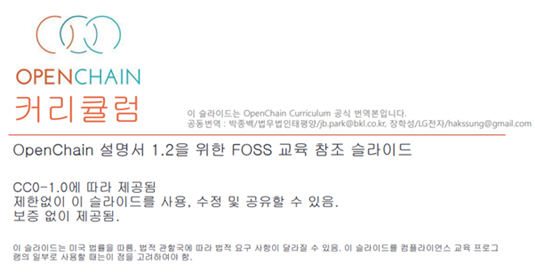

## OpenChain Training Slide란?

OpenChain Project에서는 컴플라이언스 프로그램을 구축하는데 필요한 교육 자료를 만들어서 공개하였습니다. : [https://github.com/OpenChain-Project/Curriculum](https://github.com/OpenChain-Project/Curriculum)

CC-0로 공개하였기 때문에 기업에서는 이를 활용하여 기업 내 교육 자료를 만들 수 있으며, 가장 최근 자료는 다음 링크에서 다운로드 받을 수 있습니다. 

* [PPT 파일](https://github.com/OpenChain-Project/curriculum/raw/master/slides/openchain-curriculum-for-2-0.pptx)
* [PDF 파일](https://github.com/OpenChain-Project/curriculum/raw/master/slides/openchain-curriculum-for-2-0.pdf)
* [ODP 파일](https://github.com/OpenChain-Project/curriculum/raw/master/slides/openchain-curriculum-for-2-0.odp)

## 번역 현황

OpenChain Training Slide의 한국어 번역은 1.2까지 번역이 완료된 상태이며 다음 페이지에서 다운로드 받을 수 있습니다. 

 

* [OpenChain Training Slide 한국어](https://github.com/OpenChain-Project/Curriculum-Translation-KR/tree/master/release/1.2)

## 기여자 현황 

OpenChain Training Slide 한국어 번역의 주요 기여자 현황은 다음과 같습니다. 

| Name            | Company           | Email | Role |
|-------------------|-----------------|------|------|
| Haksung Jang   | SK telecom  | haksung@sk.com | 공동번역 |
| Jongbaek Park  | BKL | jb.park@bkl.co.kr | 공동번역 | 

## 번역 참여

OpenChain Training Slide 한국어 번역은 GitHub에서 공동으로 수행하며 누구나 참여할 수 있습니다. 많은 참여 바랍니다!

	<a class="btn btn-lg btn-secondary mr-3 mb-4" href="https://github.com/OpenChain-Project/Curriculum-Translation-KR">
		GitHub <i class="fab fa-github ml-2 "></i>
	</a>

