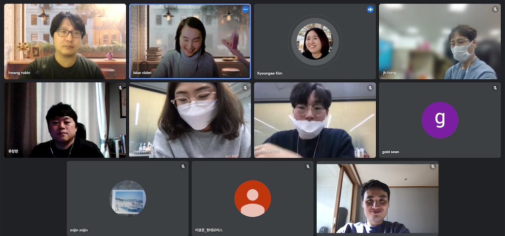

## Schedule

* Purpose: To discuss and share ISO/IEC 5230 compliance program establishment plan
* Date: 2021. 1. 18 (Tuesday), 11am to 12:30am
* Venue: Online (Google Meet)

## Attendees
* Kakao - Violet Hwang, Robin Hwang, Sean Kim
* Kakao Bank - Alro Ha, May Lee
* LG Electronics - Kyoungae Kim, Jongho Hong
* Hyundai Mobis - Mi-jin Jeon, Young-jun Lee
* Hyundai Autoever - Chang-han Ryu
* SK Telecom - Haksung Jang

## Main Activities
* Kakao and Kakao Bank shared their ISO/IEC 5230 certification results and discussed issues and solutions.

## Photo Gallery

  

