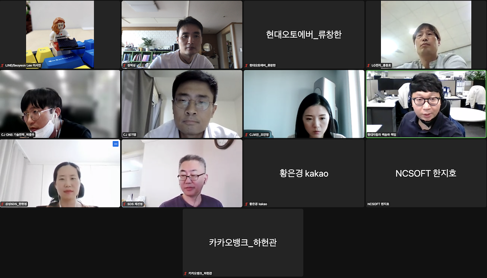

## Schedule

* Purpose: To discuss and share ISO/IEC 5230 compliance program practices
* Date: 2022. 9. 21 (Wednesday), 4pm-5pm
* Venue: Online

## Main Activities
* Share issues arising from CJ's open source compliance and discuss solutions.

## Attendees
* CJ
* CJ ONS
* Line Plus
* SK Telecom
* Hyundai Auto Ever
* LG Electronics
* Hyundai Motor
* Samsung SDS
* Kakao
* NCSOFT
* Kakao Bank

## Photo
