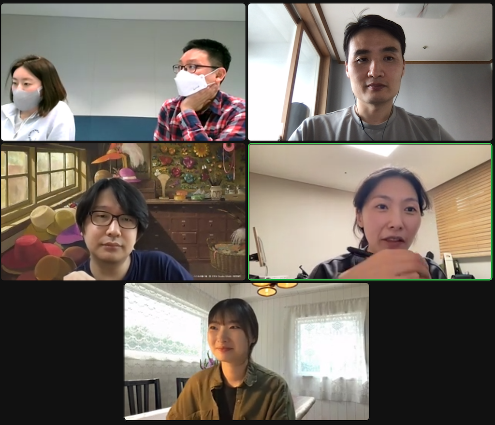

## Intro

* Schedule: 2022-02-25 (Fri) 15:30~16:30 / Zoom
* Attendees
   * Soim Kim / LG Electronics
   * Minho Hwang (Robin) / Kakao 
   * Jiho Han, Dasom Han / NCSOFT 
   * Seoyeon Lee / Line Plus
   * Haksung Jang / SK telecom

## Agenda

1. Recent Talks
2. Share KWG News
    * Cost execution details in the fourth quarter of 2021
    * New member companies
    * Subgroup activities
3. Preparation for KWG Meeting in Q1 2022
    * Schedule: 3/16 (Wednesday), 14:00~16:00
4. Discuss how to use the Linux Foundation support budget in 2022

## Photo Gallery
