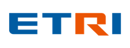
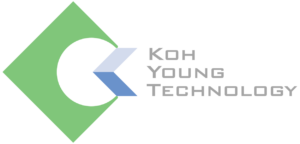
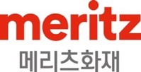

 <table>
    <tr>
        <td align=center valign=middle></td>
        <td align=center valign=middle></td>
        <td align=center valign=middle></td>
        <td align=center valign=middle></td>
    </tr>
     <tr>
        <td align=center valign=middle></td>
        <td align=center valign=middle></td>
        <td align=center valign=middle></td>
        <td align=center valign=middle></td>
    </tr>
     <tr>
        <td align=center valign=middle></td>
        <td align=center valign=middle></td>
        <td align=center valign=middle></td>
        <td align=center valign=middle></td>
    </tr>
     <tr>
        <td align=center valign=middle></td>
        <td align=center valign=middle></td>
        <td align=center valign=middle></td>
        <td align=center valign=middle></td>
    </tr>
     <tr>
        <td align=center valign=middle></td>
        <td align=center valign=middle></td>
        <td align=center valign=middle></td>
        <td align=center valign=middle></td>
    </tr>
     <tr>
        <td align=center valign=middle></td>
        <td align=center valign=middle></td>
        <td align=center valign=middle></td>
        <td align=center valign=middle></td>
    </tr>
    <tr>
        <td align=center valign=middle></td>
        <td align=center valign=middle></td>
        <td align=center valign=middle></td>
        <td align=center valign=middle></td>
    </tr>
</table>

1. 42dot
2. 고영테크놀러지
3. 금융결제원
4. 기아
5. 네이버
6. 두산디지털이노베이션
7. 라온시큐어
8. 라인플러스
9. 메리츠화재
10. 부산은행
11. 비씨카드
12. 삼성전자
13. 삼성화재
14. 삼성SDS
15. 신한금융지주회사
16. 신한DS
17. 씨에스피아이
18. 안랩
19. 우리은행
20. 엔씨소프트
21. 웨인OS
22. 지니언스
23. 카카오
24. 텔레칩스
25. 토스뱅크
26. 한국도로공사
27. 한국에너지기술연구원
28. 한글과컴퓨터
29. 한전KDN
30. 현대모비스
31. 현대오토에버
32. 현대자동차
33. ATCI
34. CJ
35. CJ CGV
36. CJ ENM
37. CJ 올리브네트웍스
38. CJ 올리브영
39. CJ 제일제당
40. ETRI
41. KB국민은행
42. KB데이타시스템
43. KT
44. KT DS
45. LG AI연구원
46. LG전자
47. LIG넥스원
48. LS 일렉트릭
49. NHN
50. SK주식회사
51. SK텔레콤